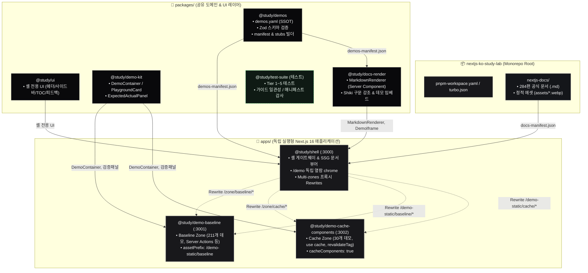

# nextjs-ko-study-lab

Next.js App Router 공식 문서([nextjs.org/docs/app](https://nextjs.org/docs/app))를 체계적인 한국어 학습 커리큘럼으로 재구성하고, Next.js 16의 최신 기능들을 독립된 **멀티 존(Multi-zones)** 환경에서 실험·검증할 수 있도록 설계된 모노레포 프로젝트입니다.

---

## 1. 프로젝트 아키텍처 & 구조 시각화

### 1.1 전체 시스템 구조도 (Mermaid)



### 1.2 디렉토리 트리 구조

```text
nextjs-ko-study-lab/
├── 📚 nextjs-docs/                  # [Phase 1, 완료] 공식 학습 문서 (단일 원본 SSOT)
│   ├── 1-getting-started/          # 1. 시작하기 커리큘럼
│   ├── 2-guides/                   # 2. 핵심 가이드 (Routing, Data Fetching, Caching 등)
│   ├── 3-api-reference/            # 3. Next.js 및 React API 레퍼런스
│   ├── 4-glossary/                 # 4. 용어 사전
│   ├── 5-architecture/             # 5. 아키텍처 심화 가이드
│   └── docs-manifest.json          # 284편 문서 색인 및 카테고리 계층 트리
│
├── 🚀 nextjs-app/                   # [Phase 2, 구현 완료] Multi-zones 데모 사이트
│   ├── apps/                       # 독립 실행형 Next.js 16 애플리케이션
│   │   ├── shell/                  # :3000 - 메인 게이트웨이, SSG 문서 뷰어, Multi-zones 프록시
│   │   ├── demo-baseline/          # :3001 - Server Actions / 기본 App Router 실습 Zone (211개)
│   │   └── demo-cache-components/  # :3002 - Next.js 16 'use cache' / Dynamic IO 전용 Zone (30개)
│   ├── packages/                   # 모노레포 공유 도메인 & UI 패키지
│   │   ├── demos/                  # @study/demos: demos.yaml (241건 데모 SSOT) & Zod 스키마
│   │   ├── ui/                     # @study/ui: 셸 레이아웃 전용 네비게이션/TOC/헤더 컴포넌트
│   │   ├── demo-kit/               # @study/demo-kit: 공통 플레이그라운드 & 검증 패널(Expected/Actual)
│   │   ├── docs-render/            # @study/docs-render: Shiki RSC 마크다운 컴파일러 & 데모 임베드
│   │   └── test-suite/             # @study/test-suite: Tier 1~5 통합 및 매니페스트 일관성 감사
│   ├── docs/                       # 핵심 설계 문서 (UI, 코드베이스 딥다이브, 4단 데모 표준, 학습기록)
│   └── docs/adr/                   # 아키텍처 의사결정 기록 (ADR 0001 ~ 0009)
│
├── 🗺️ CONTEXT-MAP.md               # 학습 문서 ↔ 데모 사이트 간 Bounded Context 계약
├── 🎨 DESIGN.md                    # UI/UX 디자인 시스템 및 색상 토큰 가이드
├── 📌 pnpm-workspace.yaml           # Catalog Pinning (Next.js 16.3.2 / React 19.2.8)
├── ⚙️ turbo.json                    # Turborepo 빌드·개발 파이프라인
├── 📋 AGENTS.md                    # 저장소 전체 작업 규칙
└── 📄 README.md
```

---

## 2. Phase 및 Bounded Context

| 구분 | 디렉토리 | 상태 | 핵심 역할 |
|---|---|---|---|
| **Phase 1** | [`nextjs-docs/`](./nextjs-docs/README.md) | **완료** (284/284) | Next.js App Router 공식 문서의 완역 및 한국어 학습 커리큘럼화 (단일 진실 공급원) |
| **Phase 2** | [`nextjs-app/`](./nextjs-app/README.md) | **구현 완료** (데모 241건, 배포 검증 별도) | 284편 문서를 화면에 렌더링하고, 241개 인터랙티브 데모를 실행하는 Multi-zones 포털 |

---

## 3. 구성 요소 상세 (Apps & Packages)

### 3.1 Apps (`nextjs-app/apps/`)

- **`@study/shell` (Port `:3000`)**: 전체 사이트의 단일 진입점(Gateway)입니다. `nextjs-docs/`의 마크다운 문서를 읽어 SSG 방식으로 서빙하며, `/zone/baseline/*`, `/zone/cache/*` 요청을 하위 Zone 앱으로 투명하게 리버스 프록시(Rewrites)합니다.
- **`@study/demo-baseline` (Port `:3001`)**: Server Actions, 낙관적 업데이트, 기본 폼 핸들링 등 App Router의 표준 기능을 실습하는 독립 Zone입니다. (`basePath: /zone/baseline`, `assetPrefix: /demo-static/baseline`)
- **`@study/demo-cache-components` (Port `:3002`)**: Next.js 16의 최신 `use cache`, `cacheLife`, `revalidateTag` 및 Dynamic IO 기능을 집중 검증하는 격리 Zone입니다. (`experimental.cacheComponents: true`)

### 3.2 Packages (`nextjs-app/packages/`)

- **`@study/demos`**: 모든 데모의 메타데이터 원본인 `demos.yaml`을 관리하고, Zod 스키마 검증 및 매니페스트/스텁 코드를 생성합니다.
- **`@study/ui`**: 셸 전용 레이아웃 컴포넌트(헤더, 좌측 트리 사이드바, 우측 목차 TOC, 피드백 카드)를 제공합니다.
- **`@study/demo-kit`**: 각 데모 Zone에서 재사용하는 공통 컨테이너, 인터랙티브 플레이그라운드, 기대값/실제값 검증 패널(`ExpectedActualPanel`)을 제공합니다.
- **`@study/docs-render`**: RSC 기반으로 Shiki 문법 강조를 수행하며, 마크다운 본문 내 데모 지시자를 파싱하여 데모 링크 카드 및 iframe으로 변환합니다.
- **`@study/test-suite`**: 단위 테스트부터 Multi-zones 통합, Playwright E2E, 매니페스트 정합성 감사를 수행하는 전용 테스트 스위트입니다.

---

## 4. 핵심 아키텍처 원칙

1. **단일 진실 공급원 (SSOT)**:
   - 학습 문서는 [`nextjs-docs/`](./nextjs-docs/README.md)가 유일한 원본입니다. 데모 사이트는 마크다운을 읽어 렌더링할 뿐 사본을 두지 않습니다.
   - 데모의 메타데이터와 주소는 [`packages/demos/demos.yaml`](./nextjs-app/packages/demos)에서 단독 선언합니다.
2. **Multi-zones 결합 및 에셋 격리**:
   - `cacheComponents`와 같이 앱 전역 설정이 필요한 실험적 기능들을 독립된 Next.js 앱으로 분리하고, Shell의 Rewrites 프록시로 하나의 사이트처럼 매끄럽게 연결합니다.
   - 정적 에셋 경로 충돌을 방지하기 위해 각 Zone마다 `assetPrefix: /demo-static/<zone>`을 적용합니다.
3. **카탈로그 중앙 고정 (Catalog Pinning)**:
   - `pnpm-workspace.yaml`의 `catalog:`에 Next.js(16.3.2)와 React(19.2.8) 버전을 고정하여 모노레포 전반의 버전 불일치를 원천 차단합니다.

---

## 5. 빠른 시작 (Getting Started)

### 요구사항

- **Node.js**: `>= 20.9.0`
- **패키지 매니저**: `pnpm@10.33.0` 이상

### 설치 및 실행

```bash
# 1. 의존성 설치
pnpm install

# 2. 전체 Zone 개발 서버 실행 (Port 3000, 3001, 3002 동시 구동)
pnpm dev

# 3. 빌드 및 타입 체크
pnpm build
pnpm check-types

# 4. 일관성 감사 및 테스트 실행
pnpm test
pnpm test:manifest
```

브라우저에서 `http://localhost:3000`에 접속하여 학습 문서와 데모를 확인할 수 있습니다.

---

## 6. 주요 문서 링크

- [학습 문서 목차 및 흐름](./nextjs-docs/README.md)
- [학습 문서 진행 상태 트래킹](./nextjs-docs/PROGRESS.md)
- [컨텍스트 맵 (Context Map)](./CONTEXT-MAP.md)
- [데모 사이트 아키텍처 명세서](./nextjs-app/ARCHITECTURE.md)
- [설계 문서 및 ADR 목차](./nextjs-app/docs/README.md)
- [디자인 가이드](./DESIGN.md)

---

## 7. 기여 및 라이선스

- [이슈 등록 안내](./.github/CONTRIBUTING.md)
- [보안 정책](./.github/SECURITY.md)
- [라이선스 (MIT)](./LICENSE)
