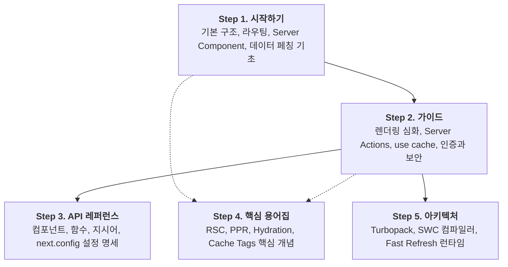

# Next.js App Router 한국어 학습 랩

<p align="center">
  <a href="https://nextjs.org/docs/app"></a>
  <a href="https://react.dev"></a>
  
  
  <a href="./LICENSE"></a>
</p>

<p align="center">
  <strong>"읽고, 눌러보고, 확인한다"</strong><br />
  Next.js App Router 공식 문서를 한국어로 체계화하고,<br />
  241개의 인터랙티브 데모에서 실제 동작을 확인하는 온라인 학습 플랫폼
</p>

<p align="center">
  <a href="https://www.learn-nextjs-lab.space/"><strong>웹사이트 바로가기</strong></a> |
  <a href="https://www.learn-nextjs-lab.space/getting-started"><strong>1장부터 학습 시작</strong></a> |
  <a href="https://www.learn-nextjs-lab.space/demo"><strong>241개 데모 둘러보기</strong></a>
</p>

---

## 어떤 웹사이트인가요?

**[Next.js 한국어 학습 랩](https://www.learn-nextjs-lab.space/)**은 Next.js App Router 문서와 실행 가능한 데모를 함께 제공하는 학습 사이트입니다. 설명을 읽은 뒤 브라우저에서 예제를 조작하며 런타임 동작을 확인할 수 있습니다.

문서를 읽다 보면 다음과 같은 점이 궁금해집니다:
- *"Server Component와 Client Component의 경계에서 props는 실제로 어떻게 전달될까?"*
- *"Next.js 16의 `use cache`와 `cacheLife`는 정확히 언제 캐시를 무효화할까?"*
- *"중첩 레이아웃(`layout.tsx`)과 템플릿(`template.tsx`)의 상태 보존 차이는 어떻게 다를까?"*

공식 문서를 바탕으로 284편의 한국어 학습 문서를 5단계 과정으로 정리했습니다. 주요 개념에는 관련 데모를 연결해 설명을 읽고 실제 동작을 이어서 확인할 수 있습니다.

---

## 웹사이트 주요 기능

### 1. 284편의 한국어 학습 문서
- 좌측 문서 트리에서 현재 위치를 확인하고 이전 또는 다음 문서로 이동할 수 있습니다.
- Shiki 문법 강조, 핵심 요약, 우측 목차를 제공합니다.
- 본문의 데모 카드에서 관련 실습 페이지로 이동할 수 있습니다.

### 2. 241개의 독립 인터랙티브 데모
- No-Simulation 원칙에 따라 화면 상태만 흉내 내지 않고 실제 파일 규칙(`layout.tsx`, `template.tsx`, `(group)`)과 브라우저 라우터(`<Link>`, `useRouter`)를 사용합니다.
- Server Actions 데모는 실제 `'use server'` 함수를 호출합니다. 개발자 도구의 Network 탭에서 `POST` 요청과 페이로드를 확인할 수 있습니다.
- `use cache`, `cacheLife`, `revalidateTag` 같은 Next.js 16 기능은 별도의 Cache Zone에서 실행합니다.

### 3. 기대값과 실제값 비교
데모의 검증 패널에서 공식 문서를 바탕으로 정리한 기대 결과와 브라우저 또는 서버에서 관찰한 값을 나란히 볼 수 있습니다. 버튼을 누르거나 URL을 이동한 뒤 결과가 어떻게 달라지는지 확인할 수 있습니다.

### 4. 데모 검색과 필터링 (`/demo`)
- 241개 데모를 한곳에서 살펴볼 수 있는 색인 페이지입니다.
- 키워드, 카테고리, 태그(`Server Actions`, `Caching`, `Parallel Routes` 등)로 원하는 데모를 찾아 실행할 수 있습니다.

### 5. 학습 진도 기록
- 로그인 없이 브라우저의 로컬 저장소에 읽은 문서와 완료한 데모를 기록합니다.
- 다시 방문하면 이전에 공부한 지점부터 이어서 학습할 수 있습니다.

---

## 화면 구성

웹사이트는 다음 네 가지 화면으로 구성됩니다.

### 1. 시작 화면 (`/`)
- 다섯 개 학습 카테고리와 전체 학습 순서를 보여줍니다.
- 대표 데모를 조작할 수 있는 미리보기를 제공합니다.

### 2. 학습 문서 (`/[category]/[slug]`)
```text
┌─────────────────────────────────────────────────────────────┐
│ 상단 바 (GNB, 검색, 빠른 이동)                               │
├──────────────┬───────────────────────────────┬──────────────┤
│ 문서 트리    │  학습 문서 본문                │ 페이지 목차  │
│ (284편 목차) │  - 개념 설명과 코드 블록      │ (우측 TOC)   │
│              │  - [관련 데모 바로가기 카드]  │              │
└──────────────┴───────────────────────────────┴──────────────┘
```

### 3. 데모 실습실 (`/demo/[category]/[slug]`)
데모 페이지는 가이드, 실습 화면, 검증 패널, 개념 정리 순서로 구성됩니다.
```text
┌─────────────────────────────────────────────────────────────┐
│ 1단. [가이드]       핵심 원리와 실행 절차                    │
├─────────────────────────────────────────────────────────────┤
│ 2단. [실습 화면]     실제 파일 경로 기반 인터랙티브 조작 영역 │
├─────────────────────────────────────────────────────────────┤
│ 3단. [검증 패널]     [기대 결과]와 [실제 관찰값] 비교         │
├─────────────────────────────────────────────────────────────┤
│ 4단. [개념 정리]     내부 메커니즘, 컴포넌트 트리 다이어그램 │
└─────────────────────────────────────────────────────────────┘
```

### 4. 데모 색인 (`/demo`)
- 241개 데모의 카드 목록과 검색 및 필터 기능을 제공합니다.
- 카테고리별 데모 수와 실습 완료율을 볼 수 있습니다.

---

## 5단계 학습 과정

Next.js를 처음 접하는 입문자부터 프로덕션 아키텍처를 고민하는 시니어까지 순서대로 따라갈 수 있도록 설계되었습니다.



| 단계 | 카테고리 | 다루는 주요 내용 | 웹사이트 바로가기 |
| :---: | :--- | :--- | :---: |
| **01** | **시작하기** | Next.js 16 설치, App Router 디렉토리 규칙, 레이아웃, Server/Client 경계 | [학습 시작](https://www.learn-nextjs-lab.space/getting-started) |
| **02** | **가이드** | 렌더링 생명주기, Server Actions 폼 변경, `use cache` 구조, 인증과 보안 | [가이드 탐색](https://www.learn-nextjs-lab.space/guides) |
| **03** | **API 레퍼런스** | `<Image>`, `<Link>`, `cookies()`, `revalidateTag()`, `'use cache'` 지시어 명세 | [레퍼런스 조회](https://www.learn-nextjs-lab.space/api-reference) |
| **04** | **핵심 용어집** | RSC Payload, Streaming, Partial Prerendering(PPR), App Shell 용어 | [용어집 검색](https://www.learn-nextjs-lab.space/glossary) |
| **05** | **아키텍처** | Turbopack 번들링, SWC 컴파일 과정, 브라우저 호환성 | [원리 탐구](https://www.learn-nextjs-lab.space/architecture) |

---

## 학습 방법

문서와 데모를 함께 볼 때는 다음 순서를 참고할 수 있습니다.

```text
  [1] 문서 학습       [2] 데모 이동        [3] 직접 조작        [4] 결과 비교        [5] 개발자 도구
 ┌─────────────┐     ┌─────────────┐     ┌─────────────┐     ┌─────────────┐     ┌─────────────┐
 │ 개념과 문법 │ ──> │ 본문 속     │ ──> │ 버튼 클릭,  │ ──> │ 기대 결과와 │ ──> │ F12 Network │
 │ 읽기        │     │ 데모 카드   │     │ 폼 제출     │     │ 실제값 대조 │     │ 페이로드 확인│
 └─────────────┘     └─────────────┘     └─────────────┘     └─────────────┘     └─────────────┘
```

1. 각 문서에서 동작 원리와 코드 예시를 읽습니다.
2. 본문에 연결된 데모 카드로 이동합니다.
3. 버튼을 누르거나 폼을 입력해 기능을 실행합니다.
4. 검증 패널에서 기대 결과와 실제 관찰값을 비교합니다.
5. 더 자세히 보고 싶다면 브라우저 개발자 도구의 Network 탭과 Console에서 RSC Payload와 `POST` 요청 본문을 확인합니다.

---

## 학습 기준과 안내

- **기준 프레임워크**: Next.js App Router **16.3.2** (React **19.2.8**)
- **기준 원문**: [Next.js App Router Documentation](https://nextjs.org/docs/app)
- **피드백 및 오류 제보**: 웹사이트 우측 하단의 **[피드백 보내기]** 버튼이나 GitHub 이슈를 이용해 주세요.
- **라이선스**: 본 프로젝트의 문서와 코드는 [MIT 라이선스](./LICENSE)를 따릅니다.
