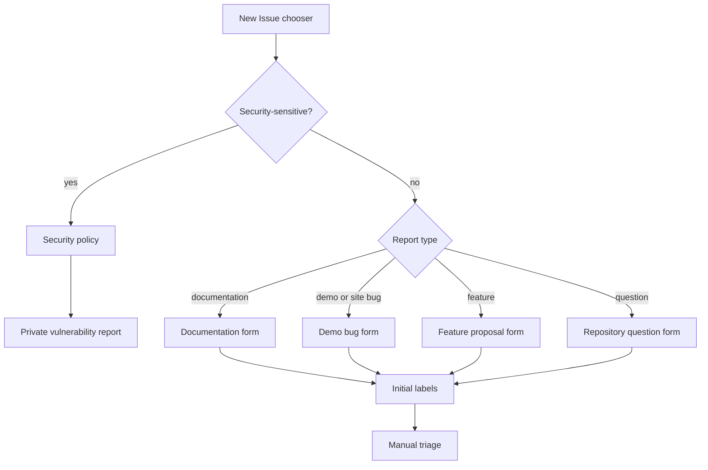
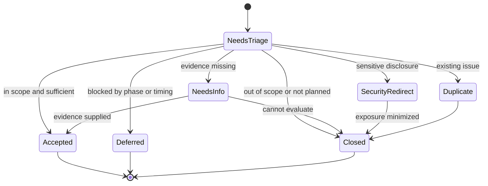

# GitHub Issue Intake Governance - Plan

## Goal Capsule

- **Objective:** 기여자가 저장소 성격에 맞는 정보를 빠짐없이 제출하고, 유지관리자가 공개 보안 정보 없이 일관된 기준으로 이슈를 분류·처리할 수 있다.
- **Means:** 네 종류의 GitHub Issue Form, community-health 문서, 최소 라벨 체계, 수동 triage runbook을 함께 도입한다. (KTD1, KTD2, KTD3)
- **Authority:** 저장소의 `AGENTS.md`와 하위 규칙이 Product Contract보다 우선하고, Product Contract가 Planning Contract와 Implementation Units보다 우선한다.
- **Execution profile:** 저장소 설정·YAML·운영 문서 중심 작업이다. 애플리케이션 테스트보다 정적 검증과 GitHub UI smoke 검증을 우선한다.
- **Stop conditions:** 보안 신고 경로·담당 수신자·노출 대응 권한 또는 라벨 선행 조건이 준비되지 않았거나, 기본 브랜치 기준 Phase Gate를 판단할 수 없으면 Form 공개를 중단한다.
- **Tail ownership:** 이 계획은 저장소 파일과 GitHub 저장소 메타데이터의 초기 설정 및 검증까지 다룬다. 실제 backlog 이슈 생성과 애플리케이션 코드 변경은 다루지 않는다.

---

## Product Contract

### Summary

문서 오류, 예제·데모 동작 오류, 기능 제안, 저장소 관련 질문을 구조화된 Form으로 접수한다. GitHub의 기본 기능만으로 초기 분류 정보를 붙이고, 이후 판단은 유지관리자 runbook에 따라 수동으로 수행한다.

### Problem Frame

원격 저장소에는 기존 이슈가 없고 로컬 저장소에도 `.github/` 기반 이슈 템플릿이나 기여·보안·triage 정책이 없다. 자유 형식 등록을 열면 문서 원본 문제와 렌더링 문제, 일반 Next.js 질문과 저장소 질문, 공개 이슈와 보안 신고가 섞일 가능성이 높다.

저장소는 `nextjs-docs/`를 학습 문서의 단일 원본으로 두고 `nextjs-app/`이 이를 읽는 두 컨텍스트 구조를 가진다. 또한 현재 규칙은 Phase 1을 우선하므로, 앱 관련 이슈 접수 자체가 실행 코드 변경 승인이 되지 않도록 운영 경계를 명시해야 한다.

### Key Decisions

- **네 종류의 구조화된 Form을 사용한다.** (session-settled: user-approved — chosen over a single generic or free-form issue path: repository-specific evidence differs for documentation, demo bugs, proposals, and questions) Governs R1-R4.
- **초기 운영은 수동 triage 중심으로 시작한다.** (session-settled: user-approved — chosen over Projects, milestones, Actions auto-labeling, and SLA dashboards: the empty backlog provides no evidence that heavier automation is warranted) Governs R7-R10, R15.
- **보안 신고는 공개 이슈와 분리하고 일반 사용자의 빈 이슈는 막는다.** (session-settled: user-approved — chosen over public or unrestricted free-form reports: vulnerability details require a private route and ordinary reports need predictable structure) Governs R5, R6, R12, R18.

### Requirements

**Issue intake**

- R1. 선택기는 문서 오류, 예제·데모 동작 오류, 기능 제안, 저장소 관련 질문 Form을 이 순서로 제공한다.
- R2. 문서 오류 Form은 대상 경로 또는 공개 URL, 문제 섹션과 현재 내용, 기대 수정, 공식 Next.js 근거를 받는다.
- R3. 예제·데모 동작 오류 Form은 기본 브랜치 또는 배포 URL, 재현 절차, 기대·실제 결과, 브라우저·OS와 관찰한 Next.js 버전을 받는다.
- R4. 기능 제안 Form은 학습자 문제와 기대 결과, 제안 범위, 검토한 대안을 받고, 질문 Form은 관련 문서·시도한 내용·막힌 지점과 명확한 질문을 받는다.

**Safety and routing**

- R5. 모든 Form은 기존 open·closed 이슈 검색과 민감한 보안 정보 미포함을 제출 전 확인하게 한다.
- R6. 공개 취약점 세부정보는 Form으로 받지 않고 `SECURITY.md`와 GitHub Private Vulnerability Reporting으로 안내한다.
- R7. 일반 사용자는 빈 이슈를 만들 수 없으며, Write 이상 권한자에게 보이는 `Maintainers only` 빈 이슈는 GitHub의 정상 동작으로 문서화한다.
- R8. 질문 Form은 이 저장소의 학습 커리큘럼과 데모 사용 범위만 받으며 일반 Next.js 기술 지원은 범위 밖임을 안내한다.

**Classification and triage**

- R9. Form은 확정 가능한 `kind:*`와 `status:needs-triage` 라벨을 기본 부여하고, 문서·데모 Form은 확정 가능한 `area:*`와 `phase:*`도 부여한다.
- R10. 유지관리자는 보안 노출, 중복, 정보 충족, 기본 브랜치·배포 범위, Phase Gate, 영역·단계 순서로 triage한다.
- R11. 중복 이슈는 원본 이슈를 가리키는 `Duplicate of #N` 댓글, `duplicate` 라벨, 종료를 함께 사용한다.
- R12. 공개 이슈에 보안 정보가 노출되면 내용을 재인용하지 않고 비공개 신고 경로로 전환한 뒤, 지정된 관리자가 본문·댓글별 가용 권한으로 노출을 최소화한다.
- R13. `phase:*`는 적용 단계 분류이며 Phase Gate를 우회하는 실행 허가가 아니다. 공개 버그는 GitHub 기본 브랜치 또는 식별 가능한 배포 URL에서 재현 가능해야 한다.

**Governance and rollout**

- R14. 기여자 안내, 지원 범위, 보안 정책, 유지관리자 triage runbook은 저장소 안에서 각각 독립적으로 찾을 수 있어야 한다.
- R15. 라벨과 Private Vulnerability Reporting을 Form보다 먼저 준비하고, 무해한 비공개 테스트 신고의 알림 수신까지 확인한 뒤 Form을 기본 브랜치에서 검증한다.
- R16. 기존 이메일 FeedbackModal은 변경하지 않는다. 공개 추적이 필요한 보고는 Issues, 일반적인 비공개 피드백은 이메일, 취약점·토큰·개인정보는 Private Vulnerability Reporting으로 구분한다.
- R17. 공개 synthetic backlog 또는 테스트 이슈를 만들지 않는다. 보안 transport 검증용 비공개 신고 1건은 허용하고, 자동 라벨과 일반 triage는 최초 실제 공개 이슈에서 운영 검증한다.
- R18. 공개 노출에 토큰·credential이 포함되면 즉시 폐기·교체하고, 개인정보는 별도 privacy escalation으로 전환하며, 이미 전파된 알림·참조·외부 cache 가능성을 사후 기록한다.

### Actors

- A1. **기여자·학습자:** 적합한 Form을 선택하고 재현·근거 정보를 제공한다.
- A2. **유지관리자:** 보안·중복·정보·범위·Phase 순으로 검토하고 라벨·결론을 관리한다.
- A3. **저장소 관리자:** 라벨과 Private Vulnerability Reporting 및 알림을 구성한다.
- A4. **GitHub:** 기본 브랜치의 Form과 chooser 설정을 렌더링하고 제출 시 필수값을 검사한다.

### Key Flows

- F1. **일반 이슈 등록**
  - **Trigger:** A1이 New Issue 선택기를 연다.
  - **Actors:** A1, A4.
  - **Steps:** 유형 선택, 필수 근거 입력, 중복·보안 확인, 제출 순서로 진행한다.
  - **Outcome:** 유형과 초기 triage 라벨이 붙은 이슈가 생성된다.
  - **Covered by:** R1-R5, R9.
- F2. **보안 신고 전환과 노출 대응**
  - **Trigger:** A1이 보안 문제를 신고하려 하거나 A2가 공개 보안 내용을 발견한다.
  - **Actors:** A1, A2, A3, A4.
  - **Steps:** 공개 Form을 중단하고 보안 정책을 확인한 뒤 Private Vulnerability Reporting으로 이동한다.
  - **Outcome:** 공개 이슈의 직접 노출은 가능한 범위에서 최소화하고, 이미 전파된 알림·참조·외부 cache 가능성은 후속 기록하며, 사건은 관리자에게 비공개로 전달된다.
  - **Covered by:** R5, R6, R12, R15, R18.
- F3. **수동 triage**
  - **Trigger:** 새 이슈에 `status:needs-triage`가 붙는다.
  - **Actors:** A2.
  - **Steps:** 보안 노출, 중복, 정보 충족, 범위, Phase Gate를 확인하고 필요한 라벨과 결론을 기록한다.
  - **Outcome:** 이슈가 정보 요청, 접수, 보류, 중복 또는 범위 밖 종료 중 하나로 결정된다.
  - **Covered by:** R10-R13.

### Acceptance Examples

- AE1. **공식 문서와 다른 학습 문서**
  - **Covers:** R2, R5, R9.
  - **Given:** 기여자가 저장소 문서 경로와 공식 Next.js URL을 알고 있다.
  - **When:** 문서 오류 Form에 현재 내용과 기대 수정을 채워 제출한다.
  - **Then:** 문서 유형·영역·Phase·triage 라벨이 붙은 검토 가능한 이슈가 생성된다.
- AE2. **기본 브랜치의 데모 오류**
  - **Covers:** R3, R9, R13.
  - **Given:** 기본 브랜치 또는 배포 URL에서 오류가 재현된다.
  - **When:** 재현 절차와 환경을 포함해 예제·데모 오류 Form을 제출한다.
  - **Then:** 앱 영역과 Phase 2 분류가 붙되 구현 승인을 의미하지 않는 이슈가 생성된다.
- AE3. **중복 보고**
  - **Covers:** R5, R10, R11.
  - **Given:** 동일한 원인과 결과를 다루는 기존 이슈가 있다.
  - **When:** 유지관리자가 원본을 확인한다.
  - **Then:** 타임라인에 중복 관계를 남기고 `duplicate`로 종료한다.
- AE4. **보안 정보 제출 또는 공개 노출**
  - **Covers:** R5-R7, R12, R18.
  - **Given:** 기여자가 취약점 세부정보를 가지고 있다.
  - **When:** New Issue 선택기를 연다.
  - **Then:** 공개 Form 대신 보안 정책과 Private Vulnerability Reporting 경로를 확인할 수 있고, 이미 노출된 경우 지정 관리자가 노출 유형에 맞는 복구 절차를 시작한다.
- AE5. **빈 이슈 선택기**
  - **Covers:** R7.
  - **Given:** 일반 기여자와 유지관리자가 각각 New Issue 선택기를 연다.
  - **When:** 등록 옵션을 확인한다.
  - **Then:** 일반 기여자에게 빈 이슈가 보이지 않고 유지관리자에게만 `Maintainers only` 옵션이 보인다.

### Success Criteria

- 네 Form이 의도한 순서와 이름으로 기본 브랜치의 New Issue 선택기에 표시된다.
- 각 Form이 필수 정보가 없는 최초 제출을 막고 존재하는 초기 라벨만 참조한다.
- 활성화된 Private Vulnerability Reporting과 유효한 보안 정책이 함께 제공되고, 무해한 비공개 테스트 신고가 지정된 주 담당자에게 실제 전달된다.
- 신규 이슈를 받은 유지관리자가 추가 정책 해석 없이 triage 순서와 종료 기준을 적용할 수 있다.
- 애플리케이션 코드와 기존 개인 작업 파일이 변경 범위에 포함되지 않는다.

### Scope Boundaries

#### In Scope

- GitHub Issue Forms와 chooser 구성.
- community-health 문서와 유지관리자 triage runbook.
- 최소 라벨 taxonomy와 Private Vulnerability Reporting·알림 설정.
- `README.md`의 짧은 이슈 등록 진입점.
- 기본 브랜치 반영 뒤 New Issue 선택기 smoke 검증.

#### Deferred to Follow-Up Work

- GitHub Projects, milestones, Actions 기반 자동 라벨링, SLA·응답시간 dashboard.
- FeedbackModal 문구 또는 링크를 GitHub Issues로 전환하는 애플리케이션 변경.
- 실제 backlog 이슈 생성과 최초 실제 이슈 이후의 taxonomy 조정.
- Phase Gate 자체의 최신 상태를 별도 저장소 작업으로 정리하는 일.

#### Outside This Plan

- `nextjs-docs/` 학습 문서 본문 수정.
- `nextjs-app/` 실행 코드, 테스트 또는 배포 구성 변경.
- 일반 Next.js 지원 커뮤니티 운영과 공개 취약점 처리의 자동화.

---

## Planning Contract

### Key Technical Decisions

- KTD1. **GitHub Issue Form YAML이 구조화된 입력을 소유하고 `kind:*` 라벨이 저장소 분류를 소유한다.** 조직이 소유하는 Issue Type은 공통 taxonomy와 운영 주체가 생길 때까지 top-level `type`에서 제외한다. GitHub.com Issue Forms는 public preview이므로 지원 키만 사용하고 schema drift를 rollout risk로 기록한다. ([Issue Forms syntax](https://docs.github.com/en/communities/using-templates-to-encourage-useful-issues-and-pull-requests/syntax-for-issue-forms))
- KTD2. **정적 Form metadata와 수동 triage를 결합한다.** (session-settled: user-approved — chosen over Actions-driven classification: deterministic form metadata reduces intake work without introducing an automation workflow) 각 Form은 R9에 따라 확정 가능한 초기 라벨만 붙이고 maintainer 판단이 필요한 분류는 runbook에 남긴다.
- KTD3. **라벨은 `kind`, `area`, `phase`, `status` 차원으로 제한한다.** `kind:documentation`, `kind:bug`, `kind:feature`, `kind:question`; `area:nextjs-docs`, `area:nextjs-app`, `area:repository`; `phase:1`, `phase:2`, `phase:cross-cutting`; `status:needs-triage`, `status:needs-info`, `status:deferred`를 사용한다. 종료 사유는 `duplicate`, `invalid`, `wontfix`를 재사용하되 기본 라벨의 삭제·의미 변경 여부도 provisioning gate에서 확인한다.
- KTD4. **보안 정책과 Private Vulnerability Reporting은 서로 대체하지 않는 policy와 transport로 함께 구성한다.** (session-settled: user-approved — chosen over public security issues: a private report form and explicit policy cover different parts of the disclosure path) PVR 활성화, 비특권 신고 접근, 지정 담당자의 실제 알림 수신을 확인하기 전에는 `/security/advisories/new` contact link를 공개하지 않는다. ([Private vulnerability reporting](https://docs.github.com/en/code-security/how-tos/report-and-fix-vulnerabilities/configure-vulnerability-reporting/configure-for-a-repository))
- KTD5. **GitHub 기본 브랜치와 식별 가능한 배포 URL을 공개 버그의 관찰 기준으로 삼는다.** 로컬 WIP나 미병합 커밋은 공개 사이트 버그가 아니라 개발 중 작업으로 처리하고, `phase:*`는 R13의 분류 정보로만 쓴다.
- KTD6. **운영 문서는 `.github/`에 모은다.** GitHub가 인식하는 `CONTRIBUTING.md`, `SUPPORT.md`, `SECURITY.md`와 maintainer용 `ISSUE_TRIAGE.md`를 Form과 가까운 위치에 둔다. ([Community health files](https://docs.github.com/en/communities/setting-up-your-project-for-healthy-contributions/creating-a-default-community-health-file))
- KTD7. **정적 검증과 post-merge smoke 검증을 분리한다.** YAML 문법·Form schema·라벨 참조는 병합 전에 확인하고, chooser·권한별 blank option·PVR 링크는 기본 브랜치 반영 뒤 확인한다.

### High-Level Technical Design

#### Intake routing



#### Triage lifecycle



### Implementation Constraints and Sequencing

1. `.github/ISSUE_TRIAGE.md`가 라벨 이름·설명·사용 조건과 외부 설정 순서를 먼저 소유한다.
2. 저장소 라벨을 생성하고 PVR, 지정 담당자의 Security alerts 설정, 무해한 private report의 실제 수신을 확인한다.
3. 네 Form과 `config.yml`을 한 변경 집합으로 추가하되, 존재하지 않는 라벨 참조가 하나라도 있으면 기본 브랜치 반영을 막는다.
4. `README.md` 진입점을 추가하고 기본 브랜치 반영 뒤 역할별 chooser smoke 검증을 수행한다.
5. 최초 실제 공개 이슈에서 자동 라벨과 runbook의 수동 상태 전이를 검증하고, 그 전에는 public synthetic backlog를 만들지 않는다.

### Risks and Dependencies

- **Issue Forms public preview:** schema가 바뀔 수 있다. 공식 validation 문서와 chooser 렌더링을 rollout 때 다시 확인한다.
- **Missing labels:** Form은 없는 라벨을 자동 생성하지 않고 적용을 누락한다. U2를 U3의 배포 선행 조건으로 둔다.
- **Security dead link or silent notification failure:** PVR 미활성 상태의 advisory URL이나 수신되지 않는 알림은 신고를 고립시킨다. 비특권 신고 접근과 무해한 private report의 실제 수신을 확인할 때까지 Form 공개를 중단한다.
- **Required fields are not durable schema:** 제출 뒤 작성자가 본문을 편집할 수 있다. 유지관리자의 정보 충족 검사를 제거하지 않는다.
- **Authority drift:** 로컬 checkout에는 앱 코드가 있으나 원격 기본 브랜치와 저장소 규칙은 다른 Phase 상태를 나타낼 수 있다. 이 계획은 기본 브랜치·배포 URL과 활성 `AGENTS.md`를 판단 기준으로 삼는다.
- **Existing worktree changes:** 현재 checkout은 `main`이 `origin/main`보다 2개 커밋 앞서고 `nextjs-app/apps/shell/next-env.d.ts`와 `.mcp.json`에 별도 변경이 있다. 구현은 이 변경을 stage·commit하거나 덮어쓰지 않아야 한다.
- **External repository settings:** PVR, 알림, 라벨은 Git 파일만으로 재현되지 않는다. `.github/ISSUE_TRIAGE.md`를 source of truth로 두고 UI 상태를 별도 확인한다.
- **Irreversible public exposure:** 본문·댓글을 조정해도 이미 전송된 알림과 외부 cache를 회수할 수 없다. runbook은 담당 관리자, 권한별 조치, credential rotation, privacy escalation, 사후 전파 점검을 함께 요구한다.

### Sources and Research

- `AGENTS.md`, `CONTEXT-MAP.md`, `nextjs-docs/AGENTS.md`, `nextjs-app/AGENTS.md` — Phase Gate, 두 컨텍스트, 문서 근거, 데모 용어와 운영 경계.
- `nextjs-app/apps/shell/src/components/FeedbackModal.tsx` — 기존 이메일 피드백 채널과 공개 Issues의 임시 역할 분리.
- [Configuring issue templates](https://docs.github.com/en/communities/using-templates-to-encourage-useful-issues-and-pull-requests/configuring-issue-templates-for-your-repository) — 기본 브랜치, chooser, blank issue, contact link, 순서 규칙.
- [Issue Form schema](https://docs.github.com/en/communities/using-templates-to-encourage-useful-issues-and-pull-requests/syntax-for-githubs-form-schema) — 지원 입력과 `required`의 public repository 동작.
- [Common validation errors](https://docs.github.com/en/communities/using-templates-to-encourage-useful-issues-and-pull-requests/common-validation-errors-when-creating-issue-forms) — ID·label·option validation 제약.
- [Managing labels](https://docs.github.com/en/issues/using-labels-and-milestones-to-track-work/managing-labels) — label 권한과 GitHub 기본 label 재사용.
- [Adding a security policy](https://docs.github.com/en/code-security/how-tos/report-and-fix-vulnerabilities/configure-vulnerability-reporting/add-security-policy) — `SECURITY.md` 위치와 내용.

---

## Output Structure

```text
.github/
├── CONTRIBUTING.md
├── ISSUE_TRIAGE.md
├── SECURITY.md
├── SUPPORT.md
└── ISSUE_TEMPLATE/
    ├── 01-documentation-error.yml
    ├── 02-demo-bug.yml
    ├── 03-feature-request.yml
    ├── 04-question.yml
    └── config.yml
README.md
```

---

## Implementation Units

### U1. Define contributor and maintainer policy

- **Goal:** R14와 R16의 채널·지원·보안·triage 경계를 저장소 문서로 고정한다.
- **Requirements:** R5-R8, R10-R14, R16, R18.
- **Dependencies:** none.
- **Files:**
  - Create `.github/CONTRIBUTING.md`.
  - Create `.github/SUPPORT.md`.
  - Create `.github/SECURITY.md`.
  - Create `.github/ISSUE_TRIAGE.md`.
- **Approach:**
  1. 기여자 문서에는 유형 선택, 중복 검색, 민감정보 금지, 등록 뒤의 기대 흐름을 설명한다.
  2. 지원 문서에는 저장소 질문과 일반 Next.js 지원, 공개 Issues와 이메일 피드백의 경계를 설명한다.
  3. 보안 문서에는 지원 범위와 PVR 신고 절차를 쓰고 취약점 세부정보를 공개 이슈나 이메일에 남기지 않도록 안내한다.
  4. triage runbook은 KTD3 라벨 catalog, R10의 순서, 정보 요청·접수·보류·중복·종료 조건을 소유한다.
  5. 공개 보안 노출 대응은 본문·댓글별 권한과 주 담당자·백업, 비공개 사건 연결, credential rotation, privacy escalation, 사후 전파 점검을 구분한다.
- **Patterns to follow:** `nextjs-app/docs/wayfinder/tickets/004-setup-monorepo-workspace-root.md`와 `nextjs-app/docs/wayfinder/tickets/010-verify-local-and-deployment-plumbing.md`의 라벨·상태·체크리스트형 운영 문서.
- **Test scenarios:**
  1. 문서 오류 신고자가 `CONTRIBUTING.md`만 읽고 올바른 Form과 필수 근거를 식별할 수 있다.
  2. 일반 Next.js 질문 사용자가 `SUPPORT.md`에서 이 저장소 Issues가 적합하지 않음을 확인한다.
  3. 취약점 신고자가 `SECURITY.md`에서 공개 세부정보 없이 PVR 경로와 기대 응답 방식을 찾는다.
  4. 유지관리자가 `ISSUE_TRIAGE.md`만으로 중복, 정보 부족, Phase 보류, 범위 밖 종료를 서로 다른 결론으로 처리한다.
  5. 공개 이슈에 토큰이 노출된 상황에서 관리자가 값을 재인용하지 않고 노출 축소, 폐기·교체, 비공개 사건 연결, 전파 기록 순서로 대응한다.
- **Verification:** 네 문서의 링크와 용어가 서로 일치하고, 각 정책 규칙이 한 문서에만 완전한 형태로 정의되어 다른 문서는 링크로 참조한다.

### U2. Provision GitHub labels and private reporting

- **Goal:** R9와 R15가 요구하는 GitHub-side 선행 조건을 준비한다.
- **Requirements:** R6, R9, R12, R15.
- **Dependencies:** U1.
- **Files:** No additional repository files; `.github/ISSUE_TRIAGE.md`의 catalog를 외부 상태의 source of truth로 사용한다.
- **Approach:**
  1. 기존 라벨을 먼저 inventory하고 KTD3의 custom 라벨과 `duplicate`, `invalid`, `wontfix`를 생성·보존 또는 의미에 맞게 정규화한다.
  2. GitHub Private Vulnerability Reporting을 활성화하고 주 담당자와 가능한 경우 백업의 권한·watch·알림 구독을 구성한다.
  3. 비특권 테스트 계정으로 민감정보가 없는 private report 1건을 보내고, 지정 담당자의 실제 알림 수신과 비공개 종료·정리를 확인한다.
  4. PVR 신고 화면, 실제 수신, 공개 노출 조정 권한이 확인되지 않으면 U3의 security contact link 공개를 막는다.
- **Execution note:** GitHub 관리자 권한이 필요한 외부 설정이다. 저장소 파일 변경과 분리해 각 설정의 현재 상태와 결과를 기록한다.
- **Test scenarios:**
  1. Form이 참조할 모든 custom 라벨과 runbook이 참조할 `duplicate`, `invalid`, `wontfix`가 정확한 이름과 의미로 존재한다.
  2. 관리자가 Security Advisories에서 `Report a vulnerability` 경로를 확인한다.
  3. 무해한 private report가 지정 담당자에게 실제로 전달되고 공개 이슈를 만들지 않은 채 비공개로 정리된다.
  4. 관리자 권한이 없는 실행자는 설정 변경을 시도하지 않고 blocker를 보고한다.
- **Verification:** label inventory와 runbook catalog가 일치하고, PVR 접근·실제 알림 수신·노출 조정 권한이 확인된다.

### U3. Add four Issue Forms and the chooser policy

- **Goal:** R1-R9의 구조화된 제출 경험과 보안·빈 이슈 routing을 구현한다.
- **Requirements:** R1-R9, R15.
- **Dependencies:** U1, U2.
- **Files:**
  - Create `.github/ISSUE_TEMPLATE/01-documentation-error.yml`.
  - Create `.github/ISSUE_TEMPLATE/02-demo-bug.yml`.
  - Create `.github/ISSUE_TEMPLATE/03-feature-request.yml`.
  - Create `.github/ISSUE_TEMPLATE/04-question.yml`.
  - Create `.github/ISSUE_TEMPLATE/config.yml`.
- **Approach:**
  1. Form마다 고유하고 3자를 넘는 `name`, 짧은 `description`, 제목 prefix와 R9의 초기 라벨을 정의한다.
  2. 모든 사용자 입력 `id`는 Form 안에서 고유하게 유지하고 지원 schema만 사용한다.
  3. 기존 이슈 검색과 민감정보 미포함은 option-level required checkbox로 둔다.
  4. 각 유형별 필수 근거는 R2-R4를 소유하며, 로그·스크린샷은 선택 입력으로 두고 비밀 제거 안내를 붙인다.
  5. chooser는 일반 사용자의 blank issue를 끄고 U2에서 검증한 PVR 경로를 contact link로 제공한다.
- **Execution note:** 이 변경은 config 중심이므로 unit test 대신 YAML/schema 검사와 GitHub chooser smoke 검증을 우선한다.
- **Patterns to follow:** KTD1, KTD2, KTD7과 GitHub 공식 Issue Form schema.
- **Test scenarios:**
  1. 각 Form의 필수 입력을 비운 경우 public repository 제출 단계가 진행되지 않는다.
  2. 네 Form의 `name`, 입력 label, `id`, dropdown·checkbox option이 각 요구 범위에서 고유하다.
  3. `id`는 영숫자·`-`·`_`만 사용하고 boolean처럼 해석될 수 있는 YAML scalar는 문자열로 인용한다.
  4. Form에 선언한 모든 라벨이 U2 inventory에 존재하고 `projects`, `milestones`, 조직 Issue Type을 참조하지 않는다.
  5. 보안 contact link는 활성 PVR로 이동하고 `SECURITY.md`가 해당 transport와 기대 대응을 설명하며, 공개 Form은 취약점 세부정보 입력을 요구하지 않는다.
- **Verification:** Ruby YAML parse, 공식 validation checklist 대조, label set comparison을 통과한다.

### U4. Expose and smoke-test the intake workflow

- **Goal:** R14-R17의 진입점과 post-merge 운영 확인을 완료한다.
- **Requirements:** R7, R14-R17.
- **Dependencies:** U1-U3.
- **Files:** Modify `README.md`.
- **Approach:**
  1. 루트 README에 이슈 등록과 보안 신고의 짧은 진입 링크를 추가하고 세부 정책은 community-health 문서가 소유하게 한다.
  2. 기본 브랜치에 반영된 뒤 일반 기여자와 maintainer 권한에서 chooser 차이를 확인한다.
  3. 실제 제출 직전까지 네 Form의 필수 검증, 순서, title prefix, label 참조, security link를 검사한다.
  4. 자동 라벨의 실제 적용과 일반 triage lifecycle은 최초 실제 공개 이슈에서 확인하고 public synthetic issue는 만들지 않는다.
- **Patterns to follow:** `README.md`의 짧은 개요와 상세 문서 링크 구조.
- **Test scenarios:**
  1. 일반 기여자 chooser는 네 Form과 보안 link를 순서대로 보여 주고 blank issue를 숨긴다.
  2. Write 이상 maintainer chooser는 같은 옵션과 `Maintainers only` blank issue를 보여 준다.
  3. README의 이슈 링크는 chooser로, 보안 링크는 정책 또는 활성 private report 화면으로 이동한다.
  4. 기존 FeedbackModal 동작과 `nextjs-docs/`, `nextjs-app/` 파일은 변경되지 않는다.
- **Verification:** 기본 브랜치 UI smoke 결과와 미검증 항목인 “최초 실제 이슈의 label application”을 runbook에 명시해 운영 인계한다.

---

## Verification Contract

| Gate | Applies to | Verification | Done signal |
| --- | --- | --- | --- |
| YAML parse | U3 | `ruby -e 'require "yaml"; Dir[".github/ISSUE_TEMPLATE/*.{yml,yaml}"].sort.each { |path| data = YAML.load_file(path); abort("#{path}: root must be a mapping") unless data.is_a?(Hash); puts "OK #{path}" }'` | 다섯 YAML 파일이 mapping으로 parse된다. |
| Form schema review | U3 | GitHub 공식 schema와 validation-error 문서에 대해 top-level key, body type, `id`, label, option을 대조한다. | 지원되지 않는 key와 중복 ID·label·option이 없다. |
| Label referential integrity | U2, U3 | GitHub label inventory와 각 Form의 `labels` 목록을 비교한다. | 모든 참조 라벨이 정확한 이름으로 존재한다. |
| Diff hygiene | U1, U3, U4 | `git diff --check -- .github README.md` | whitespace 오류가 없고 범위 밖 파일이 diff에 없다. |
| Security path | U2, U3 | PVR 활성화 뒤 비특권 계정의 무해한 private report로 접근·실수신·비공개 정리를 확인한다. | private report 경로가 열리고 지정 담당자가 실제 알림을 받으며 공개 흔적 없이 정리한다. |
| Chooser smoke | U3, U4 | 기본 브랜치에서 일반 기여자와 Write 이상 계정으로 New Issue chooser를 확인한다. | 네 Form 순서, 권한별 blank option, security contact link가 R1·R7대로 동작한다. |
| Application test boundary | All | 애플리케이션 코드가 변경되지 않았음을 확인한다. | `pnpm` build·test가 비적용이며 `nextjs-docs/`, `nextjs-app/` diff가 없다. |

---

## Definition of Done

### Global

- R1-R18이 구현 파일, GitHub 설정 또는 운영 문서 중 하나의 명확한 owner에 연결된다.
- U1-U4의 Verification 결과가 기록되고, 기본 브랜치에서만 가능한 smoke 검증이 완료된다.
- 공개 보안 신고 경로가 닫히고 PVR·정책·실제 알림 수신·노출 대응 권한이 서로 연결된다.
- Projects, milestones, Actions 자동화, SLA, FeedbackModal, backlog 생성이 diff 또는 외부 설정에 섞이지 않는다.
- 현재 worktree의 기존 수정과 커밋이 이 변경의 stage·commit 범위에 포함되지 않는다.
- 실험 또는 폐기한 템플릿, 임시 라벨, 테스트 이슈가 남지 않는다.

### Per Unit

- **U1:** 네 운영 문서가 각 독자를 명확히 구분하고 label·triage·보안 규칙을 중복 없이 연결한다.
- **U2:** label catalog, PVR, security alert notification이 Form 공개의 선행 조건으로 충족된다.
- **U3:** 네 Form과 chooser config가 정적 검증을 통과하고 존재하는 라벨만 참조한다.
- **U4:** README 진입점과 권한별 chooser smoke가 완료되고 최초 실제 이슈의 운영 검증 항목이 인계된다.
