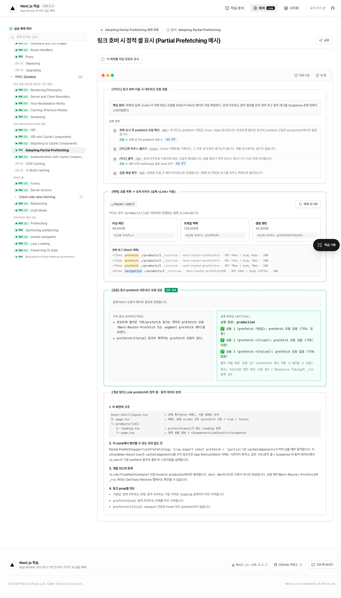

# baseline segment prefetch 로컬 구현·검증

검증일: 2026-10-01 (한국 시간)  
상태: 로컬 및 Production 구현·검증 완료. Preview 별도 배포는 미실행.
브랜치: `devPark/fix-baseline-segment-prefetch-404`  
기준 커밋: `8166967a2cbf17f787e864fcd302d0afdb19026c`  
승인: 현재 대화의 “승인”(통합 intent), “구현 검증”(plan의 로컬 구현·검증), “메인에 머지해줘”(이 변경의 커밋 및 로컬 main 반영). 이후 “메인에서 진행”으로 원격 main push와 Production 검증을 승인했다.

## 변경 내용

셸의 zone rewrite 두 규칙을 `beforeFiles`로 옮겼다. `/demo-static/*` 자산 rewrite는 `afterFiles`에 유지하고 URL 조회 로직은 보존했다. baseline/cache 앱·Proxy·Link·recorder·설정 축은 수정하지 않았다.

`apps/shell/scripts/check-zone-prefetch.mjs`를 추가했다. 실제 HTTP 응답의 상태·Content-Type·일치 경로·라우트 트리를 검사한다. 정적 segment의 name/slots 객체와 일반 Flight 배열을 읽으며, `category=[category].segments`처럼 전송 접미사가 params에 섞인 HTTP 200도 실패 처리한다. Node.js와 기존 시스템 curl을 사용하고 TLS 검증을 유지한다. 신규 의존성은 없다.

실행 위치는 저장소 루트다. 아래 JSON 증거의 명령 대상과 결과를 [verification-evidence.json](./verification-evidence.json)에 보존했다. 수정 전 조사 증거 [evidence.json](./evidence.json)은 변경하지 않았다.

## 실제 결과

| 검증 | 결과 | 증거와 범위 |
|---|---|---|
| 수정 전 공개 HTTP | 46개 중 9개 실패, 종료 코드 1 | 실패는 셸 경유 segment 요청뿐. 직접 baseline 20개는 모두 통과. HTTP 404 7개와 잘못된 category/item 트리의 HTTP 200 2개 |
| 수정 후 로컬 HTTP | 46개 모두 통과, 종료 코드 0 | baseline 직접·변경 셸 경유, segment·일반 RSC·HTML, cache zone 포함 |
| 셸 타입 | 통과 | `pnpm --filter @study/shell check-types`, 독립 설치 후 재확인 |
| 셸 production build | 통과 | `pnpm exec turbo run build --filter=@study/shell`, Next.js 16.3.2 Turbopack, 3개 build 작업 성공 |
| 생성 manifest | 통과 | zone 2개 `beforeFiles`, 자산 2개 `afterFiles`, fallback 없음. 목적지는 로컬 3001·3002 |
| 실습 Chrome | 통과 | 상품 1·2의 실제 `/_tree` prefetch 200. hover·상품 1 클릭·목록 복귀 확인. 관측 로그에 prefetch 404 없음 |
| Chrome 오류 | 대상 요청의 HTTP 오류·실행 오류 없음 | 전체 관측에 HTTP 4xx/5xx와 런타임/콘솔 오류 없음. 셸의 다른 링크 prefetch에는 `net::ERR_ABORTED` 취소 이벤트가 있었으며 상품 요청에는 없음 |
| 셸·자산 | 8개 요청 통과 | `/`, 실습 허브, baseline/cache 페이지, 각 zone에서 실제 사용한 CSS·JS가 200과 올바른 Content-Type |
| Proxy HTTP | 4개 통과 | 비인증 guard 307, 기존 데모 쿠키 guard 200/allowed, redirect 307, variant/country 응답 헤더 유지 |
| Proxy Chrome | 3개 통과 | 모바일 iPhone UA·모바일 뷰, 데스크톱 Windows UA·데스크톱 뷰, URL 유지 rewrite 및 원래 요청 경로 표시 |

공개 수정 전 검사:

```bash
node nextjs-app/apps/shell/scripts/check-zone-prefetch.mjs --shell-origin https://www.learn-nextjs-lab.space --baseline-origin https://demo-baseline.vercel.app
```

로컬 수정 후 검사:

```bash
node nextjs-app/apps/shell/scripts/check-zone-prefetch.mjs --shell-origin http://localhost:3198 --baseline-origin http://localhost:3001
```

로컬 baseline·cache는 기존 main의 production 빌드로 3001·3002에서 실행했다. 셸은 격리 worktree에서 새로 빌드한 production 서버를 3198에서 실행했다. 새 baseline/cache 빌드는 만들지 않았다. 이번 변경은 셸 rewrite뿐이며 재사용 zone 빌드의 결과를 새 zone 빌드 검증으로 확대하지 않는다.

## 검증 중 확인한 사항

첫 worktree 빌드는 main의 node_modules를 가리키는 링크가 Turbopack의 파일 시스템 루트 밖으로 나가 `next/package.json`을 해석하지 못해 실패했다. 이 작업이 만든 공유 링크만 제거하고 `pnpm install --offline --frozen-lockfile --ignore-scripts`로 독립 설치했다. 112개 패키지를 기존 캐시에서 재사용했고 다운로드·lockfile 변경 없이 빌드가 통과했다. main의 설치와 실행 파일은 변경하지 않았다.

`shoes`는 현재 데모의 유효 category가 아니다. catalog의 유효 값은 `electronics`, `fashion`이다. `shoes`의 segment·일반 RSC 트리 비교는 유지했고 HTML 이동 검증은 유효한 `electronics`로 수행했다. 존재하지 않는 category의 정상 HTML 404를 이번 버그로 잘못 판정하지 않는다.

객체 복사 단위 테스트와 설정 문자열 테스트를 추가하지 않았다. 실제 공개 배포의 실패를 먼저 확인하는 HTTP 검사와 production build manifest·Chrome·Proxy 검증을 사용했다. 전체 테스트 스위트는 승인한 plan의 검증 범위에 포함되지 않아 실행하지 않았다.

생성된 docs manifest는 내용이 같고 `generatedAt`만 달라져, 이 작업의 빌드가 만든 그 변경만 제거했다. 다른 작업 변경이나 기존 main 산출물은 되돌리지 않았다.

## 코드 검토

`ce-code-review`의 correctness·project-standards·testing·api-contract·adversarial 다섯 네이티브 검토가 완료됐으며 지적 사항은 없다. 검토 범위는 셸 설정과 신규 HTTP 검사 스크립트다. 운영 문서와 실행 증거 파일은 코드 검토 범위에서 제외했다. 검토 receipt는 `verification-evidence.json`의 `codeReview`에 보존했다. 이 결과는 배포·머지 허가나 공개 서비스 해결을 의미하지 않는다.

## Production 배포 후 검증

2026-10-01 원격 main이 여전히 `52fbb5e`여서 수정이 없는 상태를 확인했다. 사용자 “메인에서 진행” 지시 후 `8166967`과 `5ca82f1`을 push했다. 실제 배포한 구현 커밋은 `5ca82f1e69c465f05e6539078b48e3d51620d076`이다.

| 프로젝트 | 성공 시각 (KST) | 배포 기록 |
|---|---|---|
| cache | 2026-10-01 14:49:53 | [GitHub 기록](https://api.github.com/repos/Junyong34/nextjs-ko-study-lab/deployments/6777199280/statuses) |
| baseline | 2026-10-01 14:52:01 | [GitHub 기록](https://api.github.com/repos/Junyong34/nextjs-ko-study-lab/deployments/6777226891/statuses) |
| shell | 2026-10-01 14:54:14 | [GitHub 기록](https://api.github.com/repos/Junyong34/nextjs-ko-study-lab/deployments/6777257817/statuses) |

공개 도메인과 baseline 직접 도메인을 대상으로 같은 HTTP 검사 46개를 실행해 모두 통과했다. 실제 Chrome의 상품 1·2 `/_tree` 요청도 200과 `text/x-component`였고, 실습 관측 로그에 404가 없었다. 트레일 백팩 hover, 클릭 상세 이동, 목록 복귀도 확인했다. HTTP 4xx/5xx·console/runtime 오류는 없었다.

기존 셸·실제 CSS/JS 자산·Proxy 가드·헤더·redirect HTTP 12개와 Proxy 화면 3개를 검증했다. 전부 기존 기대값을 충족했다. 보조 자산 검사의 첫 실행은 Brotli 압축 파일을 UTF-8로 읽으려다 검사 도구에서 실패했다. 자산을 바이너리로 읽도록 고친 후 통과했으며 앱 변경은 없었다.

증거는 `verification-evidence.json`의 `productionAfter`에 보존했다. 화면도 함께 남겼다.



실제 Production에서 목표 완료 기준을 충족했다. 사용자 지시에 따라 PR 없이 main에 직접 반영했으며, 원격 main에서 구현 커밋과 세 프로젝트의 배포 성공을 확인했다. 별도 Preview 검증과 정확한 배포 어댑터 버전·내부 rewrite trace 확인은 이번 Production 해결의 통과 주장에 포함하지 않는다.

## 임시물 정리

검증에 생성한 3001·3002·3198 서버를 종료했고 포트에 listener가 없음을 확인했다. Chrome 임시 프로필·CDP 스크립트·요청 응답 파일·새 격리 셸 `.next`를 삭제했다. main의 기존 `.next` 빌드는 보존했다. 관리 worktree는 사용자 요청으로 로컬 main 반영 후 복구용 스냅샷을 남기고 삭제했다. Production 검증에서는 로컬 서버를 만들지 않았고 Chrome 프로필은 종료·정리했다. 사용자가 지정한 `.next-probe-prefetch`, `/tmp/zone.log`, `/tmp/shell.log`와 `/tmp/cdp-*`도 남아 있지 않다.
