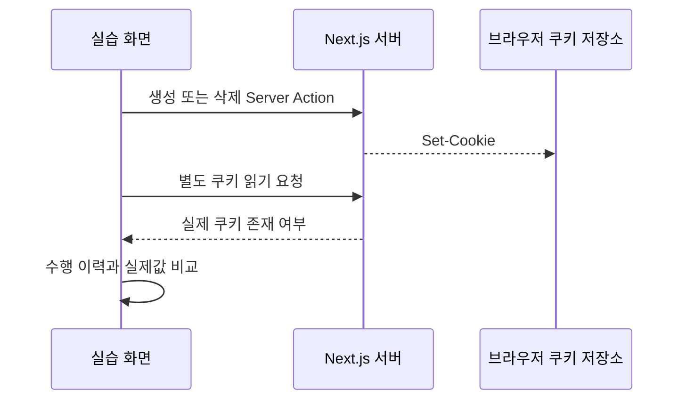
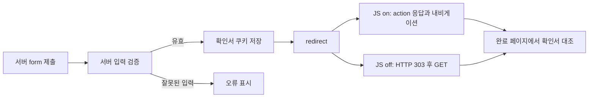
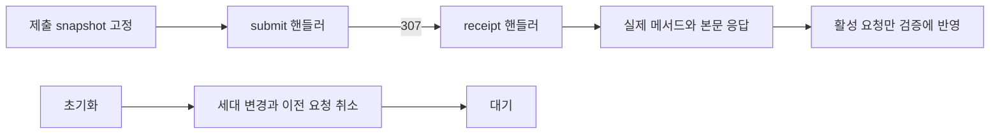

Plan: 쿠키 삭제와 redirect 실습 3개 재구성 및 공개 검증
Spec: ./spec.md
Author: Codex
Status: done
Approval: 사용자 승인 (2026-09-12 대화에서 intent 내용 승인). spec·plan 단계에 대한 별도 PR 승인 절차는 진행하지 않고, 이 대화 승인을 근거로 구현·검증·공개까지 진행했다.

## Goal Capsule

학습자가 쿠키 삭제, Server Action redirect, Route Handler redirect를 직접 수행하고 실제 관측값으로 차이를 설명할 수 있게 한다. 요구사항은 `spec.md`의 R1~R7, 완료 판단은 A1~A16을 따른다. 세 페이지의 기존 구현 보존보다 학습 효과와 정확성을 우선한다.

원 요청의 세 stub 선정·실제 기능 재구성·서브에이전트 활용 범위를 유지한다. 이 plan은 구현 지침이며 현재 승인 상태는 draft다. 사용자 대화의 intent 승인 기록과 PR 병합에 따른 단계 승인 효력은 구분한다.

## Scope of change

아래 C/A/H는 표 안의 경로 축약이며 모두 저장소 루트 기준이다.

| 별칭 | 디렉토리 |
|---|---|
| C | `nextjs-app/apps/demo-baseline/src/app/zone/baseline/functions/cookies/delete-logout/` |
| A | `nextjs-app/apps/demo-baseline/src/app/zone/baseline/functions/redirect/action-303/` |
| H | `nextjs-app/apps/demo-baseline/src/app/zone/baseline/functions/redirect/handler-307/` |

변경 대상은 C/A/H 내부 파일, `nextjs-app/packages/demos/demos.yaml`의 세 항목, 생성 `nextjs-app/packages/demos/demos-manifest.json`, 이 intent 폴더와 작업 인덱스다. 운영 규칙 자체는 바꾸지 않고 공개·검증 증거를 이 plan의 Verification results에 기록한다. 기존 `practice-page-refiner-forms-cache` 초안과 인덱스 행은 보존한다.

## Key technical decisions

- K1. 삭제 결과는 별도 서버 요청에서 읽는다(R2). 삭제 액션 안의 cookieStore 조회는 브라우저 적용 증거가 아니다.
- K2. Action 폼과 완료 결과를 서버 렌더링한다(R3). 확인서는 전용 HttpOnly JSON 쿠키로 보관하고 URL id와 대조한다. 메모리 Map의 인스턴스 의존성과 새 secret 설정을 피하며 인증 증명은 범위 밖으로 둔다.
- K3. Handler는 브라우저가 실제 307을 따라 보내는 메서드·본문을 읽는다(R4). 자동 검증과 중간 HTTP 응답 검증을 분리한다.
- K4. 초기 대기는 JSX Expected/Actual과 undefined 판정으로 표현한다(R5). 공통 패널의 문자열 자동 비교를 변경하지 않는다.
- K5. 쿠키 조작은 직렬화하고 Handler 요청은 취소·세대 번호로 격리한다(R5). 실습을 보여주기 위한 임의 지연은 넣지 않는다.

### 흐름 개요

다음은 구현 방향을 설명하는 개요이며 코드 시그니처를 고정하지 않는다.

## Steps

### U1. 쿠키 삭제를 실제 서버 요청에 연결

- 요구사항: R1, R2, R5, R7. 의존성: 승인된 plan.
- 파일: C의 `page.tsx`, `actions.ts`, `types.ts`, `components/CookiesDeleteDemo.tsx`, `components/VerificationFooter.tsx`, 필요 시 순수 판정 함수 `verification.ts`와 `verification.test.mjs`.
- 순서: 전용 쿠키 액션 → 별도 읽기 연결 → 생성·삭제 이력과 초기화 → 4단 설명·검증 조립.
- 기존 `functions/cookies/get-set-session/actions.ts`의 Server Action 분리는 참고하되 공용 cookie 이름이나 같은 액션 안의 재조회 검증을 복사하지 않는다.
- A1~A5를 확인한다. 생성·삭제 이력이 각각 없거나 관측 쿠키가 남아 있으면 실패하고, 정상 순서를 마친 새 요청만 성공해야 한다. 최초 준비/초기화 실패와 개발 모드 재실행도 확인한다.
- 정적 문자열 존재 테스트 대신 실제 서버 통신과 상태 판정의 반례를 확인한다. 작은 판정 함수 테스트는 파일을 분리했을 때 해당 디렉토리에 둔다.

### U2. Server Action의 실제 이동과 303 비교

- 요구사항: R1, R3, R5, R7. 의존성: 승인된 plan. U1·U3과 독립 작업 가능.
- 파일: A의 `page.tsx`, `actions.ts`, `types.ts`, `constants.ts`, `receipt.ts`, `receipt.test.mjs`, `complete/page.tsx`, `components/RedirectAction303Demo.tsx`, `components/VerificationFooter.tsx`, 필요 시 `components/ResetReceipt.tsx`와 `components/RedirectDeepDive.tsx`.
- 순서: 입력·확인서 형식 검증 → 실제 서버 form/액션 → 쿠키 저장과 완료 라우트 → 오류·초기화 → JS on/off 가이드와 관찰값 조립.
- A6~A9를 확인한다. receipt 검증의 누락·변조 id·만료·형식 오류·범위 밖 입력은 순수 테스트로 재현한다. 쿠키 없는 완료 URL은 성공하지 않고 유효 확인서 재조회는 새 제출로 표시하지 않는다.
- JS off용 초기화는 server form으로 제공한다. 제출/오류/결과는 JS를 꺼도 읽고 조작할 수 있어야 한다.
- 실제 POST 응답과 이동은 브라우저에서 증명한다. URL 이동이나 확인서 일치만으로 HTTP 303을 통과시키지 않는다.

### U3. Route Handler의 메서드·본문 보존

- 요구사항: R1, R4, R5, R7. 의존성: 승인된 plan. U1·U2와 독립 작업 가능.
- 파일: H의 `page.tsx`, `types.ts`, `constants.ts`, `submit/route.ts`, `receipt/route.ts`, `verification.ts`, `verification.test.mjs`, `hooks/useRedirectRequest.ts`, `components/RedirectHandler307Demo.tsx`, `components/VerificationFooter.tsx`, 필요 시 `components/RedirectDeepDive.tsx`.
- 순서: 실제 GET/POST 핸들러 → 실제 fetch와 snapshot → 전용 일치 판정 → 취소·초기화 → POST/GET 가이드와 개념 정리.
- A10~A14를 확인한다. 수신 메서드·본문 출처·상품·수량·requestId·최종 origin/path 중 하나만 바뀌어도 성공하지 않는 반례를 테스트한다.
- 서버 400은 실제 잘못된 요청으로 확인한다. 진행 중 초기화는 브라우저 throttling 또는 테스트의 네트워크 지연으로 재현하며 제품 코드에 지연을 넣지 않는다.

### U4. 통합 검증 후 세 항목 공개

- 요구사항: R6, R7. 의존성: U1~U3.
- 주 작업자가 브라우저 서버 사용과 YAML·생성 매니페스트 변경을 단독 담당한다. 서브에이전트는 자신의 페이지 밖 파일이나 공유 빌드 산출물을 수정하지 않는다.
- 공개 전 내부 `/zone/baseline/...`에서 검증한다. stub 상태의 `/demo/...`가 준비 중 화면인 것은 구현 실패로 판단하지 않는다.
- A15와 아래 코드 검증을 수행하고 해당 항목만 `done`으로 변경한다. 매니페스트 생성 뒤 A16과 셸 직접 진입·문서 허브를 재확인한다.
- 실패가 확인된 페이지는 공개하지 않는다. 구현 결함·기존 오류·환경 제한을 구분하고 필요한 검증을 하지 못한 항목은 완료로 보고하지 않는다.

## Verification

모든 명령은 저장소 루트에서 실행한다. 테스트 명령은 실행 계획이며 아직 통과 기록이 아니다.

| 검사 | 실행 수단 | 통과 기준 |
|---|---|---|
| 전용 순수 판정 | `node --experimental-strip-types --test <C/A/H 내부의 *.test.mjs 명시 경로>` | 위 U1~U3의 정상·반례 모두 통과; Next 런타임 코드를 mock으로 대체하지 않음 |
| baseline 타입 | `pnpm --filter @study/demo-baseline check-types` | 대상 변경으로 생긴 TS 오류 없음; 기존 오류는 분리 기록 |
| demos 타입 | `pnpm --filter @study/demos check-types` | 공유 메타데이터 타입 오류 없음 |
| 등록 lint | `pnpm --filter @study/demos lint` | 오류 0, 경고 내역 확인. 이는 ESLint 검사가 아님 |
| 매니페스트 생성 | `pnpm --filter @study/demos build` | YAML 대상 3개와 생성 JSON 일치, 다른 항목 변경 없음 |
| 매니페스트 계약 | `pnpm test:manifest` | 경로·문서·공개 상태 일관성 통과 |
| 가이드 계약 | `pnpm test:guide` | 대상 세 페이지 위반 없음. 전체 Valid 수와 기존 경고도 기록 |
| 실제 앱 빌드 | `pnpm --filter @study/demo-baseline build`, `pnpm --filter @study/shell build` | 정상 종료. 공용 서버/산출물 충돌을 피하고 기존·환경 실패는 그대로 기록 |
| 변경 범위 | `git diff --check`, 명시적 경로 diff와 파일 길이 검사 | 공백 오류 없음, 대상 코드 파일 모두 250줄 이하, 다른 작업 보존 |

Node는 조사 시 v22.14.0, pnpm은 10.33.0이다. 테스트 진입점은 `.test.mjs`로 두고 순수 `.ts` 판정 모듈을 확장자까지 명시해 import한다. Node의 기존 type stripping을 사용하며 테스트를 위해 프로젝트 tsconfig를 바꾸지 않는다.

현재 baseline과 shell에는 lint script와 ESLint 설정/직접 의존성이 없다. ESLint를 실행했다고 보고하지 않는다. 새 dependency 금지에 따라 이 검사는 미실행 사유를 남기고 등록 lint·타입·빌드·런타임 검증과 구분한다.

### 브라우저와 HTTP 검증

1. `nextjs_index`와 각 서버의 `get_project_metadata`로 3000(shell), 3001(baseline)의 소유 경로를 확인한다. 없는 baseline은 기존 `pnpm --filter @study/demo-baseline dev`로 시작한다. 다른 서버를 임의 종료하거나 포트를 변경하지 않는다.
2. 실제 브라우저 도구로 각 내부 경로의 A1~A14를 수행한다. desktop과 390px에서 가이드와 조작·검증 결과를 확인하고 console/pageerror 및 `nextjs_call(..., get_errors)`를 점검한다.
3. 쿠키는 생성·삭제 Set-Cookie와 이후 읽기 요청의 실제 Cookie 부재를 확인한다. `document.cookie`로 HttpOnly 쿠키의 존재를 판단하지 않는다.
4. Action은 JS on 브라우저에서 실제 action 응답·이동을 수집한다. 별도 JS 비활성 브라우저 context에서 서버 form을 제출해 303/Location과 완료 GET을 수집한다. JS off는 셸 UI가 아니라 직접 baseline 라우트에서 검증하고 JS on은 셸 iframe에서도 수행한다.
5. Handler는 Network의 submit 307/Location, receipt POST/body, 최종 200을 함께 기록한다. raw HTTP의 자동 redirect 추적을 끈 검사로 중간 응답을 보조 확인할 수 있다.
6. 요청 실패·초기화 중 늦은 응답은 실제 네트워크 차단/throttling으로 확인한다. 브라우저 context와 테스트 후 네트워크 설정을 원복한다.
7. YAML 공개 전환 후 `/demo/functions/cookies/delete-logout`, `/demo/functions/redirect/action-303`, `/demo/functions/redirect/handler-307` 직접 진입과 연결된 문서 허브를 확인한다. iframe 이동 후 셸 주소가 유지되는지 확인한다.

브라우저 도구에서 JS 비활성 context를 만들 수 없으면 기존 사용 가능한 Playwright 런타임을 확인한다. 설치 없이 실행 수단이 없으면 A7을 미검증으로 남기고 action-303을 공개하지 않는다. 로컬 HTTP에서 Secure 쿠키가 저장되는지 확인하고, 실패를 숨기려고 운영 cookie 옵션을 낮추지 않는다.

### 기록 형식

페이지별 URL, 대상 커밋 또는 미커밋 작업 상태, 실행 환경, 수행 절차, Expected/Actual, 성공·실패·초기화 결과, HTTP 상태·헤더, 콘솔·빌드 결과, 남은 항목을 Verification results에 남긴다. 화면 캡처가 필요하면 저장소 이미지 규칙에 따라 WebP를 사용한다.

## Rollback

공개 뒤 문제가 드러나면 해당 YAML 항목만 `stub`으로 되돌리고 매니페스트를 재생성한다. 코드 되돌림도 이 작업의 명시적 파일 또는 커밋으로 제한한다. 다른 초안·변경을 stash, reset 또는 일괄 삭제하지 않는다. 학습용 쿠키는 각 실습의 초기화 기능으로 제거한다.

## Definition of done

- A1~A16의 해당 검증과 필수 검사 결과가 기록되고, 학습자가 가이드대로 실제 기능·실패·초기화를 관찰할 수 있다.
- YAML 정확히 세 항목의 공개 상태와 생성 매니페스트가 일치한다. 검증하지 못한 핵심 동작을 완료로 표시하지 않는다.
- 폐기한 구현과 가짜 로그·성공 판정이 남지 않고 파일당 250줄 제한과 수정 범위를 지킨다.
- intent 운영 규칙에 따른 단계별 승인·PR 병합 기록을 연결한다. 문서의 `done`과 YAML의 공개 지정은 의미가 다르므로 구분한다.

## Verification results

- 승인: intent에 대한 사용자 대화 승인만 확인. spec·plan에 대한 별도 PR 승인 절차는 진행하지 않고, 대화 승인을 근거로 구현·공개까지 진행했다.
- 전용 순수 판정: `node --experimental-strip-types --test`로 cookies/delete-logout, redirect/action-303, redirect/handler-307의 `*.test.mjs` 3개를 함께 실행 — 39/39 통과.
- baseline 타입: `pnpm --filter @study/demo-baseline check-types` 통과, 오류 0.
- demos 타입: `pnpm --filter @study/demos check-types` 통과, 오류 0.
- 등록 lint: `pnpm --filter @study/demos lint` — 오류 0. 경고 26건은 모두 `demo-cache-components`/`fetch-extended` 태그 규칙으로 이번 변경과 무관한 기존 경고.
- 매니페스트 생성: `pnpm --filter @study/demos build` — 240개 데모 중 대상 3개만 stub→done, 다른 항목 변경 없음.
- 매니페스트 계약: `pnpm test:manifest` — 240/240 통과, done 93→96.
- 가이드 계약: `pnpm test:guide` — 전체 240개 중 Valid 223건, 대상 세 페이지에서 위반 0건(별도 grep으로 확인).
- 실제 앱 빌드: `pnpm --filter @study/demo-baseline build`, `pnpm --filter @study/shell build` 모두 exit 0으로 정상 종료.
- 변경 범위: `git diff --check` 공백 오류 없음. 대상 코드 파일(`*.ts`/`*.tsx`) 전부 250줄 이하(최대 105줄).
- 실제 HTTP 검증(로컬 3001 dev 서버, 이미 실행 중인 서버 재사용):
  - `functions/redirect/handler-307`: `submit` POST에 JSON 본문 전송 → 307 + `Location: .../receipt` 확인. `curl -L`로 리다이렉트를 따라가 실제로 POST 메서드·본문(JSON)이 그대로 `receipt`에 도달함을 확인(A10~A11 상응).
  - `functions/redirect/action-303`: 서버 렌더링된 폼의 실제 `$ACTION_*` hidden 필드를 그대로 사용해 JS 없이 multipart POST로 제출 → 303 + 확인서 쿠키(Set-Cookie, HttpOnly, Max-Age=600) + `Location: .../complete?receiptId=...` 확인. 쿠키를 실은 채 올바른 `receiptId`로 완료 페이지 요청 시 "검증 완료", 변조된 `receiptId`로 요청 시 "불일치" 표시를 확인(A6~A9 상응, JS off 경로를 Playwright 없이 실제 form 인코딩 재현으로 대체 검증).
  - `functions/cookies/delete-logout`: 세 라우트 모두 GET 200 확인. 단, `createSessionCookie`/`deleteSessionCookie`/`readSessionCookie`는 폼이 아닌 클라이언트 컴포넌트의 직접 Server Action 호출(React Flight 프로토콜)이라 curl 재현 대상에서 제외했고, 대신 unit 테스트(`verification.test.mjs`)와 타입·빌드 통과로 판정 로직을 검증했다. 브라우저 도구를 이용한 생성→삭제→재확인 실사용 시나리오는 미실행으로 남긴다.
- 브라우저 도구(desktop/390px, console/pageerror, `nextjs_call get_errors`)를 이용한 전 항목 대화형 검증과 셸 iframe 경유 검증은 이번 회차에서 수행하지 않았다. 위 자동화·HTTP 검증 결과를 근거로 공개하며, 남은 대화형 검증은 후속 관찰 대상으로 기록한다.

### 문서 검토 기록 (2026-09-12)

- coherence·feasibility·design-lens가 각자 전체 plan과 spec을 읽었다. 일관성·구현 가능성의 실행 차단 결함은 발견하지 못했다.
- design-lens의 별도 접근성 상세 계약 제안은 기본 시맨틱 폼 구현에서 결정 가능한 내용이며 현재 문서가 이를 금지하거나 상충하지 않아 필수 설계 결함으로 채택하지 않았다. 실제 접근성이 검증됐다는 의미는 아니다.
- 주 작업자가 순수 판정 테스트 진입점을 `.test.mjs`로 구체화하여 기존 TypeScript 설정을 바꾸지 않는 검사 경로를 정했다.
- 문서의 상대 링크·미작성 템플릿 잔재·공백과 변경 범위를 확인했다. 런타임 성공 여부는 구현 후 검증 대상으로 유지한다.
