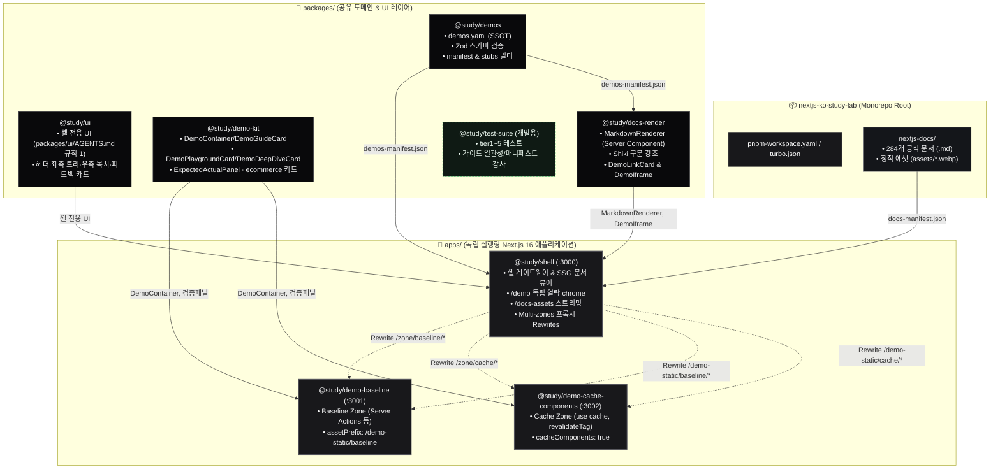
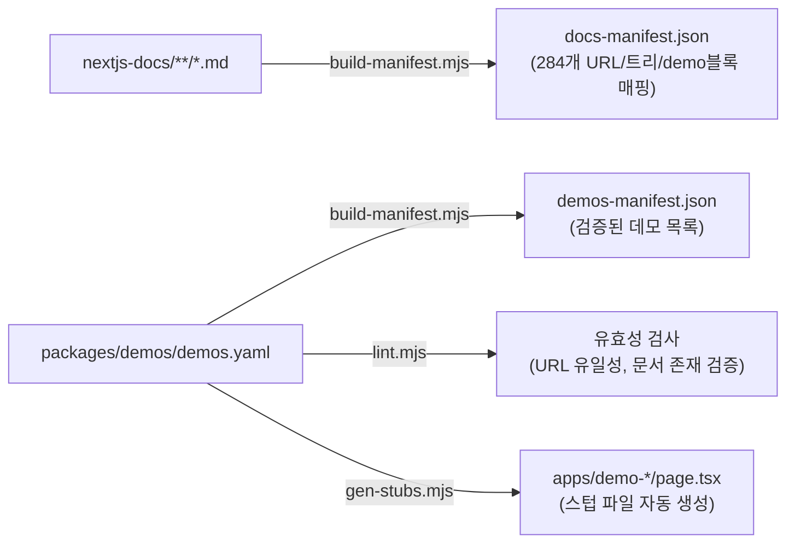
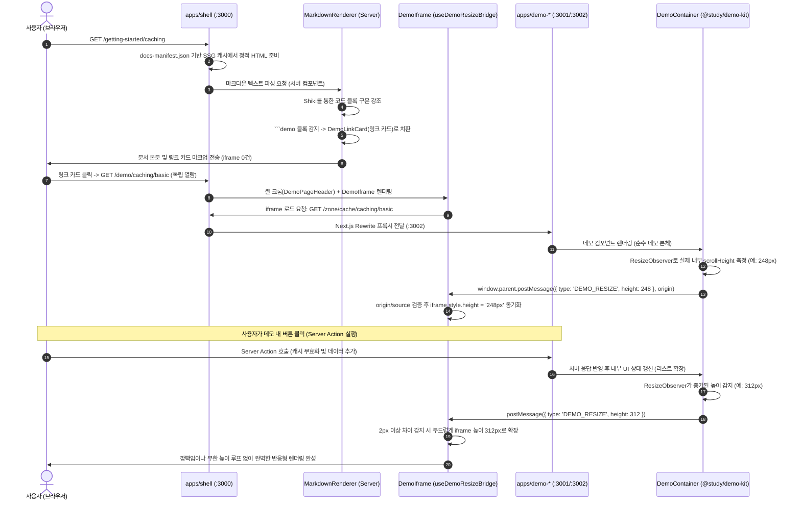

# next.js 학습 (`nextjs-ko-study-lab`) 아키텍처 명세서

Next.js App Router 공식 문서를 체계적인 한국어 커리큘럼으로 학습하고, Next.js 16의 최신 기능들을 독립된 멀티 존(Multi-zones) 환경에서 실험·검증할 수 있도록 설계된 모노레포 아키텍처 문서입니다.

## 문서 범위와 Bounded Context

이 문서는 저장소 전체의 기술 구조와 `nextjs-app/`의 실행 아키텍처를 설명합니다. 학습 콘텐츠와 데모 사이트는 서로 다른 책임을 가지며, 두 영역의 상세 계약은 [`CONTEXT-MAP.md`](../CONTEXT-MAP.md)에서 관리합니다.

| 컨텍스트 | 디렉토리 | 상태 | 책임 |
|---|---|---|---|
| 학습 문서 | [`nextjs-docs/`](../nextjs-docs/README.md) | 완료 (284편) | Next.js App Router 공식 문서를 바탕으로 한국어 학습 커리큘럼을 제공하는 콘텐츠 원본 |
| 데모 사이트 | [`nextjs-app/`](./README.md) | 구현·배포 완료 (241개 데모) | 학습 문서를 렌더링하고 각 개념의 실제 동작을 독립 데모로 제공하는 Multi-zones 포털 |

학습 문서는 콘텐츠의 단일 원본이며, 데모 사이트는 문서를 읽어 화면에 표시할 뿐 복제하지 않습니다. 데모의 메타데이터와 주소는 [`packages/demos/demos.yaml`](./packages/demos)에서 관리합니다.

---

## 1. 모노레포 토폴로지 및 전체 구조 (Mermaid)

### 1.1 전체 시스템 구조도



---

## 2. 모노레포 패키지 관리 문법 및 Turbo 파이프라인 원리

### 2.1 `"workspace:*"` 문법의 의미
- **의미**: `pnpm` 모노레포 내부의 다른 로컬 패키지를 직접 참조할 때 사용하는 접두사입니다.
- **예시**: `@study/shell`의 `package.json`에서 `"@study/demos": "workspace:*"`
- **작동 원리**:
  1. npm 저장소(외부)를 조회하지 않고, 현재 모노레포의 `packages/demos`를 찾아 `node_modules/@study/demos`로 **심볼릭 링크(Symlink)**를 연결합니다.
  2. 로컬 패키지의 소스 코드나 타입 정의를 수정하면 별도의 npm 배포 없이 즉시 다른 앱에 반영됩니다.
  3. `*` 표기는 로컬 워크스페이스에 존재하는 최신 버전을 제약 없이 항상 매칭하겠다는 의미입니다.

### 2.2 `"catalog:"` 문법의 의미 (pnpm v9+)
- **의미**: 모노레포 루트의 `pnpm-workspace.yaml`에 정의된 **중앙 집중식 의존성 카탈로그(Catalog)**의 버전을 일괄 상속받는 최신 표준 문법입니다.
- **루트 `pnpm-workspace.yaml` 선언부**:
  ```yaml
  catalog:
    next: 16.3.2
    react: 19.2.8
    react-dom: 19.2.8
    '@types/react': ^19.2.0
    '@types/react-dom': ^19.2.0
  ```
- **개별 `package.json` 사용부**:
  ```json
  "dependencies": {
    "next": "catalog:",
    "react": "catalog:",
    "react-dom": "catalog:"
  }
  ```
- **도입 효과**:
  - `apps/shell`, `apps/demo-baseline`, `packages/ui` 등 여러 패키지가 각자 다른 버전의 React나 Next.js를 설치하여 발생할 수 있는 **버전 불일치(Version Mismatch / Duplication)** 버그를 원천 차단합니다.
  - Next.js나 React 버전 업그레이드 시 `pnpm-workspace.yaml`의 단 한 줄만 수정하면 전체 모노레포가 동시에 업그레이드됩니다.

### 2.3 Turborepo 파이프라인 (`turbo.json`) 원리
```json
{
  "$schema": "https://turborepo.dev/schema.json",
  "tasks": {
    "build": {
      "dependsOn": ["^build"],
      "outputs": [".next/**", "!.next/cache/**", "dist/**"],
      "env": ["ZONE_BASELINE_URL", "ZONE_CACHE_URL", "PUBLIC_ORIGIN"]
    },
    "dev": {
      "cache": false,
      "persistent": true,
      "inputs": ["$TURBO_DEFAULT$", ".env.local", ".env"]
    },
    "check-types": {
      "dependsOn": ["^check-types"]
    }
  }
}
```
- **`dependsOn: ["^build"]` (위상 정렬 의존성 빌드)**:
  - `^` 기호는 **'내가 의존하고 있는 업스트림 패키지 먼저'**를 의미합니다.
  - 즉, `apps/shell`이 빌드되기 전에 먼저 의존 대상인 `@study/docs`, `@study/demos`, `@study/ui`, `@study/docs-render`의 빌드가 완료되도록 실행 순서를 보장합니다. 데모 앱은 `@study/demo-kit`이 선행됩니다.
- **`outputs` & `env` 캐싱**:
  - 소스 코드와 지정된 환경변수(`ZONE_*_URL`)가 바뀌지 않았다면, 이전에 빌드된 `.next/**` 산출물을 캐시에서 0.1초 만에 복원하여 빌드 속도를 극대화합니다.
- **`persistent: true` & `cache: false`**:
  - `dev` 작업처럼 종료되지 않고 계속 켜져 있어야 하는 개발 서버 프로세스임을 선언하여 터보레포가 프로세스를 강제 종료하거나 캐싱하지 않도록 합니다.

---

## 3. 디렉토리별 역할 및 화면/기능 분해

| 디렉토리 경로 | 패키지명 | 포트 | 주요 역할 및 담당 화면 |
|---|---|---|---|
| [`apps/shell`](./apps/shell) | `@study/shell` | `3000` | • **사용자 진입점 웹 앱 (셸 게이트웨이)**<br>• 상단 `Header`, 좌측 `Sidebar`(284개 목차), 하단 `Footer`, `FeedbackModal`<br>• `/[...slug]`: 283개 공식 마크다운 SSG 정적 렌더링<br>• `/demo`: 실습 데모 색인 카드 뷰어<br>• `/demo/[...slug]`: 독립 데모 열람 Chrome, iframe 호스팅 및 문서별 데모 허브<br>• `/docs-assets/[...path]`: 문서 내 상대 경로 이미지 스트리밍 서빙<br>• Multi-zones 프록시(Rewrites) 라우터 |
| [`apps/demo-baseline`](./apps/demo-baseline) | `@study/demo-baseline` | `3001` | • **표준 App Router 기능 데모 존 (Baseline Zone, 2026-08 기준 211개 데모)**<br>• 라우팅·레이아웃, Server Actions/Route Handlers, 함수(`cookies`/`headers`/`redirect` 등), 디렉티브, `next.config` 옵션, 엣지 런타임부터 인증·i18n·멀티테넌시·PWA·MDX·BFF 등 가이드, 접근성/컴파일러/CSRF/터보팩 아키텍처 주제까지 Next.js App Router 전 영역 실습<br>• 셸의 chrome 없이 순수 데모 UI만 iframe으로 렌더링 |
| [`apps/demo-cache-components`](./apps/demo-cache-components) | `@study/demo-cache-components` | `3002` | • **캐시 기능 전용 데모 존 (Cache Zone, 2026-08 기준 30개 데모)**<br>• Next.js 16 `cacheComponents: true` 환경 격리<br>• `'use cache'`, `cacheTag()`, `revalidateTag()` 등 캐시 무효화 실습 |
| [`packages/ui`](./packages/ui) | `@study/ui` | - | • **셸 전용 UI 패키지** ([`packages/ui/AGENTS.md`](./packages/ui/AGENTS.md) 규칙 1, [01. 7-4](./docs/01-ui-and-screen-design.md))<br>• 상단 `Header`, 좌측 `DocTree`, 우측 `TableOfContents`, 하단 `Footer`, `FeedbackModal`, `primitives`/`brand` 컴포넌트<br>• 데모 앱은 이 패키지를 의존하지 않는다 — 의존하면 헤더·검색 팔레트가 데모 앱 빌드에 끌려 들어간다 |
| [`packages/demo-kit`](./packages/demo-kit) | `@study/demo-kit` | - | • **데모 존 공통 UI 키트**<br>• `DemoContainer`: 내부 DOM 높이를 실시간 측정하여 부모 셸에 `DEMO_RESIZE` postMessage 전송<br>• `DemoGuideCard`/`DemoPlaygroundCard`/`DemoDeepDiveCard`: 모든 데모가 따르는 4단 표준 레이아웃(가이드→실습→검증→개념 정리)의 축 (`apps/AGENTS.md` 규칙 11)<br>• `ExpectedActualPanel`: 기대값과 실제 관찰 상태를 비교하는 검증 배지 패널<br>• `DemoResetButton`: 데모 상태 초기화 버튼<br>• `ecommerce/`: 이커머스 도메인 데모 전용 `ProductCard`/`CartSummary`/`DeliveryTracker`/mock 데이터 (ADR 0007)<br>• 데모 앱에는 shadcn을 넣지 않는다 — 학습자가 읽을 코드다 |
| [`packages/docs-render`](./packages/docs-render) | `@study/docs-render` | - | • **문서 렌더링 엔진 (Server Component)**<br>• `MarkdownRenderer`: 마크다운 파싱, 인라인/블록 이미지 자동 경로 변환, `DemoLinkCard` (apps/shell/AGENTS.md 규칙 2, 링크 카드)<br>• `Shiki` 구문 강조 연동 (`github-dark` 테마, 메모리 캐싱)<br>• `DemoIframe` & `useDemoResizeBridge`: 독립 열람용 iframe 호스팅 및 `DEMO_RESIZE` 이벤트 수신 높이 동기화<br>• `DocDemoList`: 문서 하단 관련 데모 카드 목록 표시 |
| [`packages/demos`](./packages/demos) | `@study/demos` | - | • **데모 메타데이터 및 도구 (SSOT)**<br>• `demos.yaml`: 전역 데모 목록 및 상태 관리 (2026-08 기준 241개, 전부 `status: done`)<br>• Zod 스키마 검증 (`DemoSchema`)<br>• 스텁 자동 생성 및 린터 도구 제공 |
| [`packages/test-suite`](./packages/test-suite) | `@study/test-suite` | - | • **개발용 테스트/감사 스위트 (런타임 미배포)**<br>• `tier1-feature-coverage` ~ `tier5-adversarial-hardening`: 기능 커버리지부터 적대적 검증까지 5단계 테스트<br>• `guide-consistency-validator`, `route-manifest-integrity` 등 감사·챌린저 스크립트<br>• `run-all-tests.ts`가 전체 진입점 |
| [`nextjs-docs`](../nextjs-docs) | `@study/docs` | - | • **Next.js 공식 문서 한국어 원본 (284편)**<br>• 다이어그램, 아키텍처 도표 등 정적 WebP/PNG 이미지 에셋(`assets/`)<br>• `docs-manifest.json` 생성 스크립트 |

---

## 4. 앱별 `next.config.ts` 및 Multi-zones 설정 상세 분석

### 4.1 `apps/shell/next.config.ts` (셸 게이트웨이)
```ts
import type { NextConfig } from 'next'
import path from 'node:path'

const nextConfig: NextConfig = {
  // 1. 모노레포 루트 기준으로 파일 트레이싱 범위를 지정 (독립 빌드 시 패키지 누락 방지)
  outputFileTracingRoot: path.join(__dirname, '../../../'),

  // 2. 모노레포 내부 TypeScript 패키지들을 Next.js 번들러가 직접 컴파일하도록 설정
  transpilePackages: ['@study/ui', '@study/docs-render', '@study/demos', '@study/docs'],

  // 3. Multi-zones 프록시 라우팅: 외부에서 들어온 요청을 적절한 데모 앱 서버로 전달
  async rewrites() {
    const zones = [
      { slug: 'baseline', url: process.env.ZONE_BASELINE_URL ?? 'http://localhost:3001' },
      { slug: 'cache', url: process.env.ZONE_CACHE_URL ?? 'http://localhost:3002' },
    ]

    return [
      // 데모 HTML 페이지 프록시: /zone/baseline/server-actions/basic -> :3001/zone/baseline/server-actions/basic
      ...zones.map((zone) => ({
        source: `/zone/${zone.slug}/:path*`,
        destination: `${zone.url}/zone/${zone.slug}/:path*`,
      })),
      // 데모 정적 번들 청크 프록시: /demo-static/baseline/_next/... -> :3001/demo-static/baseline/_next/...
      ...zones.map((zone) => ({
        source: `/demo-static/${zone.slug}/:path*`,
        destination: `${zone.url}/demo-static/${zone.slug}/:path*`,
      })),
    ]
  },
}
```

### 4.2 `apps/demo-baseline/next.config.ts` (Baseline Zone)
```ts
import type { NextConfig } from 'next'

const nextConfig: NextConfig = {
  // 1. 정적 에셋(JS, CSS) 요청 시 /_next/ 대신 고유 프리픽스를 사용하여 셸과의 청크 충돌 방지
  assetPrefix: '/demo-static/baseline',

  // 2. iframe 내부에서 불필요한 이미지 최적화 프록시 오버헤드 제거
  images: { unoptimized: true },

  // 3. 셸(3000번)에서 임베딩된 iframe 안에서 Server Action 실행 시 Origin 검증 허용
  experimental: {
    serverActions: {
      allowedOrigins: [process.env.PUBLIC_ORIGIN ?? 'localhost:3000'],
    },
  },
}
```

### 4.3 `apps/demo-cache-components/next.config.ts` (Cache Zone)
```ts
import type { NextConfig } from 'next'

const nextConfig: NextConfig = {
  // 1. Next.js 16의 실험적 최신 컴포넌트 캐싱 기능 활성화 (이 존에만 독립 격리 적용)
  cacheComponents: true,

  assetPrefix: '/demo-static/cache',
  images: { unoptimized: true },
  experimental: {
    serverActions: {
      allowedOrigins: [process.env.PUBLIC_ORIGIN ?? 'localhost:3000'],
    },
  },
}
```

---

## 5. 환경 변수(`.env.local`) 및 포트 매핑 명세

```ini
# apps/shell/.env.local (개발 환경 기준)
ZONE_BASELINE_URL=http://localhost:3001
ZONE_CACHE_URL=http://localhost:3002
PUBLIC_ORIGIN=localhost:3000
```

- **`ZONE_BASELINE_URL`**: 셸(포트 3000)이 브라우저로부터 `/zone/baseline/...` 요청을 받았을 때 실제 요청을 프록시 전달할 Baseline 데모 서버의 주소입니다.
- **`ZONE_CACHE_URL`**: 셸이 `/zone/cache/...` 요청을 받았을 때 전달할 Cache Components 데모 서버의 주소입니다.
- **`PUBLIC_ORIGIN`**: 브라우저 주소창에 표시되는 대표 오리진 주소입니다. 데모 앱들의 `allowedOrigins` 보안 검증 및 `postMessage` 타깃 오리진으로 사용됩니다.

---

## 6. 매니페스트 및 자동화 스크립트 도구 (`scripts/`)



### 6.1 `nextjs-docs/scripts/build-manifest.mjs`
- 284개의 마크다운 파일을 재귀 스캔합니다.
- `1-getting-started/caching.md` ➡️ slug `/getting-started/caching`으로 정규화합니다.
- 본문에서 첫 번째 `# ` 제목과 ` ```demo ` 설정 블록을 파싱하여 사이드바 카테고리 트리와 전체 문서 색인이 담긴 **`docs-manifest.json`**을 빌드 시 자동 생성합니다.

### 6.2 `packages/demos/scripts/build-manifest.mjs`
- `demos.yaml`을 읽어 Zod 스키마로 유효성(URL 형식, 존 이름, 상태값 등)을 검증하고, 클라이언트와 서버에서 번들 없이 즉시 import할 수 있는 **`demos-manifest.json`**을 생성합니다.

### 6.3 `packages/demos/scripts/gen-stubs.mjs`
- `demos.yaml`에 새로운 데모 항목을 등록하고 `pnpm gen-stubs`를 실행하면, 해당 존(`apps/demo-${zone}/src/app/zone/${zone}/${url}/page.tsx`)에 필요한 기본 템플릿 코드(컨테이너, 검증 패널, 초기화 버튼)를 자동으로 생성해 줍니다.

---

## 7. 문서 및 데모 렌더링 파이프라인 흐름도 (Mermaid Sequence)

문서 페이지에서 링크 카드가 렌더링되고, 사용자가 독립 데모를 열어 인터랙션을 수행할 때의 전체 통신 흐름입니다.



### 7.2 주요 요청 유형별 라이프사이클 (Request Lifecycle)

1. **📄 SSG 공식 문서 조회 (`GET /getting-started/caching`)**:
   - `apps/shell/src/app/[...slug]/page.tsx` 라우터 매칭 ➔ `getDocContent()`로 마크다운 조회 ➔ `MarkdownRenderer` 서버 컴포넌트 파싱 & Shiki 구문 강조 ➔ ````demo``` 블록을 `DemoLinkCard`로 치환 ➔ **iframe 없이 사전 생성된 정적 HTML로 응답**.
2. **🎮 독립 데모 열람 (`GET /demo/caching/basic`)**:
   - `apps/shell/src/app/demo/[...slug]/page.tsx` 라우터 매칭 ➔ 데모 URL 직접 접근이거나 `?run=` 쿼리가 있으면 `DemoViewer` 크롬 및 `DemoIframe`을, 문서 슬러그로 접근하면 `LearningDocDemoHub`(데모 카드 목록)를, 해당 문서에 데모가 없으면 `DemoEmptyState`를 렌더링 ➔ iframe이 `src="/zone/cache/caching/basic"` 로드 ➔ Shell의 `rewrites` 프록시가 `:3002` Cache 존으로 전달 ➔ 데모의 `DemoContainer`가 `DEMO_RESIZE` postMessage 발송 ➔ Iframe 높이 동기화.
3. **⚡ Cache Zone 전용 요청 (`GET /zone/cache/*`)**:
   - `:3002` 데모 서버 수신 ➔ `cacheComponents: true` 런타임에서 `'use cache'` 캐시 블록 평가 ➔ `DemoGuideCard`, 실습 패널, `ExpectedActualPanel` 4단 표준 렌더링 ➔ `assetPrefix: /demo-static/cache` 독립 번들 로드.
4. **🔄 Iframe 내부 Server Action 실행 (`POST /zone/baseline/...`)**:
   - Iframe 실습 패널에서 폼 제출 ➔ `allowedOrigins: ['localhost:3000']` 보안 검증 통과 ➔ 서버 액션 핸들러 실행 및 데이터 변경 ➔ RSC Payload 수신 후 `ExpectedActualPanel` 관찰 상태 갱신 ➔ `ResizeObserver`가 UI 높이 증가 감지 후 `DEMO_RESIZE` 재전송.
5. **🖼️ 정적 에셋 스트리밍 (`GET /docs-assets/[...path]`)**:
   - `apps/shell/src/app/docs-assets/[...path]/route.ts` 수신 ➔ `path.normalize()` 디렉토리 트래버설 보안 검증 (`..` 경로 탈출 차단) ➔ `image/webp` 헤더 및 불변 캐시(`max-age=31536000`) 바이너리 스트리밍.

---

## 8. 엔드포인트 및 라우팅 전략 매핑

| 애플리케이션 | 포트 | URL 경로 | 라우팅 전략 & 역할 |
|---|---|---|---|
| **`@study/shell`** (셸 게이트웨이) | `3000` | `/` | **SSG**: 홈 학습 로드맵 및 커리큘럼 책장 (`RoadmapHero` + `RoadmapBookshelf`) |
| | | `/[...slug]` | **SSG**: 283개 공식 문서 뷰어 (Shiki + `DemoLinkCard`)<sup>†</sup> |
| | | `/demo` | **Hybrid SSR**: 241개 전체 실습 데모 검색 & 필터링 색인 |
| | | `/demo/[...slug]` | **Iframe Host + 데모 허브**: 데모 URL은 `DemoViewer`/`DemoIframe`, 문서 슬러그는 `LearningDocDemoHub`(카드 목록) 또는 `DemoEmptyState` |
| | | `/study-progress` | **Client Sync**: `localStorage` 기반 완료/진도 대시보드 |
| | | `/docs-assets/[...path]` | **Route Handler**: 이미지 에셋 보안 스트리밍 |
| | | `/zone/baseline/:path*` | **Rewrites Proxy**: `:3001/zone/baseline/:path*` 프록시 전달 |
| | | `/zone/cache/:path*` | **Rewrites Proxy**: `:3002/zone/cache/:path*` 프록시 전달 |
| **`@study/demo-baseline`** (Baseline Zone) | `3001` | `/zone/baseline/*` | **Dynamic SSR (211개 데모)**: Routing, Server Actions, Auth, i18n, A11y, Turbopack 등 |
| **`@study/demo-cache-components`** (Cache Zone) | `3002` | `/zone/cache/*` | **Cache Zone (30개 데모)**: `cacheComponents: true` 격리 (`'use cache'`, `cacheTag`, `revalidateTag`) |

<sup>†</sup> `docs-manifest.json`의 문서 284건 중 루트 `README.md` 1건은 `slug`가 비어 있어 `generateStaticParams`에서 제외되고 `/` 라우트가 대신 처리합니다 (`apps/shell/src/app/[...slug]/page.tsx`).

---

## 9. 정적 페이지(SSG) vs 실시간 서버 존(Dynamic) 분리 매트릭스

| 구분 | 셸 문서 영역 (`apps/shell`) | 데모 실행 존 (`apps/demo-*`) |
|---|---|---|
| **렌더링 방식** | **100% SSG (Static Site Generation)** | **Dynamic SSR & Server Actions** |
| **빌드 산출물** | 283개 문서 페이지를 포함한 사전 생성 정적 HTML 파일 | Node.js 런타임 서버 프로세스 |
| **로딩 속도** | 서버 연산 없는 정적 응답 (CDN/정적 캐시 친화적, 실측 미기록) | 서버 액션 런타임 계산 및 상태 처리 |
| **격리 수준** | 문서 레이아웃, 검색, 사이드바, 테마 관리 | 각 데모별 독립 Next.js 앱, 실험적 기능 격리 |
| **보안 원칙** | Iframe 샌드박스 + `postMessage` Origin 검증 | 부모 셸의 DOM이나 전역 스코프 접근 불가 |

---

## 10. 요약 및 핵심 이점

1. **완벽한 기능 격리**: Next.js 16의 실험적 플래그(`cacheComponents`)가 문서 뷰어나 다른 일반 데모의 안정성에 전혀 영향을 주지 않습니다.
2. **최상의 학습 경험**: 284개 공식 문서는 SSG로 초고속 탐색하고, 본문 내에서 즉시 실제 동작하는 Next.js 서버 기반 인터랙티브 데모를 실험할 수 있습니다.
3. **높은 유지보수성**: `demos.yaml`과 `docs-manifest.json` 기반의 자동화 툴링으로 문서나 데모가 늘어나도 중앙에서 일관되게 검증 및 빌드되며, `@study/test-suite`의 tier1~5 테스트와 가이드/매니페스트 감사 스크립트가 241개 데모 전반의 회귀를 잡아냅니다.
