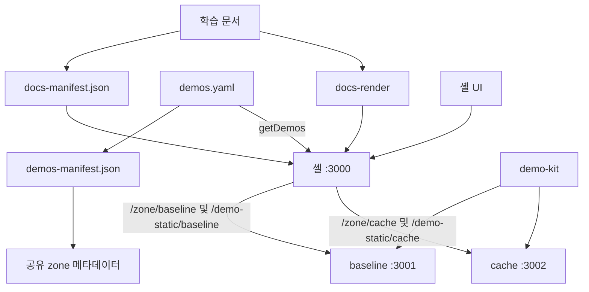
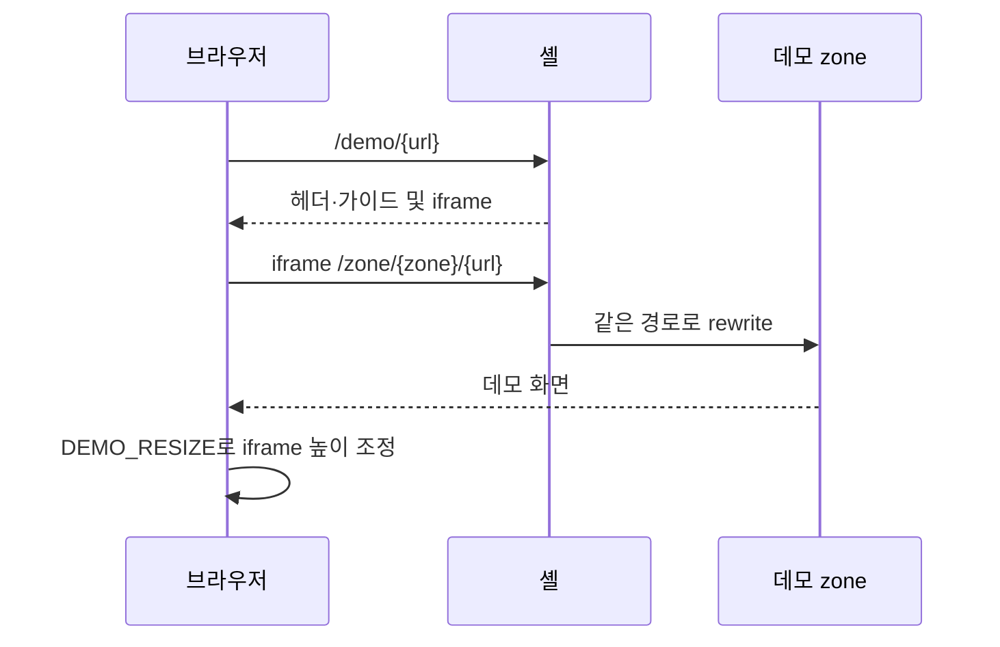

# Next.js 학습 랩 아키텍처

2026-09-05 소스 기준의 시스템 경계와 요청 흐름이다. 코드 탐색은 [02](./docs/02-codebase-deep-dive-guide.md), 운영 절차는 [04](./docs/04-vercel-deployment-plan.md), 문서별 역할은 [문서 색인](./docs/README.md)을 따른다.

## 문서 범위와 Bounded Context

| 영역 | 책임 | 원본 |
|---|---|---|
| 학습 콘텐츠 | 한국어 학습 문서·목차·이미지 | `nextjs-docs/` |
| 데모 목록 | 존재·URL·제목·연결 문서·zone·공개 상태 | `packages/demos/demos.yaml` |
| 셸 | 문서 렌더링·탐색·학습 기록·데모 뷰어·프록시 | `apps/shell/` |
| 데모 zone | 실제 Next.js 기능의 실행 | `apps/demo-baseline/`, `apps/demo-cache-components/` |

문서·데모의 생성 매니페스트는 소비용 산출물이며 직접 편집하지 않는다. 등록·공개 상태는 [09](./docs/09-demo-status-and-stepwise-release-guide.md), 콘텐츠 경계는 [CONTEXT-MAP](../CONTEXT-MAP.md)을 참조한다.

## 1. 시스템 구조

## 2. 패키지 경계와 빌드

워크스페이스는 저장소 루트의 `pnpm-workspace.yaml`이 정의한다. 앱 폴더에서 별도 의존성 트리를 만들지 않는다. `workspace:*`는 로컬 패키지 의존, `catalog:`는 루트 기준 버전 참조다. 버전 변경은 lockfile·학습 기준·영향 검증을 함께 다뤄야 한다.

| 패키지 | 책임 |
|---|---|
| `@study/docs` | 학습 콘텐츠와 문서 매니페스트 생성 |
| `@study/demos` | 데모 매니페스트·조회·공유 메타데이터·생성/검증 도구 |
| `@study/ui` | 셸의 헤더·트리·카드·피드백·공유 UI |
| `@study/docs-render` | MarkdownRenderer·Shiki·본문 데모 링크·iframe 수신 브리지 |
| `@study/demo-kit` | 데모 컨테이너·가이드·검증 패널·높이 송신 브리지 |
| `@study/test-suite` | 개발용 정적 검사와 테스트. 통과 범위는 실행한 검사에 한정 |

`turbo.json`의 build는 `^build`를 선행한다. 앱 전체 빌드·타입 검사는 각각 루트 `pnpm build`, `pnpm check-types`다. 상세 명령과 생성물은 [02](./docs/02-codebase-deep-dive-guide.md), 배포 캐시·환경변수는 [04](./docs/04-vercel-deployment-plan.md)가 관리한다.

## 3. URL과 실행 책임

| URL | 처리 |
|---|---|
| `/` | 전용 홈 페이지. 학습 루트 README를 그대로 렌더링하지 않음 |
| `/{문서 slug}` | `[...slug]`에서 매니페스트 조회 후 MarkdownRenderer 호출 |
| `/demo` | 검색어·카테고리·페이지를 사용하는 데모 색인 |
| `/demo/{데모 url}` | 공개 상태 검사 후 데모 뷰어 또는 준비 중 안내 |
| `/demo/{문서 slug}` | 문서별 데모 허브. `?run=` 동작의 제약은 09번 참조 |
| `/study-progress` | 셸 소유의 브라우저 학습 기록 |
| `/docs-assets/{path}` | 문서 이미지 제공 |
| `/zone/{zone}/*` | 셸에서 해당 zone으로 rewrite |
| `/demo-static/{zone}/*` | zone 정적 자산으로 접두사를 유지해 rewrite |
| `/og`, `/zone/{zone}/og` | 셸·zone의 OG 이미지 라우트 |

학습자에게 안내하는 주소는 셸의 `/demo/*`다. 내부 zone URL도 요청 가능한 경로이며 공개 상태가 접근 권한을 보장하지 않는다.

## 4. 요청과 iframe 흐름

본문 `demo` 지시자는 iframe이 아닌 링크 카드다. 현재 홈에도 iframe이 없다. 데모 뷰어에서 `DemoIframe`을 사용한다.

`DemoContainer`의 `useResizeBridge`는 컨테이너 높이를 관찰해 `{ type: 'DEMO_RESIZE', height }`를 보낸다. 수신 훅은 origin·iframe source·메시지 형태를 검사하고 최소 높이와 2px 변화 기준을 적용한다. 이 설명은 소스 확인이며 모든 비정상 메시지의 방어가 검증됐다는 뜻은 아니다.

## 5. zone 설정과 배포 경계

baseline은 `assetPrefix: '/demo-static/baseline'`, cache는 `assetPrefix: '/demo-static/cache'`와 `cacheComponents: true`를 사용한다. 두 앱 모두 `images.unoptimized`를 사용하고 `allowedOrigins`를 Related Projects 또는 `PUBLIC_ORIGIN`으로 구성한다.

셸은 `ZONE_*_URL`을 폴백으로 zone host를 구하고 두 종류의 경로를 rewrite한다. 문서 파일 추적용 `outputFileTracingRoot`도 셸 설정에 있다. 설정값·환경별 운영 절차는 중복하지 않고 [04](./docs/04-vercel-deployment-plan.md)를 따른다.

## 6. 상태와 검증 경계

학습 기록은 `study_learning_progress` localStorage에 완료 항목만 저장한다. 데이터 모델·저장소 실패 처리는 [06](./docs/06-learning-progress-design.md), 공개 상태·현재 우회 경로는 [09](./docs/09-demo-status-and-stepwise-release-guide.md)에 기록한다.

첫 배포 검증은 과거 기록이 있으며 Preview 검증은 남아 있다. 정적 검사, 로컬 브라우저 확인, 배포 확인을 구분해 보고한다. 이번 문서 정비의 근거와 구현 후속 항목은 [최신화 기록](./docs/maintenance/2026-09-05-documentation-refresh.md)에 정리했다.
