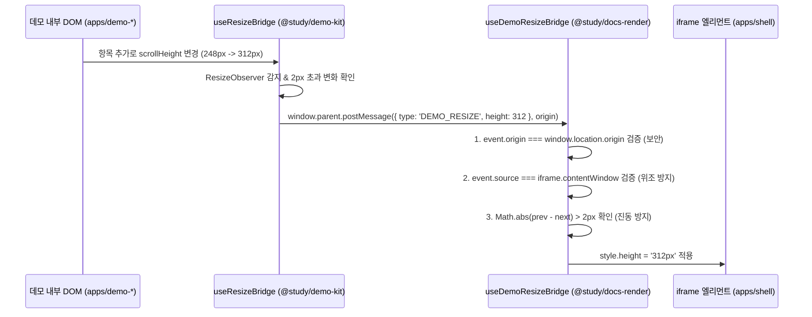

# [02] 코드베이스 심층 분석 및 데이터 흐름 가이드

이 문서는 `nextjs-ko-study-lab` 모노레포의 **디렉토리/파일 역할, YAML 데이터 변환·소비 파이프라인, 패키지 간 격리 정책, 셸 프레임 vs 데모 뼈대 연결 관계**를 개발자가 한눈에 꿰뚫어볼 수 있도록 정리한 심층 기술 가이드입니다.

---

## 1. 모노레포 전체 토폴로지 및 파일 맵

저장소는 **1개의 모노레포 루트, 1개의 문서 저장소, 3개의 독립 Next.js 앱, 5개의 공유 패키지**로 구성되어 있습니다.

```
nextjs-ko-study-lab/
├── package.json                      # 모노레포 루트 스크립트 (build, dev, check-types)
├── pnpm-workspace.yaml               # 워크스페이스 패키지 정의 & 중앙 의존성 카탈로그(catalog:)
├── turbo.json                        # Turborepo 태스크 파이프라인 및 캐시 무효화 규칙
│
├── nextjs-docs/                      # [문서 소스] 공식 문서 한국어 마크다운 원본 (284편)
│   ├── 1-getting-started/...         # 카테고리별 마크다운 문서 (*.md)
│   ├── assets/                       # 공식 문서 정적 이미지 에셋 (*.webp, *.png)
│   ├── scripts/build-manifest.mjs    # md 스캔 ➡️ docs-manifest.json 빌더
│   └── docs-manifest.json            # 284개 문서 색인, 트리 구조, demo 블록 매핑 결과물
│
└── nextjs-app/
    ├── ARCHITECTURE.md               # 시스템 아키텍처 명세서 (SSOT)
    ├── CONTEXT.md                    # 데모 사이트 도메인 용어집
    ├── AGENTS.md                     # 저장소 전체 규칙(범용 6개) + 하위 디렉토리별 AGENTS.md 지도
    ├── scripts/                      # 콘텐츠 생성/마이그레이션용 1회성 스크립트 (generate-all-demos 등)
    │
    ├── packages/                     # [공유 패키지 레이어]
    │   ├── demos/                    # 데모 메타데이터 및 도구 (demos.yaml SSOT)
    │   │   ├── demos.yaml            # 전체 데모의 고유 URL, 제목, zone, 상태 선언 (2026-08 기준 241개, 전부 done)
    │   │   ├── scripts/              # build-manifest, lint, gen-stubs 도구
    │   │   └── src/index.ts          # Zod 스키마, 데모 조회 함수
    │   ├── demo-kit/                 # 데모 앱 전용 공통 UI 키트 (packages/ui/AGENTS.md 규칙 1)
    │   │   ├── DemoContainer.tsx     # 데모 루트 래퍼 (ResizeObserver 탑재)
    │   │   ├── DemoGuideCard.tsx     # 4단 레이아웃 1단: 가이드 카드 (apps/AGENTS.md 규칙 11)
    │   │   ├── DemoPlaygroundCard.tsx# 4단 레이아웃 2단: 실습 화면 카드
    │   │   ├── DemoDeepDiveCard.tsx  # 4단 레이아웃 4단: 개념 정리 카드
    │   │   ├── ExpectedActualPanel.tsx# 4단 레이아웃 3단: 기대값 vs 실제값 검증 패널
    │   │   ├── DemoResetButton.tsx   # 데모 상태 초기화 버튼
    │   │   ├── ecommerce/            # 이커머스 도메인 데모 전용 키트 (ProductCard, CartSummary 등, ADR 0007)
    │   │   └── useResizeBridge.ts    # 셸로 DEMO_RESIZE postMessage를 전송하는 훅
    │   ├── docs-render/              # 셸 전용 문서 렌더링 엔진 (Server Component)
    │   │   ├── markdown/             # MarkdownRenderer 스캐너, 파서, AST 노드
    │   │   ├── code/                 # Shiki 문법 강조, CodeBlock
    │   │   └── demo/                 # DemoLinkCard, DemoIframe, useDemoResizeBridge
    │   ├── test-suite/                # 개발용 테스트/감사 스위트 (런타임 미배포)
    │   │   ├── src/tier1-feature-coverage ~ tier5-adversarial-hardening/ # 5단계 테스트
    │   │   └── src/runners/          # run-all-tests, guide-consistency-validator, route-manifest-integrity 등
    │   └── ui/                       # 셸 전용 프레임 UI 패키지 (packages/ui/AGENTS.md 규칙 1)
    │       ├── layout/               # Header, Footer, FooterLinks, FeedbackTrigger
    │       ├── nav/                  # DocTree (사이드바), TableOfContents (우측 목차)
    │       ├── demo/                 # DemoIndexCard, DemoIndexStats, DemoPageHeader
    │       ├── feedback/             # FeedbackModal, FeedbackForm
    │       ├── primitives/           # Button, Badge, Input, Card 등 원자 컴포넌트
    │       └── styles.ts             # 전역 반복 Tailwind 클래스 리터럴 상수
    │
    └── apps/                         # [Next.js 16 애플리케이션 레이어]
        ├── shell/                    # [Port 3000] 사용자 진입점 게이트웨이 & SSG 문서 뷰어
        │   ├── src/app/layout.tsx    # 전체 사이트 공통 레이아웃 (Header, DocTree, Footer)
        │   ├── src/app/[...slug]/    # 284개 마크다운 문서 SSG 렌더링 라우트
        │   ├── src/app/demo/         # 데모 색인 카드 목록 (/demo)
        │   ├── src/app/demo/[...slug]# 데모 독립 열람 Chrome (/demo/...)
        │   ├── src/app/docs-assets/  # 문서 내 상대 경로 이미지 스트리밍 라우트
        │   ├── src/lib/              # docs-root, manifest, demos 조회 라이브러리
        │   └── next.config.ts        # Multi-zones 프록시 Rewrites 라우터
        ├── demo-baseline/            # [Port 3001] Baseline Zone (Server Actions 등 표준 기능)
        │   ├── src/app/zone/baseline/# /zone/baseline/... 데모 라우트
        │   └── next.config.ts        # assetPrefix: /demo-static/baseline, allowedOrigins
        └── demo-cache-components/    # [Port 3002] Cache Zone (use cache 전용 기능)
            ├── src/app/zone/cache/   # /zone/cache/... 데모 라우트
            └── next.config.ts        # cacheComponents: true, assetPrefix: /demo-static/cache
```

---

## 2. 설정 파일 및 YAML 데이터 변환·소비 파이프라인

모노레포의 모든 데이터는 **수동 복제 없이 단일 원본(SSOT)에서 빌드 타임에 정적 JSON 매니페스트로 변환되어 앱에 주입**됩니다.

```mermaid
flowchart TD
    subgraph ConfigPipeline ["1. 중앙 의존성 관리 파이프라인"]
        PW["pnpm-workspace.yaml<br/>(catalog: next, react 등 고정)"] -->|"catalog:" 상속| AppPkg["각 package.json (apps/*, packages/*)"]
        TJ["turbo.json<br/>(dependsOn: ^build, env, outputs)"] -->|위상 정렬| BuildTask["pnpm build / check-types"]
    end

    subgraph DemosPipeline ["2. 데모 메타데이터 파이프라인 (SSOT)"]
        DY["packages/demos/demos.yaml<br/>(데모 URL, 제목, zone, status)"]
        DY -->|scripts/gen-stubs.mjs| Stubs["apps/demo-*/page.tsx<br/>(스텁 템플릿 자동 생성)"]
        DY -->|scripts/build-manifest.mjs<br/>(Zod 스키마 검증)| DM["demos-manifest.json<br/>(정적 JSON)"]
        DM -->|import| ShellDemo["apps/shell (/demo 색인, 독립 열람)"]
        DM -->|import| DocDemo["packages/docs-render (DocDemoList)"]
    end

    subgraph DocsPipeline ["3. 마크다운 문서 파이프라인"]
        MD["nextjs-docs/**/*.md<br/>(284개 공식 문서 원문)"]
        MD -->|scripts/build-manifest.mjs| DocM["docs-manifest.json<br/>(URL 매핑, 목차 트리, demo 블록)"]
        DocM -->|import| ShellManifest["apps/shell/src/lib/manifest.ts"]
        ShellManifest -->|generateStaticParams| SSG["284개 정적 HTML 생성"]
        ShellManifest -->|Tree 전달| DocTree["@study/ui (DocTree 사이드바)"]
    end
```

### 2.1 `pnpm-workspace.yaml`의 카탈로그(`catalog:`) 원리
- **중앙 선언**: 루트 `pnpm-workspace.yaml`에 `next: 16.3.2`, `react: 19.2.8`을 정의합니다.
- **앱/패키지 주입**: 각 하위 `package.json`에서는 `"next": "catalog:"`로 선언합니다.
- **효과**: 3개 Next.js 앱과 4개 패키지가 **정확히 동일한 버전**을 바라보며, 버전 파편화로 인한 React 훅 충돌이나 번들 중복이 원천 차단됩니다.

### 2.2 `demos.yaml`의 라이프사이클과 변환 흐름
1. **정의**: 새 데모를 기획하면 `packages/demos/demos.yaml`에 항목을 추가합니다.
   ```yaml
   - url: caching/basic
     title: use cache 기본 동작 및 revalidateTag 무효화
     doc: 1-getting-started/caching.md
     zone: cache
     status: done
   ```
2. **스텁 생성 (`pnpm gen-stubs`)**: `gen-stubs.mjs`가 `demos.yaml`을 읽어 아직 파일이 없는 zone 디렉토리(`apps/demo-cache-components/src/app/zone/cache/caching/basic/page.tsx`)에 `@study/demo-kit` 기반의 표준 스텁 코드를 자동 생성합니다.
3. **유효성 검증 및 매니페스트 빌드 (`pnpm build`)**: `build-manifest.mjs`가 Zod 스키마(`DemoSchema`)로 URL 형식과 중복을 검사한 뒤 `demos-manifest.json`을 출력합니다.
4. **소비**:
   - `apps/shell/src/app/demo/page.tsx` ➡️ `status === 'done'`인 데모만 필터링하여 색인 카드를 렌더링합니다.
   - `packages/docs-render/src/demo/DocDemoList.tsx` ➡️ `doc` 필드가 현재 문서와 일치하는 데모를 찾아 문서 하단에 "관련 데모"로 자동 노출합니다.

### 2.3 `nextjs-docs` ➡️ `docs-manifest.json` 변환 흐름
1. `nextjs-docs/scripts/build-manifest.mjs`가 284개 마크다운 파일을 재귀 스캔합니다.
2. 파일 경로(예: `1-getting-started/caching.md`)의 카테고리 번호를 제거하여 URL 슬러그(`/getting-started/caching`)로 정규화합니다.
3. 본문 첫 번째 `# 제목`과 ` ```demo ` 코드펜스를 파싱하여 사이드바 트리 노드(`TreeNode`)와 매니페스트를 생성합니다.
4. `apps/shell/src/app/[...slug]/page.tsx`는 `getManifest()`를 통해 빌드 타임에 전체 284개 라우트의 `generateStaticParams()`를 수행하여 100% SSG 정적 HTML을 만듭니다.

---

## 3. 패키지 격리 정책 및 UI 책임 분할 (packages/ui/AGENTS.md 규칙 1 & apps/shell/AGENTS.md 규칙 2)

모노레포에서 가장 중요한 아키텍처 규칙은 **"어느 패키지의 코드가 어느 앱으로 흘러 들어가는가"**입니다.

```mermaid
graph LR
    classDef shellPkg fill:#1e293b,stroke:#475569,color:#f8fafc;
    classDef demoPkg fill:#064e3b,stroke:#059669,color:#f8fafc;
    classDef appStyle fill:#18181b,stroke:#71717a,color:#ffffff;

    subgraph ShellScope ["셸 영역 (apps/shell)"]
        UI["@study/ui<br/>(Header, DocTree, TOC, Modal)"]:::shellPkg
        Render["@study/docs-render<br/>(MarkdownRenderer, DemoLinkCard, DemoIframe)"]:::shellPkg
        ShellApp["apps/shell (:3000)"]:::appStyle
        UI --> ShellApp
        Render --> ShellApp
    end

    subgraph DemoScope ["데모 존 영역 (apps/demo-*)"]
        DemoKit["@study/demo-kit<br/>(DemoContainer, DemoGuideCard,<br/>DemoPlaygroundCard, DemoDeepDiveCard,<br/>ExpectedActualPanel, ecommerce/)"]:::demoPkg
        DemoBaseline["apps/demo-baseline (:3001)"]:::appStyle
        DemoCache["apps/demo-cache-components (:3002)"]:::appStyle
        DemoKit --> DemoBaseline
        DemoKit --> DemoCache
    end

    %% 금지선
    UI x-.-x|❌ 절대 의존 금지 (packages/ui/AGENTS.md 규칙 1)| DemoBaseline
    UI x-.-x|❌ 절대 의존 금지 (packages/ui/AGENTS.md 규칙 1)| DemoCache
```

### 3.1 `@study/ui` (셸 전용 UI) 정책
* **담당 역할**: 사이트 프레임워크 UI (헤더, 사이드바 트리, 우측 목차, 피드백 모달, 원자 컴포넌트, 데모 색인 카드).
* **사용처**: **오직 `apps/shell`에서만 import합니다.**
* **격리 이유 (packages/ui/AGENTS.md 규칙 1)**: 데모 앱이 `@study/ui`를 참조하는 순간, Next.js의 `transpilePackages`를 통해 사이드바 트리, 검색 로직, 모달 등 무거운 셸 전용 코드가 데모 앱의 클라이언트 번들로 끌려 들어갑니다. 데모 앱의 빌드 크기와 CSS를 가볍게 유지하기 위해 엄격히 격리합니다.

### 3.2 `@study/demo-kit` (데모 앱 전용 UI) 정책
* **담당 역할**: 데모 존의 표준 래퍼 및 검증 도구 (`DemoContainer`, `ExpectedActualPanel`, `DemoResetButton`, `useResizeBridge`), 그리고 모든 데모가 따르는 4단 표준 레이아웃(가이드→실습→검증→개념 정리)을 구성하는 `DemoGuideCard`/`DemoPlaygroundCard`/`DemoDeepDiveCard` (`apps/AGENTS.md` 규칙 11). 이커머스 도메인 데모용 `ecommerce/`(`ProductCard`, `CartSummary`, `DeliveryTracker`, mock 데이터, ADR 0007)도 포함합니다.
* **사용처**: **`apps/demo-baseline`, `apps/demo-cache-components` 등 모든 데모 zone 앱.**
* **특징**:
  * Tailwind 클래스만 사용하는 초경량 순수 컴포넌트입니다.
  * 내부 DOM 크기를 `ResizeObserver`로 측정하여 부모 셸로 `DEMO_RESIZE` postMessage를 쏘는 송신 브릿지가 내장되어 있습니다.
  * 데모 앱에는 shadcn 등의 거대 라이브러리를 일절 넣지 않습니다 (학습자가 읽을 실습 코드이므로 단순성 유지).

### 3.3 `@study/docs-render` (문서 렌더링 엔진) 정책
* **담당 역할**: 마크다운 텍스트를 정적 HTML로 변환하는 렌더러.
* **서버 컴포넌트화**: 본문 내 iframe을 걷어냄으로써 `MarkdownRenderer.tsx`에서 `'use client'`를 제거하여 **서버 컴포넌트로 동작**합니다 (클라이언트 JS는 복사 버튼과 Shiki 런타임 하이라이팅을 담은 `CodeBlock`으로 격리).
* **apps/shell/AGENTS.md 규칙 2 (링크 카드 전환)**: 본문에 ` ```demo ` 블록이 발견되면 iframe을 띄우지 않고 `<DemoLinkCard />`를 렌더링하여 학습자가 클릭 시 `/demo/[...slug]` 독립 열람 페이지로 이동하도록 안내합니다.

---

## 4. 코드 네비게이션 가이드 (어디를 봐야 하는가?)

작업 목적에 따라 어떤 파일과 패키지를 확인해야 하는지 정리한 맵입니다.

| 내가 확인/수정하려는 작업 | 진입점 파일 (Entry File) | 연결된 핵심 모듈 / 패키지 |
|---|---|---|
| **사이트 전체 프레임/레이아웃 (헤더, 좌측 트리, 푸터)** | [`apps/shell/src/app/layout.tsx`](../apps/shell/src/app/layout.tsx) | `@study/ui` (`layout/header/Header.tsx`, `nav/doc-tree/DocTree.tsx`, `layout/footer/Footer.tsx`) |
| **마크다운 문서 렌더링 및 본문 UI** | [`apps/shell/src/app/[...slug]/page.tsx`](../apps/shell/src/app/[...slug]/page.tsx) | `apps/shell/src/lib/manifest.ts` (데이터 로드)<br>`@study/docs-render` (`MarkdownRenderer.tsx`)<br>`@study/ui` (`nav/toc/TableOfContents.tsx`) |
| **데모 색인 목록 화면 (`/demo`)** | [`apps/shell/src/app/demo/page.tsx`](../apps/shell/src/app/demo/page.tsx) | `@study/ui` (`demo/DemoIndexCard.tsx`, `demo/DemoIndexStats.tsx`) |
| **데모 독립 열람 Chrome 및 iframe (`/demo/...`)** | [`apps/shell/src/app/demo/[...slug]/page.tsx`](../apps/shell/src/app/demo/[...slug]/page.tsx) | `@study/ui` (`demo/DemoPageHeader.tsx`)<br>`@study/docs-render` (`demo/DemoIframe.tsx`, `demo/useDemoResizeBridge.ts`) |
| **데모 앱 내부 실행 코드 (Baseline Zone)** | [`apps/demo-baseline/src/app/zone/baseline/...`](../apps/demo-baseline/src/app/zone/baseline/server-actions/basic/page.tsx) | `@study/demo-kit` (`DemoContainer`, `ExpectedActualPanel`, `DemoResetButton`) |
| **데모 앱 내부 실행 코드 (Cache Zone)** | [`apps/demo-cache-components/src/app/zone/cache/...`](../apps/demo-cache-components/src/app/zone/cache/caching/basic/page.tsx) | `@study/demo-kit` (`DemoContainer`, `ExpectedActualPanel`) |
| **전역 데모 목록 및 메타데이터 추가** | [`packages/demos/demos.yaml`](../packages/demos/demos.yaml) | `packages/demos/scripts/` (`lint.mjs`, `gen-stubs.mjs`, `build-manifest.mjs`) |
| **전역 반복 스타일/디자인 토큰 상수** | [`packages/ui/src/styles.ts`](../packages/ui/src/styles.ts) | `@study/ui` 내부 primitives 및 layout 컴포넌트 전반 |
| **테스트/검증 스크립트 작성 및 실행** | [`packages/test-suite/src/runners/run-all-tests.ts`](../packages/test-suite/src/runners/run-all-tests.ts) | `src/tier1-feature-coverage` ~ `tier5-adversarial-hardening` (테스트 본문), `src/runners/guide-consistency-validator.ts` · `route-manifest-integrity.ts` (감사 스크립트) |

---

## 5. 런타임 연결 파이프라인 상세 메커니즘

### 5.1 Multi-zones 프록시 Rewrites 라우팅
학습자가 브라우저에서 요청을 보낼 때 실제 라우팅되는 물리적 경로 매핑입니다.

```
[브라우저 요청]
  │
  ├── 1. GET /getting-started/caching ──▶ apps/shell (:3000) 직접 응답 (SSG HTML)
  │
  ├── 2. GET /demo/caching/basic ──────▶ apps/shell (:3000) 직접 응답 (셸 Chrome + DemoIframe)
  │                                           │ (iframe src="/zone/cache/caching/basic")
  │                                           ▼
  ├── 3. GET /zone/cache/caching/basic ─▶ apps/shell Rewrites 프록시 ──▶ apps/demo-cache-components (:3002)
  │
  └── 4. GET /demo-static/cache/_next/.. ▶ apps/shell Rewrites 프록시 ──▶ apps/demo-cache-components (:3002) 정적 청크
```

* **`apps/shell/next.config.ts`의 `rewrites`**:
  * `/zone/baseline/:path*` ➡️ `http://localhost:3001/zone/baseline/:path*`
  * `/zone/cache/:path*` ➡️ `http://localhost:3002/zone/cache/:path*`
  * `/demo-static/:slug/:path*` ➡️ 해당 zone의 정적 애셋 포트로 전달
* **효과**: 학습자는 포트가 다른 3개의 서버를 오가지만, 브라우저 상에서는 오직 `localhost:3000` 단일 오리진으로만 통신합니다.

### 5.2 Iframe Height Bridge 통신 프로토콜
데모 내부의 DOM 높이가 동적으로 변경(예: 항목 추가, 아코디언 열림)될 때 iframe 높이가 자동으로 따라 늘어나는 양방향 프로토콜입니다.



* **보안 검증**: `event.origin`과 `event.source`를 모두 엄격하게 검증하여 타 오리진이나 화면 내 다른 프레임의 간섭을 차단합니다.
* **진동 방지**: 소수점 픽셀 차이로 인한 무한 리사이즈 렌더 루프를 막기 위해 **2px 임계치(Threshold)**를 적용합니다.

### 5.3 Server Actions 보안 배관
데모 앱(`demo-baseline`) 안에서 Server Action(`'use server'`)을 호출할 때 Next.js는 CSRF 방지를 위해 Origin을 검증합니다.
* 데모 앱의 `next.config.ts`에 `experimental.serverActions.allowedOrigins: [process.env.PUBLIC_ORIGIN ?? 'localhost:3000']`을 지정하여, 셸(3000번) 오리진에서 전송된 폼 요청이 거부되지 않고 정상 처리되도록 배관이 연결되어 있습니다.

---

## 6. 요약 체크리스트

1. **새로운 데모를 추가할 때**: `demos.yaml`에 항목 추가 ➡️ `pnpm gen-stubs` 실행 ➡️ 생성된 `apps/demo-*/page.tsx`에 `@study/demo-kit` 기반 실증 코드 작성.
2. **UI 코드를 작성할 때**: 셸 화면은 `@study/ui`에, 데모 전용 공통 로직은 `@study/demo-kit`에 배치 (교차 import 금지).
3. **문서 렌더러를 수정할 때**: `MarkdownRenderer`는 서버 컴포넌트 원칙을 유지하며, 본문 내 데모 지시자는 `<DemoLinkCard>`로 처리.
