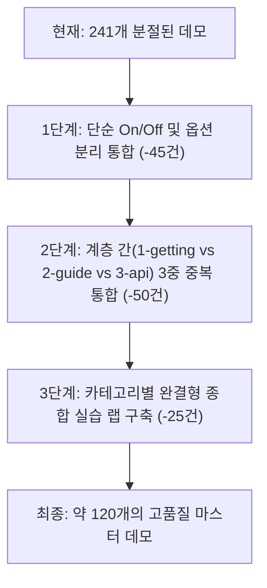

# nextjs-app 데모 중복 분석 및 통폐합 권고 보고서 (241건)

- **대상**: `nextjs-app/packages/demos/demos.yaml` 등록 데모 241건
- **목적**: 241개 데모 중 기능·개념·UI가 중복되거나 과도하게 쪼개진 예제를 체계적으로 분류하고, 학습 효과를 극대화할 수 있는 통폐합(Consolidation) 방안을 제시한다.
- **분석 기준**:
  1. **계층 간 중복 (Cross-Layer Overlap)**: `1-getting-started`, `2-guides`, `3-api-reference`에 걸쳐 동일한 Next.js 개념이 다중 구현된 사례
  2. **단일 문서 내 과세분화 (Intra-Doc Fragmentation)**: 1개 문서에 2~3개의 미세 변형(예: On/Off, A/B 탭)으로 불필요하게 쪼개진 사례
  3. **UI/인터랙션 패턴 중복 (Interaction Pattern Clones)**: 동일한 장바구니/카운터/로그 패턴을 단순 복제한 사례

---

## 1. 요약 (Executive Summary)

| 구분 | 건수 / 비율 | 설명 |
|---|---|---|
| **전체 등록 데모** | 241건 (100%) | 현재 `demos.yaml`에 등록된 전체 데모 |
| **동일 문서 다중 매핑 데모** | **172건 (71.4%)** | 82개 문서에 2~3개씩 쪼개져 연결된 데모 |
| **핵심 중복 클러스터** | **12개 영역 (110건)** | 레이아웃, 캐싱, 서버액션, 에러, 라우팅 등 주요 기능별 중복군 |
| **통폐합 권장 후 예상 데모 수** | **약 110 ~ 125건** | 핵심 인터랙티브 데모로 통합 시 약 **50% 압축 가능** |

### 핵심 발견점
1. **3중 계층 중복 구조**: 동일한 주제(예: 레이아웃, 캐싱, 에러 핸들링, 서버 액션)가 `1-getting-started` (기초) → `2-guides` (가이드) → `3-api-reference` (API/컨벤션)의 3단계로 각각 독립된 데모 페이지로 생성되어 있어 학습자에게 피로도를 줍니다.
2. **On/Off 단순 분리**: `draftMode().enable()`과 `disable()`, `cookies().set()`과 `delete()`, `revalidateTag` 기본형과 max형 등이 단일 데모 내 토글 UI로 충분함에도 별도 페이지로 분리되어 있습니다.
3. **가짜 세그먼트 파편화**: Dynamic Segments(`[id]`, `[...slug]`, `[[...slug]]`) 3개가 거의 동일한 코드 베이스에서 슬러그 처리 방식만 다르게 3개 페이지를 차지하고 있습니다.

---

## 2. 12대 핵심 중복 클러스터 상세 (110건)

---

### 클러스터 1: 캐싱, ISR 및 재검증 (총 31건 중복) — 🚨 최대 중복 영역

동일한 캐시 수명, 태그 무효화, ISR 개념이 1-getting-started, 2-guides, 3-api-reference 전반에 걸쳐 31개로 쪼개져 있습니다.

| # | 데모 URL | 존 | 연결 문서 | 현재 다루는 내용 | 통합 권장안 |
|---|---|---|---|---|---|
| 1 | `caching/basic` | cache | `1-getting-started/caching.md` | use cache 기본 동작 및 태그 무효화 | **[통합 데모 A]** `caching/unified-cache-lab` (기본 캐싱 + cacheLife + cacheTag 결합) |
| 2 | `revalidating/time-based-isr` | cache | `1-getting-started/revalidating.md` | cacheLife 시간 기반 캐시 수명 및 SWR | ↑ |
| 3 | `revalidating/tag-vs-path` | cache | `1-getting-started/revalidating.md` | revalidateTag vs revalidatePath 대조 | **[통합 데모 B]** `revalidating/tag-vs-path-purge` (정밀 태그 vs 경로 무효화 비교) |
| 4 | `guides/how-revalidation-works/swr-flow` | cache | `2-guides/how-revalidation-works.md` | SWR 재검증 흐름도 및 백그라운드 갱신 | ↑ |
| 5 | `guides/how-revalidation-works/ondemand-sync` | cache | `2-guides/how-revalidation-works.md` | On-demand 즉시 무효화 및 캐시 퍼지 | ↑ |
| 6 | `guides/caching-legacy/fetch-cache` | baseline | `2-guides/caching-without-cache-components.md` | 레거시 fetch cache 옵션 | **[통합 데모 C]** `caching/legacy-fetch-vs-use-cache` (레거시 vs 모던 비교) |
| 7 | `guides/caching-legacy/segment-revalidate` | baseline | `2-guides/caching-without-cache-components.md` | `export const revalidate` 세그먼트 설정 | ↑ |
| 8 | `guides/isr/time-isr-60s` | baseline | `2-guides/incremental-static-regeneration.md` | 레거시 60초 ISR 재검증 | ↑ |
| 9 | `guides/isr/revalidate-path-sync` | baseline | `2-guides/incremental-static-regeneration.md` | revalidatePath 동기화 | ↑ |
| 10 | `guides/isr-cache-components/cache-life-hours` | cache | `2-guides/.../isr-cache-components.md` | cacheLife('hours') 프로파일 | 위 통합 데모 A로 흡수 |
| 11 | `guides/isr-cache-components/precision-tag-purge` | cache | `2-guides/.../isr-cache-components.md` | cacheTag 정밀 퍼지 | 위 통합 데모 B로 흡수 |
| 12 | `guides/migrating-cache-components/unstable-to-use-cache` | cache | `2-guides/.../migrating-to-cache-components.md` | unstable_cache → use cache 마이그레이션 | 위 통합 데모 C로 흡수 |
| 13 | `guides/migrating-cache-components/cache-key-compare` | cache | `2-guides/.../migrating-to-cache-components.md` | 캐시 키 생성 방식 대조표 | ↑ |
| 14 | `functions/cache-life/preset-profiles` | cache | `3-api-reference/.../cacheLife.md` | cacheLife 빌트인 프리셋 | **[통합 데모 D]** `api/cache-life-profiles` (프리셋 + 커스텀 프로파일 통합) |
| 15 | `functions/cache-life/custom-profile` | cache | `3-api-reference/.../cacheLife.md` | next.config.ts custom cacheLife | ↑ |
| 16 | `functions/cache-tag/multi-tag-binding` | cache | `3-api-reference/.../cacheTag.md` | cacheTag 다중 바인딩 | **[통합 데모 E]** `api/cache-tag-cascade` (다중 바인딩 + 연쇄 무효화) |
| 17 | `functions/cache-tag/cascade-invalidation` | cache | `3-api-reference/.../cacheTag.md` | cacheTag 연쇄 무효화 | ↑ |
| 18 | `functions/unstable-cache/db-query` | cache | `3-api-reference/.../unstable_cache.md` | unstable_cache DB 쿼리 래핑 | 유지 (레거시 API 단독 실습) |
| 19 | `functions/unstable-no-store/dynamic-bailout` | baseline | `3-api-reference/.../unstable_noStore.md` | unstable_noStore 동적 렌더링 탈출 | 유지 |
| 20 | `functions/revalidate-path/page-vs-layout` | cache | `3-api-reference/.../revalidatePath.md` | page vs layout 레벨 revalidatePath | 위 통합 데모 B로 흡수 |
| 21 | `functions/revalidate-path/dynamic-route` | cache | `3-api-reference/.../revalidatePath.md` | 동적 라우트 revalidatePath | ↑ |
| 22 | `functions/revalidate-tag/basic-tag-purge` | cache | `3-api-reference/.../revalidateTag.md` | revalidateTag 기본 무효화 | 위 통합 데모 B로 흡수 |
| 23 | `functions/revalidate-tag/max-expiration` | cache | `3-api-reference/.../revalidateTag.md` | revalidateTag max 옵션 | ↑ |
| 24 | `functions/update-tag/instant-memory-sync` | cache | `3-api-reference/.../updateTag.md` | updateTag 메모리 즉시 동기화 | 유지 (Next.js 16 신규 API) |
| 25 | `directives/use-cache/function-cache` | cache | `3-api-reference/.../use-cache.md` | 함수 레벨 'use cache' | **[통합 데모 F]** `directives/use-cache-suite` (함수 + JSX 컴포넌트 + Private) |
| 26 | `directives/use-cache/component-jsx-cache` | cache | `3-api-reference/.../use-cache.md` | 컴포넌트 JSX 레벨 'use cache' | ↑ |
| 27 | `directives/use-cache/private-profile-cache` | cache | `3-api-reference/.../use-cache-private.md` | 'use cache: private' 사용자 캐시 | ↑ |
| 28 | `directives/use-cache/remote-redis-cache` | cache | `3-api-reference/.../use-cache-remote.md` | 'use cache: remote' 원격 캐시 | 유지 (인프라 연계 특수 실습) |
| 29 | `config/cache-components/enable-flag` | cache | `3-api-reference/.../cacheComponents.md` | cacheComponents: true 활성화 | **[통합 데모 G]** `config/cache-components-tuning` (설정값 통합 인스펙터) |
| 30 | `config/cache-life/custom-presets` | cache | `3-api-reference/.../cacheLife.md` | next.config.ts cacheLife 정의 | ↑ |
| 31 | `config/expire-time/memory-isr-tuning` | cache | `3-api-reference/.../expireTime.md` | expireTime 메모리 튜닝 | ↑ |

> **통폐합 효과**: 31개 데모 → **7개 심화 인터랙티브 랩으로 압축 (77% 감소)**

---

### 클러스터 2: Server Actions & 폼 데이터 변경 (총 8건 중복)

| # | 데모 URL | 존 | 연결 문서 | 현재 다루는 내용 | 통합 권장안 |
|---|---|---|---|---|---|
| 1 | `server-actions/basic` | baseline | `2-guides/server-actions.md` | Server Actions 기본 폼 처리 및 장바구니 | **[통합 데모 A]** `server-actions/complete-lifecycle` (기본 액션 + transition + optimistic UI) |
| 2 | `guides/server-actions-advanced` | baseline | `2-guides/server-actions.md` | useActionState 쿠폰 유효성 검증 | ↑ |
| 3 | `guides/server-actions/start-transition` | baseline | `2-guides/server-actions.md` | useTransition 연동 논블로킹 UI | ↑ |
| 4 | `guides/forms/use-action-state-errors` | baseline | `2-guides/forms.md` | useActionState 폼 필드 에러 표시 | **[통합 데모 B]** `forms/use-action-state-status` (useActionState + useFormStatus 결합 폼) |
| 5 | `guides/forms/use-form-status-spinner` | baseline | `2-guides/forms.md` | useFormStatus 로딩 스피너 | ↑ |
| 6 | `mutating-data/server-action-revalidate` | baseline | `1-getting-started/mutating-data.md` | Server Action + revalidatePath 동기화 | 통합 데모 A에 옵션으로 포함 |
| 7 | `directives/use-server/file-level-action` | baseline | `3-api-reference/.../use-server.md` | 파일 레벨 'use server' 분리 | **[통합 데모 C]** `directives/use-server-patterns` (파일 레벨 vs 인라인 클로저 비교) |
| 8 | `directives/use-server/inline-action-closure` | baseline | `3-api-reference/.../use-server.md` | 인라인 'use server' 클로저 액션 | ↑ |

> **통폐합 효과**: 8개 데모 → **3개 완결형 실습으로 압축 (62% 감소)**

---

### 클러스터 3: Layouts, Templates & Route Groups (총 10건 중복)

| # | 데모 URL | 존 | 연결 문서 | 현재 다루는 내용 | 통합 권장안 |
|---|---|---|---|---|---|
| 1 | `layouts-and-pages/nested-layouts` | baseline | `1-getting-started/layouts-and-pages.md` | GNB/사이드바 중첩 레이아웃 | **[통합 데모 A]** `layouts/nested-and-state-preservation` (중첩 레이아웃 + 상태 보존 시연) |
| 2 | `file-conventions/layout/root-and-nested` | baseline | `3-api-reference/.../layout.md` | Root Layout vs Nested Layout | ↑ |
| 3 | `file-conventions/layout/state-preservation` | baseline | `3-api-reference/.../layout.md` | 레이아웃 전환 간 상태 보존 | ↑ |
| 4 | `file-conventions/layout/dynamic-category-layout` | baseline | `3-api-reference/.../layout.md` | [category]/layout.tsx 동적 레이아웃 | 유지 (동적 라우트 연계) |
| 5 | `layouts-and-pages/template-lifecycle` | baseline | `1-getting-started/layouts-and-pages.md` | template.tsx 인스턴스 재생성 | **[통합 데모 B]** `templates/layout-vs-template-lifecycle` (Layout과 Template 생명주기 1:1 비교 랩) |
| 6 | `file-conventions/template/remount-lifecycle` | baseline | `3-api-reference/.../template.md` | template.tsx 리마운트 및 useEffect | ↑ |
| 7 | `file-conventions/template/input-reset-animation` | baseline | `3-api-reference/.../template.md` | 라우트 전환 시 입력값 리셋 | ↑ |
| 8 | `layouts-and-pages/route-groups-layouts` | baseline | `1-getting-started/layouts-and-pages.md` | Route Groups 다중 루트 레이아웃 | **[통합 데모 C]** `route-groups/isolation-and-multi-root` (URL 무영향 그룹화 + 루트 레이아웃 분리) |
| 9 | `file-conventions/route-groups/group-url-isolation` | baseline | `3-api-reference/.../route-groups.md` | (shop)/(auth) URL 격리 | ↑ |
| 10 | `file-conventions/route-groups/shop-vs-admin-roots` | baseline | `3-api-reference/.../route-groups.md` | 사용자몰 vs 어드민 독립 루트 | ↑ |

> **통폐합 효과**: 10개 데모 → **4개 핵심 라우팅 랩으로 압축 (60% 감소)**

---

### 클러스터 4: Navigation, Link & Prefetching (총 12건 중복)

| # | 데모 URL | 존 | 연결 문서 | 현재 다루는 내용 | 통합 권장안 |
|---|---|---|---|---|---|
| 1 | `linking-and-navigating/soft-navigation` | baseline | `1-getting-started/linking-and-navigating.md` | Link vs a 소프트 네비게이션 & 스크롤 | **[통합 데모 A]** `navigation/link-and-scroll` (소프트 네비게이션, 스크롤 복원) |
| 2 | `components/link/soft-navigation-scroll` | baseline | `3-api-reference/.../link.md` | <Link scroll={...}> 제어 | ↑ |
| 3 | `linking-and-navigating/router-prefetch` | baseline | `1-getting-started/linking-and-navigating.md` | useRouter.prefetch() 최적화 | **[통합 데모 B]** `navigation/prefetch-master-lab` (Link prefetch 3종 vs useRouter.prefetch) |
| 4 | `components/link/prefetch-options` | baseline | `3-api-reference/.../link.md` | <Link prefetch> (auto/full/false) | ↑ |
| 5 | `guides/prefetching/viewport-vs-hover` | baseline | `2-guides/prefetching.md` | 뷰포트 진입 vs 호버 프리페치 | ↑ |
| 6 | `guides/prefetching/custom-prefetch-false` | baseline | `2-guides/prefetching.md` | prefetch={false} 데이터 절약 | ↑ |
| 7 | `guides/optimizing-prefetching/bandwidth-saver` | baseline | `2-guides/optimizing-prefetching.md` | 프리페치 네트워크 대역폭 절약 | ↑ |
| 8 | `functions/use-router/push-replace` | baseline | `3-api-reference/.../use-router.md` | useRouter push vs replace vs back | **[통합 데모 C]** `api/use-router-suite` (push, replace, refresh, back 종합 실습) |
| 9 | `functions/use-router/refresh-server-sync` | baseline | `3-api-reference/.../use-router.md` | router.refresh() 서버 재검증 | ↑ |
| 10 | `functions/use-pathname/active-link` | baseline | `3-api-reference/.../use-pathname.md` | usePathname() 활성 GNB 탭 | 유지 |
| 11 | `functions/use-search-params/filter-parsing` | baseline | `3-api-reference/.../use-search-params.md` | useSearchParams() 쿼리 파싱 | **[통합 데모 D]** `api/use-search-params-filter` (쿼리 파싱 + 디바운스 검색 동기화) |
| 12 | `functions/use-search-params/debounce-transition` | baseline | `3-api-reference/.../use-search-params.md` | useTransition 연동 디바운스 검색 | ↑ |

> **통폐합 효과**: 12개 데모 → **5개 네비게이션 랩으로 압축 (58% 감소)**

---

### 클러스터 5: Error Handling, Not Found & Status Codes (총 11건 중복)

| # | 데모 URL | 존 | 연결 문서 | 현재 다루는 내용 | 통합 권장안 |
|---|---|---|---|---|---|
| 1 | `error-handling/segment-error` | baseline | `1-getting-started/error-handling.md` | error.tsx 세그먼트 격리 | **[통합 데모 A]** `error-handling/boundary-and-recovery` (세그먼트 에러 + reset() 복구) |
| 2 | `file-conventions/error/payment-error-boundary` | baseline | `3-api-reference/.../error.md` | 결제 실패 에러 바운더리 | ↑ |
| 3 | `file-conventions/error/reset-recovery` | baseline | `3-api-reference/.../error.md` | reset() 런타임 재시도 복구 | ↑ |
| 4 | `error-handling/global-error` | baseline | `1-getting-started/error-handling.md` | Root global-error.tsx 전역 에러 | 유지 (루트 에러 격리 전용) |
| 5 | `file-conventions/not-found/missing-product-404` | baseline | `3-api-reference/.../not-found.md` | not-found.tsx UI | **[통합 데모 B]** `not-found/programmatic-404-lab` (notFound() 함수 호출 및 404 UI) |
| 6 | `file-conventions/not-found/programmatic-not-found` | baseline | `3-api-reference/.../not-found.md` | notFound() 동적 발동 | ↑ |
| 7 | `functions/not-found/trigger-404` | baseline | `3-api-reference/.../not-found.md` | notFound() 트리거 | ↑ |
| 8 | `file-conventions/forbidden/admin-role-403` | baseline | `3-api-reference/.../forbidden.md` | forbidden.tsx 어드민 차단 UI | **[통합 데모 C]** `http-status/forbidden-and-unauthorized` (401 unauthorized vs 403 forbidden) |
| 9 | `functions/forbidden/trigger-403` | baseline | `3-api-reference/.../forbidden.md` | forbidden() 함수 호출 | ↑ |
| 10 | `file-conventions/unauthorized/anonymous-401` | baseline | `3-api-reference/.../unauthorized.md` | unauthorized.tsx 로그인 유도 UI | ↑ |
| 11 | `functions/unauthorized/trigger-401` | baseline | `3-api-reference/.../unauthorized.md` | unauthorized() 함수 호출 | ↑ |

> **통폐합 효과**: 11개 데모 → **3개 에러/상태코드 랩으로 압축 (73% 감소)**

---

### 클러스터 6: Images, Fonts & Scripts (총 9건 중복)

| # | 데모 URL | 존 | 연결 문서 | 현재 다루는 내용 | 통합 권장안 |
|---|---|---|---|---|---|
| 1 | `images/image-optimization` | baseline | `1-getting-started/images.md` | next/image 반응형 및 WebP | **[통합 데모 A]** `components/image-mastery` (반응형 sizes + blur placeholder + priority LCP) |
| 2 | `components/image/responsive-sizes` | baseline | `3-api-reference/.../image.md` | sizes 속성 반응형 뷰포트 | ↑ |
| 3 | `components/image/blur-placeholder` | baseline | `3-api-reference/.../image.md` | placeholder="blur" 블러업 효과 | ↑ |
| 4 | `components/image/priority-lcp-preload` | baseline | `3-api-reference/.../image.md` | priority LCP 사전 로드 | ↑ |
| 5 | `fonts/font-optimization` | baseline | `1-getting-started/fonts.md` | next/font 제로 런타임 CLS 방지 | **[통합 데모 B]** `components/font-mastery` (Google Variable Fonts + Local Font-Face) |
| 6 | `components/font/google-variable-tokens` | baseline | `3-api-reference/.../font.md` | Google Fonts 가변 폰트 CSS 변수 | ↑ |
| 7 | `components/font/local-font-face` | baseline | `3-api-reference/.../font.md` | next/font/local 커스텀 폰트 | ↑ |
| 8 | `guides/scripts/strategy-order` | baseline | `2-guides/scripts.md` | next/script 로딩 전략 비교 | **[통합 데모 C]** `components/script-mastery` (strategy 4종 + 외부 PG SDK onLoad 콜백) |
| 9 | `components/script/loading-strategies` | baseline | `3-api-reference/.../script.md` | script strategy 세부 옵션 | ↑ |
| 10 | `guides/scripts/pg-sdk-onload` | baseline | `2-guides/scripts.md` | 결제 SDK onLoad 이벤트 | ↑ |
| 11 | `components/script/pg-sdk-onload` | baseline | `3-api-reference/.../script.md` | script onLoad 이벤트 | ↑ |

> **통폐합 효과**: 11개 데모 → **3개 최적화 컴포넌트 랩으로 압축 (73% 감소)**

---

### 클러스터 7: Dynamic Routes & Segments (총 5건 중복)

| # | 데모 URL | 존 | 연결 문서 | 현재 다루는 내용 | 통합 권장안 |
|---|---|---|---|---|---|
| 1 | `file-conventions/dynamic-segments/single-param` | baseline | `3-api-reference/.../dynamic-routes.md` | `[id]` 단일 동적 세그먼트 | **[통합 데모]** `routing/dynamic-segments-lab` (단일 [id] vs Catch-all [...slug] vs Optional [[...slug]]를 1개 상품 카탈로그 라우트에서 탭/URL로 실습) |
| 2 | `file-conventions/dynamic-segments/catch-all-slug` | baseline | `3-api-reference/.../dynamic-routes.md` | `[...slug]` Catch-all 세그먼트 | ↑ |
| 3 | `file-conventions/dynamic-segments/optional-catch-all` | baseline | `3-api-reference/.../dynamic-routes.md` | `[[...slug]]` 선택적 Catch-all | ↑ |
| 4 | `functions/use-params/client-id` | baseline | `3-api-reference/.../use-params.md` | useParams() 클라이언트 훅 | 위 통합 데모 내 클라이언트 뷰로 흡수 |
| 5 | `file-conventions/page/react-19-use-params` | baseline | `3-api-reference/.../page.md` | React 19 use(params) 언래핑 | 위 통합 데모 내 서버 컴포넌트 뷰로 흡수 |

> **통폐합 효과**: 5개 데모 → **1개 종합 동적 라우팅 랩으로 압축 (80% 감소)**

---

### 클러스터 8: Parallel Routes & Intercepting Routes (총 5건 중복)

| # | 데모 URL | 존 | 연결 문서 | 현재 다루는 내용 | 통합 권장안 |
|---|---|---|---|---|---|
| 1 | `file-conventions/parallel-routes` | baseline | `3-api-reference/.../parallel-routes.md` | @analytics / @team 기본 슬롯 | **[통합 데모 A]** `parallel-routes/dashboard-slots` (병렬 슬롯 + 조건부 렌더링 + default.tsx 복구) |
| 2 | `file-conventions/parallel-routes/conditional-slot` | baseline | `3-api-reference/.../parallel-routes.md` | @admin vs @user 조건부 슬롯 | ↑ |
| 3 | `file-conventions/parallel-routes/independent-tabs` | baseline | `3-api-reference/.../parallel-routes.md` | 독립 탭 서브 네비게이션 | ↑ |
| 4 | `file-conventions/intercepting-routes` | baseline | `3-api-reference/.../intercepting-routes.md` | 모달 인터셉트 기본 | **[통합 데모 B]** `intercepting-routes/photo-modal-feed` (피드 내 모달 인터셉트 vs 새로고침/직접접근 전체 페이지) |
| 5 | `file-conventions/intercepting-routes/direct-vs-modal` | baseline | `3-api-reference/.../intercepting-routes.md` | (..) 직접 접근 vs 모달 대조 | ↑ |

> **통폐합 효과**: 5개 데모 → **2개 고급 라우팅 랩으로 압축 (60% 감소)**

---

### 클러스터 9: Redirects & Draft Mode (총 8건 중복)

| # | 데모 URL | 존 | 연결 문서 | 현재 다루는 내용 | 통합 권장안 |
|---|---|---|---|---|---|
| 1 | `guides/redirecting/order-complete` | baseline | `2-guides/redirecting.md` | 주문 완료 redirect('/order/success') | **[통합 데모 A]** `api/redirect-matrix` (Server Action 303 vs Route Handler 307 vs SEO 308) |
| 2 | `guides/redirecting/session-expired` | baseline | `2-guides/redirecting.md` | 세션 만료 로그인 redirect | ↑ |
| 3 | `functions/redirect/action-303` | baseline | `3-api-reference/.../redirect.md` | Server Action 303 Redirect | ↑ |
| 4 | `functions/redirect/handler-307` | baseline | `3-api-reference/.../redirect.md` | Route Handler 307 Redirect | ↑ |
| 5 | `functions/permanent-redirect/seo-308` | baseline | `3-api-reference/.../permanentRedirect.md` | 영구 308 Permanent Redirect | ↑ |
| 6 | `guides/draft-mode/preview-toggle` | baseline | `2-guides/draft-mode.md` | 초안 모드 미리보기 On/Off | **[통합 데모 B]** `draft-mode/live-preview-studio` (enable/disable 토글 + Bypass 쿠키 검증) |
| 7 | `guides/draft-mode/bypass-cookie` | baseline | `2-guides/draft-mode.md` | __prerender_bypass 쿠키 검증 | ↑ |
| 8 | `functions/draft-mode/enable-preview` | baseline | `3-api-reference/.../draft-mode.md` | draftMode().enable() | ↑ |
| 9 | `functions/draft-mode/disable-preview` | baseline | `3-api-reference/.../draft-mode.md` | draftMode().disable() | ↑ |

> **통폐합 효과**: 9개 데모 → **2개 인터랙티브 랩으로 압축 (78% 감소)**

---

### 클러스터 10: Metadata & OG Images (총 9건 중복)

| # | 데모 URL | 존 | 연결 문서 | 현재 다루는 내용 | 통합 권장안 |
|---|---|---|---|---|---|
| 1 | `metadata-and-og-images/static-and-dynamic-metadata` | baseline | `1-getting-started/.../metadata-and-og-images.md` | 정적/동적 메타데이터 기본 | **[통합 데모 A]** `metadata/dynamic-seo-lab` (generateMetadata + 부모 상속 + dynamic-title) |
| 2 | `functions/generate-metadata/dynamic-title` | baseline | `3-api-reference/.../generate-metadata.md` | 동적 SEO 타이틀 생성 | ↑ |
| 3 | `functions/generate-metadata/parent-inheritance` | baseline | `3-api-reference/.../generate-metadata.md` | 부모 metadata 상속 | ↑ |
| 4 | `metadata-and-og-images/opengraph-image` | baseline | `1-getting-started/.../metadata-and-og-images.md` | ImageResponse 기본 OG 생성 | **[통합 데모 B]** `metadata/og-image-generator` (배너 할인 뱃지 + 동적 영수증 OG 이미지) |
| 5 | `file-conventions/metadata-og/discount-banner-og` | baseline | `3-api-reference/.../opengraph-image.md` | opengraph-image.tsx 파일 컨벤션 | ↑ |
| 6 | `functions/image-response/og-badge` | baseline | `3-api-reference/.../image-response.md` | ImageResponse 뱃지 | ↑ |
| 7 | `functions/image-response/dynamic-receipt` | baseline | `3-api-reference/.../image-response.md` | ImageResponse 영수증 | ↑ |
| 8 | `file-conventions/metadata-app-icons/dynamic-favicon` | baseline | `3-api-reference/.../app-icons.md` | icon.tsx / apple-icon.tsx 파비콘 | **[통합 데모 C]** `metadata/special-files-hub` (icon + manifest + robots + sitemap) |
| 9 | `file-conventions/metadata-manifest/dynamic-pwa-manifest` | baseline | `3-api-reference/.../manifest.md` | manifest.ts PWA 매니페스트 | ↑ |
| 10 | `file-conventions/metadata-robots/dynamic-crawler-rules` | baseline | `3-api-reference/.../robots.md` | robots.ts 크롤러 규칙 | ↑ |
| 11 | `file-conventions/metadata-sitemap/split-index-sitemaps` | baseline | `3-api-reference/.../sitemap.md` | sitemap.ts 사이트맵 분할 | ↑ |

> **통폐합 효과**: 11개 데모 → **3개 메타데이터 종합 랩으로 압축 (73% 감소)**

---

### 클러스터 11: Route Handlers & REST API (총 5건 중복)

| # | 데모 URL | 존 | 연결 문서 | 현재 다루는 내용 | 통합 권장안 |
|---|---|---|---|---|---|
| 1 | `route-handlers/rest-api-crud` | baseline | `1-getting-started/route-handlers.md` | GET/POST/PATCH/DELETE CRUD | **[통합 데모 A]** `route-handlers/rest-crud-orders` (주문 CRUD + HMAC 웹훅 검증) |
| 2 | `file-conventions/route/rest-api-orders` | baseline | `3-api-reference/.../route.md` | 주문 REST API 라우트 | ↑ |
| 3 | `file-conventions/route/webhook-signature` | baseline | `3-api-reference/.../route.md` | 웹훅 서명 검증 | ↑ |
| 4 | `route-handlers/streaming-sse` | baseline | `1-getting-started/route-handlers.md` | ReadableStream SSE 스트리밍 | **[통합 데모 B]** `route-handlers/sse-stock-stream` (실시간 주식/재고 SSE 스트림) |
| 5 | `file-conventions/route/sse-stock-stream` | baseline | `3-api-reference/.../route.md` | SSE 재고 스트림 라우트 | ↑ |

> **통폐합 효과**: 5개 데모 → **2개 Route Handler 랩으로 압축 (60% 감소)**

---

### 클러스터 12: Client Data Fetching: TanStack Query & SWR (총 4건 중복)

| # | 데모 URL | 존 | 연결 문서 | 현재 다루는 내용 | 통합 권장안 |
|---|---|---|---|---|---|
| 1 | `guides/swr-polling` | baseline | `2-guides/.../swr.md` | SWR 주기적 폴링 | **[통합 데모 A]** `client-fetching/swr-suite` (폴링 + 낙관적 mutate() 갱신) |
| 2 | `guides/swr/mutation-optimistic` | baseline | `2-guides/.../swr.md` | SWR 낙관적 mutation | ↑ |
| 3 | `guides/tanstack-query/infinite-scroll` | baseline | `2-guides/.../tanstack-query.md` | TanStack Query 무한 스크롤 | **[통합 데모 B]** `client-fetching/tanstack-query-suite` (무한 스크롤 + SSR prefetchQuery 하이드레이션) |
| 4 | `guides/tanstack-query/ssr-hydration` | baseline | `2-guides/.../tanstack-query.md` | TanStack Query SSR 하이드레이션 | ↑ |

> **통폐합 효과**: 4개 데모 → **2개 클라이언트 패칭 랩으로 압축 (50% 감소)**

---

## 3. 문서별 다중 매핑 전수 목록 (82개 문서, 172건)

1개 문서에 2개 이상의 데모가 물려 있는 전체 82개 문서 목록입니다:

| # | 문서 경로 (`doc`) | 데모 수 | 소속 데모 URL 목록 |
|---|---|:---:|---|
| 1 | `2-guides/server-actions.md` | 3 | `server-actions/basic`, `guides/server-actions-advanced`, `guides/server-actions/start-transition` |
| 2 | `1-getting-started/layouts-and-pages.md` | 3 | `layouts-and-pages/nested-layouts`, `layouts-and-pages/template-lifecycle`, `layouts-and-pages/route-groups-layouts` |
| 3 | `2-guides/authentication.md` | 3 | `guides/auth-session`, `guides/authentication/middleware-guard`, `guides/authentication/rsc-user-profile` |
| 4 | `3-api-reference/3.1-file-conventions/parallel-routes.md` | 3 | `file-conventions/parallel-routes`, `file-conventions/parallel-routes/conditional-slot`, `file-conventions/parallel-routes/independent-tabs` |
| 5 | `3-api-reference/3.1-file-conventions/layout.md` | 3 | `file-conventions/layout/root-and-nested`, `file-conventions/layout/state-preservation`, `file-conventions/layout/dynamic-category-layout` |
| 6 | `3-api-reference/3.2-components/image.md` | 3 | `components/image/responsive-sizes`, `components/image/blur-placeholder`, `components/image/priority-lcp-preload` |
| 7 | `3-api-reference/3.1-file-conventions/route.md` | 3 | `file-conventions/route/rest-api-orders`, `file-conventions/route/webhook-signature`, `file-conventions/route/sse-stock-stream` |
| 8 | `3-api-reference/3.1-file-conventions/dynamic-routes.md` | 3 | `file-conventions/dynamic-segments/single-param`, `file-conventions/dynamic-segments/catch-all-slug`, `file-conventions/dynamic-segments/optional-catch-all` |
| 9 | `1-getting-started/linking-and-navigating.md` | 2 | `linking-and-navigating/soft-navigation`, `linking-and-navigating/router-prefetch` |
| 10 | `1-getting-started/server-and-client-components.md` | 2 | `server-client-components/composition`, `server-client-components/serialization` |
| 11 | `1-getting-started/fetching-data.md` | 2 | `fetching-data/parallel-fetching`, `fetching-data/use-promise-streaming` |
| 12 | `1-getting-started/mutating-data.md` | 2 | `mutating-data/server-action-revalidate`, `mutating-data/optimistic-cart` |
| 13 | `1-getting-started/revalidating.md` | 2 | `revalidating/time-based-isr`, `revalidating/tag-vs-path` |
| 14 | `1-getting-started/error-handling.md` | 2 | `error-handling/segment-error`, `error-handling/global-error` |
| 15 | `1-getting-started/css.md` | 2 | `css/tailwind-v4`, `css/css-modules` |
| 16 | `1-getting-started/metadata-and-og-images.md` | 2 | `metadata-and-og-images/static-and-dynamic-metadata`, `metadata-and-og-images/opengraph-image` |
| 17 | `1-getting-started/route-handlers.md` | 2 | `route-handlers/rest-api-crud`, `route-handlers/streaming-sse` |
| 18 | `2-guides/streaming.md` | 2 | `guides/streaming-nested`, `guides/streaming/chunk-loading` |
| 19 | `2-guides/2.15-client-side-data-fetching/swr.md` | 2 | `guides/swr-polling`, `guides/swr/mutation-optimistic` |
| 20 | `2-guides/lazy-loading.md` | 2 | `guides/lazy-loading-chart`, `guides/lazy-loading/modal-dynamic` |
| 21 | `3-api-reference/3.1-file-conventions/intercepting-routes.md` | 2 | `file-conventions/intercepting-routes`, `file-conventions/intercepting-routes/direct-vs-modal` |
| 22 | `2-guides/rendering-philosophy.md` | 2 | `guides/rendering-philosophy/server-vs-client`, `guides/rendering-philosophy/hydration-boundary` |
| 23 | `2-guides/server-and-client-boundary.md` | 2 | `guides/server-and-client-boundary/children-slot`, `guides/server-and-client-boundary/props-serialization` |
| 24 | `2-guides/how-revalidation-works.md` | 2 | `guides/how-revalidation-works/swr-flow`, `guides/how-revalidation-works/ondemand-sync` |
| 25 | `2-guides/caching-without-cache-components.md` | 2 | `guides/caching-legacy/fetch-cache`, `guides/caching-legacy/segment-revalidate` |
| 26 | `2-guides/incremental-static-regeneration.md` | 2 | `guides/isr/time-isr-60s`, `guides/isr/revalidate-path-sync` |
| 27 | `2-guides/incremental-static-regeneration-cache-components.md` | 2 | `guides/isr-cache-components/cache-life-hours`, `guides/isr-cache-components/precision-tag-purge` |
| 28 | `2-guides/migrating-to-cache-components.md` | 2 | `guides/migrating-cache-components/unstable-to-use-cache`, `guides/migrating-cache-components/cache-key-compare` |
| 29 | `2-guides/authentication-with-cache-components.md` | 2 | `guides/auth-cache-components/static-layout-session-context`, `guides/auth-cache-components/private-cache-user` |
| 30 | `2-guides/forms.md` | 2 | `guides/forms/use-action-state-errors`, `guides/forms/use-form-status-spinner` |
| 31 | `2-guides/2.15-client-side-data-fetching/tanstack-query.md` | 2 | `guides/tanstack-query/infinite-scroll`, `guides/tanstack-query/ssr-hydration` |
| 32 | `2-guides/redirecting.md` | 2 | `guides/redirecting/order-complete`, `guides/redirecting/session-expired` |
| 33 | `2-guides/draft-mode.md` | 2 | `guides/draft-mode/preview-toggle`, `guides/draft-mode/bypass-cookie` |
| 34 | `2-guides/prefetching.md` | 2 | `guides/prefetching/viewport-vs-hover`, `guides/prefetching/custom-prefetch-false` |
| 35 | `3-api-reference/3.1-file-conventions/loading.md` | 2 | `file-conventions/loading/skeleton-boundary`, `file-conventions/loading/nested-segment-loading` |
| 36 | `3-api-reference/3.1-file-conventions/not-found.md` | 2 | `file-conventions/not-found/missing-product-404`, `file-conventions/not-found/programmatic-not-found` |
| 37 | `2-guides/instant-navigation.md` | 2 | `guides/instant-navigation/loading-skeleton`, `guides/instant-navigation/router-cache-back` |
| 38 | `2-guides/preserving-ui-state.md` | 2 | `guides/preserving-ui-state/drawer-open`, `guides/preserving-ui-state/scroll-retention` |
| 39 | `2-guides/css-in-js.md` | 2 | `guides/css-in-js/style-registry`, `functions/use-server-inserted-html/head-style` |
| 40 | `2-guides/data-security.md` | 2 | `guides/data-security/server-only-guard`, `guides/data-security/react-taint-api` |
| 41 | `2-guides/environment-variables.md` | 2 | `guides/environment-variables/public-vs-server`, `guides/environment-variables/runtime-env` |
| 42 | `2-guides/scripts.md` | 2 | `guides/scripts/strategy-order`, `guides/scripts/pg-sdk-onload` |
| 43 | `2-guides/mdx.md` | 2 | `guides/mdx/product-tech-doc`, `guides/mdx/custom-component-slot` |
| 44 | `2-guides/third-party-libraries.md` | 2 | `guides/third-party-libraries/google-analytics`, `guides/third-party-libraries/youtube-embed` |
| 45 | `2-guides/backend-for-frontend.md` | 2 | `guides/bff/order-aggregation`, `guides/bff/response-shaping` |
| 46 | `2-guides/internationalization.md` | 2 | `guides/i18n/subpath-routing`, `guides/i18n/dictionary-translation` |
| 47 | `2-guides/multi-tenant.md` | 2 | `guides/multi-tenant/subdomain-tenant`, `guides/multi-tenant/isolated-branding` |
| 48 | `2-guides/static-exports.md` | 2 | `guides/static-exports/client-routing`, `guides/static-exports/ssg-catalog` |
| 49 | `3-api-reference/3.1-file-conventions/page.md` | 2 | `file-conventions/page/static-and-dynamic`, `file-conventions/page/react-19-use-params` |
| 50 | `3-api-reference/3.1-file-conventions/error.md` | 2 | `file-conventions/error/payment-error-boundary`, `file-conventions/error/reset-recovery` |
| 51 | `3-api-reference/3.1-file-conventions/template.md` | 2 | `file-conventions/template/remount-lifecycle`, `file-conventions/template/input-reset-animation` |
| 52 | `3-api-reference/3.1-file-conventions/default.md` | 2 | `file-conventions/default/parallel-fallback`, `file-conventions/default/hard-reload-restore` |
| 53 | `3-api-reference/3.1-file-conventions/route-groups.md` | 2 | `file-conventions/route-groups/group-url-isolation`, `file-conventions/route-groups/shop-vs-admin-roots` |
| 54 | `3-api-reference/.../runtime.md` | 2 | `file-conventions/route-segment-config/runtime-nodejs-edge`, `functions/server-runtime/edge-vs-nodejs` |
| 55 | `3-api-reference/3.2-components/link.md` | 2 | `components/link/soft-navigation-scroll`, `components/link/prefetch-options` |
| 56 | `3-api-reference/3.2-components/font.md` | 2 | `components/font/google-variable-tokens`, `components/font/local-font-face` |
| 57 | `3-api-reference/3.2-components/script.md` | 2 | `components/script/loading-strategies`, `components/script/pg-sdk-onload` |
| 58 | `3-api-reference/3.3-functions/use-router.md` | 2 | `functions/use-router/push-replace`, `functions/use-router/refresh-server-sync` |
| 59 | `3-api-reference/3.3-functions/use-search-params.md` | 2 | `functions/use-search-params/filter-parsing`, `functions/use-search-params/debounce-transition` |
| 60 | `3-api-reference/3.3-functions/cacheLife.md` | 2 | `functions/cache-life/preset-profiles`, `functions/cache-life/custom-profile` |
| 61 | `3-api-reference/3.3-functions/cacheTag.md` | 2 | `functions/cache-tag/multi-tag-binding`, `functions/cache-tag/cascade-invalidation` |
| 62 | `3-api-reference/3.3-functions/revalidatePath.md` | 2 | `functions/revalidate-path/page-vs-layout`, `functions/revalidate-path/dynamic-route` |
| 63 | `3-api-reference/3.3-functions/revalidateTag.md` | 2 | `functions/revalidate-tag/basic-tag-purge`, `functions/revalidate-tag/max-expiration` |
| 64 | `3-api-reference/3.3-functions/fetch.md` | 2 | `functions/fetch-extended/revalidate-option`, `functions/fetch-extended/tag-option` |
| 65 | `3-api-reference/3.3-functions/cookies.md` | 2 | `functions/cookies/get-set-session`, `functions/cookies/delete-logout` |
| 66 | `3-api-reference/3.3-functions/headers.md` | 2 | `functions/headers/user-agent-device`, `functions/headers/custom-auth-token` |
| 67 | `3-api-reference/3.3-functions/draft-mode.md` | 2 | `functions/draft-mode/enable-preview`, `functions/draft-mode/disable-preview` |
| 68 | `3-api-reference/3.3-functions/after.md` | 2 | `functions/after/background-logging`, `functions/after/analytics-batch` |
| 69 | `3-api-reference/3.3-functions/redirect.md` | 2 | `functions/redirect/action-303`, `functions/redirect/handler-307` |
| 70 | `3-api-reference/3.3-functions/next-response.md` | 2 | `functions/next-response/json-builder`, `functions/next-response/rewrite-virtual` |
| 71 | `3-api-reference/3.3-functions/image-response.md` | 2 | `functions/image-response/og-badge`, `functions/image-response/dynamic-receipt` |
| 72 | `3-api-reference/3.3-functions/generate-metadata.md` | 2 | `functions/generate-metadata/dynamic-title`, `functions/generate-metadata/parent-inheritance` |
| 73 | `3-api-reference/3.3-functions/generate-static-params.md` | 2 | `functions/generate-static-params/basic-ssg`, `functions/generate-static-params/multiple-segments` |
| 74 | `3-api-reference/3.4-directives/use-client.md` | 2 | `directives/use-client/boundary-declaration`, `directives/use-client/window-storage-access` |
| 75 | `3-api-reference/3.4-directives/use-server.md` | 2 | `directives/use-server/file-level-action`, `directives/use-server/inline-action-closure` |
| 76 | `3-api-reference/3.4-directives/use-cache.md` | 2 | `directives/use-cache/function-cache`, `directives/use-cache/component-jsx-cache` |
| 77 | `3-api-reference/.../redirects.md` | 2 | `config/redirects/regex-pattern-matching`, `config/redirects/header-query-condition` |
| 78 | `3-api-reference/.../rewrites.md` | 2 | `config/rewrites/cross-zone-proxy`, `config/rewrites/query-param-rewrite` |
| 79 | `3-api-reference/.../images.md` | 2 | `config/images/remote-patterns-security`, `config/images/formats-avif-webp` |
| 80 | `3-api-reference/.../output.md` | 2 | `config/output/standalone-container`, `config/output/export-static-spa` |
| 81 | `3-api-reference/edge.md` | 2 | `edge/v8-lightweight/global-web-apis`, `edge/v8-lightweight/nodejs-modules-bailout` |
| 82 | `5-architecture/accessibility.md` | 2 | `architecture/accessibility/form-aria-support`, `architecture/accessibility/modal-focus-trap` |

---

## 4. 통폐합 권장 방향 및 구조 설계 (Actionable Recommendation)

현재 241건은 양적으로는 방대하나, 다수의 예제가 단순 토글/옵션 차이에 불과합니다. 학습 품질을 높이기 위한 **3단계 통폐합 로드맵**을 제안합니다.

### 1단계: 단순 On/Off 및 함수 시그니처 짝(Pair) 통합 (즉시 가능)
- `draftMode().enable()` + `disable()` → 1개 데모 내 스위치 UI로 통합
- `cookies().set()` + `delete()` → 1개 세션 관리 데모로 통합
- `use-client` 기본 선언 + `window.localStorage` 접근 → 1개 클라이언트 경계 데모로 통합
- `use-server` 파일 레벨 + 인라인 액션 → 1개 Server Action 모듈화 데모로 통합
- `cacheLife` 프리셋 + 커스텀 프로파일 → 1개 캐시 프로파일 인터랙티브 랩으로 통합

### 2단계: 계층 간 3중 중복 데모 통합
- `1-getting-started/layouts-and-pages` + `3-api-reference/layout` → **Layout 마스터 데모**
- `1-getting-started/server-actions` + `2-guides/forms` + `3-api-reference/use-server` → **Server Actions & Forms 마스터 데모**
- `1-getting-started/revalidating` + `2-guides/isr` + `3-api-reference/revalidateTag` → **Revalidation & Cache Purge 마스터 데모**

### 3단계: 종합 학습 랩 (Interactive Learning Lab) 체계 도입
- 분절된 4단 카드 대신, 한 화면에서 탭(Tabs) 또는 라우트 전환을 통해 개념을 단계별로 실습할 수 있는 **"완결형 실습 랩(Interactive Lab)"** 구조로 전환하면 유지보수 비용과 학습 효율을 극대화할 수 있습니다.
