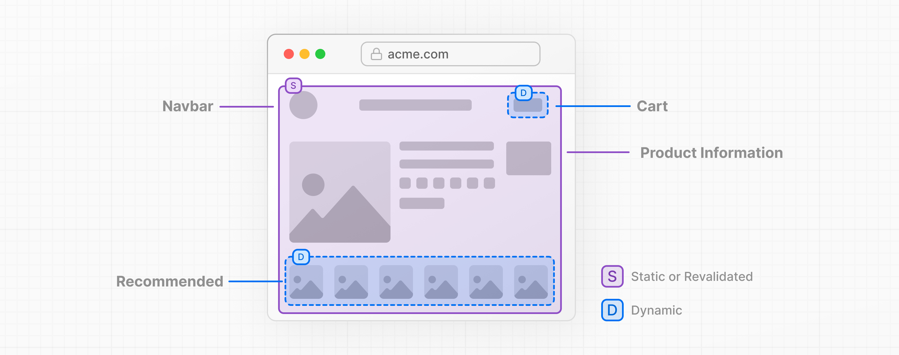
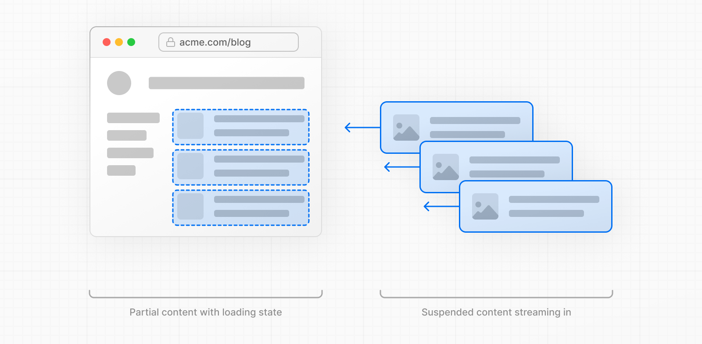

# Caching

- 공식 문서: [Caching](https://nextjs.org/docs/app/getting-started/caching)
- 상위 메뉴: [Getting Started](./README.md)
- 전체 목차: [Next.js 학습 문서](../README.md)

> 이 문서는 `next.config.ts`에서 [`cacheComponents: true`](../3-api-reference/3.5-config/3.5.1-next-config-js/README.md)를 켰을 때의 **Cache Components** 모델을 다룬다. Cache Components를 쓰지 않는다면 [Caching and Revalidating (이전 모델)](../2-guides/caching-without-cache-components.md) 가이드를 참고한다.

## 학습 목표

- `use cache` 지시어를 데이터 레벨/UI 레벨에서 적용하는 방법을 구분할 수 있다.
- 캐시되지 않은 데이터는 `<Suspense>`로 스트리밍하고, 런타임 API는 왜 `<Suspense>`가 필요한지 설명할 수 있다.
- 랜덤 값·타임스탬프를 다룰 때 `connection()` + `<Suspense>` 조합과 `use cache` 조합의 차이를 안다.
- Partial Prerendering(PPR)이 무엇이고, 정적 셸(static shell)이 어떻게 만들어지는지 설명할 수 있다.
- 캐시된 콘텐츠가 저장되는 세 곳(prerender된 HTML, 공유 스토어, 브라우저)을 구분할 수 있다.

## 핵심 개념 및 설명

캐싱은 데이터 fetching이나 다른 계산의 결과를 저장해두어, 같은 데이터에 대한 이후 요청을 다시 작업하지 않고 더 빠르게 처리하는 기법이다.

### Cache Components 활성화하기

Next 설정 파일에 [`cacheComponents`](../3-api-reference/3.5-config/3.5.1-next-config-js/README.md) 옵션을 추가하면 Cache Components를 켤 수 있다.

```ts
import type { NextConfig } from 'next'

const nextConfig: NextConfig = {
  cacheComponents: true,
}

export default nextConfig
```

> **알아두면 좋은 점**: Cache Components가 켜지면, `GET` Route Handler도 페이지와 같은 prerendering 모델을 따른다. 자세한 내용은 [Cache Components를 쓰는 Route Handlers](./route-handlers.md#with-cache-components)를 참고한다.

### 사용법

[`use cache`](../3-api-reference/3.4-directives/use-cache.md) 지시어는 비동기 함수와 컴포넌트의 반환값을 캐시한다. 두 레벨에서 적용할 수 있다.

- **데이터 레벨**: 데이터를 가져오거나 계산하는 함수를 캐시 (예: `getProducts()`, `getUser(id)`)
- **UI 레벨**: 컴포넌트나 페이지 전체를 캐시 (예: `async function BlogPosts()`)

캐시 지시어는 결과에 수명(lifetime)을 부여하고, Next.js는 이 정보로 렌더링 최적화를 적용한다. 캐시된 결과가 정적 셸의 일부가 되는 과정과 [프리페치](#런타임-프리페칭)에 포함될 수 있는지는 [Prerendering](#prerendering)을 참고한다.

> **알아두면 좋은 점**: 모든 캐시 지시어에는 [`cacheLife`](../3-api-reference/3.3-functions/cacheLife.md)를 함께 쓰는 걸 권장한다. 지정하지 않으면 암묵적으로 `default` 프로필이 적용된다.

인자와, 부모 스코프에서 클로저로 캡처된 값들은 자동으로 [캐시 키](../3-api-reference/3.4-directives/use-cache.md#cache-keys)의 일부가 된다. 즉 입력이 다르면 별도의 캐시 엔트리가 생긴다. 무엇을 캐시할 수 있는지, 인자가 어떻게 동작하는지는 [직렬화 요구사항과 제약](../3-api-reference/3.4-directives/use-cache.md#constraints)을 참고한다.

#### 데이터 레벨 캐싱

데이터를 가져오는 비동기 함수를 캐시하려면, 함수 본문 맨 위에 `use cache` 지시어를 추가한다.

```tsx
import { cacheLife } from 'next/cache'

export async function getUsers() {
  'use cache'
  cacheLife('hours')
  return db.query('SELECT * FROM users')
}
```

데이터 레벨 캐싱은 같은 데이터가 여러 컴포넌트에서 쓰일 때, 또는 데이터를 UI와 독립적으로 캐시하고 싶을 때 유용하다.

#### UI 레벨 캐싱

컴포넌트, 페이지, 레이아웃 전체를 캐시하려면, 그 컴포넌트나 페이지 본문 맨 위에 `use cache` 지시어를 추가한다.

```tsx
import { cacheLife } from 'next/cache'

export default async function Page() {
  'use cache'
  cacheLife('hours')

  const users = await db.query('SELECT * FROM users')

  return (
    <ul>
      {users.map((user) => (
        <li key={user.id}>{user.name}</li>
      ))}
    </ul>
  )
}
```

> 파일 맨 위에 `"use cache"`를 추가하면 그 파일의 모든 export 함수가 캐시된다.

### 캐시되지 않은 데이터 스트리밍하기

API, 데이터베이스, 그 외 비동기 작업 같은 비동기 소스에서 데이터를 가져오면서 매 요청마다 최신 데이터가 필요한 컴포넌트에는 `"use cache"`를 쓰지 않는다.

대신 컴포넌트를 [`<Suspense>`](https://react.dev/reference/react/Suspense)로 감싸고 fallback UI를 제공한다. fallback은 prerender된 셸과 함께 나가고, 비동기 작업은 요청 시점에 실행된다.

```tsx
import { Suspense } from 'react'

async function LatestPosts() {
  const data = await fetch('https://api.example.com/posts')
  const posts = await data.json()
  return (
    <ul>
      {posts.map((post) => (
        <li key={post.id}>{post.title}</li>
      ))}
    </ul>
  )
}

export default function Page() {
  return (
    <>
      <h1>My Blog</h1>
      <Suspense fallback={<p>Loading posts...</p>}>
        <LatestPosts />
      </Suspense>
    </>
  )
}
```

예를 들어 `<p>Loading posts...</p>`는 정적 셸에 포함되고, 포스트 목록은 요청 시점에 스트리밍된다.

`<Suspense>` 바운더리 없이 캐시되지 않은 읽기를 두면, dev 오버레이에 **blocking-route** 인사이트가 다음 수정 방법과 함께 나타난다.

```
<Suspense fallback={…}>
  <DataChild />
</Suspense>
```

> **알아두면 좋은 점**: 각 수정 카드는 패턴, 코드 샘플, 트레이드오프를 담은 자세한 설명으로 연결된다.

`<Suspense>`는 비동기 작업이 끝날 때까지 fallback UI를 제공하지만, 그 자체로 컴포넌트를 다이나믹 렌더링으로 전환시키지는 않는다. 컴포넌트가 동기적인 작업만 수행한다면, `<Suspense>`로 감싸져 있든 아니든 prerendering 중에 완료된다.

### 런타임 API 다루기

런타임 API는 사용자가 요청을 보낼 때만 알 수 있는 정보를 필요로 한다. 다음이 여기에 포함된다.

- [`cookies`](../3-api-reference/3.3-functions/cookies.md) — 사용자의 쿠키 데이터
- [`headers`](../3-api-reference/3.3-functions/headers.md) — 요청 헤더
- [`searchParams`](../3-api-reference/3.1-file-conventions/page.md) — URL 쿼리 파라미터
- [`params`](../3-api-reference/3.1-file-conventions/page.md) — 다이나믹 라우트 파라미터. [`generateStaticParams`](../3-api-reference/3.3-functions/generate-static-params.md)로 빌드 타임에 특정 값을 prerender하거나, [Cache Components를 쓰는 ISR](../2-guides/incremental-static-regeneration-cache-components.md)로 알 수 없는 params가 백그라운드에서 resolve되는 동안 [App Shell](../4-glossary/README.md)을 제공할 수 있다.

런타임 API에 접근하는 컴포넌트는 `<Suspense>`로 감싸야 한다.

```tsx
import { cookies } from 'next/headers'
import { Suspense } from 'react'

async function UserGreeting() {
  const cookieStore = await cookies()
  const theme = cookieStore.get('theme')?.value || 'light'
  return <p>Your theme: {theme}</p>
}

export default function Page() {
  return (
    <>
      <h1>Dashboard</h1>
      <Suspense fallback={<p>Loading...</p>}>
        <UserGreeting />
      </Suspense>
    </>
  )
}
```

`<Suspense>` 없이 런타임 API에 접근하면, dev 오버레이에 같은 **blocking-route** 인사이트와 같은 수정 방법이 나타난다.

런타임에 의존하는 데이터도 [`"use cache: private"`](../3-api-reference/3.4-directives/use-cache-private.md)로 수명을 줄 수 있다. 이는 Cache Components와 함께 제공되는 또 다른 변형으로, 쿠키·헤더·`searchParams`를 직접 읽는 함수에 수명을 줘서 [프리페치](#런타임-프리페칭)에 포함될 수 있게 한다.

다음 섹션은 `use cache: private`의 대안을 보여준다: 런타임 값을 추출해서 공유 캐시 함수에 인자로 전달하는 방식이다.

#### 런타임 값을 캐시된 함수에 전달하기

런타임 API에서 값을 추출해서 캐시된 함수에 인자로 전달할 수 있다.

```tsx
import { cookies } from 'next/headers'
import { Suspense } from 'react'

export default function Page() {
  return (
    <Suspense fallback={<div>Loading...</div>}>
      <ProfileContent />
    </Suspense>
  )
}

// (캐시되지 않은) 컴포넌트가 런타임 데이터를 읽는다
async function ProfileContent() {
  const session = (await cookies()).get('session')?.value
  return <CachedContent sessionId={session} />
}

// 캐시된 컴포넌트는 추출된 값을 prop으로 받는다
async function CachedContent({ sessionId }: { sessionId: string }) {
  'use cache'
  // sessionId가 캐시 키의 일부가 된다
  const data = await fetchUserData(sessionId)
  return <div>{data}</div>
}
```

요청 시점에, 일치하는 캐시 엔트리가 없으면 `<CachedContent />`가 실행되고, 같은 `sessionId`를 가진 이후 요청을 위해 결과를 저장한다.

> **알아두면 좋은 점**: `<CachedContent />`가 요청 데이터 뒤에 게이트되어 있어서, prerender된 정적 셸에는 추가되지 않는다. 런타임에는 기본적으로 [인메모리](../3-api-reference/3.4-directives/use-cache.md#runtime-caching-considerations)로 캐시되는데, 서버리스 요청 사이에는 유지되지 않으므로 매 요청마다 다시 평가될 수 있다. 지속적이고 공유되는 캐싱이 필요하면 [`'use cache: remote'`](../3-api-reference/3.4-directives/use-cache-remote.md)를 쓴다.

이 패턴에서는 [런타임 프리페칭](#런타임-프리페칭)이 클라이언트 전환 중에 사용자의 실제 세션으로 `<CachedContent />`를 prerender해서 클릭 전에 결과를 준비해둘 수 있다. 서버 사이드 엔트리가 요청 사이에 거의 살아남지 못해도 이게 가능한 건, 부여한 수명이 그 결과를 프리페치에 합류시켜, 클라이언트가 그 결과를 자신의 [`cacheLife`](../3-api-reference/3.3-functions/cacheLife.md) `stale` 윈도우 동안 최신으로 취급하기 때문이다.

### 정적, 캐시된, 스트리밍이 함께 있는 경우

정적 콘텐츠, 캐시된 다이나믹 콘텐츠, 스트리밍되는 다이나믹 콘텐츠가 한 페이지에서 함께 동작하는 전체 예시다.

```tsx
import { Suspense } from 'react'
import { cookies } from 'next/headers'
import { cacheLife, cacheTag } from 'next/cache'
import Link from 'next/link'

export default function BlogPage() {
  return (
    <>
      {/* 정적 콘텐츠 - 자동으로 prerender됨 */}
      <header>
        <h1>Our Blog</h1>
        <nav>
          <Link href="/">Home</Link> | <Link href="/about">About</Link>
        </nav>
      </header>

      {/* 캐시된 다이나믹 콘텐츠 - 정적 셸에 포함됨 */}
      <BlogPosts />

      {/* 런타임 다이나믹 콘텐츠 - 요청 시점에 스트리밍됨 */}
      <Suspense fallback={<p>Loading your preferences...</p>}>
        <UserPreferences />
      </Suspense>
    </>
  )
}

type Post = { id: string; title: string; author: string; date: string }

// 모두가 같은 블로그 포스트를 본다 (매시간 재검증)
async function BlogPosts() {
  'use cache'
  cacheLife('hours')
  cacheTag('posts')

  const res = await fetch('https://api.vercel.app/blog')
  const posts: Post[] = await res.json()

  return (
    <section>
      <h2>Latest Posts</h2>
      <ul>
        {posts.map((post) => (
          <li key={post.id}>
            <h3>{post.title}</h3>
            <p>
              By {post.author} on {post.date}
            </p>
          </li>
        ))}
      </ul>
    </section>
  )
}

// 쿠키에 저장된 값에 의존하는 UI
async function UserPreferences() {
  const theme = (await cookies()).get('theme')?.value || 'light'
  const favoriteCategory = (await cookies()).get('category')?.value

  return (
    <aside>
      <p>Your theme: {theme}</p>
      {favoriteCategory && <p>Favorite category: {favoriteCategory}</p>}
    </aside>
  )
}
```

prerendering 중에 헤더(정적)와 블로그 포스트(`use cache`로 캐시)는 사용자 설정에 대한 fallback UI와 함께 정적 셸의 일부가 된다. 쿠키에 저장된 UI 설정은 요청 시점에 스트리밍된다.

이전 렌더링 모델과 달리, 여기서 `cookies()`를 읽는다고 해서 라우트 전체가 다이나믹 렌더링으로 전환되지 않는다. Suspense 바운더리가 런타임 접근이 스트리밍되는 부분에 fallback UI를 제공하는 동안, 정적/캐시된 콘텐츠는 여전히 초기 HTML에 담겨 나간다.

`<Suspense>`가 비동기 접근을 감싸는 것처럼, **에러 바운더리**는 실패를 감싼다: 렌더링 중 에러가 날 수 있는 서브트리를 감싸자. 컴포넌트 레벨 바운더리에는 [`catchError`](../3-api-reference/3.3-functions/catchError.md)를, 라우트 레벨 바운더리에는 [`error.js`](../3-api-reference/3.1-file-conventions/error.md) 파일 컨벤션을 쓴다.

빌드하면서, [`generateMetadata`](../3-api-reference/3.3-functions/generate-metadata.md)와 [`generateViewport`](../3-api-reference/3.3-functions/generate-viewport.md) 안의 캐시되지 않은 fetch나 런타임 데이터 접근도 페이지와 같은 인사이트와 에러를 보여줘서, 의도한 렌더링으로 안내한다는 점을 기억하자. 알려진 값과 알려지지 않은 param 값 모두에 대한 incremental static regeneration은 [Cache Components를 쓰는 ISR](../2-guides/incremental-static-regeneration-cache-components.md)을 참고한다.

### 랜덤 값과 타임스탬프

`Math.random()`, `Date.now()`, `crypto.randomUUID()` 같은 작업은 실행할 때마다 다른 값을 낸다. Cache Components는 이런 값을 명시적으로 다루도록 요구한다.

> **알아두면 좋은 점**: `performance.now()`는 텔레메트리 목적이라, Next.js는 이를 보호가 필요한 값으로 취급하지 않는다. 타이밍 측정에 쓰고, 렌더링하는 대신 결과를 로거나 메트릭으로 전달하자.

**요청마다 고유한 값을 생성**하려면, 이런 작업 전에 [`connection()`](../3-api-reference/3.3-functions/connection.md)을 호출해 요청 시점으로 미루고, 컴포넌트를 `<Suspense>`로 감싼다.

```tsx
import { connection } from 'next/server'
import { Suspense } from 'react'

async function UniqueContent() {
  await connection()
  const uuid = crypto.randomUUID()
  return <p>Request ID: {uuid}</p>
}

export default function Page() {
  return (
    <Suspense fallback={<p>Loading...</p>}>
      <UniqueContent />
    </Suspense>
  )
}
```

또는 **결과를 캐시**해서 재검증 전까지 모든 사용자가 같은 값을 보게 할 수도 있다.

```tsx
export default async function Page() {
  'use cache'
  const buildId = crypto.randomUUID()
  return <p>Build ID: {buildId}</p>
}
```

어떤 작업이 이렇게 동작하는지 굳이 외우지 않아도 된다. dev 오버레이가 호출에 따라 **blocking-prerender-random**, **blocking-prerender-current-time**, **blocking-prerender-crypto** 인사이트를 다음 수정 방법과 함께 보여준다.

```
await connection()
const id = Math.random()
return <Item id={id} />
```

```
function RandomId() {
  "use cache"
  return String(Math.random())
```

### 예측 가능한 값

렌더링마다 달라질 수 있는 랜덤 값·타임스탬프와 달리, 모듈 import, 동기 I/O, 순수 계산은 실행할 때마다 같은 결과를 낸다. 이런 작업만 쓰는 컴포넌트는 자동으로 prerender되고, 그 결과는 빌드 타임에 정적 HTML의 일부가 된다.

```tsx
import fs from 'node:fs'

export default async function Page() {
  const constants = await import('./constants.json')
  const content = fs.readFileSync('./config.json', 'utf-8')
  const items = JSON.parse(content).items ?? []

  return (
    <div>
      <h1>{constants.appName}</h1>
      <ul>
        {items.map((item) => (
          <li key={item.id}>{item.value}</li>
        ))}
      </ul>
    </div>
  )
}
```

> **알아두면 좋은 점**: 이는 `better-sqlite3`나 Node.js 내장 [`node:sqlite`](https://nodejs.org/api/sqlite.html)처럼 동기 API를 쓰는 임베디드 데이터베이스 쿼리에도 적용된다. 동기 소스에서 요청별 데이터가 필요하면 쿼리 전에 [`connection()`](../3-api-reference/3.3-functions/connection.md)을 호출한다.

일부 비동기 API는 폰트나 설정 파일처럼 들어오는 요청에 의존하지 않는 로컬 리소스를 읽는다. 이런 리소스가 매 요청마다 동일할 것으로 예상된다면, 렌더링 중이 아니라 모듈 스코프에서 한 번만 읽는다.

데이터가 렌더링 중에 계산되어 요청 사이에 재사용되어야 한다면, 그 읽기를 [`use cache`](../3-api-reference/3.4-directives/use-cache.md)로 감싼다. 데이터가 들어오는 요청에 의존하거나 시간에 따라 바뀔 것으로 예상되면, 요청 시점 렌더링 중에 읽는다.

```tsx
import { readFile } from 'node:fs/promises'

const content = await readFile('./config.json', 'utf-8')
const items = JSON.parse(content).items ?? []

export default function Page() {
  return (
    <ul>
      {items.map((item) => (
        <li key={item.id}>{item.value}</li>
      ))}
    </ul>
  )
}
```

이 예시에서 설정 파일은 매 요청마다 동일할 것으로 예상되어 모듈 스코프에서 한 번만 읽힌다. `await readFile()`을 컴포넌트 안에서 호출하면 캐시되지 않은 데이터로 취급되어, `use cache` 안에서 접근하거나 `<Suspense>` 바운더리 뒤에 둬야 한다. 이 파일은 요청에 의존하지 않고 바뀔 것으로 예상되지 않으므로, 모듈 스코프가 가장 단순한 선택이다.

### Prerendering

빌드 타임에, Next.js는 라우트의 컴포넌트 트리를 렌더링한다. 각 컴포넌트가 어떻게 처리되는지는 그 컴포넌트가 쓰는 API에 따라 다르다.

- [`use cache`](#사용법): 수명이 [너무 짧지 않다면](../3-api-reference/3.3-functions/cacheLife.md#prerendering-behavior) 결과가 캐시되어 정적 셸에 포함됨
- [`<Suspense>`](#캐시되지-않은-데이터-스트리밍하기): fallback UI가 정적 셸에 포함되고 콘텐츠는 요청 시점에 스트리밍됨
- [예측 가능한 값](#예측-가능한-값): 모듈 import, `fs.readFileSync`, 순수 계산은 prerender 중에 완료되어 자동으로 정적 셸에 포함됨
- [랜덤 값과 타임스탬프](#랜덤-값과-타임스탬프): `connection()` + `<Suspense>`로 요청마다 고유한 값을 얻거나, `use cache`로 사용자 간에 값을 공유

이렇게 생성된 정적 셸은 최초 페이지 로드를 위한 HTML과 클라이언트 사이드 내비게이션을 위한 직렬화된 [RSC Payload](./server-and-client-components.md#on-the-server)로 구성되어, 사용자가 URL로 직접 접속하든 다른 페이지에서 전환하든 브라우저가 완전히 렌더링된 콘텐츠를 즉시 받게 한다. 이 렌더링 방식을 **Partial Prerendering(PPR)** 이라고 부르며, Cache Components의 기본 동작이다.



만들어진 모든 정적 셸은 상위 서버를 거치지 않고 CDN에서 직접 서빙될 수 있다. 이는 다이렉트 내비게이션을 [즉각적으로](#instant-navigation) 만든다.

라우트의 정적 셸에 무엇이 담기는지는 빌드 타임에 알 수 있는 것에 따라 다르다. 라우트의 [다이나믹 params](../3-api-reference/3.3-functions/generate-static-params.md)가 알려져 있으면 셸에 그 구체적인 콘텐츠가 담기고, 캐시되지 않았거나 런타임인 나머지 데이터는 여전히 `<Suspense>` fallback 뒤에서 스트리밍된다. params를 모른다면, 재사용 가능한 URL 독립적인 버전이 [**App Shell**](../4-glossary/README.md)이다: 같은 정적 셸이지만 param에 특정된 부분만 fallback 뒤에 남는다. [Incremental Static Regeneration](#incremental-static-regeneration)이 첫 방문 이후 구체적인 버전을 채워넣는다.

Next.js는 prerendering 중에 완료될 수 없는 컴포넌트를 명시적으로 다루도록 요구한다. dev 오버레이와 dev 서버 콘솔에 라우트를 지목하고 수정 방법(접근을 캐시하거나, `<Suspense>` 바운더리로 옮기거나, 라우트를 옵트아웃)을 가리키는 검증 인사이트를 보여준다. 이 검증 덕분에 모든 라우트가 정적 셸을 만들어내서, 다이렉트 내비게이션이 항상 즉각적이다.



> **🎥 시청**: Partial Prerendering이 왜, 어떻게 동작하는지 → [YouTube (10분)](https://www.youtube.com/watch?v=MTcPrTIBkpA).

#### 정적 셸 최대화하기

비동기 작업이 트리에서 더 깊이 있을수록, 페이지의 더 많은 부분이 prerender될 수 있다. 이는 Cache Components가 보상하는 구조적 패턴이다: 어디서나 적용할 수 있는 일반적인 습관이며, 이어서 설명할 즉각적인 내비게이션과 런타임 프리페칭의 기반이 된다. [런타임 API](#런타임-api-다루기)와 데이터 fetch 같은 비동기 작업 전반에 적용된다.

`params`를 최상위 레벨에서 구조 분해하는 레이아웃을 생각해보자.

```tsx
export default async function Layout({
  children,
  params,
}: LayoutProps<'/shop/[slug]'>) {
  const { slug } = await params

  return (
    <div>
      <Sidebar />
      <h1>{slug}</h1>
      {children}
    </div>
  )
}
```

이 param이 다이나믹이면(즉 [`generateStaticParams`](../3-api-reference/3.3-functions/generate-static-params.md)가 제공하지 않으면), 런타임 데이터가 되어 레이아웃이 prerender될 수 없다.

하지만 종종 트리에서 더 아래쪽에서 파라미터 값을 읽을 수 있다. 레이아웃 레벨에서 await하는 대신, params promise를 아래로 전달하고 거기서 await한다.

```tsx
import { Suspense } from 'react'

// async가 아님: 이 레이아웃은 params를 절대 await하지 않는다
export default function Layout({
  children,
  params,
}: LayoutProps<'/shop/[slug]'>) {
  return (
    <div>
      <Sidebar />
      <Suspense fallback={<h1>Loading...</h1>}>
        {/* await가 바운더리 안에서 일어나므로 셸은 여전히 렌더링된다 */}
        {params.then(({ slug }) => (
          <SlugHeading slug={slug} />
        ))}
      </Suspense>
      {children}
    </div>
  )
}

function SlugHeading({ slug }: { slug: string }) {
  return <h1>{slug}</h1>
}
```

이제 `<Sidebar />`, `{children}`, Suspense fallback 모두 정적 셸의 일부가 된다. `SlugHeading`만 요청 시점에 스트리밍된다. `params` promise 전체를 자식 컴포넌트에 넘겨서 거기서 await할 수도 있다.

같은 원리가 `cookies()`, `headers()`, `searchParams`, 데이터 fetch에도 적용된다. 관련 패턴은 [`React.cache`로 데이터 재사용하기](./fetching-data.md#reacthcache로-데이터-재사용하기)를 참고한다.

### Instant navigation

Cache Components는 16.0.0에서 다이렉트 방문이 정적 셸을 만든다는 검증과 함께 출시됐다. 클라이언트 내비게이션은 다르다: 다이렉트 방문을 커버하는 `<Suspense>` 바운더리가 전환 중 렌더링에는 포함되지 않을 수 있다. 이 구조를 제대로 잡는 건 프레임워크가 나설 때 더 쉬워진다. Cache Components는 이제 이런 내비게이션도 검증해서, 라우트로의 내비게이션을 즉각적으로 만들도록 안내하는 인사이트와 에러를 준다. 예를 들어 데이터를 `<Suspense>`로 감싸거나, `use cache`로 캐시하거나, 접근이 일어나는 위치를 옮기는 식이다.

예시와 점검 도구는 [Instant navigation 가이드](../2-guides/instant-navigation.md)를 참고한다.

### 런타임 프리페칭

[Partial Prefetching](../3-api-reference/3.5-config/3.5.1-next-config-js/README.md)이 켜져 있으면, 라우터는 기본적으로 각 라우트의 [App Shell](../4-glossary/README.md)을 프리페치한다. 여기엔 이미 정적 콘텐츠와 `cookies()`/`headers()`에서 파생된 세션 데이터가 포함되어 있다. 런타임 프리페칭은 이 프리페치를 **URL 데이터**로 확장한다: 목적지 링크마다 달라지는 `searchParams`와 다이나믹 `params`다.

[`<Link prefetch={true}>`](../3-api-reference/3.2-components/link.md)가 [Partial Prefetching](../3-api-reference/3.5-config/3.5.1-next-config-js/README.md) 라우트를 가리키면, Next.js는 목적지 URL이 해석된 상태로 그 라우트의 컴포넌트 트리를 다시 렌더링한다. 같은 규칙이 적용되지만, 이제 `searchParams`와 `params`가 스코프 안에 있으므로 트리의 더 많은 부분이 resolve된다.

- 런타임 API에서 추출한 값으로 호출된 [`use cache`](#사용법)(인자로 전달됨)는 런타임 prerender에 합류한다
- [`use cache: private`](../3-api-reference/3.4-directives/use-cache-private.md)는 서버에서 실행되어 런타임 데이터를 직접 읽고 결과를 브라우저에 캐시해서, 런타임 prerender에 합류한다
- [`<Suspense>`](#캐시되지-않은-데이터-스트리밍하기) fallback은 캐시되지 않은 콘텐츠가 요청 시점에 스트리밍되는 동안 런타임 prerender에 남는다

이렇게 만들어진 **런타임 prerender**는 정적 셸을 넘어서 목적지 URL이 여는 콘텐츠까지 확장된다. 프리페치 중에 일어나기 때문에, 내비게이션은 기다릴 게 없다. 비용은 프리페치 가능한 링크마다 서버 호출이 발생한다는 점이다.

예를 들어 URL에서 `searchParams`를 읽는 검색 페이지를 보자.

```tsx
import { Suspense } from 'react'

export default function SearchPage(props: PageProps<'/search'>) {
  return (
    <Suspense fallback={<p>Loading results...</p>}>
      <Results searchParams={props.searchParams} />
    </Suspense>
  )
}

async function Results({
  searchParams,
}: Pick<PageProps<'/search'>, 'searchParams'>) {
  const { q } = await searchParams
  const results = await search(q)
  return (
    <ul>
      {results.map((result) => (
        <li key={result.id}>{result.title}</li>
      ))}
    </ul>
  )
}

async function search(query: string | string[] | undefined) {
  'use cache'
  return db.search(query)
}
```

다이렉트 방문에서는 `<Results>`가 fallback 뒤에서 스트리밍된다.

`/search?q=shoes`로 향하는 [`<Link>`](../3-api-reference/3.2-components/link.md)가 프리페치되면, 프레임워크는 링크의 URL로부터 `searchParams`를 resolve해서, 캐시된 `search` 결과가 클릭 전에 런타임 prerender에 포함된다. 브라우저는 그 결과를 [`stale`](../3-api-reference/3.3-functions/cacheLife.md#stale) 시간이 지나거나 `searchParams`가 바뀔 때까지 재사용한다.

`<Link>` 프리페칭이 어떻게 동작하는지, 어떻게 도입하는지는 [Adopting Partial Prefetching](../2-guides/adopting-partial-prefetching.md)을 참고한다.

전체 패턴은 [Runtime prefetching 가이드](../2-guides/README.md)를, 모든 모드는 [`prefetch` reference](../3-api-reference/3.1-file-conventions/3.1.22-route-segment-config/README.md)를 참고한다.

### 캐시된 콘텐츠가 저장되는 곳

캐시된 함수의 출력은 빌드 타임이나 런타임에 **RSC payload**로 직렬화된다. 이 payload가 다른 모든 것의 기반이 된다. Next.js는 이를 HTML로 렌더링하거나, 서버·원격 스토어에 보관하거나, 브라우저로 보내며, [`cacheLife`](../3-api-reference/3.3-functions/cacheLife.md)가 각 복사본이 얼마나 최신 상태를 유지하는지를 정한다.

- **Prerender된 HTML**: self-hosting이면 payload가 HTML로 렌더링되어 디스크에, 아니면 플랫폼의 지속적인 스토리지에 CDN 뒤로 저장된다. 이 HTML이 빌드 타임의 [정적 셸](#prerendering)이자, [ISR](#incremental-static-regeneration) 업그레이드 이후의 구체적인 페이지로, [`revalidate`](../3-api-reference/3.3-functions/cacheLife.md#revalidate)와 [`expire`](../3-api-reference/3.3-functions/cacheLife.md#expire)가 언제 다시 만들어지는지를 제어한다.
- **공유 스토어**: 기본적으로 결과는 인스턴스별 인메모리 스토어에 남는데, 서버리스에서는 임시적이다. [`use cache: remote`](../3-api-reference/3.4-directives/use-cache-remote.md)는 여러 인스턴스가 공유하는 지속적인 [캐시 핸들러](../3-api-reference/3.5-config/3.5.1-next-config-js/README.md)로 옮긴다. **높은 히트율**에서만 이득이 되는 네트워크 라운드트립이다.
- **브라우저**: payload는 클라이언트 내비게이션이나 [프리페치](#런타임-프리페칭)를 위해 전송되는 RSC에 포함되어, 브라우저가 자신의 [`stale`](../3-api-reference/3.3-functions/cacheLife.md#stale) 윈도우 동안 최신으로 유지한다. [`use cache: private`](../3-api-reference/3.4-directives/use-cache-private.md) 결과는 여기에만 존재한다.

> **알아두면 좋은 점**: `cookies()`나 `headers()`를 읽는 [App Shell](../4-glossary/README.md)은 세션에 특정되어, 공유 서버 캐시가 아니라 클라이언트에서 세션별로 캐시된다.

이 모든 스토어는 단일 배포에 스코프된다. 새 배포는 새로 시작되고, 새 prerender가 만들어지며, `use cache` 엔트리는 지속적인 [`remote`](../3-api-reference/3.4-directives/use-cache-remote.md) 엔트리라도 넘어가지 않는다. [캐시 키](../3-api-reference/3.4-directives/use-cache.md#cache-keys)에 빌드 id가 포함되기 때문이다. 환경별 동작은 [런타임 캐싱 고려사항](../3-api-reference/3.4-directives/use-cache.md#runtime-caching-considerations)을, 서버 캐시 설정은 [Self-hosting](../2-guides/self-hosting.md#caching-and-isr)을 참고한다.

### Incremental Static Regeneration

다이나믹 param 세그먼트가 있는 라우트에서, [`generateStaticParams`](../3-api-reference/3.3-functions/generate-static-params.md)는 빌드 타임에 나열한 URL들을 prerender한다. 그 외 URL은 즉시 [App Shell](../4-glossary/README.md)로 서빙된 뒤, 백그라운드에서 이제 알게 된 params로 업그레이드되어 다음 방문자를 위해 캐시된다.

전체 과정은 [Cache Components를 쓰는 ISR](../2-guides/incremental-static-regeneration-cache-components.md)을 참고한다.

### 봇과 크롤러

브라우저는 정적 셸을 즉시 받는다. 봇과 크롤러는 user agent로 감지되어 다르게 처리된다: 완전한 문서가 필요하기 때문에, Next.js는 셸을 건너뛰고 요청 시점에 페이지 전체를 다이나믹하게 렌더링한 뒤, 렌더링이 끝나면 완성된 HTML을 보낸다.

셸이 재사용되지 않고 다시 렌더링되기 때문에, prerendering 중에 완료됐던 작업이 봇에게는 요청 시점에 실행된다. 셸의 일부가 prerendering 중에만 존재하는 입력(빌드 타임 데이터, 요청 시점 환경에서 접근할 수 없는 값)에 의존한다면, 사람에게는 로드되는 페이지가 크롤러에게는 렌더링에 실패할 수 있다. 셸이 의존하는 데이터가 요청 시점에도 쓸 수 있는지 확인해야 한다. 자세한 내용은 Streaming 가이드의 [Bots and crawlers](../2-guides/streaming.md)를 참고한다.

## 예제 및 데모 설계

- 데모 가능 여부: 가능 (Phase 1에서는 설계만 남기고 구현은 보류)
- 데모 목적: 정적 헤더, `use cache`로 캐시된 블로그 목록, `<Suspense>`로 스트리밍되는 쿠키 기반 설정을 한 페이지에 함께 두고 각각의 타이밍을 비교한다.
- 사용자가 확인할 화면과 상호작용: 네트워크 탭에서 초기 HTML에 무엇이 담겨 오는지, 어떤 부분이 이후 스트리밍으로 채워지는지 확인.
- 예제에서 관찰할 결과: `cacheLife('hours')`를 준 데이터는 여러 사용자에게 같은 값을 보여주고, 쿠키 기반 UI는 사용자마다 다르게 스트리밍되는 것.

## 연습 문제

**Q1. (단일 선택) `use cache`로 캐시되지 않은, 매 요청마다 최신 데이터가 필요한 컴포넌트를 다루는 올바른 방법은?**

1. `use cache`를 붙이되 `cacheLife('seconds')`를 준다.
2. `<Suspense>`로 감싸고 fallback UI를 제공한다.
3. `connection()`만 호출하고 끝낸다.
4. 컴포넌트를 Client Component로 바꾼다.

<details>
<summary>정답 보기</summary>

**정답: 2** — 캐시하지 않을 데이터는 `<Suspense>`로 감싸서 정적 셸에는 fallback을, 실제 콘텐츠는 요청 시점에 스트리밍하도록 한다.

</details>

**Q2. (복수 선택) 다음 중 옳은 것을 모두 고르시오.**

- [ ] `cookies()`를 읽는 컴포넌트는 `<Suspense>`로 감싸야 한다.
- [ ] `Math.random()`을 요청마다 다른 값으로 쓰려면 `connection()` 호출 후 `<Suspense>`로 감싼다.
- [ ] 모듈 스코프에서 한 번만 읽는 정적 설정 파일도 항상 `use cache`가 필요하다.
- [ ] Partial Prerendering은 정적 셸과 요청 시점 스트리밍 콘텐츠를 하나의 응답으로 합친다.

<details>
<summary>정답 보기</summary>

**정답: 1, 2, 4** — 매 요청마다 동일할 것으로 예상되는 리소스는 모듈 스코프에서 한 번만 읽으면 되고 `use cache`가 필수는 아니다.

</details>

**Q3. (단일 선택) `use cache: remote`를 쓰는 이유로 가장 적절한 것은?**

1. 캐시를 요청마다 무조건 새로 계산하게 만들기 위해
2. 인메모리 캐시보다 느리지만 여러 인스턴스가 공유하는 지속적인 캐시가 필요할 때
3. 클라이언트에만 캐시를 저장하기 위해
4. 봇과 크롤러에게 다른 콘텐츠를 보여주기 위해

<details>
<summary>정답 보기</summary>

**정답: 2** — `use cache: remote`는 결과를 durable cache handler로 옮겨 여러 인스턴스가 공유하게 하며, 히트율이 높을 때 네트워크 라운드트립 비용을 상쇄한다.

</details>

## 요약

- `use cache`는 데이터 레벨 또는 UI 레벨에서 함수·컴포넌트의 결과를 캐시하고, `cacheLife`로 수명을 함께 지정하는 게 권장된다.
- 캐시되지 않은 데이터와 런타임 API(`cookies`, `headers`, `searchParams`, `params`)는 `<Suspense>`로 감싸야 스트리밍된다.
- 랜덤 값·타임스탬프는 `connection()` + `<Suspense>`(요청마다 새 값) 또는 `use cache`(사용자 간 공유 값)로 명시적으로 다뤄야 한다.
- Partial Prerendering은 정적 셸(HTML + RSC Payload)을 만들어 CDN에서 바로 서빙하고, 나머지는 요청 시점에 스트리밍한다.
- 캐시된 콘텐츠는 prerender된 HTML, 공유 서버 스토어, 브라우저 세 곳 중 하나에 저장되며, 각각 다른 수명 규칙을 따른다.
