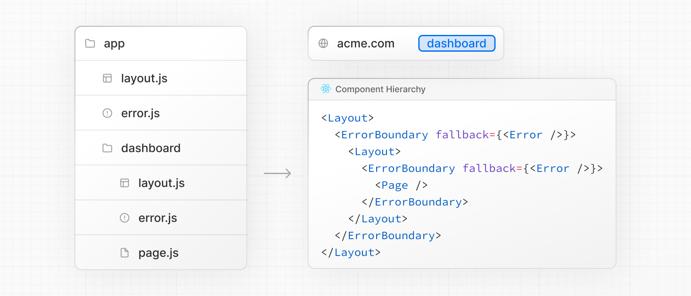

# Error Handling

- 공식 문서: [Error Handling](https://nextjs.org/docs/app/getting-started/error-handling)
- 상위 메뉴: [Getting Started](./README.md)
- 전체 목차: [Next.js 학습 문서](../README.md)

## 학습 목표

- 예상된 에러(expected errors)와 처리되지 않은 예외(uncaught exceptions)를 구분해서 다룰 수 있다.
- `useActionState`로 폼의 예상된 에러를 값으로 모델링할 수 있다.
- `error.js`와 `catchError`로 에러 바운더리를 만들고, 에러가 어떻게 버블링되는지 이해한다.
- 이벤트 핸들러·비동기 코드의 에러가 왜 에러 바운더리에 잡히지 않는지, 어떻게 직접 처리해야 하는지 안다.

## 핵심 개념 및 설명

에러는 [예상된 에러](#예상된-에러-다루기)와 [처리되지 않은 예외](#처리되지-않은-예외-다루기) 두 범주로 나눌 수 있다.

### 예상된 에러 다루기

예상된 에러는 애플리케이션이 정상적으로 동작하는 중에도 발생할 수 있는 에러다. [서버 사이드 폼 검증](../2-guides/forms.md)이나 실패한 요청이 여기 속한다. 이런 에러는 명시적으로 처리해서 클라이언트에 반환해야 한다.

#### Server Functions

[Server Functions](https://react.dev/reference/rsc/server-functions)에서 예상된 에러를 다룰 때는 [`useActionState`](https://react.dev/reference/react/useActionState) 훅을 쓸 수 있다.

이런 에러는 `try`/`catch`로 던지지 말고, 예상된 에러를 반환값으로 모델링한다.

```tsx filename="app/actions.ts"
'use server'

export async function createPost(prevState: any, formData: FormData) {
  const title = formData.get('title')
  const content = formData.get('content')

  const res = await fetch('https://api.vercel.app/posts', {
    method: 'POST',
    body: { title, content },
  })
  const json = await res.json()

  if (!res.ok) {
    return { message: 'Failed to create post' }
  }
}
```

action을 `useActionState` 훅에 전달하고, 반환된 `state`로 에러 메시지를 보여줄 수 있다.

```tsx filename="app/ui/form.tsx"
'use client'

import { useActionState } from 'react'
import { createPost } from '@/app/actions'

const initialState = {
  message: '',
}

export function Form() {
  const [state, formAction, pending] = useActionState(createPost, initialState)

  return (
    <form action={formAction}>
      <label htmlFor="title">Title</label>
      <input type="text" id="title" name="title" required />
      <label htmlFor="content">Content</label>
      <textarea id="content" name="content" required />
      {state?.message && <p aria-live="polite">{state.message}</p>}
      <button disabled={pending}>Create Post</button>
    </form>
  )
}
```

#### Server Components

Server Component 안에서 데이터를 fetch할 때, 그 응답을 이용해 에러 메시지를 조건부로 렌더링하거나 [`redirect`](../3-api-reference/3.3-functions/redirect.md)할 수 있다.

```tsx filename="app/page.tsx"
export default async function Page() {
  const res = await fetch(`https://...`)
  const data = await res.json()

  if (!res.ok) {
    return 'There was an error.'
  }

  return '...'
}
```

#### Not found

라우트 세그먼트 안에서 [`notFound`](../3-api-reference/3.3-functions/not-found.md) 함수를 호출하고 [`not-found.js`](../3-api-reference/3.1-file-conventions/not-found.md) 파일로 404 UI를 보여줄 수 있다.

```tsx filename="app/blog/[slug]/page.tsx"
import { notFound } from 'next/navigation'
import { getPostBySlug } from '@/lib/posts'

export default async function Page({
  params,
}: {
  params: Promise<{ slug: string }>
}) {
  const { slug } = await params
  const post = getPostBySlug(slug)

  if (!post) {
    notFound()
  }

  return <div>{post.title}</div>
}
```

```tsx filename="app/blog/[slug]/not-found.tsx"
export default function NotFound() {
  return <div>404 - Page Not Found</div>
}
```

### 처리되지 않은 예외 다루기

처리되지 않은 예외는 애플리케이션의 정상적인 흐름에서 일어나면 안 되는, 버그나 문제를 나타내는 예상하지 못한 에러다. 이런 에러는 에러를 던져서 처리해야 하고, 그 에러는 에러 바운더리에 잡힌다.

#### 중첩 에러 바운더리

Next.js는 처리되지 않은 예외를 다루기 위해 에러 바운더리를 쓴다. 에러 바운더리는 자식 컴포넌트의 에러를 잡아서, 크래시한 컴포넌트 트리 대신 fallback UI를 보여준다.

라우트 세그먼트 안에 [`error.js`](../3-api-reference/3.1-file-conventions/error.md) 파일을 추가하고 React 컴포넌트를 export하면 에러 바운더리를 만들 수 있다.

```tsx filename="app/dashboard/error.tsx"
'use client' // 에러 바운더리는 Client Component여야 한다

import { useEffect } from 'react'

export default function ErrorPage({
  error,
  retry,
}: {
  error: Error & { digest?: string }
  retry: () => void
}) {
  useEffect(() => {
    // 에러 리포팅 서비스에 에러를 로그로 남긴다
    console.error(error)
  }, [error])

  return (
    <div>
      <h2>Something went wrong!</h2>
      <button
        onClick={
          // 세그먼트를 다시 fetch·렌더링해서 복구를 시도한다
          () => retry()
        }
      >
        Try again
      </button>
    </div>
  )
}
```

에러는 가장 가까운 부모 에러 바운더리로 버블링된다. 이는 [라우트 계층](./project-structure.md#component-hierarchy)의 여러 레벨에 `error.tsx` 파일을 두어 세밀한 에러 처리를 할 수 있게 해준다.



컴포넌트 레벨의 에러 복구를 위해, [`catchError`](../3-api-reference/3.3-functions/catchError.md) 함수로 컴포넌트 트리의 어느 부분이든 감쌀 수 있는 에러 바운더리를 만들 수 있다.

```tsx filename="app/custom-error-boundary.tsx"
'use client'

import { catchError, type ErrorInfo } from 'next/error'

function ErrorFallback(props: { title: string }, { error, retry }: ErrorInfo) {
  return (
    <div>
      <h2>{props.title}</h2>
      <p>{error.message}</p>
      <button onClick={() => retry()}>Try again</button>
    </div>
  )
}

export default catchError(ErrorFallback)
```

그다음 반환된 컴포넌트를 어떤 레이아웃이나 페이지에서도 래퍼로 쓸 수 있다.

```tsx filename="app/some-component.tsx"
import ErrorBoundary from './custom-error-boundary'

export default function Component({ children }: { children: React.ReactNode }) {
  return <ErrorBoundary title="Dashboard Error">{children}</ErrorBoundary>
}
```

에러 바운더리는 이벤트 핸들러 안의 에러를 잡지 않는다. 앱 전체를 크래시시키는 대신 **fallback UI**를 보여주기 위해 [렌더링 중 발생하는 에러](https://react.dev/reference/react/Component#static-getderivedstatefromerror)를 잡도록 설계되어 있다.

일반적으로, 이벤트 핸들러나 비동기 코드의 에러는 렌더링 이후에 실행되기 때문에 에러 바운더리로 처리되지 않는다.

이런 경우를 다루려면, 에러를 직접 잡아서 `useState`나 `useReducer`로 저장하고, UI를 갱신해서 사용자에게 알린다.

```tsx filename="app/dashboard/error.tsx"
'use client'

import { useState } from 'react'

export function Button() {
  const [error, setError] = useState(null)

  const handleClick = () => {
    try {
      // 실패할 수 있는 작업 수행
      throw new Error('Exception')
    } catch (reason) {
      setError(reason)
    }
  }

  if (error) {
    /* fallback UI 렌더링 */
  }

  return (
    <button type="button" onClick={handleClick}>
      Click me
    </button>
  )
}
```

`useTransition`의 `startTransition` 안에서 처리되지 않은 에러는 가장 가까운 에러 바운더리로 버블링된다는 점도 알아두자.

```tsx filename="app/ui/form.tsx"
'use client'

import { useTransition } from 'react'

export function Button() {
  const [pending, startTransition] = useTransition()

  const handleClick = () =>
    startTransition(() => {
      throw new Error('Exception')
    })

  return (
    <button type="button" onClick={handleClick}>
      Click me
    </button>
  )
}
```

### 전역 에러

흔하지는 않지만, 루트 레이아웃에서 [`global-error.js`](../3-api-reference/3.1-file-conventions/error.md#global-error) 파일로 에러를 처리할 수 있다. 이 파일은 루트 `app` 디렉토리에 위치하며, [국제화](../2-guides/internationalization.md)를 쓰고 있어도 동작한다. 전역 에러 UI는 활성화됐을 때 루트 레이아웃이나 template을 대체하기 때문에, 자체 `<html>`과 `<body>` 태그를 정의해야 한다.

```tsx filename="app/global-error.tsx"
'use client' // 에러 바운더리는 Client Component여야 한다

export default function GlobalError({
  error,
  retry,
}: {
  error: Error & { digest?: string }
  retry: () => void
}) {
  return (
    // global-error는 html과 body 태그를 포함해야 한다
    <html>
      <body>
        <h2>Something went wrong!</h2>
        <button onClick={() => retry()}>Try again</button>
      </body>
    </html>
  )
}
```

## 예제 및 데모 설계

- 데모 가능 여부: 가능 (Phase 1에서는 설계만 남기고 구현은 보류)
- 데모 목적: 폼 검증 실패(예상된 에러)와 렌더링 중 던진 예외(처리되지 않은 예외)를 나란히 두고, 각각 `useActionState`와 `error.tsx`로 어떻게 다르게 처리되는지 보여준다.
- 사용자가 확인할 화면과 상호작용: 특정 라우트 세그먼트에서만 에러를 던져 가장 가까운 `error.tsx`가 잡는 것과, 이벤트 핸들러 안 에러가 잡히지 않는 것을 비교.
- 예제에서 관찰할 결과: 에러가 가장 가까운 부모 `error.tsx`로 버블링되는 순서, `catchError`로 만든 바운더리가 컴포넌트 단위로 복구되는 것.

## 연습 문제

**Q1. (단일 선택) 서버 사이드 폼 검증처럼 예상되는 에러를 다룰 때 권장되는 방식은?**

1. `throw new Error()`로 던지고 `error.tsx`에서 잡는다.
2. `try`/`catch`로 잡지 않고, 에러를 반환값으로 모델링해서 `useActionState`로 전달한다.
3. 무조건 `notFound()`를 호출한다.
4. `global-error.js`에서만 처리한다.

<details>
<summary>정답 보기</summary>

**정답: 2** — 예상된 에러는 던지지 않고 `{ message: '...' }` 같은 반환값으로 모델링해서 `useActionState`의 `state`로 클라이언트에 전달하는 게 권장된다.

</details>

**Q2. (복수 선택) 다음 중 에러 바운더리(`error.tsx`)가 잡지 못하는 것을 모두 고르시오.**

- [ ] 렌더링 중 컴포넌트가 던진 에러
- [ ] 이벤트 핸들러(`onClick`) 안에서 던진 에러
- [ ] `useEffect` 밖에서 일어나는 비동기 코드의 에러
- [ ] `useTransition`의 `startTransition` 콜백 안에서 처리되지 않은 에러

<details>
<summary>정답 보기</summary>

**정답: 2, 3** — 이벤트 핸들러와 일반 비동기 코드의 에러는 렌더링 이후 실행되어 에러 바운더리에 잡히지 않는다. `startTransition` 안의 처리되지 않은 에러는 가장 가까운 에러 바운더리로 버블링된다.

</details>

**Q3. (단일 선택) `global-error.js`를 만들 때 반드시 지켜야 하는 것은?**

1. Server Component로 작성해야 한다.
2. `<html>`과 `<body>` 태그를 직접 정의해야 한다.
3. `app` 디렉토리가 아닌 프로젝트 루트에 둬야 한다.
4. `not-found.js`와 같은 파일에 합쳐야 한다.

<details>
<summary>정답 보기</summary>

**정답: 2** — `global-error.js`는 활성화되면 루트 레이아웃이나 template을 대체하므로, 자체 `<html>`, `<body>` 태그를 포함해야 한다. 또한 Client Component여야 한다.

</details>

## 요약

- 에러는 예상된 에러(반환값으로 모델링)와 처리되지 않은 예외(던지고 에러 바운더리가 잡음)로 나눠서 다룬다.
- Server Function의 예상된 에러는 `useActionState`로 상태화해서 클라이언트에 보여준다.
- `error.js`는 라우트 세그먼트 단위의 에러 바운더리이며, 에러는 가장 가까운 부모로 버블링된다. `catchError`로는 더 세밀한 컴포넌트 단위 바운더리를 만들 수 있다.
- 이벤트 핸들러와 일반 비동기 코드의 에러는 에러 바운더리에 잡히지 않으므로 직접 `try`/`catch`로 처리해야 한다.
- `global-error.js`는 루트 레이아웃 자체가 크래시했을 때를 위한 최후의 수단이며, 자체 `<html>`/`<body>` 태그가 필요하다.
