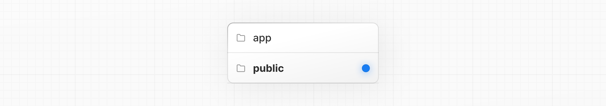

# Image Optimization

- 공식 문서: [Image Optimization](https://nextjs.org/docs/app/getting-started/images)
- 상위 메뉴: [Getting Started](./README.md)
- 전체 목차: [Next.js 학습 문서](../README.md)

## 학습 목표

- `next/image`의 `<Image>` 컴포넌트가 일반 `` 대비 어떤 최적화를 자동으로 해주는지 설명할 수 있다.
- 정적 import한 로컬 이미지와, 정적 import 없이 쓰는 로컬 이미지, 리모트 이미지 세 경우의 차이를 구분할 수 있다.
- 리모트 이미지를 쓸 때 `next.config.js`에 `remotePatterns`를 왜, 어떻게 설정해야 하는지 안다.

## 핵심 개념 및 설명

Next.js의 [`<Image>`](../3-api-reference/3.2-components/image.md) 컴포넌트는 HTML `` 엘리먼트를 확장해서 다음을 제공한다.

- **크기 최적화**: WebP 같은 최신 이미지 포맷을 써서 기기별로 올바른 크기의 이미지를 자동으로 서빙한다.
- **시각적 안정성**: 이미지가 로딩될 때 자동으로 [레이아웃 시프트](https://web.dev/articles/cls)를 방지한다.
- **더 빠른 페이지 로드**: 네이티브 브라우저 지연 로딩으로 이미지가 뷰포트에 들어올 때만 불러오고, 선택적으로 블러업 placeholder를 보여준다.
- **자산 유연성**: 리모트 서버에 저장된 이미지도 온디맨드로 크기를 조절한다.

`<Image>`를 쓰려면 `next/image`에서 import하고 컴포넌트 안에서 렌더링한다.

```tsx
import Image from 'next/image'

export default function Page() {
  return <Image src="" alt="" />
}
```

`src`에는 [로컬](#로컬-이미지) 이미지나 [리모트](#리모트-이미지) 이미지를 지정할 수 있다.

> **🎥 시청**: `next/image` 사용법 더 알아보기 → [YouTube (9분)](https://youtu.be/IU_qq_c_lKA).

### 로컬 이미지

프로젝트 루트의 [`public`](../3-api-reference/3.1-file-conventions/public-folder.md) 폴더에 이미지, 폰트 같은 정적 파일을 저장할 수 있다. `public` 안의 파일은 베이스 URL(`/`)로 시작하는 경로로 코드에서 참조할 수 있다.



```tsx
import Image from 'next/image'

export default function Page() {
  return (
    <Image
      src="/profile.png"
      alt="Picture of the author"
      width={500}
      height={500}
    />
  )
}
```

이미지를 정적으로 import하면, Next.js가 고유한(intrinsic) [`width`](../3-api-reference/3.2-components/image.md)와 [`height`](../3-api-reference/3.2-components/image.md)를 자동으로 알아낸다. 이 값들은 이미지 비율을 정하고 이미지가 로딩되는 동안 [Cumulative Layout Shift](https://web.dev/articles/cls)를 막는 데 쓰인다.

```tsx
import Image from 'next/image'
import ProfileImage from './profile.png'

export default function Page() {
  return (
    <Image
      src={ProfileImage}
      alt="Picture of the author"
      // width={500}가 자동으로 채워짐
      // height={500}이 자동으로 채워짐
      // blurDataURL="data:..."이 자동으로 채워짐
      // placeholder="blur" // 로딩 중 선택적 블러업
    />
  )
}
```

#### 정적 import 없이 쓰는 이미지

이미지에 정적 `import`를 쓸 수 없는 상황이라면, Server Component 안에서 다이나믹 `import()`를 써도 `width`, `height`, `blurDataURL`을 자동으로 얻을 수 있다.

```tsx
import Image from 'next/image'

async function PostImage({
  imageFilename,
  alt,
}: {
  imageFilename: string
  alt: string
}) {
  const { default: image } = await import(
    `../content/blog/images/${imageFilename}`
  )
  // image에는 width, height, blurDataURL이 담겨 있다
  return <Image src={image} alt={alt} />
}
```

[경로 별칭](../3-api-reference/3.5-config/README.md)(예: `@/`)을 설정해뒀다면, 상대 경로 대신 이를 쓸 수 있다.

```tsx
const { default: image } = await import(
  `@/content/blog/images/${imageFilename}`
)
```

경로에는 정적인 접두사(예: `../content/blog/images/`)가 포함되어야 한다. 최대한 구체적으로 지정해야 한다. 그 접두사와 일치하는 **모든** 파일이 번들에 포함되기 때문이다. 지정한 디렉토리 안의 파일만 포함되므로, 외부 입력이 그 밖으로 빠져나갈 수 없다.

### 리모트 이미지

리모트 이미지를 쓰려면 `src` prop에 URL 문자열을 전달한다.

```tsx
import Image from 'next/image'

export default function Page() {
  return (
    <Image
      src="https://s3.amazonaws.com/my-bucket/profile.png"
      alt="Picture of the author"
      width={500}
      height={500}
    />
  )
}
```

Next.js는 빌드 과정에서 리모트 파일에 접근할 수 없기 때문에, [`width`](../3-api-reference/3.2-components/image.md), [`height`](../3-api-reference/3.2-components/image.md), 선택적으로 [`blurDataURL`](../3-api-reference/3.2-components/image.md) props를 직접 지정해야 한다. `width`와 `height`는 이미지의 올바른 종횡비를 추론해서 로딩 중 레이아웃 시프트를 막는 데 쓰인다. 대신 [`fill` prop](../3-api-reference/3.2-components/image.md)으로 이미지가 부모 엘리먼트 크기를 채우게 할 수도 있다.

리모트 서버의 이미지를 안전하게 허용하려면 [`next.config.js`](../3-api-reference/3.5-config/README.md)에 지원할 URL 패턴 목록을 정의해야 한다. 악의적인 사용을 막기 위해 최대한 구체적으로 지정한다. 예를 들어 아래 설정은 특정 AWS S3 버킷의 이미지만 허용한다.

```ts
import type { NextConfig } from 'next'

const config: NextConfig = {
  images: {
    remotePatterns: [
      {
        protocol: 'https',
        hostname: 's3.amazonaws.com',
        port: '',
        pathname: '/my-bucket/**',
        search: '',
      },
    ],
  },
}

export default config
```

## 예제 및 데모 설계

- 데모 가능 여부: 가능 (Phase 1에서는 설계만 남기고 구현은 보류)
- 데모 목적: 일반 `` 태그와 `<Image>` 컴포넌트를 나란히 두고, 네트워크 탭에서 실제로 서빙되는 이미지 포맷·크기 차이를 비교한다.
- 사용자가 확인할 화면과 상호작용: 뷰포트를 좁혔다 넓혔다 하면서 `<Image>`가 다른 크기의 이미지를 요청하는 것을 확인.
- 예제에서 관찰할 결과: `remotePatterns`에 등록하지 않은 호스트의 이미지를 `<Image>`로 렌더링하면 에러가 나는 것.

## 연습 문제

**Q1. (단일 선택) 정적으로 import한 로컬 이미지를 `<Image>`에 전달했을 때 자동으로 채워지는 것이 아닌 것은?**

1. `width`
2. `height`
3. `blurDataURL`
4. `alt`

<details>
<summary>정답 보기</summary>

**정답: 4** — `width`, `height`, `blurDataURL`은 정적 import 시 자동으로 알아내지만, `alt`는 접근성을 위해 직접 의미 있는 값을 지정해야 한다.

</details>

**Q2. (복수 선택) 다음 중 옳은 것을 모두 고르시오.**

- [ ] 리모트 이미지는 `width`, `height`를 직접 지정하지 않아도 자동으로 추론된다.
- [ ] 리모트 이미지를 쓰려면 `next.config.js`의 `remotePatterns`에 허용할 호스트를 등록해야 한다.
- [ ] `fill` prop을 쓰면 이미지가 부모 엘리먼트 크기를 채운다.
- [ ] `<Image>`는 뷰포트에 들어오기 전에도 항상 전체 해상도로 이미지를 미리 불러온다.

<details>
<summary>정답 보기</summary>

**정답: 2, 3** — 리모트 이미지는 빌드 시점에 Next.js가 파일에 접근할 수 없어 `width`/`height`를 직접 지정해야 한다. `<Image>`는 네이티브 지연 로딩으로 뷰포트에 들어올 때만 불러온다.

</details>

**Q3. (단일 선택) `remotePatterns`를 최대한 구체적으로 지정해야 하는 이유는?**

1. 빌드 속도를 높이기 위해서
2. 악의적인 사용(임의의 외부 이미지 최적화 남용)을 막기 위해서
3. TypeScript 타입 추론을 돕기 위해서
4. CSS 순서를 예측 가능하게 하기 위해서

<details>
<summary>정답 보기</summary>

**정답: 2** — 허용 호스트/경로를 넓게 잡으면 누구나 그 패턴에 맞는 임의의 이미지를 최적화 API에 태울 수 있어, 최대한 구체적으로 지정하는 게 권장된다.

</details>

## 요약

- `<Image>` 컴포넌트는 크기 최적화, 레이아웃 시프트 방지, 지연 로딩, 리모트 이미지 리사이징을 자동으로 처리한다.
- 로컬 이미지를 정적으로 import하면 `width`, `height`, `blurDataURL`이 자동으로 채워진다.
- 정적 import가 어려우면 Server Component에서 다이나믹 `import()`로도 같은 정보를 얻을 수 있다.
- 리모트 이미지는 `width`/`height`를 직접 지정해야 하고, `next.config.js`의 `remotePatterns`에 허용 호스트를 등록해야 한다.
- `remotePatterns`는 악의적인 사용을 막기 위해 프로토콜·호스트·경로를 최대한 구체적으로 지정하는 게 안전하다.
