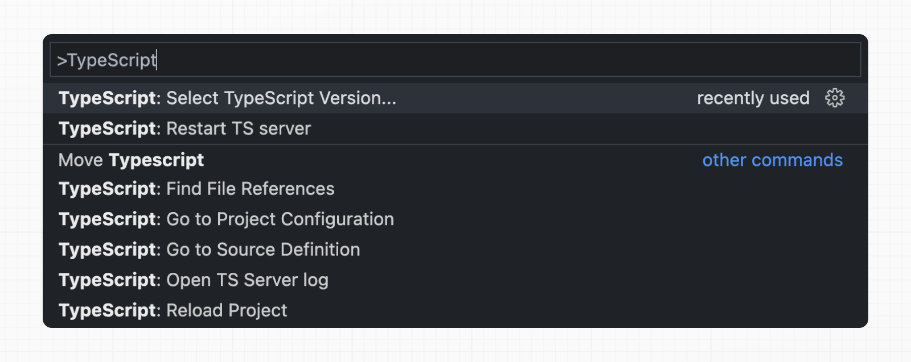

# Installation

- 공식 문서: [Installation](https://nextjs.org/docs/app/getting-started/installation)
- 상위 메뉴: [Getting Started](./README.md)
- 전체 목차: [Next.js 학습 문서](../README.md)

## 학습 목표

- `create-next-app`으로 새 Next.js 프로젝트를 생성하고 로컬에서 실행할 수 있다.
- 프로젝트를 실행하는 데 필요한 시스템 요구사항(Node.js 버전, 지원 브라우저)을 안다.
- CLI 자동 생성과 수동 설치, 두 방식의 차이와 각각 언제 쓰는지 설명할 수 있다.
- `app` 디렉토리의 최소 구성 요소(루트 레이아웃, 페이지, `public` 폴더)를 이해하고 직접 만들 수 있다.
- TypeScript, ESLint/Biome, 절대 경로 임포트 같은 기본 설정을 프로젝트에 추가할 수 있다.
- `next upgrade`로 버전을 최신 상태로 유지하는 방법과, 그것이 왜 중요한지 안다.

## 핵심 개념 및 설명

### 빠른 시작

가장 빠른 방법은 `create-next-app` CLI로 새 프로젝트를 만들고 바로 실행하는 것이다.

```bash
pnpm create next-app@latest my-app --yes
cd my-app
pnpm dev
```

`--yes` 플래그를 쓰면 프롬프트 없이 저장된 기본값(또는 이전 설정)으로 바로 생성된다. 기본값은 **TypeScript, Tailwind CSS, ESLint, App Router, Turbopack**이 활성화되고, import 별칭은 `@/*`로 설정되며, 코딩 에이전트가 최신 Next.js 문법을 따르도록 안내하는 `AGENTS.md`(및 이를 참조하는 `CLAUDE.md`)가 함께 생성된다.

`http://localhost:3000`에 접속하면 방금 생성한 프로젝트의 기본 페이지를 볼 수 있다.

### 시스템 요구사항

작업을 시작하기 전에 개발 환경이 아래 조건을 만족하는지 확인한다.

- Node.js 최소 버전: **20.9**
- 운영체제: macOS, Windows(WSL 포함), Linux

### 지원 브라우저

Next.js는 별도 설정 없이 최신 브라우저를 지원한다.

- Chrome 111+
- Edge 111+
- Firefox 111+
- Safari 16.4+

폴리필 설정이나 특정 브라우저 타게팅이 필요하면 [브라우저 지원](../5-architecture/README.md) 문서를 참고한다.

### CLI로 생성하기 (`create-next-app`)

가장 빠르고 권장되는 방법은 [`create-next-app`](../3-api-reference/3.6-cli/create-next-app.md)이다. 프롬프트 없이 진행하지 않으면(`--yes` 없이 실행하면) 다음과 같은 질문을 받는다.

```
프로젝트 이름은 무엇인가요? my-app
Next.js 추천 기본값을 사용할까요?
    예, 추천 기본값 사용 - TypeScript, ESLint, Tailwind CSS, App Router, AGENTS.md
    아니오, 이전 설정 재사용
    아니오, 직접 설정 - 원하는 옵션을 선택
```

`직접 설정`을 선택하면 아래 항목들을 하나씩 물어본다.

```
TypeScript를 사용할까요? No / Yes
어떤 린터를 사용할까요? ESLint / Biome / None
React Compiler를 사용할까요? No / Yes
Tailwind CSS를 사용할까요? No / Yes
코드를 src/ 디렉토리 안에 둘까요? No / Yes
App Router를 사용할까요? (권장) No / Yes
import 별칭을 커스터마이즈할까요? (기본값 @/*) No / Yes
어떤 import 별칭을 설정할까요? @/*
코딩 에이전트에게 최신 Next.js 사용법을 안내할 AGENTS.md를 포함할까요? No / Yes
```

응답이 끝나면 프로젝트 이름으로 폴더가 생성되고 필요한 의존성이 자동으로 설치된다.

### 수동으로 설치하기

CLI 없이 직접 구성할 수도 있다. 먼저 필요한 패키지를 설치한다.

```bash
pnpm i next@latest react@latest react-dom@latest
```

> **알아두면 좋은 점**
>
> - App Router는 [React canary 릴리스](https://react.dev/blog/2023/05/03/react-canaries)를 내부적으로 사용한다. 여기에는 안정화된 React 19의 모든 변경사항과, 프레임워크에서 검증 중인 최신 기능이 포함되어 있다. 그래도 툴링·생태계 호환성을 위해 `package.json`에 `react`와 `react-dom`을 직접 명시해야 한다.
> - Pages Router는 `package.json`에 명시한 React 버전을 그대로 사용한다.

이어서 `package.json`에 다음 스크립트를 추가한다.

```json
{
  "scripts": {
    "dev": "next dev",
    "build": "next build",
    "start": "next start",
    "lint": "eslint",
    "lint:fix": "eslint --fix"
  }
}
```

각 스크립트는 개발 단계별로 대응한다.

- `next dev`: Turbopack(기본 번들러)으로 개발 서버를 실행한다.
- `next build`: 프로덕션용으로 애플리케이션을 빌드한다.
- `next start`: 프로덕션 서버를 실행한다.
- `eslint`: ESLint를 실행한다.

Turbopack이 이제 기본 번들러다. Webpack을 쓰려면 `next dev --webpack` 또는 `next build --webpack`으로 실행한다.

#### `app` 디렉토리 만들기

Next.js는 파일 시스템 기반 라우팅을 쓴다. 즉 파일·폴더 구조가 곧 라우트 구조다.

`app` 폴더를 만들고, 그 안에 `layout.tsx`를 만든다. 이 파일이 [루트 레이아웃](../3-api-reference/3.1-file-conventions/layout.md)이며 반드시 있어야 하고, `<html>`과 `<body>` 태그를 포함해야 한다.

```tsx
export default function RootLayout({
  children,
}: {
  children: React.ReactNode
}) {
  return (
    <html lang="en">
      <body>{children}</body>
    </html>
  )
}
```

그리고 초기 콘텐츠를 담은 홈페이지 `app/page.tsx`를 만든다.

```tsx
export default function Page() {
  return <h1>Hello, Next.js!</h1>
}
```

`layout.tsx`와 `page.tsx`는 애플리케이션의 루트(`/`)에 접속했을 때 함께 렌더링된다.


> **알아두면 좋은 점**
>
> - 루트 레이아웃을 만들지 않고 `next dev`로 개발 서버를 실행하면 Next.js가 자동으로 만들어준다.
> - 애플리케이션 코드와 설정 파일을 분리하고 싶다면 [`src` 폴더](../3-api-reference/3.1-file-conventions/src-folder.md)를 선택적으로 사용할 수 있다.

#### `public` 폴더 만들기 (선택)

프로젝트 루트에 [`public` 폴더](../3-api-reference/3.1-file-conventions/public-folder.md)를 만들어 이미지, 폰트 등 정적 자산을 보관할 수 있다. `public` 안의 파일은 베이스 URL(`/`)부터 시작하는 경로로 코드에서 참조할 수 있다.

예를 들어 `public/profile.png`는 `/profile.png`로 참조한다.

```tsx
import Image from 'next/image'

export default function Page() {
  return <Image src="/profile.png" alt="Profile" width={100} height={100} />
}
```

### 개발 서버 실행

1. `npm run dev`(또는 `pnpm dev`)로 개발 서버를 시작한다.
2. `http://localhost:3000`에 접속해 애플리케이션을 확인한다.
3. `app/page.tsx`를 수정하고 저장하면 브라우저에 바로 반영된다.

### TypeScript 설정

> TypeScript 최소 버전: `v5.1.0`

Next.js는 TypeScript를 기본 지원한다. 파일 확장자를 `.ts`/`.tsx`로 바꾸고 `next dev`를 실행하면, 필요한 의존성과 권장 옵션이 담긴 `tsconfig.json`이 자동으로 생성된다.

#### IDE 플러그인

Next.js는 커스텀 TypeScript 플러그인과 타입 체커를 내장하고 있어, VS Code 등의 에디터에서 더 정교한 타입 체크와 자동완성을 쓸 수 있다. VS Code에서는 커맨드 팔레트(`Ctrl/⌘` + `Shift` + `P`)를 열고 "TypeScript: Select TypeScript Version"을 검색해 "Use Workspace Version"을 선택하면 활성화된다.



### 에디터 설정

App Router는 `page.tsx`, `layout.tsx`, `route.ts`처럼 파일명이 관례로 정해져 있어서, 에디터 탭이 같은 이름으로 가득 차기 쉽다. 각 탭에 상위 폴더 이름을 함께 표시하도록 설정하면(예: `blog/[id]`) 구분이 쉬워진다.

VS Code 1.88+ 또는 Cursor에서는 `.vscode/settings.json`에 커스텀 에디터 레이블을 추가한다. 폴더 2단계까지 표시해야 `blog/[id]/page.tsx` 같은 동적 라우트들이 전부 `[id]`로만 뭉쳐 보이지 않는다.

```json
{
  "workbench.editor.customLabels.patterns": {
    "**/app/**/page.tsx": "${dirname(1)}/${dirname} - page.tsx",
    "**/app/**/layout.tsx": "${dirname(1)}/${dirname} - layout.tsx",
    "**/app/**/loading.tsx": "${dirname(1)}/${dirname} - loading.tsx",
    "**/app/**/error.tsx": "${dirname(1)}/${dirname} - error.tsx",
    "**/app/**/not-found.tsx": "${dirname(1)}/${dirname} - not-found.tsx",
    "**/app/**/template.tsx": "${dirname(1)}/${dirname} - template.tsx",
    "**/app/**/default.tsx": "${dirname(1)}/${dirname} - default.tsx",
    "**/app/**/route.ts": "${dirname(1)}/${dirname} - route.ts"
  }
}
```

> **알아두면 좋은 점**: JetBrains IDE(WebStorm, IntelliJ)는 동일 이름 파일의 폴더를 자동으로 표시해주므로 별도 설정이 필요 없다.

### 린트 설정

Next.js는 ESLint와 Biome 둘 다 지원한다. 원하는 린터를 골라 `package.json` 스크립트로 직접 실행한다.

- **ESLint**(더 폭넓은 규칙):

```json
{
  "scripts": {
    "lint": "eslint",
    "lint:fix": "eslint --fix"
  }
}
```

- **Biome**(빠른 린터 + 포매터):

```json
{
  "scripts": {
    "lint": "biome check",
    "format": "biome format --write"
  }
}
```

이전에 `next lint`를 쓰던 프로젝트라면 codemod로 ESLint CLI로 옮길 수 있다.

```bash
npx @next/codemod@canary next-lint-to-eslint-cli .
```

ESLint를 쓴다면 명시적인 설정 파일(`eslint.config.mjs` 권장)을 만든다.

> **알아두면 좋은 점**: Next.js 16부터 `next build`는 더 이상 린터를 자동으로 실행하지 않는다. NPM 스크립트로 직접 린트를 실행해야 한다.

### 절대 경로 임포트와 경로 별칭

Next.js는 `tsconfig.json`/`jsconfig.json`의 `paths`, `baseUrl` 옵션을 기본 지원한다. 이 옵션들로 프로젝트 디렉토리를 절대 경로로 별칭 지정해, 모듈 임포트를 더 짧고 명확하게 만들 수 있다.

```tsx
// 이전
import { Button } from '../../../components/button'

// 이후
import { Button } from '@/components/button'
```

절대 경로 임포트를 설정하려면 `tsconfig.json`(또는 `jsconfig.json`)에 `baseUrl`을 추가한다.

```json
{
  "compilerOptions": {
    "baseUrl": "src/"
  }
}
```

`baseUrl`만으로도 절대 경로 임포트가 가능하지만, `paths` 옵션을 함께 쓰면 세부 별칭까지 지정할 수 있다. 아래는 `@/components/*`를 `components/*`로 매핑하는 예시다.

```json
{
  "compilerOptions": {
    "baseUrl": "src/",
    "paths": {
      "@/styles/*": ["styles/*"],
      "@/components/*": ["components/*"]
    }
  }
}
```

`paths`에 적은 모든 경로는 `baseUrl` 위치를 기준으로 상대적으로 해석된다.

### Next.js 업그레이드

버전을 최신으로 유지하는 것이 중요하다. 릴리스마다 보안 패치, 버그 수정, 성능 개선과 새 기능이 함께 나오기 때문에, 꾸준히 업그레이드하면 매번의 업그레이드 부담이 작아진다.

```bash
pnpm next upgrade
```

업그레이드하면 `next` 패키지 안에 내장된 문서(`node_modules/next/dist/docs/`)도 함께 갱신된다. 새 기능은 해당 문서와 함께 들어오고, 기존 문서도 그 사이 발견된 새로운 주의점을 반영해 갱신된다. 그래서 코딩 에이전트가 학습 데이터가 아니라 실제 설치된 버전을 기준으로 코드를 작성하게 된다. 업그레이드 후에는 에이전트에게 아래처럼 요청해서 최신 내용을 따라가게 할 수 있다.

```
Let's get our Next.js knowledge up to speed, and give me a summary of what's new for you
```

버전별 가이드와 수동 업그레이드 절차는 [Upgrading](./upgrading.md) 문서를 참고한다.

## 예제 및 데모 설계

- 데모 가능 여부: 가능 (Phase 1에서는 설계만 남기고 구현은 보류)
- 데모 목적: `pnpm create next-app`을 실제로 실행해 프롬프트에 응답하는 과정과, 생성된 프로젝트가 `http://localhost:3000`에서 기본 페이지로 뜨는 과정을 그대로 보여준다.
- 사용자가 확인할 화면과 상호작용: 터미널에 뜨는 CLI 프롬프트에 하나씩 응답하는 과정, 생성 완료 후 폴더 구조, 브라우저에 뜨는 기본 페이지.
- 예제에서 관찰할 결과: `app/layout.tsx`, `app/page.tsx`, `package.json` 등 생성된 파일 목록과, `--yes` 옵션을 줬을 때와 직접 설정했을 때 결과물(선택한 옵션)이 어떻게 달라지는지.

## 연습 문제

**Q1. (단일 선택) `pnpm create next-app@latest my-app --yes`로 프로젝트를 생성했을 때, 기본으로 활성화되지 않는 것은?**

1. TypeScript
2. Tailwind CSS
3. Redux
4. ESLint

<details>
<summary>정답 보기</summary>

**정답: 3** — `--yes`의 기본값은 TypeScript, Tailwind CSS, ESLint, App Router, Turbopack이다. Redux는 별도로 설치해야 한다.

</details>

**Q2. (복수 선택) 다음 중 옳은 것을 모두 고르시오.**

- [ ] `next dev`는 기본 번들러로 Turbopack을 사용한다.
- [ ] Next.js 16부터 `next build`는 자동으로 린터를 실행한다.
- [ ] `app` 디렉토리의 루트 레이아웃은 `<html>`과 `<body>` 태그를 반드시 포함해야 한다.
- [ ] `public` 폴더는 프로젝트에 반드시 있어야 한다.

<details>
<summary>정답 보기</summary>

**정답: 1, 3** — Next.js 16부터 `next build`는 린터를 자동으로 실행하지 않으며(NPM 스크립트로 직접 실행), `public` 폴더는 선택 사항이다.

</details>

**Q3. (단일 선택) 절대 경로 임포트(`@/components/button` 같은 별칭)를 설정할 때 사용하는 `tsconfig.json` 옵션 조합은?**

1. `include` / `exclude`
2. `baseUrl` / `paths`
3. `strict` / `noEmit`
4. `outDir` / `rootDir`

<details>
<summary>정답 보기</summary>

**정답: 2** — `baseUrl`로 기준 경로를 정하고, `paths`로 세부 별칭을 매핑한다.

</details>

## 요약

- `pnpm create next-app@latest`로 새 프로젝트를 만들고 `pnpm dev`로 개발 서버를 실행한다.
- 최소 요구사항은 Node.js 20.9+이며, Chrome/Edge/Firefox 111+, Safari 16.4+를 지원한다.
- CLI 생성이 기본이지만, `next`/`react`/`react-dom`을 직접 설치하고 `app/layout.tsx` + `app/page.tsx`를 만들면 수동으로도 구성할 수 있다.
- TypeScript, ESLint/Biome, 절대 경로 임포트(`baseUrl` + `paths`)는 생성 시점 또는 이후 어느 때나 추가로 설정할 수 있다.
- `pnpm next upgrade`는 버전뿐 아니라 내장 문서도 함께 갱신해, 코딩 에이전트가 실제 설치 버전을 기준으로 최신 문법을 따르게 한다.
