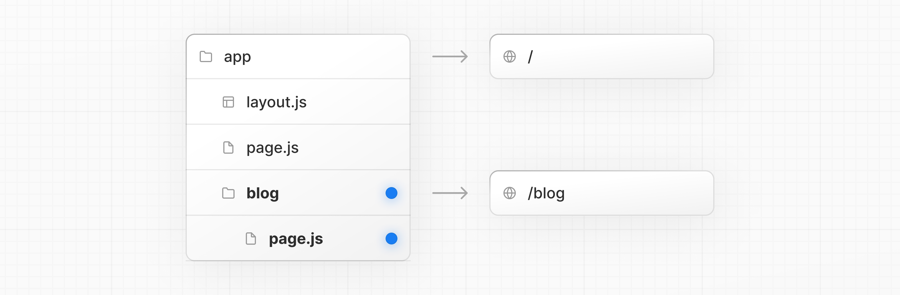
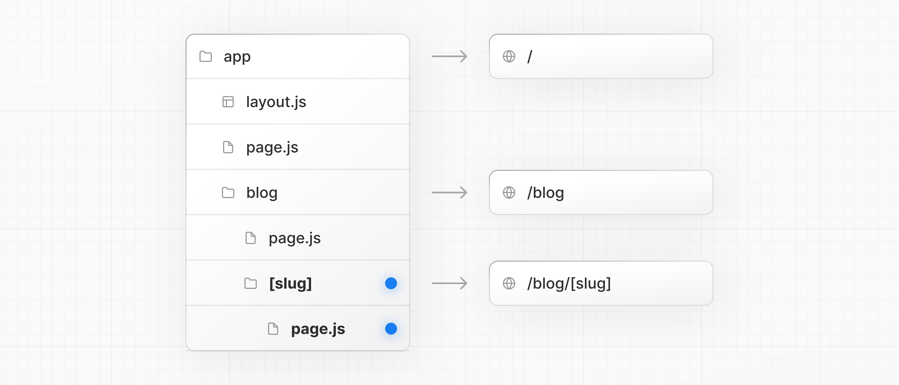
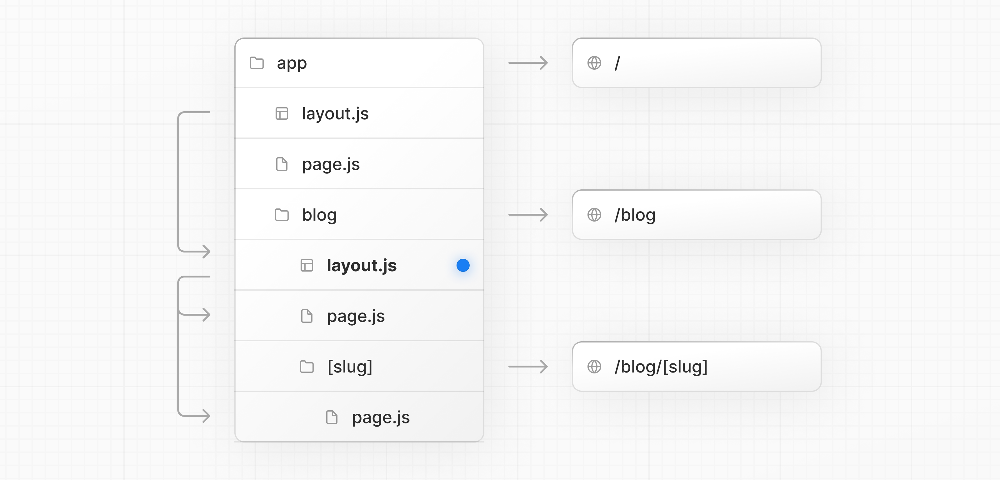

# Layouts and Pages

- 공식 문서: [Layouts and Pages](https://nextjs.org/docs/app/getting-started/layouts-and-pages)
- 상위 메뉴: [Getting Started](./README.md)
- 전체 목차: [Next.js 학습 문서](../README.md)

## 학습 목표

- `page` 파일로 라우트를 만들고, `layout` 파일로 여러 페이지가 공유하는 UI를 만들 수 있다.
- 폴더를 중첩해서 다중 세그먼트 라우트를 만들고, `[slug]` 같은 다이나믹 세그먼트로 데이터 기반 라우트를 생성할 수 있다.
- `searchParams` prop과 `useSearchParams` 훅을 언제 각각 써야 하는지 구분할 수 있다.
- `<Link>` 컴포넌트로 페이지 사이를 연결하고, `PageProps`/`LayoutProps` 헬퍼 타입을 활용할 수 있다.

## 핵심 개념 및 설명

### 페이지 만들기

**페이지**는 특정 라우트에서 렌더링되는 UI다. `app` 디렉토리 안에 [`page` 파일](../3-api-reference/3.1-file-conventions/page.md)을 추가하고 React 컴포넌트를 default export하면 된다. 예를 들어 인덱스 페이지(`/`)를 만들려면:


```tsx
export default function Page() {
  return <h1>Hello Next.js!</h1>
}
```

### 레이아웃 만들기

레이아웃은 여러 페이지가 **공유**하는 UI다. 내비게이션이 일어나도 레이아웃은 상태를 유지하고, 인터랙티브 상태를 유지하며, 다시 렌더링되지 않는다.

[`layout` 파일](../3-api-reference/3.1-file-conventions/layout.md)에서 React 컴포넌트를 default export하면 레이아웃을 정의할 수 있다. 이 컴포넌트는 페이지나 다른 [레이아웃](#레이아웃-중첩하기)이 될 수 있는 `children` prop을 받아야 한다.

예를 들어 인덱스 페이지를 자식으로 받는 레이아웃을 만들려면 `app` 디렉토리 안에 `layout` 파일을 추가한다.


```tsx
export default function DashboardLayout({
  children,
}: {
  children: React.ReactNode
}) {
  return (
    <html lang="en">
      <body>
        {/* 레이아웃 UI */}
        {/* 페이지나 중첩 레이아웃을 렌더링할 위치에 children을 둔다 */}
        <main>{children}</main>
      </body>
    </html>
  )
}
```

위 레이아웃은 `app` 디렉토리의 루트에 정의되어 있어서 [루트 레이아웃](../3-api-reference/3.1-file-conventions/layout.md)이라고 부른다. 루트 레이아웃은 **필수**이며 `html`과 `body` 태그를 포함해야 한다.

### 중첩 라우트 만들기

중첩 라우트는 여러 URL 세그먼트로 구성된 라우트다. 예를 들어 `/blog/[slug]` 라우트는 세 세그먼트로 구성된다.

- `/` (루트 세그먼트)
- `blog` (세그먼트)
- `[slug]` (리프 세그먼트)

Next.js에서는:

- **폴더**가 URL 세그먼트에 대응하는 라우트 세그먼트를 정의한다.
- **파일**(`page`, `layout` 등)이 그 세그먼트에서 보여줄 UI를 만든다.

중첩 라우트를 만들려면 폴더를 서로 안에 중첩시킨다. 예를 들어 `/blog` 라우트를 추가하려면 `app` 디렉토리에 `blog` 폴더를 만들고, `/blog`를 퍼블릭하게 노출하려면 `page.tsx`를 추가한다.



```tsx
// 예시 import
import { getPosts } from '@/lib/posts'
import { Post } from '@/ui/post'

export default async function Page() {
  const posts = await getPosts()

  return (
    <ul>
      {posts.map((post) => (
        <Post key={post.id} post={post} />
      ))}
    </ul>
  )
}
```

폴더를 계속 중첩해서 라우트를 더 깊게 만들 수 있다. 예를 들어 특정 블로그 포스트를 위한 라우트를 만들려면 `blog` 안에 새 `[slug]` 폴더를 만들고 `page` 파일을 추가한다.



```tsx
function generateStaticParams() {}

export default function Page() {
  return <h1>Hello, Blog Post Page!</h1>
}
```

폴더명을 대괄호로 감싸면(예: `[slug]`) [다이나믹 라우트 세그먼트](../3-api-reference/3.1-file-conventions/dynamic-routes.md)가 되어 데이터로부터 여러 페이지(블로그 포스트, 상품 페이지 등)를 생성할 수 있다.

### 레이아웃 중첩하기

기본적으로 폴더 계층 안의 레이아웃도 중첩되어, `children` prop을 통해 자식 레이아웃을 감싼다. 특정 라우트 세그먼트(폴더) 안에 `layout`을 추가해서 레이아웃을 중첩할 수 있다.

예를 들어 `/blog` 라우트를 위한 레이아웃을 만들려면 `blog` 폴더 안에 새 `layout` 파일을 추가한다.



```tsx
export default function BlogLayout({
  children,
}: {
  children: React.ReactNode
}) {
  return <section>{children}</section>
}
```

위 두 레이아웃을 합치면 다음 구조가 된다. 루트 레이아웃(`app/layout.js`)이 블로그 레이아웃(`app/blog/layout.js`)을 감싸고, 블로그 레이아웃이 다시 블로그 페이지(`app/blog/page.js`)와 블로그 포스트 페이지(`app/blog/[slug]/page.js`)를 감싼다.

### 다이나믹 세그먼트 만들기

[다이나믹 세그먼트](../3-api-reference/3.1-file-conventions/dynamic-routes.md)는 데이터로부터 생성되는 라우트를 만들 수 있게 해준다. 예를 들어 블로그 포스트마다 일일이 라우트를 만드는 대신, 다이나믹 세그먼트로 블로그 포스트 데이터에 기반해 라우트를 생성할 수 있다.

다이나믹 세그먼트를 만들려면 세그먼트(폴더) 이름을 대괄호로 감싼다: `[segmentName]`. 예를 들어 `app/blog/[slug]/page.tsx` 라우트에서 `[slug]`가 다이나믹 세그먼트다.

```tsx
export default async function BlogPostPage({
  params,
}: {
  params: Promise<{ slug: string }>
}) {
  const { slug } = await params
  const post = await getPost(slug)

  return (
    <div>
      <h1>{post.title}</h1>
      <p>{post.content}</p>
    </div>
  )
}
```

다이나믹 세그먼트 안의 중첩 레이아웃도 `params` prop에 접근할 수 있다.

### `searchParams`로 렌더링하기

Server Component **페이지**에서는 [`searchParams`](../3-api-reference/3.1-file-conventions/page.md) prop으로 검색 파라미터에 접근할 수 있다.

```tsx
export default async function Page({
  searchParams,
}: {
  searchParams: Promise<{ [key: string]: string | string[] | undefined }>
}) {
  const filters = (await searchParams).filters
}
```

`searchParams`를 쓰면 페이지가 **다이나믹 렌더링**으로 전환된다. 들어오는 요청이 있어야 검색 파라미터를 읽을 수 있기 때문이다.

Client Component는 [`useSearchParams`](../3-api-reference/3.3-functions/use-search-params.md) 훅으로 검색 파라미터를 읽을 수 있다.

#### 언제 어떤 걸 쓸까

- **데이터 로딩**(페이지네이션, DB 필터링 등)에 검색 파라미터가 필요하면 `searchParams` prop을 쓴다.
- 검색 파라미터를 **클라이언트에서만** 쓴다면(예: props로 이미 불러온 목록을 필터링) `useSearchParams`를 쓴다.
- 작은 최적화로, **콜백이나 이벤트 핸들러** 안에서는 재렌더링을 유발하지 않고 검색 파라미터를 읽기 위해 `new URLSearchParams(window.location.search)`를 쓸 수 있다.

### 페이지 사이 링크 연결하기

[`<Link>` 컴포넌트](../3-api-reference/3.2-components/link.md)로 라우트 사이를 이동할 수 있다. `<Link>`는 HTML `<a>` 태그를 확장한 Next.js 내장 컴포넌트로, [prefetching](./linking-and-navigating.md)과 클라이언트 사이드 내비게이션을 제공한다.

예를 들어 블로그 포스트 목록을 만들 때 `next/link`에서 `<Link>`를 import하고 `href` prop을 넘긴다.

```tsx
import Link from 'next/link'
import { getPosts } from '@/lib/posts'

export default async function Posts() {
  const posts = await getPosts()

  return (
    <ul>
      {posts.map((post) => (
        <li key={post.slug}>
          <Link href={`/blog/${post.slug}`}>{post.title}</Link>
        </li>
      ))}
    </ul>
  )
}
```

> **알아두면 좋은 점**: `<Link>`가 Next.js에서 라우트를 이동하는 주된 방법이다. 더 고급 내비게이션이 필요하면 [`useRouter` 훅](../3-api-reference/3.3-functions/use-router.md)도 쓸 수 있다.

### Route Props 헬퍼

Next.js는 라우트 구조로부터 `params`와 이름 붙인 슬롯을 추론하는 유틸리티 타입을 제공한다.

- **PageProps**: `params`와 `searchParams`를 포함한 `page` 컴포넌트용 props
- **LayoutProps**: `children`과 이름 붙인 슬롯(예: `@analytics` 같은 폴더)을 포함한 `layout` 컴포넌트용 props

이 헬퍼들은 `next dev`, `next build`, [`next typegen`](../3-api-reference/3.6-cli/next.md) 실행 시 자동으로 생성되어 전역에서 쓸 수 있다.

```tsx
export default async function Page(props: PageProps<'/blog/[slug]'>) {
  const { slug } = await props.params
  return <h1>Blog post: {slug}</h1>
}
```

```tsx
export default function Layout(props: LayoutProps<'/dashboard'>) {
  return (
    <section>
      {props.children}
      {/* app/dashboard/@analytics가 있으면 타입이 지정된 슬롯으로 나타난다: */}
      {/* {props.analytics} */}
    </section>
  )
}
```

> **알아두면 좋은 점**
>
> - 정적 라우트는 `params`가 `{}`로 해석된다.
> - `PageProps`, `LayoutProps`는 전역 헬퍼라 별도 import가 필요 없다.
> - 타입은 `next dev`, `next build`, `next typegen` 실행 중에 생성된다.

## 예제 및 데모 설계

- 데모 가능 여부: 가능 (Phase 1에서는 설계만 남기고 구현은 보류)
- 데모 목적: `app/blog/[slug]/page.tsx` 같은 다이나믹 라우트를 만들어, 폴더 구조와 실제 URL이 어떻게 대응하는지 보여준다.
- 사용자가 확인할 화면과 상호작용: `/blog`, `/blog/hello-world` 같은 URL로 직접 이동하며, `layout`이 유지되고 `page`만 바뀌는 것을 확인.
- 예제에서 관찰할 결과: 루트 레이아웃과 블로그 레이아웃이 중첩되어 함께 렌더링되는 것, `searchParams`를 쓴 페이지가 다이나믹 렌더링으로 전환되는 것.

## 연습 문제

**Q1. (단일 선택) `/blog/[slug]/page.tsx`에서 `[slug]`는 무엇인가?**

1. 라우트 그룹
2. 프라이빗 폴더
3. 다이나믹 세그먼트
4. 병렬 라우트 슬롯

<details>
<summary>정답 보기</summary>

**정답: 3** — 폴더명을 대괄호로 감싸면 다이나믹 세그먼트가 되어, 데이터에 기반해 여러 페이지를 생성할 수 있다.

</details>

**Q2. (복수 선택) 다음 중 옳은 것을 모두 고르시오.**

- [ ] `useSearchParams`를 쓴 페이지는 항상 서버에서만 검색 파라미터를 읽는다.
- [ ] `searchParams` prop을 페이지에서 사용하면 해당 페이지는 다이나믹 렌더링으로 전환된다.
- [ ] `<Link>`는 HTML `<a>` 태그를 확장해 prefetching과 클라이언트 사이드 내비게이션을 제공한다.
- [ ] 루트 레이아웃은 선택 사항이며 없어도 무방하다.

<details>
<summary>정답 보기</summary>

**정답: 2, 3** — `useSearchParams`는 Client Component 훅으로 클라이언트에서 검색 파라미터를 읽는다. 루트 레이아웃은 필수이며 `html`, `body` 태그를 포함해야 한다.

</details>

**Q3. (단일 선택) 이벤트 핸들러 안에서 재렌더링 없이 검색 파라미터만 읽고 싶을 때 권장되는 방법은?**

1. `searchParams` prop을 이벤트 핸들러에 전달한다.
2. `useSearchParams` 훅을 이벤트 핸들러 안에서 호출한다.
3. `new URLSearchParams(window.location.search)`를 사용한다.
4. `useRouter().push()`로 페이지를 새로고침한다.

<details>
<summary>정답 보기</summary>

**정답: 3** — 콜백이나 이벤트 핸들러 안에서는 `new URLSearchParams(window.location.search)`로 재렌더링을 유발하지 않고 검색 파라미터를 읽을 수 있다.

</details>

## 요약

- `page` 파일은 라우트를 만들고, `layout` 파일은 여러 페이지가 공유하는 UI를 만든다. 루트 레이아웃은 필수다.
- 폴더를 중첩하면 라우트도 중첩되고, 레이아웃도 부모-자식 관계로 함께 중첩된다.
- `[slug]`처럼 폴더명을 대괄호로 감싸면 데이터 기반으로 여러 페이지를 생성하는 다이나믹 세그먼트가 된다.
- 데이터 로딩엔 `searchParams` prop, 클라이언트 전용 필터링엔 `useSearchParams`, 이벤트 핸들러 안 읽기엔 `window.location.search`를 쓴다.
- `<Link>`로 페이지를 연결하고, `PageProps`/`LayoutProps` 헬퍼로 `params`와 슬롯 타입을 자동으로 추론받을 수 있다.
