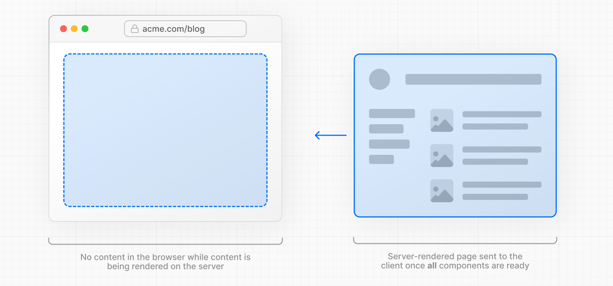
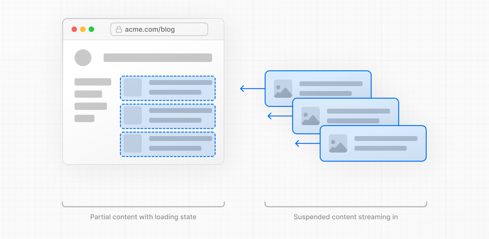
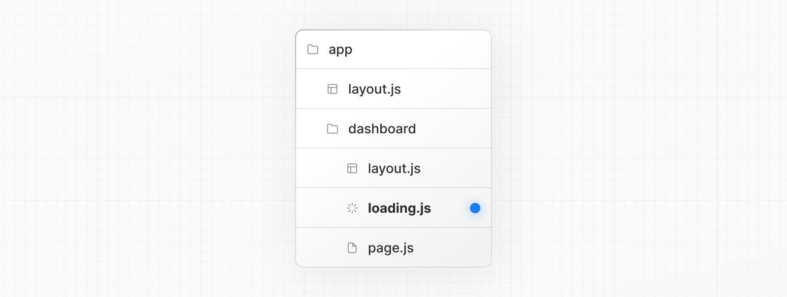

# Linking and Navigating

- 공식 문서: [Linking and Navigating](https://nextjs.org/docs/app/getting-started/linking-and-navigating)
- 상위 메뉴: [Getting Started](./README.md)
- 전체 목차: [Next.js 학습 문서](../README.md)

## 학습 목표

- Next.js에서 내비게이션이 서버 렌더링·프리페칭·스트리밍·클라이언트 사이드 전환으로 어떻게 빨라지는지 설명할 수 있다.
- 정적 라우트와 다이나믹 라우트에서 프리페칭이 어떻게 다르게 동작하는지 구분할 수 있다.
- `loading.tsx`를 추가해 다이나믹 라우트의 내비게이션 체감 속도를 개선할 수 있다.
- 내비게이션이 느려지는 원인(로딩 UI 부재, `generateStaticParams` 부재, 느린 네트워크, hydration 지연)을 진단하고 대응할 수 있다.

## 핵심 개념 및 설명

Next.js에서 라우트는 기본적으로 서버에서 렌더링된다. 이는 새 라우트를 보여주기 전에 클라이언트가 서버 응답을 기다려야 한다는 뜻이다. Next.js는 내장된 [프리페칭](#프리페칭), [스트리밍](#스트리밍), [클라이언트 사이드 전환](#클라이언트-사이드-전환)으로 내비게이션을 빠르고 반응성 있게 유지한다.

### 내비게이션이 동작하는 방식

#### 서버 렌더링

Next.js에서 [레이아웃과 페이지](./layouts-and-pages.md)는 기본적으로 [React Server Components](https://react.dev/reference/rsc/server-components)다. 최초 방문과 이후 내비게이션 모두, 서버에서 [Server Component Payload](./server-and-client-components.md)가 생성된 뒤 클라이언트로 전송된다.

서버 렌더링에는 발생 **시점**에 따라 두 종류가 있다.

- **Prerendering**: 빌드 타임 또는 [재검증](./revalidating.md) 중에 일어나고 결과가 캐시된다.
- **Dynamic Rendering**: 클라이언트 요청에 대응해 요청 시점에 일어난다.

서버 렌더링의 트레이드오프는 클라이언트가 새 라우트를 보기 전에 서버 응답을 기다려야 한다는 점이다. Next.js는 사용자가 방문할 가능성이 높은 라우트를 [프리페칭](#프리페칭)하고 [클라이언트 사이드 전환](#클라이언트-사이드-전환)을 수행해서 이 지연을 해결한다.

> **알아두면 좋은 점**: 최초 방문 시에도 HTML이 생성된다.

#### 프리페칭

프리페칭은 사용자가 실제로 이동하기 **전에** 백그라운드에서 라우트를 미리 불러오는 과정이다. 사용자가 링크를 클릭할 때쯔음엔 다음 라우트를 렌더링할 데이터가 이미 클라이언트에 준비되어 있어, 라우트 간 이동이 즉각적으로 느껴진다.

Next.js는 [`<Link>` 컴포넌트](../3-api-reference/3.2-components/link.md)로 연결된 라우트가 사용자의 뷰포트에 들어오면 자동으로 프리페칭한다.

```tsx
import Link from 'next/link'

export default function Layout({ children }: { children: React.ReactNode }) {
  return (
    <html>
      <body>
        <nav>
          {/* 링크가 hover되거나 뷰포트에 들어오면 프리페칭됨 */}
          <Link href="/blog">Blog</Link>
          {/* 프리페칭 없음 */}
          <a href="/contact">Contact</a>
        </nav>
        {children}
      </body>
    </html>
  )
}
```

라우트가 얼마나 프리페칭되는지는 정적인지 다이나믹인지에 따라 다르다.

- **정적 라우트**: 라우트 전체가 프리페칭된다.
- **다이나믹 라우트**: 프리페칭이 스킵되거나, [`loading.tsx`](../3-api-reference/3.1-file-conventions/loading.md)가 있으면 부분적으로 프리페칭된다.

다이나믹 라우트를 스킵하거나 부분적으로만 프리페칭함으로써, Next.js는 사용자가 방문하지 않을 수도 있는 라우트에 서버 작업을 낭비하지 않는다. 다만 내비게이션 전에 서버 응답을 기다려야 한다는 점 때문에 앱이 응답하지 않는다는 인상을 줄 수 있다.



> **알아두면 좋은 점**: 프리페칭의 전체 동작, 링크별 제어 방법, [Partial Prefetching](../2-guides/adopting-partial-prefetching.md) 도입 시 어떻게 바뀌는지는 별도 가이드를 참고한다.

다이나믹 라우트로의 내비게이션 경험을 개선하려면 [스트리밍](#스트리밍)을 쓸 수 있다.

#### 스트리밍

스트리밍은 다이나믹 라우트 전체가 렌더링되길 기다리지 않고, 서버가 준비되는 대로 그 라우트의 일부를 클라이언트로 보낼 수 있게 한다. 페이지의 일부가 아직 로딩 중이어도 사용자는 뭔가를 더 빨리 보게 된다.

다이나믹 라우트에서는 공유 레이아웃과 로딩 스켈레톤을 미리 요청할 수 있어, **부분적으로 프리페칭**될 수 있다는 뜻이다.



스트리밍을 쓰려면 라우트 폴더에 `loading.tsx`를 만든다.



```tsx
export default function Loading() {
  // 라우트가 로딩되는 동안 보여줄 대체 UI를 추가한다.
  return <LoadingSkeleton />
}
```

내부적으로 Next.js는 `page.tsx` 콘텐츠를 자동으로 `<Suspense>` 바운더리로 감싼다. 프리페칭된 대체 UI가 라우트 로딩 중에 보이다가, 준비되면 실제 콘텐츠로 교체된다.

> **알아두면 좋은 점**: 중첩 컴포넌트를 위한 로딩 UI를 만들 때 [`<Suspense>`](https://react.dev/reference/react/Suspense)도 직접 쓸 수 있다.

`loading.tsx`의 장점:

- 사용자에게 즉각적인 내비게이션과 시각적 피드백을 준다.
- 공유 레이아웃이 인터랙티브 상태를 유지하고, 내비게이션을 중단할 수 있다.
- Core Web Vitals 개선: [TTFB](https://web.dev/articles/ttfb), [FCP](https://web.dev/articles/fcp), [TTI](https://web.dev/articles/tti).

내비게이션 경험을 더 개선하기 위해, Next.js는 `<Link>` 컴포넌트로 [클라이언트 사이드 전환](#클라이언트-사이드-전환)을 수행한다.

#### 클라이언트 사이드 전환

전통적으로 서버 렌더링 페이지로의 내비게이션은 전체 페이지 로드를 유발한다. 이는 상태를 지우고, 스크롤 위치를 초기화하고, 인터랙티비티를 막는다.

Next.js는 `<Link>` 컴포넌트로 이를 피하는 클라이언트 사이드 전환을 쓴다. 페이지를 다시 불러오는 대신, 다음을 통해 콘텐츠를 동적으로 갱신한다.

- 공유 레이아웃과 UI를 유지
- 현재 페이지를 프리페칭된 로딩 상태로, 또는 준비되어 있으면 새 페이지로 교체

클라이언트 사이드 전환은 서버 렌더링 앱을 클라이언트 렌더링 앱처럼 **느껴지게** 만드는 핵심이다. [프리페칭](#프리페칭)과 [스트리밍](#스트리밍)이 함께 작동하면, 다이나믹 라우트에서도 빠른 전환이 가능해진다.

Next.js는 클라이언트 사이드 전환 중 [페이지 맨 위로 스크롤](../3-api-reference/3.2-components/link.md)하는 것도 처리한다. 내비게이션 이후 콘텐츠가 sticky/fixed 헤더 뒤로 스크롤되면, CSS `scroll-padding-top`으로 이 문제를 고칠 수 있다.

## 무엇이 전환을 느리게 만들 수 있을까

이런 최적화들이 내비게이션을 빠르고 반응성 있게 만들어주지만, 특정 조건에서는 전환이 여전히 느리게 **느껴질** 수 있다. 흔한 원인과 개선 방법은 다음과 같다.

### `loading.tsx`가 없는 다이나믹 라우트

다이나믹 라우트로 이동할 때, 클라이언트는 결과를 보여주기 전에 서버 응답을 기다려야 한다. 이는 앱이 응답하지 않는다는 인상을 줄 수 있다.

다이나믹 라우트에 `loading.tsx`를 추가해 부분 프리페칭을 활성화하고, 즉각적인 내비게이션을 유발하고, 라우트가 렌더링되는 동안 로딩 UI를 보여주는 것을 권장한다.

> **알아두면 좋은 점**: 개발 모드에서는 Next.js Devtools로 라우트가 정적인지 다이나믹인지 확인할 수 있다.

### `generateStaticParams`가 없는 다이나믹 세그먼트

[다이나믹 세그먼트](../3-api-reference/3.1-file-conventions/dynamic-routes.md)가 prerender될 수 있는데도 [`generateStaticParams`](../3-api-reference/3.3-functions/generate-static-params.md)가 없어서 되지 않는다면, 그 라우트는 요청 시점의 다이나믹 렌더링으로 폴백한다.

```tsx
export async function generateStaticParams() {
  const posts = await fetch('https://.../posts').then((res) => res.json())

  return posts.map((post) => ({
    slug: post.slug,
  }))
}

export default async function Page({
  params,
}: {
  params: Promise<{ slug: string }>
}) {
  const { slug } = await params
  // ...
}
```

### 느린 네트워크

느리거나 불안정한 네트워크에서는 프리페칭이 사용자가 링크를 클릭하기 전에 끝나지 않을 수 있다. 이는 정적/다이나믹 라우트 모두에 영향을 준다. 이 경우 `loading.js` 대체 UI가 아직 프리페칭되지 않아 즉시 나타나지 않을 수 있다.

체감 성능을 높이려면 [`useLinkStatus` 훅](../3-api-reference/3.3-functions/use-link-status.md)으로 전환이 진행되는 동안 즉각적인 피드백을 보여줄 수 있다.

```tsx
'use client'

import { useLinkStatus } from 'next/link'

export default function LoadingIndicator() {
  const { pending } = useLinkStatus()
  return (
    <span aria-hidden className={`link-hint ${pending ? 'is-pending' : ''}`} />
  )
}
```

초기 애니메이션 딜레이(예: 100ms)를 주고 처음엔 보이지 않게(`opacity: 0`) 시작해서 힌트를 "디바운스"할 수 있다. 즉 내비게이션이 지정한 지연보다 오래 걸릴 때만 로딩 인디케이터가 보인다.

> **알아두면 좋은 점**: **실험적인** [`useOffline`](../2-guides/offline-support.md) 훅을 쓰면, 연결이 끊긴 동안에도 프리페칭된 라우트를 계속 이동할 수 있게 유지할 수 있다. [오프라인 지원 가이드](../2-guides/offline-support.md)를 참고한다.

> **알아두면 좋은 점**: 진행 바(progress bar) 같은 다른 시각적 피드백 패턴도 쓸 수 있다. [여기](https://github.com/vercel/react-transition-progress)에서 예시를 볼 수 있다.

### 프리페칭 비활성화하기

`<Link>` 컴포넌트의 `prefetch` prop을 `false`로 설정해서 프리페칭을 끌 수 있다. 무한 스크롤 테이블처럼 링크를 대량으로 렌더링할 때 불필요한 리소스 사용을 피하는 데 유용하다.

```tsx
<Link prefetch={false} href="/blog">
  Blog
</Link>
```

다만 프리페칭을 끄면 트레이드오프가 있다.

- **정적 라우트**: 사용자가 링크를 클릭할 때만 fetch된다.
- **다이나믹 라우트**: 클라이언트가 이동하기 전에 먼저 서버에서 렌더링되어야 한다.

프리페칭을 완전히 끄지 않고도 리소스 사용을 줄이려면, hover 시에만 프리페칭할 수 있다. 이렇게 하면 뷰포트 안의 모든 링크가 아니라, 사용자가 방문할 가능성이 더 높은 라우트만 프리페칭된다.

```tsx
'use client'

import Link from 'next/link'
import { useState } from 'react'

function HoverPrefetchLink({
  href,
  children,
}: {
  href: string
  children: React.ReactNode
}) {
  const [active, setActive] = useState(false)

  return (
    <Link
      href={href}
      prefetch={active ? null : false}
      onMouseEnter={() => setActive(true)}
    >
      {children}
    </Link>
  )
}
```

### 하이드레이션이 끝나지 않음

`<Link>`는 Client Component라서 라우트를 프리페칭하기 전에 하이드레이션되어야 한다. 최초 방문 시, 큰 JavaScript 번들이 하이드레이션을 늦춰서 프리페칭이 곧바로 시작되지 못할 수 있다.

React는 Selective Hydration으로 이를 완화하지만, 다음으로 더 개선할 수 있다.

- [`@next/bundle-analyzer`](../2-guides/package-bundling.md) 플러그인으로 큰 의존성을 찾아 제거해 번들 크기를 줄인다.
- 가능하면 클라이언트 로직을 서버로 옮긴다. [Server and Client Components](./server-and-client-components.md) 문서를 참고한다.

### 네이티브 History API

Next.js는 네이티브 [`window.history.pushState`](https://developer.mozilla.org/en-US/docs/Web/API/History/pushState)와 [`window.history.replaceState`](https://developer.mozilla.org/en-US/docs/Web/API/History/replaceState) 메서드로, 페이지를 다시 불러오지 않고도 브라우저의 히스토리 스택을 갱신할 수 있게 해준다.

`pushState`와 `replaceState` 호출은 Next.js 라우터와 통합되어, [`usePathname`](../3-api-reference/3.3-functions/use-pathname.md)과 [`useSearchParams`](../3-api-reference/3.3-functions/use-search-params.md)와 동기화할 수 있다.

#### `window.history.pushState`

브라우저 히스토리 스택에 새 엔트리를 추가할 때 쓴다. 사용자는 이전 상태로 돌아갈 수 있다. 예를 들어 상품 목록을 정렬할 때:

```tsx
'use client'

import { useSearchParams } from 'next/navigation'

export default function SortProducts() {
  const searchParams = useSearchParams()

  function updateSorting(sortOrder: string) {
    const params = new URLSearchParams(searchParams.toString())
    params.set('sort', sortOrder)
    window.history.pushState(null, '', `?${params.toString()}`)
  }

  return (
    <>
      <button onClick={() => updateSorting('asc')}>Sort Ascending</button>
      <button onClick={() => updateSorting('desc')}>Sort Descending</button>
    </>
  )
}
```

#### `window.history.replaceState`

브라우저 히스토리 스택의 현재 엔트리를 교체할 때 쓴다. 사용자는 이전 상태로 돌아갈 수 없다. 예를 들어 애플리케이션의 로케일을 전환할 때:

```tsx
'use client'

import { usePathname } from 'next/navigation'

export function LocaleSwitcher() {
  const pathname = usePathname()

  function switchLocale(locale: string) {
    // 예: '/en/about' 또는 '/fr/contact'
    const newPath = `/${locale}${pathname}`
    window.history.replaceState(null, '', newPath)
  }

  return (
    <>
      <button onClick={() => switchLocale('en')}>English</button>
      <button onClick={() => switchLocale('fr')}>French</button>
    </>
  )
}
```

## 예제 및 데모 설계

- 데모 가능 여부: 가능 (Phase 1에서는 설계만 남기고 구현은 보류)
- 데모 목적: `loading.tsx`가 있는 다이나믹 라우트와 없는 다이나믹 라우트를 나란히 두고, 내비게이션 체감 속도 차이를 비교한다.
- 사용자가 확인할 화면과 상호작용: 네트워크 스로틀링을 켠 상태에서 두 라우트를 클릭해보고, `useLinkStatus`로 만든 로딩 인디케이터가 언제 나타나는지 확인.
- 예제에서 관찰할 결과: 정적 라우트는 뷰포트에 들어오는 즉시 전체가 프리페칭되고, 다이나믹 라우트는 `loading.tsx` 유무에 따라 프리페칭 범위가 달라지는 것.

## 연습 문제

**Q1. (단일 선택) `<Link>`로 연결된 정적 라우트가 뷰포트에 들어왔을 때 기본 동작은?**

1. 아무 일도 일어나지 않는다.
2. 라우트 전체가 자동으로 프리페칭된다.
3. 사용자가 클릭해야만 요청이 시작된다.
4. 서버에 다이나믹 렌더링을 요청한다.

<details>
<summary>정답 보기</summary>

**정답: 2** — `<Link>`로 연결된 라우트가 뷰포트에 들어오면 Next.js가 자동으로 프리페칭하며, 정적 라우트는 전체가 프리페칭된다.

</details>

**Q2. (복수 선택) 다음 중 옳은 것을 모두 고르시오.**

- [ ] `loading.tsx`가 있으면 다이나믹 라우트도 부분적으로 프리페칭될 수 있다.
- [ ] 클라이언트 사이드 전환은 전체 페이지를 다시 로드해 상태를 초기화한다.
- [ ] `generateStaticParams`가 없는 다이나믹 세그먼트는 요청 시점 다이나믹 렌더링으로 폴백할 수 있다.
- [ ] `<Link prefetch={false}>`를 쓰면 정적 라우트도 클릭 전까지 요청되지 않는다.

<details>
<summary>정답 보기</summary>

**정답: 1, 3, 4** — 클라이언트 사이드 전환은 오히려 전체 페이지 로드를 피하기 위한 기법이다.

</details>

**Q3. (단일 선택) 느린 네트워크에서 프리페칭이 끝나기 전에 사용자가 링크를 클릭했을 때, 체감 성능을 높이기 위해 권장되는 방법은?**

1. `prefetch={false}`로 프리페칭을 끈다.
2. `useLinkStatus` 훅으로 전환 중임을 보여주는 즉각적인 피드백 UI를 추가한다.
3. `loading.tsx`를 삭제한다.
4. 모든 라우트를 정적으로 강제 전환한다.

<details>
<summary>정답 보기</summary>

**정답: 2** — `useLinkStatus`의 `pending` 값을 이용해, 전환이 지연될 때만 나타나는 로딩 힌트를 보여줄 수 있다.

</details>

## 요약

- Next.js의 라우트는 서버 렌더링되지만, 프리페칭·스트리밍·클라이언트 사이드 전환이 함께 작동해 빠르게 느껴지게 만든다.
- 정적 라우트는 뷰포트에 들어오면 전체가 프리페칭되고, 다이나믹 라우트는 스킵되거나 `loading.tsx`가 있을 때만 부분 프리페칭된다.
- `loading.tsx`는 내부적으로 `page.tsx`를 `<Suspense>`로 감싸 즉각적인 내비게이션과 로딩 UI를 제공한다.
- `generateStaticParams` 부재, 느린 네트워크, 하이드레이션 지연은 내비게이션을 느리게 느껴지게 만드는 흔한 원인이다.
- `useLinkStatus` 훅으로 전환이 예상보다 오래 걸릴 때만 로딩 힌트를 보여줄 수 있다.
