# Project Structure

- 공식 문서: [Project Structure](https://nextjs.org/docs/app/getting-started/project-structure)
- 상위 메뉴: [Getting Started](./README.md)
- 전체 목차: [Next.js 학습 문서](../README.md)

## 학습 목표

- Next.js 프로젝트의 최상위 폴더·파일이 각각 어떤 역할을 하는지 구분할 수 있다.
- `layout`, `page`, `loading`, `error` 같은 라우팅 파일이 폴더 구조 안에서 어떻게 계층을 이루는지 이해한다.
- 다이나믹 세그먼트, 라우트 그룹, 프라이빗 폴더, 병렬/인터셉트 라우트를 언제 쓰는지 구분할 수 있다.
- 프로젝트 파일(컴포넌트, 유틸)을 `app` 안/밖 어디에 둘지 실제 전략들을 비교해서 고를 수 있다.

## 핵심 개념 및 설명

### 최상위 폴더

최상위 폴더는 애플리케이션의 코드와 정적 자산을 조직하는 데 쓰인다.

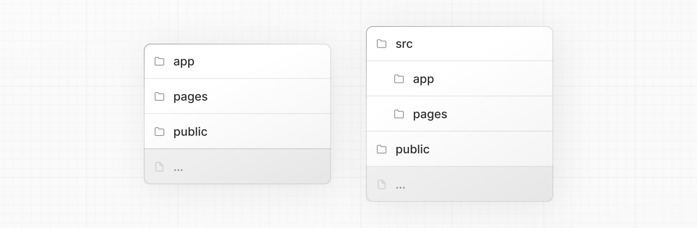

- `app`: App Router
- `pages`: Pages Router (레거시)
- `public`: 정적 자산 (이미지, 폰트 등)
- `src`: 선택적인 애플리케이션 소스 폴더

### 최상위 파일

최상위 파일은 애플리케이션을 설정하고, 의존성을 관리하고, proxy를 실행하고, 모니터링 도구를 연동하고, 환경 변수를 정의하는 데 쓰인다.

| 파일 | 역할 |
| --- | --- |
| `next.config.js` | Next.js 설정 파일 |
| `package.json` | 프로젝트 의존성과 스크립트 |
| `instrumentation.ts` | OpenTelemetry, Instrumentation 파일 |
| `proxy.ts` | Next.js 요청 proxy |
| `.env` | 환경 변수 (버전 관리에 올리지 않아야 함) |
| `.env.local` | 로컬 환경 변수 (버전 관리에 올리지 않아야 함) |
| `.env.production` | 프로덕션 환경 변수 (버전 관리에 올리지 않아야 함) |
| `.env.development` | 개발 환경 변수 (버전 관리에 올리지 않아야 함) |
| `eslint.config.mjs` | ESLint 설정 파일 |
| `.gitignore` | Git이 무시할 파일·폴더 |
| `next-env.d.ts` | Next.js용 TypeScript 선언 파일 (버전 관리에 올리지 않아야 함) |
| `tsconfig.json` | TypeScript 설정 파일 |
| `jsconfig.json` | JavaScript 설정 파일 |

### 라우팅 파일

`page`를 추가하면 라우트가 노출되고, `layout`은 헤더·내비게이션·푸터 같은 공유 UI, `loading`은 스켈레톤, `error`는 에러 바운더리, `route`는 API를 담당한다.

| 파일 | 확장자 | 역할 |
| --- | --- | --- |
| `layout` | `.js` `.jsx` `.tsx` | 레이아웃 |
| `page` | `.js` `.jsx` `.tsx` | 페이지 |
| `loading` | `.js` `.jsx` `.tsx` | 로딩 UI |
| `not-found` | `.js` `.jsx` `.tsx` | Not found UI |
| `error` | `.js` `.jsx` `.tsx` | 에러 UI |
| `global-error` | `.js` `.jsx` `.tsx` | 전역 에러 UI |
| `route` | `.js` `.ts` | API 엔드포인트 |
| `template` | `.js` `.jsx` `.tsx` | 다시 렌더링되는 레이아웃 |
| `default` | `.js` `.jsx` `.tsx` | 병렬 라우트의 대체 페이지 |

### 중첩 라우트

폴더는 URL 세그먼트를 정의하고, 폴더를 중첩하면 세그먼트도 중첩된다. 레이아웃은 어느 레벨에 있든 그 자식 세그먼트를 감싸며, `page`나 `route` 파일이 있어야 라우트가 퍼블릭하게 노출된다.

| 경로 | URL 패턴 | 설명 |
| --- | --- | --- |
| `app/layout.tsx` | — | 모든 라우트를 감싸는 루트 레이아웃 |
| `app/blog/layout.tsx` | — | `/blog`와 그 하위를 감싸는 레이아웃 |
| `app/page.tsx` | `/` | 퍼블릭 라우트 |
| `app/blog/page.tsx` | `/blog` | 퍼블릭 라우트 |
| `app/blog/authors/page.tsx` | `/blog/authors` | 퍼블릭 라우트 |

### 다이나믹 라우트

세그먼트를 대괄호로 감싸면(`[segment]`) 데이터로부터 여러 페이지를 생성하는 다이나믹 세그먼트가 된다. `[...segment]`는 캐치올, `[[...segment]]`는 옵셔널 캐치올이다.

| 경로 | URL 패턴 |
| --- | --- |
| `app/blog/[slug]/page.tsx` | `/blog/my-first-post` |
| `app/shop/[...slug]/page.tsx` | `/shop/clothing`, `/shop/clothing/shirts` |
| `app/docs/[[...slug]]/page.tsx` | `/docs`, `/docs/layouts-and-pages`, `/docs/api-reference/use-router` |

### 라우트 그룹과 프라이빗 폴더

URL을 바꾸지 않고 코드를 조직하려면 라우트 그룹(`(group)`)을 쓰고, 라우팅 대상이 아닌 파일을 함께 두려면 프라이빗 폴더(`_folder`)를 쓴다.

| 경로 | URL 패턴 | 설명 |
| --- | --- | --- |
| `app/(marketing)/page.tsx` | `/` | 그룹은 URL에서 생략됨 |
| `app/(shop)/cart/page.tsx` | `/cart` | `(shop)` 안에서 레이아웃을 공유 |
| `app/blog/_components/Post.tsx` | — | 라우팅되지 않음, UI 유틸을 두기 안전한 위치 |
| `app/blog/_lib/data.ts` | — | 라우팅되지 않음, 유틸을 두기 안전한 위치 |

### 병렬 라우트와 인터셉트 라우트

슬롯 기반 레이아웃이나 모달 라우팅처럼 특정 UI 패턴에 맞는 기능이다. 이름 붙인 슬롯에는 `@folder`, 현재 라우트 안에서 다른 라우트를 URL을 바꾸지 않고 렌더링하려면 인터셉트 패턴을 쓴다.

| 패턴 | 의미 | 대표 사용처 |
| --- | --- | --- |
| `@folder` | 이름 붙인 슬롯 | 사이드바 + 메인 콘텐츠 |
| `(.)folder` | 같은 레벨 인터셉트 | 같은 계층의 라우트를 모달로 미리보기 |
| `(..)folder` | 부모 레벨 인터셉트 | 부모의 자식 라우트를 오버레이로 열기 |
| `(..)(..)folder` | 두 레벨 인터셉트 | 더 깊이 중첩된 오버레이 |
| `(...)folder` | 루트부터 인터셉트 | 현재 화면에서 임의의 라우트를 표시 |

### 메타데이터 파일 컨벤션

앱 아이콘(`favicon`, `icon`, `apple-icon`), OG/Twitter 이미지(`opengraph-image`, `twitter-image`), SEO 파일(`sitemap`, `robots`)은 정적 파일이나 코드로 생성하는 파일 형태로 둘 수 있다. 자세한 내용은 [Metadata and OG images](./metadata-and-og-images.md) 문서를 참고한다.

## 프로젝트 구성하기

Next.js는 파일을 어떻게 조직하고 어디에 콜로케이션할지에 대해 **무의견(unopinionated)** 이다. 몇 가지 기능은 조직을 돕지만 강제하지 않는다.

### 컴포넌트 계층

특수 파일로 정의된 컴포넌트들은 특정 계층 순서로 렌더링된다.

- `layout.js`
- `template.js`
- `error.js` (React 에러 바운더리)
- `loading.js` (React suspense 바운더리)
- `not-found.js` ("not found" UI를 위한 React 에러 바운더리)
- `page.js` 또는 중첩된 `layout.js`

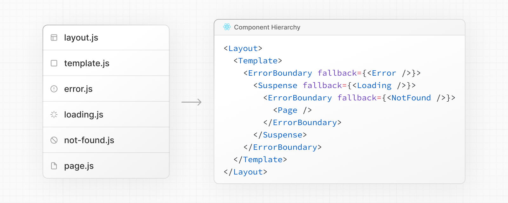

이 컴포넌트들은 중첩 라우트에서 재귀적으로 렌더링된다. 즉 한 라우트 세그먼트의 컴포넌트는 부모 세그먼트의 컴포넌트 **안에** 중첩된다.

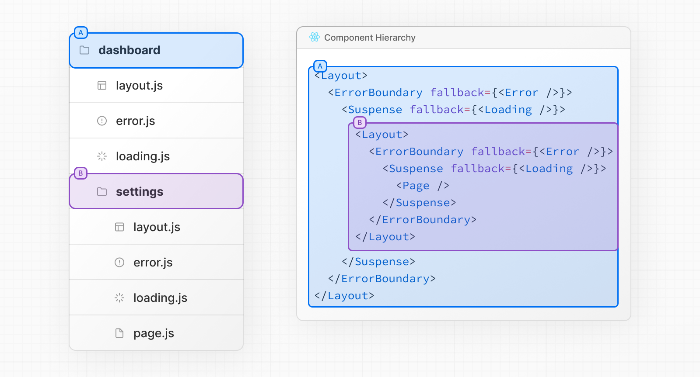

### 콜로케이션

`app` 안에서 폴더는 라우트 구조를 정의하지만, `page.js`나 `route.js`가 있어야만 라우트가 퍼블릭하게 노출된다.

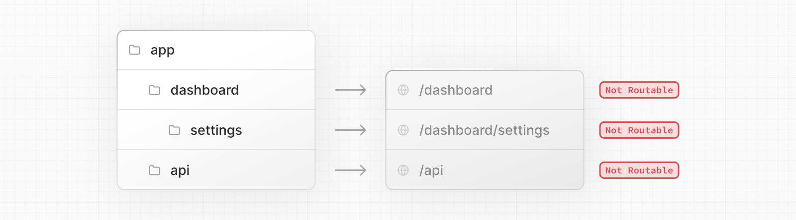

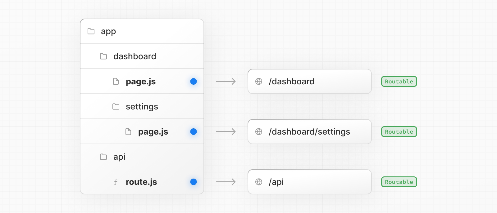

그리고 라우트가 노출되더라도, `page.js`나 `route.js`가 **반환하는 콘텐츠만** 클라이언트로 전송된다. 즉 프로젝트 파일을 라우트 세그먼트 안에 안전하게 콜로케이션할 수 있다.

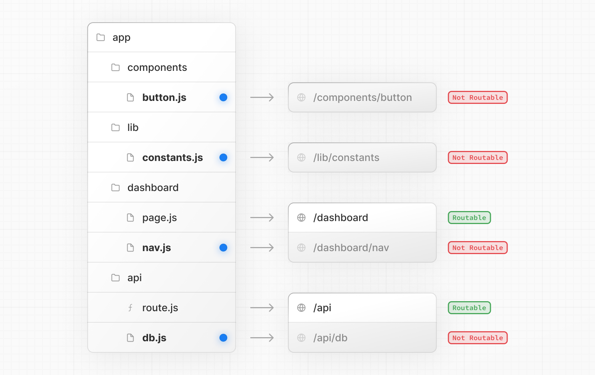

> **알아두면 좋은 점**: 프로젝트 파일을 `app` 안에 콜로케이션**할 수는 있지만**, 반드시 그래야 하는 건 아니다. 원한다면 뒤에서 다룰 "`app` 밖에 프로젝트 파일 두기" 예시처럼 `app` 디렉토리 밖에 둘 수도 있다.

### 프라이빗 폴더

폴더 이름 앞에 언더스코어를 붙이면(`_folderName`) 프라이빗 폴더가 된다. 라우팅 시스템이 이 폴더와 하위 폴더 전체를 라우팅 대상에서 제외한다.

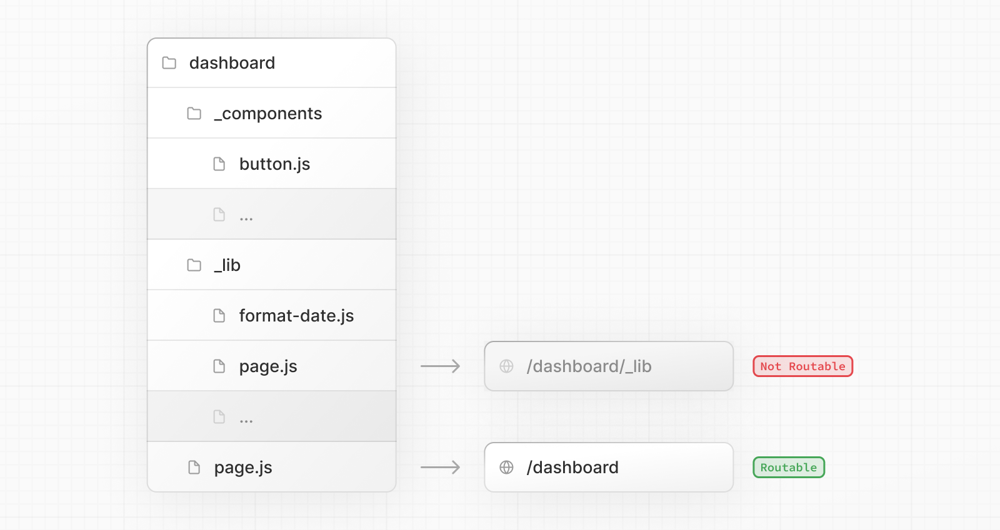

콜로케이션 자체엔 프라이빗 폴더가 필수는 아니지만, 다음 상황에 유용하다.

- UI 로직과 라우팅 로직을 분리
- 프로젝트 전반과 Next.js 생태계 안에서 내부 파일을 일관되게 조직
- 코드 에디터에서 파일을 정렬·그룹화
- 향후 Next.js 파일 컨벤션과의 이름 충돌 방지

> **알아두면 좋은 점**
>
> - 프레임워크 차원의 컨벤션은 아니지만, 프라이빗 폴더 밖의 파일도 같은 언더스코어 패턴으로 "프라이빗"하다고 표시해두는 것을 고려할 수 있다.
> - 언더스코어로 시작하는 URL 세그먼트가 필요하면 `%5FfolderName`(언더스코어의 URL 인코딩)을 폴더명 앞에 붙이면 된다.
> - 프라이빗 폴더를 쓰지 않는다면, 예기치 못한 이름 충돌을 막기 위해 앞서 다룬 "라우팅 파일" 같은 Next.js의 특수 파일 컨벤션을 알아두는 게 좋다.

### 라우트 그룹

폴더를 괄호로 감싸면(`(folderName)`) 라우트 그룹이 된다. URL 경로에는 포함되지 않고 조직 목적으로만 쓰인다.

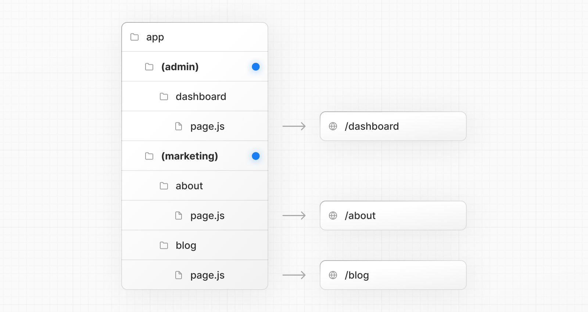

라우트 그룹은 다음 상황에 유용하다.

- 사이트 섹션, 의도, 팀 단위로 라우트를 조직 (예: 마케팅 페이지, 어드민 페이지)
- 같은 라우트 세그먼트 레벨에서 중첩 레이아웃을 여러 개 두기 (여러 개의 루트 레이아웃 포함)

### `src` 폴더

`app`을 포함한 애플리케이션 코드를 선택적으로 `src` 폴더 안에 둘 수 있다. 대부분 프로젝트 루트에 있는 설정 파일들과 애플리케이션 코드를 분리하기 위함이다.

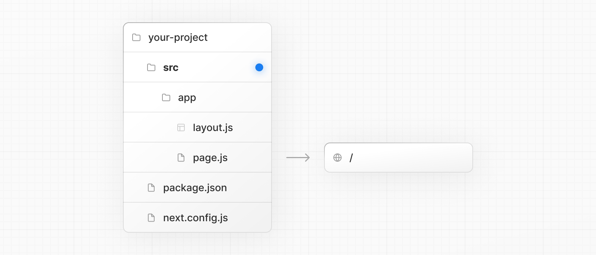

## 예시

다음은 흔한 전략들을 아주 높은 수준에서만 정리한 것이다. 가장 간단한 결론은 팀에 맞는 전략을 골라서 프로젝트 전체에 일관되게 적용하는 것이다.

> **알아두면 좋은 점**: 아래 예시에서 `components`, `lib` 폴더는 일반화된 자리표시자다. 프레임워크 차원의 특별한 의미는 없고, `ui`, `utils`, `hooks`, `styles` 등 다른 이름을 쓸 수도 있다.

### `app` 밖에 프로젝트 파일 두기

이 전략은 모든 애플리케이션 코드를 프로젝트 **루트**의 공유 폴더에 두고, `app` 디렉토리는 순수하게 라우팅 목적으로만 쓴다.

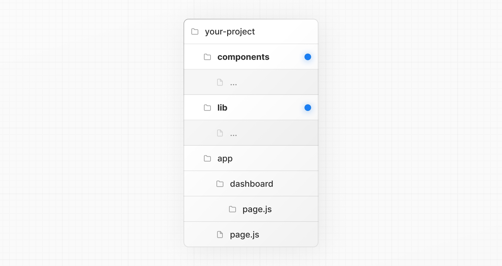

### `app` 안 최상위 폴더에 프로젝트 파일 두기

이 전략은 모든 애플리케이션 코드를 `app` 디렉토리 **루트**의 공유 폴더에 둔다.

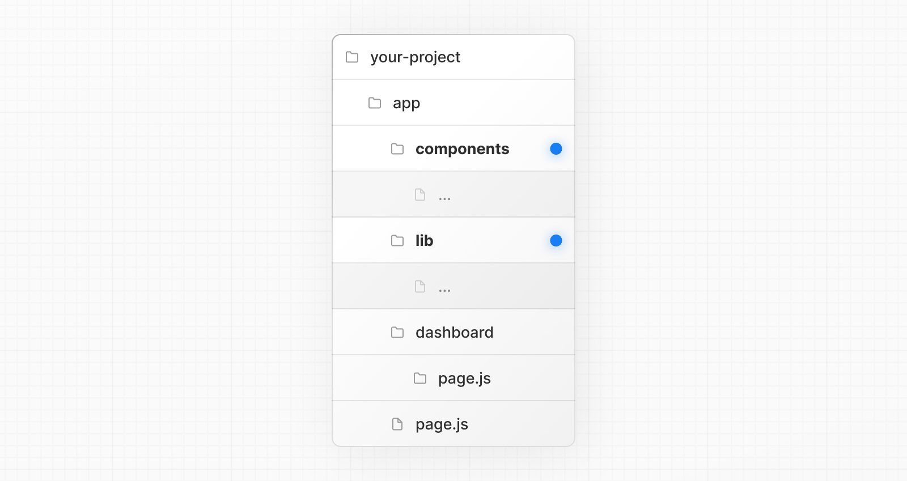

### 기능이나 라우트별로 프로젝트 파일 나누기

이 전략은 전역으로 공유되는 애플리케이션 코드는 `app` 루트에 두고, 더 특정한 코드는 그 코드를 사용하는 라우트 세그먼트 안으로 **분리**한다.

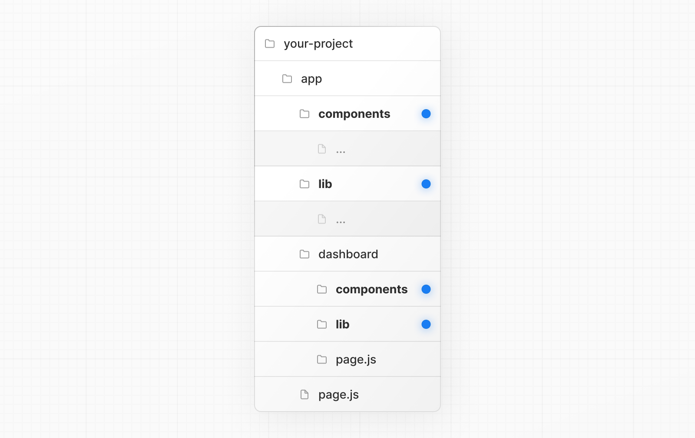

### URL 경로에 영향 없이 라우트 조직하기

URL에 영향을 주지 않고 라우트를 조직하려면, 관련 라우트를 묶는 그룹을 만든다. 괄호로 감싼 폴더(`(marketing)`, `(shop)`)는 URL에서 생략된다.

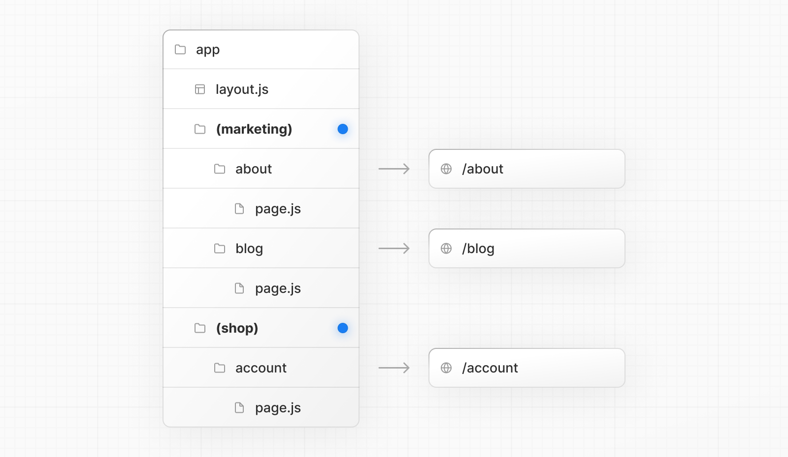

`(marketing)`과 `(shop)` 안의 라우트는 같은 URL 계층을 공유하지만, 각 그룹 폴더 안에 `layout.js`를 추가하면 서로 다른 레이아웃을 줄 수 있다. 이 레이아웃들은 기존 앱 레이아웃 안에 중첩된다.

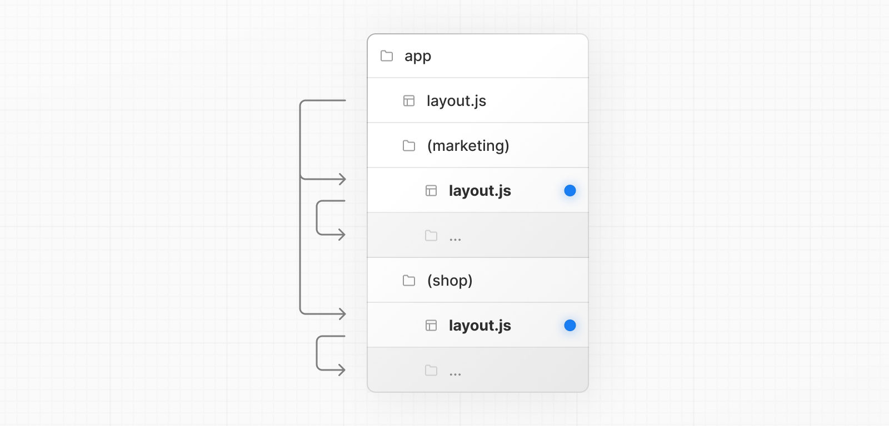

### 특정 세그먼트만 레이아웃 적용하기

특정 라우트만 레이아웃에 포함시키려면, 새 라우트 그룹(예: `(shop)`)을 만들고 그 레이아웃을 공유할 라우트(예: `account`, `cart`)를 그룹 안으로 옮긴다. 그룹 밖의 라우트(예: `checkout`)는 레이아웃을 공유하지 않는다.

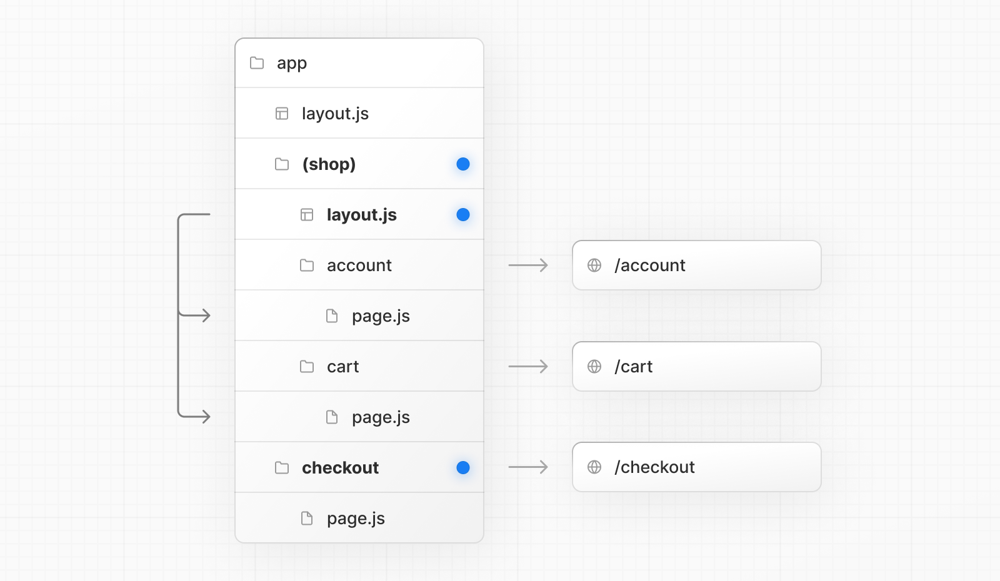

### 특정 라우트에만 로딩 스켈레톤 적용하기

`loading.js` 파일로 [로딩 스켈레톤](./route-handlers.md)을 특정 라우트에만 적용하려면, 새 라우트 그룹(예: `/(overview)`)을 만들고 `loading.tsx`를 그 그룹 안으로 옮긴다.

이렇게 하면 `loading.tsx`는 대시보드 안의 모든 페이지가 아니라 대시보드 → 개요 페이지에만 적용되고, URL 경로 구조에는 영향을 주지 않는다.

### 여러 개의 루트 레이아웃 만들기

여러 개의 [루트 레이아웃](../3-api-reference/3.1-file-conventions/layout.md)을 만들려면, 최상위 `layout.js`를 지우고 각 라우트 그룹 안에 `layout.js`를 추가한다. 완전히 다른 UI나 경험을 가진 섹션으로 애플리케이션을 나눌 때 유용하다. `<html>`과 `<body>` 태그는 각 루트 레이아웃에 추가해야 한다.

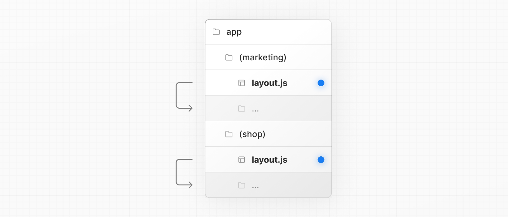

위 예시에서 `(marketing)`과 `(shop)` 둘 다 자기만의 루트 레이아웃을 갖는다.

## 예제 및 데모 설계

- 데모 가능 여부: 가능 (Phase 1에서는 설계만 남기고 구현은 보류)
- 데모 목적: 같은 기능을 구현하는 폴더 구조를 여러 전략(앱 밖에 두기 / 앱 루트에 두기 / 기능별로 나누기)으로 나란히 비교해서 보여준다.
- 사용자가 확인할 화면과 상호작용: 폴더 트리 뷰어에서 전략을 전환하면서 같은 라우트가 어떻게 다르게 조직되는지 확인.
- 예제에서 관찰할 결과: 라우트 그룹 `(marketing)`, `(shop)`으로 나눴을 때 URL은 그대로인데 레이아웃만 달라지는 것, `_components` 같은 프라이빗 폴더가 라우팅에서 제외되는 것.

## 연습 문제

**Q1. (단일 선택) 다음 중 URL 경로에 아무 영향도 주지 않는 폴더 네이밍 방식은?**

1. `[slug]`
2. `(marketing)`
3. `@analytics`
4. `_components`와 `(marketing)` 둘 다

정답 보기

**정답: 4** — `(marketing)`(라우트 그룹)과 `_components`(프라이빗 폴더) 둘 다 URL 경로에 나타나지 않는다. `[slug]`는 다이나믹 세그먼트, `@analytics`는 병렬 라우트 슬롯으로 둘 다 라우팅에 영향을 준다(슬롯은 URL엔 안 보이지만 병렬 렌더링에 관여한다).

**Q2. (복수 선택) 다음 중 옳은 것을 모두 고르시오.**

- [ ] `app/blog/page.js`가 없어도 `app/blog/_components/Post.tsx`는 항상 존재할 수 있다.
- [ ] 라우트가 퍼블릭하게 노출되려면 세그먼트에 `page.js` 또는 `route.js`가 있어야 한다.
- [ ] 같은 라우트 세그먼트에 `page.js`와 `route.js`가 동시에 있을 수 있다.
- [ ] 여러 개의 루트 레이아웃을 만들 때는 각 레이아웃에 `<html>`과 `<body>` 태그를 넣어야 한다.

정답 보기

**정답: 1, 2, 4** — `page.js`와 `route.js`는 같은 라우트 세그먼트에 동시에 존재할 수 없다(충돌).

**Q3. (단일 선택) 대시보드의 특정 페이지 하나에만 `loading.tsx`를 적용하고 싶을 때 가장 적절한 방법은?**

1. 해당 페이지의 `page.tsx` 안에 `loading.tsx` 코드를 직접 합친다.
2. 새 라우트 그룹을 만들어 그 페이지와 `loading.tsx`를 함께 옮긴다.
3. `_loading` 프라이빗 폴더를 만든다.
4. `next.config.js`에서 `loading` 옵션을 설정한다.

정답 보기

**정답: 2** — 새 라우트 그룹(예: `(overview)`)을 만들어 원하는 페이지와 `loading.tsx`를 그 안으로 옮기면, URL 구조를 바꾸지 않고도 그 라우트에만 로딩 스켈레톤을 적용할 수 있다.

## 요약

- 최상위 폴더(`app`, `public`, `src`)와 최상위 파일(`next.config.js`, `package.json` 등)이 프로젝트의 뼈대를 이룬다.
- `layout`, `page`, `loading`, `error`, `route` 같은 라우팅 파일은 폴더 계층을 따라 중첩되어 쌓인다.
- `[slug]`(다이나믹), `(group)`(라우트 그룹), `_folder`(프라이빗 폴더), `@slot`(병렬 라우트)은 각각 다른 목적의 네이밍 컨벤션이다.
- 라우트가 퍼블릭하게 노출되려면 `page.js`/`route.js`가 필요하지만, 그 외 파일은 라우트 세그먼트 안에 안전하게 콜로케이션할 수 있다.
- 프로젝트 파일을 어디에 둘지(앱 밖/앱 루트/기능별)는 Next.js가 강제하지 않으며, 팀에 맞는 전략을 일관되게 적용하면 된다.
