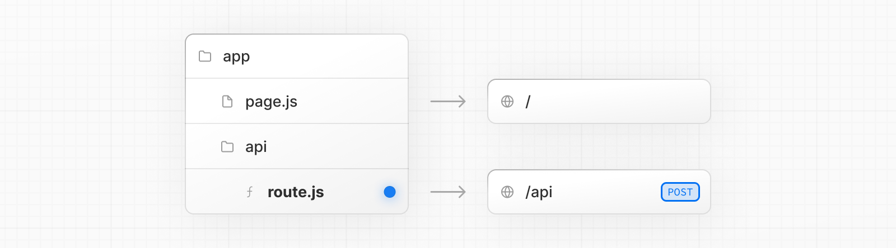

# Route Handlers

- 공식 문서: [Route Handlers](https://nextjs.org/docs/app/getting-started/route-handlers)
- 상위 메뉴: [Getting Started](./README.md)
- 전체 목차: [Next.js 학습 문서](../README.md)

## 학습 목표

- Web `Request`와 `Response` API로 Route Handler를 만들 수 있다.
- 지원 HTTP 메서드, 파일 배치, `page`와의 충돌 규칙을 설명할 수 있다.
- 기본 캐시 동작과 Cache Components를 켰을 때의 prerender 조건을 구분할 수 있다.
- 다이나믹 세그먼트의 `params`를 `RouteContext`로 안전하게 다룰 수 있다.

## 핵심 개념 및 설명

### Route Handlers

Route Handler는 Web [`Request`](https://developer.mozilla.org/docs/Web/API/Request)와 [`Response`](https://developer.mozilla.org/docs/Web/API/Response) API로 특정 라우트의 사용자 정의 요청 처리기를 만든다.



> **알아두면 좋은 점**: Route Handler는 `app` 디렉토리에서만 사용할 수 있다. `pages` 디렉토리의 API Routes에 대응하므로 둘을 함께 사용할 필요가 없다.

#### 파일 규칙

`app` 안에 [`route.js|ts`](../3-api-reference/3.1-file-conventions/route.md)를 만들고 HTTP 메서드 이름의 함수를 export한다.

```ts filename="app/api/route.ts"
export async function GET(request: Request) {}
```

`page.js`, `layout.js`처럼 `app` 아래 어디에나 중첩할 수 있다. 다만 같은 라우트 세그먼트 레벨에 `route.js`와 `page.js`를 함께 둘 수 없다.

#### 지원하는 HTTP 메서드

`GET`, `POST`, `PUT`, `PATCH`, `DELETE`, `HEAD`, `OPTIONS`를 지원한다. 지원하지 않는 메서드를 요청하면 Next.js가 `405 Method Not Allowed`를 반환한다.

#### 확장된 `NextRequest`와 `NextResponse` API

Web 표준 API 외에도 Next.js는 고급 사용 사례를 위한 편의 기능이 있는 [`NextRequest`](../3-api-reference/3.3-functions/next-request.md)와 [`NextResponse`](../3-api-reference/3.3-functions/next-response.md)를 제공한다.

#### 캐싱

Route Handler는 기본적으로 캐시되지 않는다. `GET`만 `dynamic = 'force-static'` 같은 라우트 설정으로 캐싱을 선택할 수 있다. 다른 HTTP 메서드는 캐시되지 않는다.

```ts filename="app/items/route.ts"
export const dynamic = 'force-static'

export async function GET() {
  const res = await fetch('https://data.mongodb-api.com/...', {
    headers: {
      'Content-Type': 'application/json',
      'API-Key': process.env.DATA_API_KEY,
    },
  })
  const data = await res.json()
  return Response.json(data)
}
```

> **알아두면 좋은 점**: 캐시되는 `GET`과 같은 파일에 있어도 다른 HTTP 메서드는 캐시되지 않는다.

##### Cache Components를 사용할 때

[Cache Components](./caching.md)를 켜면 `GET` Route Handler는 일반 UI 라우트와 같은 모델을 따른다. 기본적으로 요청 시점에 실행되지만, 캐시되지 않은 데이터나 런타임 데이터에 접근하지 않으면 빌드 시점에 prerender할 수 있다.

```ts filename="app/items/route.ts"
// 다이나믹·런타임 데이터가 없어 빌드 시점에 prerender할 수 있다
export async function GET() {
  return Response.json({ projectName: 'Next.js' })
}
```

`Math.random()` 같은 비결정적 연산을 만나면 빌드 중 prerender를 멈추고 요청 시점 렌더링으로 미룬다. `headers()` 같은 런타임 API로 요청별 데이터를 읽을 때도 마찬가지다.

> **알아두면 좋은 점**: 네트워크 요청, 데이터베이스 쿼리, 비동기 파일 시스템 작업, 요청 객체 속성, [`cookies()`](../3-api-reference/3.3-functions/cookies.md), [`headers()`](../3-api-reference/3.3-functions/headers.md), [`connection()`](../3-api-reference/3.3-functions/connection.md), 비결정적 연산에 접근하면 `GET`의 prerender가 중단된다.

캐시되지 않은 데이터도 별도 도우미 함수에서 `use cache`와 `cacheLife`를 사용하면 정적 응답에 포함할 수 있다.

```ts filename="app/api/products/route.ts"
import { cacheLife } from 'next/cache'

export async function GET() {
  return Response.json(await getProducts())
}

async function getProducts() {
  'use cache'
  cacheLife('hours')
  return db.query('SELECT * FROM products')
}
```

> **알아두면 좋은 점**: `use cache`는 Route Handler 본문에 직접 쓸 수 없으므로 도우미 함수로 분리한다. 캐시된 응답은 새 요청이 들어올 때 `cacheLife`에 따라 revalidate된다.

#### 특수 Route Handlers

`sitemap.ts`, `opengraph-image.tsx`, `icon.tsx` 같은 metadata 특수 파일은 요청 시점 API나 다이나믹 설정을 사용하지 않는 한 기본적으로 정적이다.

#### 라우트 결정

`route`는 가장 낮은 수준의 라우팅 기본 요소라고 볼 수 있다. `page`와 달리 레이아웃이나 클라이언트 내비게이션에 참여하지 않으며, 같은 라우트에 `page.js`와 공존할 수 없다.

| Page | Route | 결과 |
| --- | --- | --- |
| `app/page.js` | `app/route.js` | 충돌 |
| `app/page.js` | `app/api/route.js` | 유효 |
| `app/[user]/page.js` | `app/api/route.js` | 유효 |

각 `route.js` 또는 `page.js`는 해당 라우트의 모든 HTTP 메서드를 차지한다.

#### Route Context Helper

TypeScript에서는 전역 `RouteContext`로 다이나믹 세그먼트의 `context`를 타입 지정한다.

```ts filename="app/users/[id]/route.ts"
import type { NextRequest } from 'next/server'

export async function GET(_req: NextRequest, ctx: RouteContext<'/users/[id]'>) {
  const { id } = await ctx.params
  return Response.json({ id })
}
```

> **알아두면 좋은 점**: `RouteContext` 타입은 `next dev`, `next build`, `next typegen` 중에 생성된다.

## 예제 및 데모 설계

- 데모 가능 여부: 가능 (Phase 1에서는 설계만 작성)
- 데모 목적: 정적 `GET`, 요청 헤더를 읽는 `GET`, `POST`의 실행·캐시 차이를 비교한다.
- 사용자가 확인할 화면과 상호작용: 각 엔드포인트를 반복 호출하고 응답 값과 서버 로그를 확인한다.
- 관찰할 결과: 정적 `GET`만 prerender할 수 있고, 런타임 데이터 사용과 다른 메서드는 요청마다 실행된다.

## 연습 문제

**Q1. (복수 선택) Route Handler가 지원하는 메서드를 모두 고르시오.**

- [ ] `GET`
- [ ] `PATCH`
- [ ] `CONNECT`
- [ ] `OPTIONS`

<details><summary>정답 보기</summary>

**정답: 1, 2, 4** — `CONNECT`는 지원 목록에 없으며 요청하면 405 응답을 받는다.

</details>

**Q2. (단일 선택) Cache Components를 켠 `GET`이 `headers()`를 호출하면 어떻게 되는가?**

1. 항상 빌드 시점에 prerender된다.
2. prerender가 중단되고 요청 시점 렌더링으로 미뤄진다.
3. 자동으로 `POST`로 변환된다.
4. `route.js`가 `page.js`로 바뀐다.

<details><summary>정답 보기</summary>

**정답: 2** — `headers()`는 요청별 런타임 데이터를 읽으므로 정적 prerender를 계속할 수 없다.

</details>

## 요약

- Route Handler는 `app`의 `route.js|ts`에서 Web 요청·응답 API를 사용한다.
- 같은 세그먼트의 `page.js`와 공존할 수 없고 지원하지 않는 메서드는 405를 반환한다.
- 기본적으로 캐시되지 않으며 일반 설정에서는 `GET`만 정적 캐싱을 선택할 수 있다.
- Cache Components에서는 데이터 접근 방식에 따라 빌드 시점 prerender 여부가 결정된다.
- `RouteContext`는 다이나믹 세그먼트의 `params` 타입을 생성해 준다.
