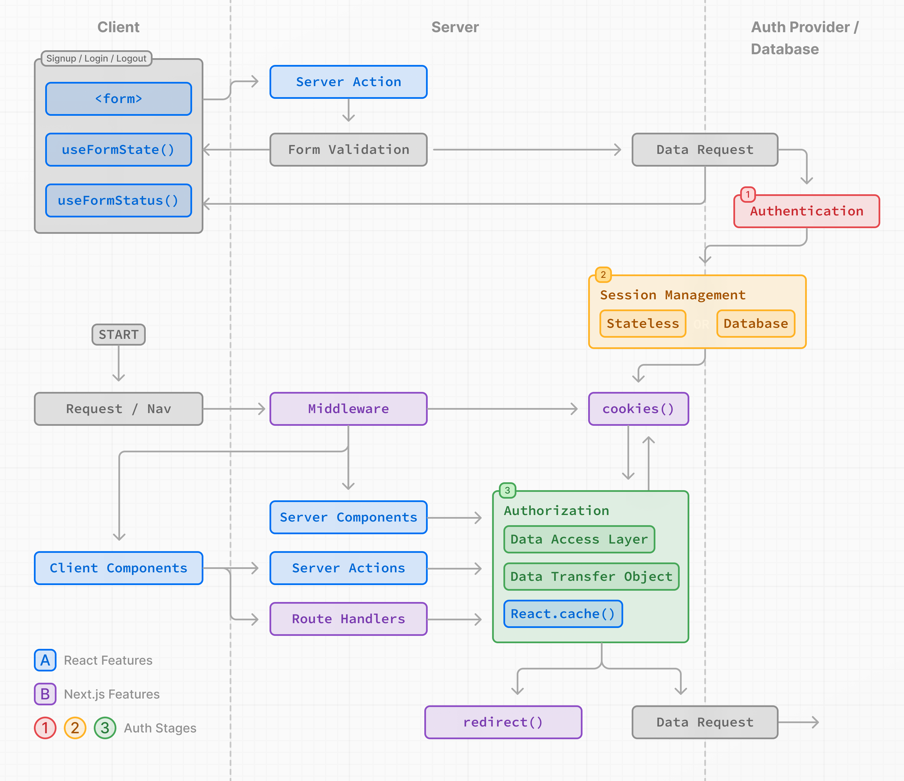

# Authentication

- 공식 문서: [Authentication](https://nextjs.org/docs/app/guides/authentication)
- 상위 메뉴: [Guides](./README.md)
- 전체 목차: [Next.js 학습 문서](../README.md)

## 학습 목표

- 인증(Authentication), 세션 관리(Session Management), 인가(Authorization)의 역할을 구분한다.
- Server Action에서 자격 증명을 검증하고 안전한 세션 쿠키를 만들 수 있다.
- 낙관적 검사와 보안 검사를 구분하고 Data Access Layer에 인가를 집중한다.
- Server Component, 레이아웃, Server Action, Route Handler에서 인증 검사를 배치할 위치를 판단한다.

## 핵심 개념 및 설명

인증은 사용자가 주장한 신원과 실제 사용자가 같은지 확인한다. 세션 관리는 요청 사이에 인증 상태를 유지한다. 인가는 인증된 사용자가 어떤 라우트, 데이터, 동작에 접근할 수 있는지 결정한다.



이 문서의 사용자 이름·비밀번호 예제는 학습용이다. 직접 구현할 수도 있지만, 보안과 단순성을 위해 인증 라이브러리를 사용하는 것을 권장한다. 인증 라이브러리는 소셜 로그인, 다중 인증, 역할 기반 접근 제어도 제공할 수 있다.

> **알아두면 좋은 점**: Cache Components를 활성화하면 세션 읽기와 사용자별 데이터 캐싱에 별도 규칙이 적용된다. [Authentication with Cache Components](./authentication-with-cache-components.md)를 함께 참고한다.

### Authentication

#### 가입과 로그인 기능

`<form>`과 [Server Action](../1-getting-started/mutating-data.md), `useActionState`를 사용하면 자격 증명을 수집하고 서버에서 입력을 검증한 뒤 인증 제공자나 데이터베이스를 호출할 수 있다. Server Action은 서버에서 실행되지만 공개 POST 진입점처럼 취급해야 한다.

```tsx
'use client'

import { useActionState } from 'react'
import { signup } from '@/app/actions/auth'

export function SignupForm() {
  const [state, action, pending] = useActionState(signup, undefined)

  return (
    <form action={action}>
      <input name="email" type="email" required />
      <input name="password" type="password" required />
      <p aria-live="polite">{state?.message}</p>
      <button disabled={pending}>Sign Up</button>
    </form>
  )
}
```

서버에서는 Zod나 Yup 같은 스키마 라이브러리로 필드를 다시 검증한다. 검증에 실패하면 인증 제공자나 데이터베이스를 호출하기 전에 반환한다. 유효한 비밀번호는 평문으로 저장하지 않고 해시한 뒤 사용자를 만든다. 그다음 세션을 만들고 적절한 페이지로 이동한다.

```ts
'use server'

import * as z from 'zod'
import bcrypt from 'bcrypt'
import { redirect } from 'next/navigation'
import { createSession } from '@/app/lib/session'

const SignupSchema = z.object({
  email: z.email({ error: 'Please enter a valid email.' }).trim(),
  password: z.string().min(8, { error: 'Be at least 8 characters long' }),
})

export async function signup(_: unknown, formData: FormData) {
  const fields = SignupSchema.safeParse({
    email: formData.get('email'),
    password: formData.get('password'),
  })
  if (!fields.success) return { message: 'Invalid fields.' }

  const password = await bcrypt.hash(fields.data.password, 10)
  const user = await db.insert(users).values({
    email: fields.data.email,
    password,
  }).returning({ id: users.id })

  if (!user[0]) return { message: 'An error occurred while creating your account.' }
  await createSession(user[0].id)
  redirect('/profile')
}
```

> **알아두면 좋은 점**: React 19의 `useFormStatus`는 `pending`뿐 아니라 `data`, `method`, `action`도 제공한다. 데이터를 변경하기 전에는 사용자가 그 동작을 수행할 권한까지 확인해야 한다.

> **팁**: 직접 만든 인증 흐름은 빠르게 복잡해지므로 인증 라이브러리 사용을 검토한다. 가입 과정에서 이메일이나 사용자 이름의 중복을 미리 확인하면 불필요한 제출을 줄이고 즉시 피드백할 수 있다. 입력 중 발생하는 검사 요청의 빈도는 `use-debounce` 같은 라이브러리로 조절할 수 있다.

제출 버튼의 `pending` 상태는 같은 폼을 여러 번 제출하는 일을 막는 데도 사용한다.

### Session Management

세션 관리는 세션이나 토큰을 생성·저장·갱신·삭제해 요청 사이에 인증 상태를 유지한다.

- **Stateless 세션**: 세션 데이터나 토큰을 브라우저 쿠키에 저장하고 요청마다 서버에서 검증한다. 단순하지만 잘못 구현하면 덜 안전할 수 있다.
- **Database 세션**: 세션 데이터는 데이터베이스에 두고 브라우저에는 암호화된 세션 ID만 보낸다. 더 안전하지만 복잡하고 서버 자원을 더 사용할 수 있다.

두 방식을 함께 사용할 수도 있다.

> **알아두면 좋은 점**: 직접 암호화를 구현하기보다 `iron-session`이나 `jose` 같은 세션 관리 라이브러리를 사용하는 것을 권장한다.

#### Stateless 세션 만들기

먼저 서명용 비밀 키를 생성해 [환경 변수](./environment-variables.md)에 둔다. 세션 모듈에는 `server-only`를 import한다.

> **알아두면 좋은 점**: 사용 중인 인증 라이브러리가 세션 관리도 제공하는지 확인한다.

비밀 키는 예측하기 어려운 충분한 길이로 만들고 저장소에 커밋하지 않는다.

```bash
openssl rand -base64 32
```

```bash
SESSION_SECRET=your_secret_key
```

```ts
import 'server-only'
import { SignJWT, jwtVerify } from 'jose'

const key = new TextEncoder().encode(process.env.SESSION_SECRET)

export async function encrypt(payload: { userId: string }) {
  return new SignJWT(payload)
    .setProtectedHeader({ alg: 'HS256' })
    .setIssuedAt()
    .setExpirationTime('7d')
    .sign(key)
}

export async function decrypt(session = '') {
  try {
    return (await jwtVerify(session, key, { algorithms: ['HS256'] })).payload
  } catch {
    console.log('Failed to verify session')
  }
}
```

> **팁**: payload에는 이후 요청에 필요한 사용자 ID나 역할처럼 최소한의 고유 정보만 넣는다. 전화번호, 이메일, 카드 정보, 비밀번호 같은 개인·민감 정보는 넣지 않는다.

세션 쿠키는 서버에서 설정한다. `HttpOnly`는 클라이언트 JavaScript의 접근을 막고, `Secure`는 HTTPS로만 전송하며, `SameSite`는 교차 사이트 요청 규칙을 정한다. `Expires` 또는 `Max-Age`와 `Path`도 명시한다.

```ts
import 'server-only'
import { cookies } from 'next/headers'

export async function createSession(userId: string) {
  const expires = new Date(Date.now() + 7 * 24 * 60 * 60 * 1000)
  const session = await encrypt({ userId })
  const cookieStore = await cookies()

  cookieStore.set('session', session, {
    httpOnly: true,
    secure: true,
    sameSite: 'lax',
    expires,
    path: '/',
  })
}
```

> **알아두면 좋은 점**: 쿠키는 서버에서 설정해야 클라이언트가 세션 데이터를 임의로 바꾸는 위험을 줄일 수 있다.

사용자가 다시 방문하면 만료 시각을 연장할 수 있고, 로그아웃할 때는 `(await cookies()).delete('session')`으로 쿠키를 지운다.

> **알아두면 좋은 점**: 사용 중인 인증 라이브러리가 refresh token과 세션 갱신·삭제를 지원하는지도 확인한다.

#### Database 세션 만들기

데이터베이스 세션은 다음 흐름을 따른다.

1. 세션 테이블을 만들고 세션 생성·갱신·삭제 기능을 구현한다.
2. 브라우저에 저장할 세션 ID를 암호화한다.
3. Proxy의 낙관적 검사에 쓸 쿠키와 데이터베이스 상태를 함께 유지한다.

> **팁**: 빠른 조회가 필요하면 세션 수명 동안 서버 캐시를 두거나 관련 데이터 요청을 합칠 수 있다. 마지막 로그인 시각, 활성 기기 수, 모든 기기 로그아웃 같은 기능에는 Database 세션이 적합하다.

### Authorization

인가는 두 수준으로 나뉜다.

- **낙관적 검사**는 쿠키의 세션 데이터로 UI를 숨기거나 리다이렉트한다. 빠르지만 민감한 데이터 접근을 최종 승인하는 검사는 아니다.
- **보안 검사**는 데이터베이스의 세션과 리소스를 확인한다. 민감한 데이터와 동작에는 이 검사를 사용한다.

인가 로직은 Data Access Layer(DAL)에 집중하고, 클라이언트에는 Data Transfer Object(DTO)로 필요한 필드만 반환한다. Proxy는 선택적으로 낙관적 사전 검사를 수행한다.

#### Proxy의 낙관적 검사

[Proxy](../3-api-reference/3.1-file-conventions/proxy.md)는 여러 라우트의 리다이렉트를 한곳에 모으고 정적 유료 콘텐츠 같은 라우트를 사전 필터링할 수 있다. 그러나 prefetch된 라우트를 포함해 넓게 실행되므로 쿠키만 읽고, 성능을 해칠 데이터베이스 검사는 피한다.

```ts
import { NextRequest, NextResponse } from 'next/server'
import { decrypt } from '@/app/lib/session'

export async function proxy(req: NextRequest) {
  const session = await decrypt(req.cookies.get('session')?.value)
  if (req.nextUrl.pathname.startsWith('/dashboard') && !session?.userId) {
    return NextResponse.redirect(new URL('/login', req.nextUrl))
  }
  return NextResponse.next()
}
```

Proxy는 첫 번째 방어선일 뿐이다. 대부분의 보안 검사는 데이터 원본 가까이에서 수행한다.

> **팁**: Proxy는 모든 라우트에서 실행하는 편이 권장되지만, `matcher`로 특정 경로만 선택할 수도 있다. 사용 중인 인증 라이브러리가 Proxy에서 실행될 수 있는지도 확인한다.

#### Data Access Layer

DAL은 데이터 요청과 인가를 중앙화한다. 최소한 세션 유효성을 확인하고 리다이렉트하거나 이후 요청에 필요한 사용자 정보만 반환하는 함수를 둔다. React `cache`는 한 렌더링 패스에서 중복 검증을 줄인다.

```ts
import 'server-only'
import { cache } from 'react'
import { cookies } from 'next/headers'
import { redirect } from 'next/navigation'

export const verifySession = cache(async () => {
  const session = await decrypt((await cookies()).get('session')?.value)
  if (!session?.userId) redirect('/login')
  return { userId: String(session.userId) }
})
```

> **알아두면 좋은 점**: 정적 라우트가 사용자 사이에 데이터를 공유한다면 요청 시점 DAL 검사만으로 보호되지 않으므로 Proxy도 사용한다.

#### Data Transfer Object(DTO) 사용하기

DTO는 전체 사용자 객체 대신 화면에 필요한 필드만 반환한다.

> **알아두면 좋은 점**: DTO는 `toJSON()`, 개별 함수, JavaScript 클래스 등 여러 방식으로 정의할 수 있다. React나 Next.js 전용 기능이 아니므로 앱에 맞는 패턴을 선택한다.

#### Server Components

Server Component에서는 역할에 따라 컴포넌트를 조건부 렌더링할 수 있다.

> **알아두면 좋은 점**: UI를 조건부로 숨기는 것은 사용자 경험을 위한 조치일 뿐, 데이터와 Server Action을 보호하는 인가 검사를 대체하지 않는다.

#### 레이아웃과 인증 검사

공유 레이아웃은 클라이언트 내비게이션 때 다시 렌더링되지 않을 수 있다. 레이아웃이 자식을 숨겨도 다른 라우트 세그먼트와 parallel route slot의 실행이나 RSC Payload 포함을 막지 못한다. 검사는 데이터 원본 또는 조건부 컴포넌트 가까이에 둔다.

##### 인증 검사와 스트리밍

레이아웃 최상위에서 `cookies()`, `headers()`, DAL을 `await`하면 해당 세그먼트의 첫 스트리밍 청크와 `{children}`이 함께 지연된다. 세션이 필요한 사용자 메뉴만 중첩 Server Component로 옮기고 `Suspense`로 감싼다. Client Component는 DAL을 import할 수 없으므로 부모 Server Component에서 검증한 최소 데이터를 prop이나 Context로 전달한다.

##### 페이지 수준 검사

페이지는 클라이언트 내비게이션 때 다시 렌더링되므로 역할별 UI를 배치하기에 레이아웃보다 적합하다. 하지만 이 검사도 데이터 접근과 변경을 최종 보호하지는 않는다.

##### 컴포넌트 수준 검사

leaf 컴포넌트의 역할 기반 UI는 사용자 경험을 조정할 뿐이다. 레이아웃이나 상위 컴포넌트에서 `return null`로 숨기는 패턴은 여러 진입점을 막지 못하므로 권장하지 않는다.

#### Server Actions

[Server Action](./server-actions.md)은 공개 API 엔드포인트처럼 취급한다. UI가 이미 권한을 검사했더라도 각 Action에서 인증과 인가를 다시 수행한다.

```ts
'use server'

export async function deleteUser() {
  const session = await verifySession()
  const user = await getUser(session.userId)
  if (user.role !== 'admin') throw new Error('Forbidden')
  // 권한이 확인된 뒤에만 변경한다.
}
```

#### Route Handlers

[Route Handler](../3-api-reference/3.1-file-conventions/route.md)도 공개 API 엔드포인트처럼 취급해 요청마다 인증과 인가를 수행한다. `401`은 인증되지 않은 요청, `403`은 인증됐지만 권한이 없는 요청에 사용한다.

### Resources

#### 인증 라이브러리

공식 문서는 Auth0, Better Auth, Clerk, Descope, Kinde, Logto, NextAuth.js, Ory, Stack Auth, Supabase, Stytch, WorkOS의 Next.js 통합 문서를 안내한다. 구현 전에는 각 라이브러리의 현재 App Router·Proxy 호환성을 확인한다.

#### 세션 관리 라이브러리

공식 문서는 Iron Session과 Jose를 소개한다. 세션 형식, 키 교체, 만료·갱신·삭제 요구에 맞는 라이브러리를 선택한다.

#### 더 읽을거리

추가 학습 자료는 다음과 같다.

| 자료 | 목적 |
|---|---|
| [How to think about security in Next.js](https://nextjs.org/blog/security-nextjs-server-components-actions) | Server Component와 Server Action 보안 모델 |
| [Understanding XSS Attacks](https://vercel.com/guides/understanding-xss-attacks) | XSS 공격 이해 |
| [Understanding CSRF Attacks](https://vercel.com/guides/understanding-csrf-attacks) | CSRF 공격 이해 |
| [The Copenhagen Book](https://thecopenhagenbook.com/) | 웹 인증 구현 참고 자료 |

## 예제 및 데모 설계

- 데모 가능 여부: Phase 2에서 구현 예정
- 데모 목적: 가입, 세션 생성, 낙관적 라우트 검사, 데이터 원본의 보안 검사를 한 흐름으로 비교한다.
- 사용자가 확인할 화면과 상호작용:
  - 잘못된 가입 입력이 데이터베이스 호출 전에 거절되는지 확인한다.
  - 로그인 후 `HttpOnly` 세션 쿠키가 생기고 로그아웃 후 삭제되는지 확인한다.
  - 관리자 버튼을 숨기는 UI 검사와 Server Action 내부 인가 검사의 차이를 확인한다.

## 연습 문제

1. 인증된 사용자가 특정 게시물을 삭제할 수 있는지 결정하는 단계는 무엇인가?

   - A. Authentication
   - B. Session Management
   - C. Authorization

   <details><summary>정답 보기</summary>

   정답: C. 인가는 인증된 사용자가 특정 리소스에 수행할 수 있는 동작을 결정한다.

   </details>

2. Proxy에서 권장하는 인증 검사는 무엇인가?

   - A. 모든 요청에서 데이터베이스의 전체 사용자 레코드를 조회한다.
   - B. 쿠키 세션으로 낙관적 검사를 하고 보안 검사는 데이터 원본 가까이에서 수행한다.
   - C. UI 요소를 숨긴 결과만 신뢰한다.

   <details><summary>정답 보기</summary>

   정답: B. Proxy의 넓은 실행 범위에서는 빠른 사전 검사를 하고 민감한 검사는 DAL에서 수행한다.

   </details>

3. 세션 쿠키 설정으로 적절한 것을 모두 고르시오.

   - A. `HttpOnly`
   - B. `Secure`
   - C. 비밀번호를 payload에 포함

   <details><summary>정답 보기</summary>

   정답: A, B. 쿠키 접근과 전송을 제한하고, payload에는 최소 식별 정보만 넣는다.

   </details>

## 챕터 요약

- 인증, 세션 관리, 인가는 서로 다른 책임이며 모두 필요하다.
- 가입 입력은 서버에서 검증하고 비밀번호는 해시한 뒤 세션을 만든다.
- 세션 쿠키는 서버에서 안전한 옵션과 함께 설정하고 최소 정보만 담는다.
- Proxy는 낙관적 검사에 사용하고 보안 검사는 DAL과 데이터 원본 가까이에서 수행한다.
- Server Action과 Route Handler는 독립된 공개 진입점으로 보고 매번 인증·인가한다.
