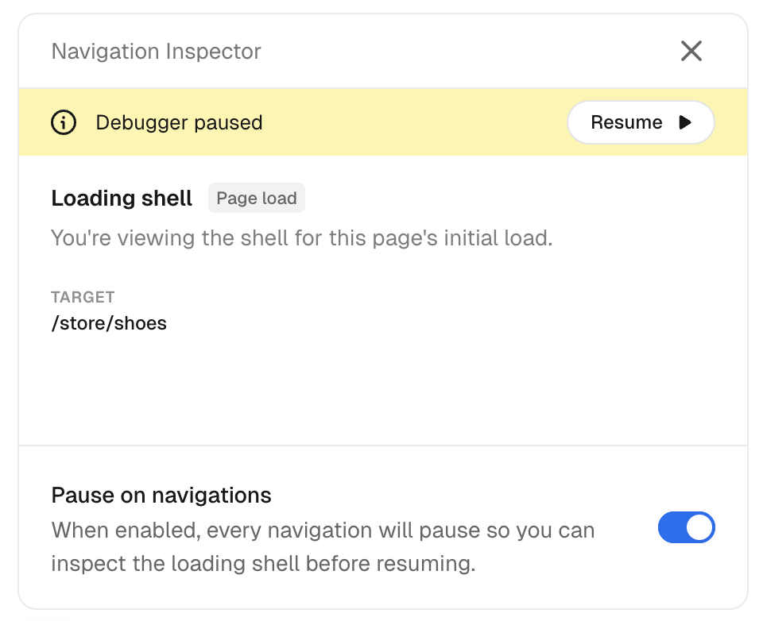
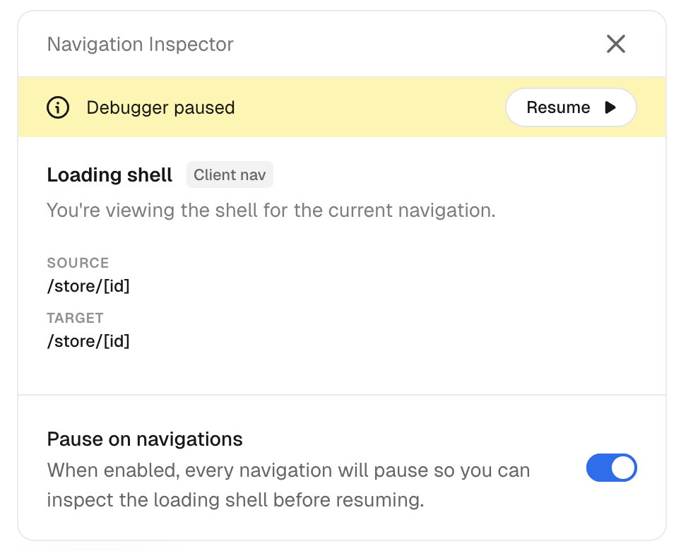
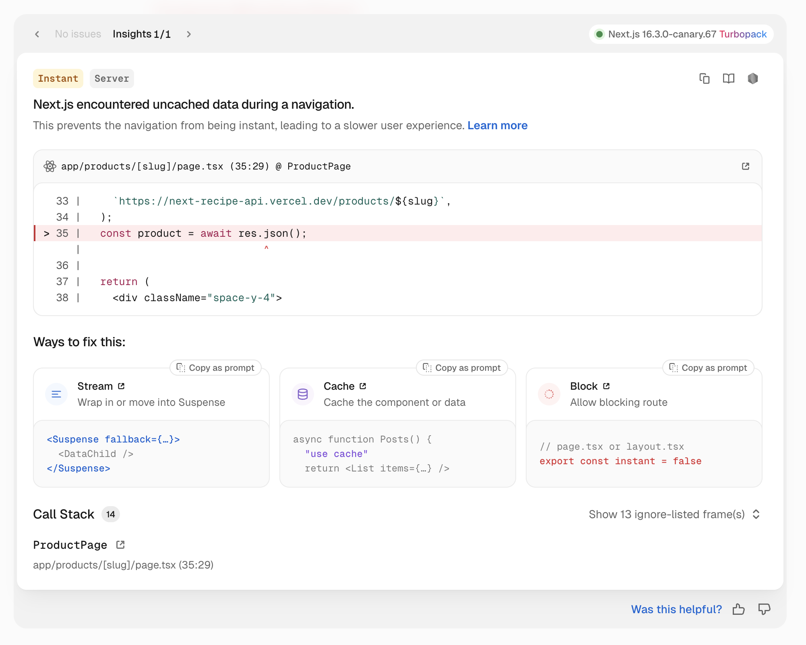
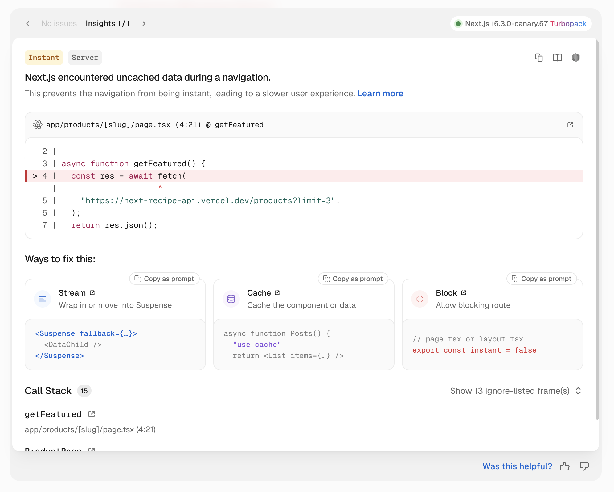

# Instant navigation

- 공식 문서: [Instant navigation](https://nextjs.org/docs/app/guides/instant-navigation)
- 상위 메뉴: [Guides](./README.md)
- 전체 목차: [Next.js 학습 문서](../README.md)

## 학습 목표

- “즉시” 내비게이션의 기준과 direct visit·client navigation의 차이를 설명한다.
- 캐시 지시어와 `<Suspense>`로 즉시 보이는 셸을 구성한다.
- 개발 검증, Navigation Inspector, E2E 테스트로 회귀를 방지한다.

## 핵심 개념 및 설명

### “즉시”의 의미

사용자가 클릭하는 순간 브라우저가 새 페이지 렌더링을 시작하고 정적·캐시·fallback 콘텐츠를 바로 보여주며, 나머지를 서버가 fallback 안으로 스트리밍하면 내비게이션이 “즉시”라고 본다.

> **알아두면 좋은 점**: 이 정의는 warm cache를 전제로 한다. cold cache에서는 서버가 캐시 결과를 한 번 계산해야 하므로 첫 내비게이션은 기다릴 수 있다.

direct visit은 문서 root부터 전체 트리를 렌더링해 보통 CDN의 static shell HTML을 받는다. client navigation은 현재·목적지 라우트가 공유하는 layout 아래만 다시 렌더링한다. 공유 layout 위의 `<Suspense>`는 전환 범위 밖이라 fallback으로 사용할 수 없다. `useSearchParams()`도 서버 렌더링에서는 빌드 시 값을 몰라 suspend하지만 client navigation에서는 router가 이미 URL을 알아 동기적으로 해석될 수 있다.

`prefetch={true}`는 URL별 데이터를 미리 해석하지만 App Shell 없이 막히는 라우트를 고칠 수는 없다. 먼저 셸을 즉시 만들고 [Optimizing prefetching](./optimizing-prefetching.md)을 적용한다.

### 도구: static shell 만들기

Cache Components와 Partial Prefetching을 켠다. `'use cache'`와 변형 지시어는 async 함수 결과에 수명을 부여해 static shell에 포함할 수 있게 한다. 캐시되지 않은 데이터나 `cookies()`·`headers()` 같은 runtime API는 `<Suspense>` fallback 뒤에서 스트리밍한다.

> **알아두면 좋은 점**: `"use cache: private"`는 runtime API를 읽는 함수 결과를 서버가 아니라 브라우저에만 캐시하므로 static shell에는 들어갈 수 없다. prefetch와 함께 쓰는 법은 [Optimizing prefetching](./optimizing-prefetching.md#use-cache-private)을 참고한다.

> **알아두면 좋은 점**: fallback 자체가 cookie, header, 전체 URL을 읽으면 빌드 시 suspend하므로 더 위의 `<Suspense>`가 필요하다. `prefetch={true}` 링크에서는 URL 데이터가 미리 준비되어 fallback이 prefetched UI에 포함될 수 있다.

기본 `<Link>`는 라우트의 App Shell을 공유한다. URL별 캐시 콘텐츠까지 준비하려면 `prefetch={true}`를 선택적으로 사용한다.

### 즉시 내비게이션 검증

개발 검증은 정적 셸을 막는 읽기를 찾아 캐시, 스트리밍, 검증 제외 중 선택하도록 안내한다. 라우트별 `instant` 설정으로 기본 검증 강도를 정할 수 있으며, CI에서는 프로덕션과 가까운 빌드와 E2E 테스트를 사용한다.

검증 오류는 uncached fetch나 runtime API가 `<Suspense>` 밖에 있는 위치를 보여준다. slug에 의존하는 데이터는 하위 컴포넌트로 옮겨 `<Suspense>`로 감싸고, 라우트와 무관하며 수명이 있는 데이터는 `'use cache'`를 사용한다.

```tsx filename="app/products/[slug]/page.tsx"
export default async function ProductPage(props: PageProps<'/products/[slug]'>) {
  const featured = await getFeatured()
  return (
    <>
      <FeaturedSection items={featured} />
      <Suspense fallback={<p>Loading product...</p>}>
        <ProductInfo params={props.params} />
      </Suspense>
    </>
  )
}

async function getFeatured() {
  'use cache'
  return fetch('https://example.com/products?limit=3').then((r) => r.json())
}
```

### Navigation Inspector로 loading state 보기

DevTools의 Navigation Inspector에서 **Pause on navigations**를 켜면 셸이 준비된 시점에 멈춰 즉시 보이는 UI를 확인할 수 있다.



페이지를 새로고침하면 direct visit의 fallback을 확인한다. cold cache에서는 캐시 콘텐츠도 아직 준비되지 않을 수 있다.



형제 라우트 사이에서는 공유 layout 아래만 바뀌므로 direct visit과 다른 셸이 보일 수 있다.

> **알아두면 좋은 점**: 페이지 로드와 client navigation은 다른 셸을 만들 수 있다. `useSearchParams` 같은 훅은 페이지 로드에서는 suspend하지만 client navigation에서는 동기적으로 해석될 수 있다.

### E2E 테스트로 회귀 방지

구조 검증은 셸 존재를 알려주지만 올바른 콘텐츠가 셸에 있는지는 보장하지 않는다. `@next/playwright`의 `instant()` 범위에서 내비게이션을 멈추고 사용자가 즉시 보는 요소와 fallback을 assertion한 뒤 재개한다.

> **알아두면 좋은 점**: `instant()` 범위 시작은 Inspector의 **Pause on navigations**, 범위 종료는 **Resume**과 같은 역할을 한다.

### 막히는 내비게이션 고치기

검증 overlay는 slug 기반 uncached 접근을 먼저 표시한다.



slug에 의존하는 작업을 `<Suspense>` 아래로 옮기면 검증은 다음 blocker로 진행한다. 라우트와 무관한 featured fetch에는 수명을 부여한다.



서버리스 배포에서 프로세스 메모리의 `'use cache'` 결과는 인스턴스 사이에 유지되지 않을 수 있다. 지속 캐시가 필요하면 `"use cache: remote"`를 고려한다.

### AI workflow와 loading state 반복 개선

구조 변경 전후를 실행 중인 앱에서 확인하고, shell snapshot과 pending Suspense boundary를 비교한다. fallback은 단순 spinner보다 최종 레이아웃을 반영해야 layout shift가 적다. 검증·snapshot·E2E를 반복해 의도한 초기 UI를 고정한다.

### 검증 제외

모든 페이지가 즉시여야 하는 것은 아니다. 구조 변경 가치가 낮으면 page나 layout에 `export const instant = false`를 설정해 해당 세그먼트 진입의 검증 피드백을 끈다. 실제 동작을 강제로 느리게 만드는 설정은 아니며 하위 형제 세그먼트 사이의 검증은 계속된다. 알려진 수명이 있는 세션 콘텐츠라면 제외하기 전에 `"use cache: private"`로 App Shell에 준비할 수 있는지 검토한다.

## 예제 및 데모 설계

- Phase 2에서 uncached 상품 페이지를 만들고 `<Suspense>`와 `'use cache'`를 단계적으로 적용한다.
- direct visit과 형제 client navigation의 초기 UI를 Navigation Inspector로 비교한다.
- E2E에서 즉시 보일 콘텐츠와 스트리밍 fallback을 각각 assertion한다.

## 연습 문제

1. 공유 layout 위의 Suspense fallback이 형제 client navigation에서 쓰이지 않는 이유는?
   - A. 재렌더링 범위 밖이기 때문
   - B. Suspense는 서버에서만 동작하기 때문
   - C. prefetch가 항상 꺼지기 때문

   <details><summary>정답 보기</summary>A. 형제 이동은 공유 layout 아래만 다시 렌더링한다.</details>

2. slug별 uncached fetch에 적합한 첫 해결은?
   - A. root layout 전체를 캐시
   - B. 하위 컴포넌트로 옮겨 Suspense로 감싸기
   - C. 모든 검증 비활성화

   <details><summary>정답 보기</summary>B. URL별 작업을 streaming boundary 아래로 옮겨 셸이 막히지 않게 한다.</details>

## 챕터 요약

- 즉시 내비게이션은 클릭 직후 셸을 렌더링하고 나머지를 스트리밍한다.
- direct visit과 client navigation은 렌더링 범위가 달라 초기 UI도 다를 수 있다.
- 캐시 지시어는 수명 있는 결과를 셸에 넣고 Suspense는 uncached 작업을 격리한다.
- Inspector와 E2E 테스트로 실제 사용자가 즉시 보는 콘텐츠를 검증한다.
- 구조 변경 가치가 없을 때만 세그먼트별 검증을 명시적으로 제외한다.
