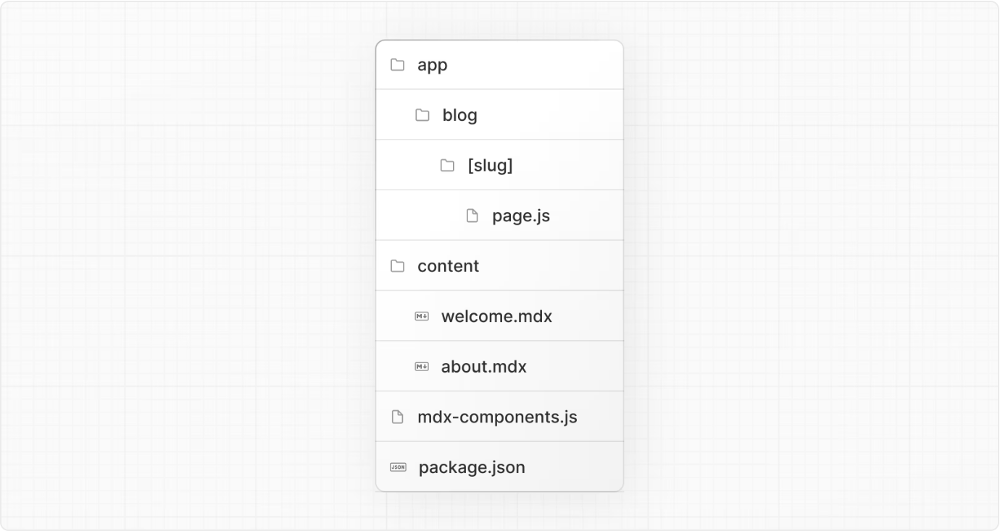

# MDX

- 공식 문서: [MDX](https://nextjs.org/docs/app/guides/mdx)
- 상위 메뉴: [Guides](./README.md)
- 전체 목차: [Next.js 학습 문서](../README.md)

## 학습 목표

- Markdown과 MDX의 차이와 Next.js의 변환 흐름을 설명할 수 있다.
- `@next/mdx`, `mdx-components.tsx`, `pageExtensions`를 설정할 수 있다.
- 파일 기반 라우팅, 정적 import, 다이나믹 import 중 콘텐츠 구조에 맞는 방식을 선택할 수 있다.
- 전역·지역 컴포넌트, layout, frontmatter 대안, remark/rehype plugin의 제약을 설명할 수 있다.

## 핵심 개념 및 설명

Markdown은 일반 텍스트 문법을 구조적으로 올바른 HTML로 변환하는 가벼운 markup 언어다. MDX는 Markdown의 상위 집합으로, Markdown 파일 안에 JSX를 직접 작성해 React 컴포넌트와 다이나믹 상호작용을 넣을 수 있다.

Next.js는 애플리케이션 안의 로컬 MDX와 서버에서 동적으로 가져온 원격 MDX를 지원할 수 있다. Next.js plugin은 Markdown과 React 컴포넌트를 HTML로 변환하며, App Router의 기본인 Server Component에서도 사용할 수 있다.

> **알아두면 좋은 점**: 완전한 동작 예시는 공식 Portfolio Starter Kit template에서 확인할 수 있다.

### 의존성 설치

`@next/mdx`와 관련 패키지를 설치하면 `/pages` 또는 `/app` 안의 `.md`, `.mdx` 파일을 page로 처리하거나 다른 파일에서 가져올 수 있다.

```bash
pnpm add @next/mdx @mdx-js/loader @mdx-js/react @types/mdx
```

### `next.config.mjs` 설정

프로젝트 root의 설정 파일에서 Markdown과 MDX 확장자를 page로 인식시키고 MDX 설정을 결합한다.

```js
import createMDX from '@next/mdx'

/** @type {import('next').NextConfig} */
const nextConfig = {
  // Markdown과 MDX 파일도 page 확장자로 처리한다.
  pageExtensions: ['js', 'jsx', 'md', 'mdx', 'ts', 'tsx'],
}

const withMDX = createMDX({
  // 필요한 Markdown plugin을 이곳에 추가한다.
})

export default withMDX(nextConfig)
```

이 설정으로 `.mdx` 파일을 page, 라우트, import 대상으로 사용할 수 있다. `@next/mdx`는 기본적으로 `.mdx`만 컴파일한다. webpack에서 `.md`까지 처리하려면 `extension: /\.(md|mdx)$/`를 추가한다.

### `mdx-components.tsx` 추가

프로젝트 root에 [`mdx-components.tsx`](../3-api-reference/3.1-file-conventions/mdx-components.md) 또는 `.js` 파일을 만든다. `app`이나 `pages`와 같은 수준에 두며, `src`를 사용한다면 그 안에 둘 수 있다.

```tsx
import type { MDXComponents } from 'mdx/types'

const components: MDXComponents = {}

export function useMDXComponents(): MDXComponents {
  return components
}
```

> **알아두면 좋은 점**:
>
> - App Router에서 `@next/mdx`를 사용하려면 `mdx-components.tsx`가 필요하며, 없으면 작동하지 않는다.
> - 이 파일 convention과 사용자 정의 style·컴포넌트 사용법을 함께 확인한다.

### MDX 렌더링

#### 파일 기반 라우팅

`app/mdx-page/page.mdx`처럼 `/app` 안에 MDX page를 만들면 일반 page와 똑같이 라우팅하고 metadata를 사용할 수 있다. MDX 안에서 Markdown 문법과 React 컴포넌트 import를 함께 작성한다.

#### import 사용

MDX를 라우트 밖의 콘텐츠 디렉터리에 두고 page에서 컴포넌트처럼 가져올 수 있다.

```tsx
import Welcome from '@/markdown/welcome.mdx'

export default function Page() {
  return <Welcome />
}
```

#### 다이나믹 import 사용

파일 시스템 라우팅 대신 다이나믹 라우트 segment에서 별도 디렉터리의 MDX 컴포넌트를 가져올 수 있다.



```tsx
export default async function Page({
  params,
}: {
  params: Promise<{ slug: string }>
}) {
  const { slug } = await params
  const { default: Post } = await import(`@/content/${slug}.mdx`)

  return <Post />
}

export function generateStaticParams() {
  return [{ slug: 'welcome' }, { slug: 'about' }]
}

export const dynamicParams = false
```

[`generateStaticParams`](../3-api-reference/3.3-functions/generate-static-params.md)는 제공한 라우트를 prerender한다. `dynamicParams = false`이면 목록에 없는 라우트는 404를 반환한다.

> **알아두면 좋은 점**: import 경로에 `.mdx` 확장자를 명시해야 한다. `@/content` 같은 module path alias는 필수가 아니지만 경로를 단순하게 만든다.

### 사용자 정의 style과 컴포넌트

Markdown은 렌더링될 때 `h2`, `p`, `ul`, `li` 같은 네이티브 HTML 요소로 매핑된다. 이 요소에 대응하는 사용자 정의 컴포넌트를 제공해 전역, 지역, 공유 layout 단위로 style을 적용할 수 있다.

#### 전역 style과 컴포넌트

`mdx-components.tsx`에 등록한 매핑은 모든 MDX 파일에 적용된다. 예를 들어 `h1`을 별도 markup으로 바꾸거나 Markdown의 `img`를 `next/image`로 렌더링할 수 있다.

```tsx
import type { MDXComponents } from 'mdx/types'
import Image, { type ImageProps } from 'next/image'

const components = {
  h1: ({ children }) => (
    <h1 style={{ color: 'red', fontSize: '48px' }}>{children}</h1>
  ),
  img: (props) => (
    <Image
      sizes="100vw"
      style={{ width: '100%', height: 'auto' }}
      {...(props as ImageProps)}
    />
  ),
} satisfies MDXComponents

export function useMDXComponents(): MDXComponents {
  return components
}
```

#### 지역 style과 컴포넌트

가져온 MDX 컴포넌트에 `components` prop을 넘기면 전역 매핑과 병합되고 같은 키는 지역 설정이 덮어쓴다.

```tsx
import Welcome from '@/markdown/welcome.mdx'

const overrideComponents = {
  h1: ({ children }) => <h1 style={{ color: 'blue' }}>{children}</h1>,
}

export default function Page() {
  return <Welcome components={overrideComponents} />
}
```

#### 공유 layout

App Router의 `layout.tsx`로 여러 MDX page에 공통 구조와 style을 적용한다. Tailwind를 쓴다면 `@tailwindcss/typography` plugin의 `prose` class를 공유 layout에 적용해 Markdown 콘텐츠의 typography를 재사용할 수 있다.

### Frontmatter

Frontmatter는 page 정보를 담는 YAML과 비슷한 key/value 형식이다. `@next/mdx`는 기본적으로 frontmatter를 지원하지 않는다. 필요하면 `remark-frontmatter`, `remark-mdx-frontmatter`, `gray-matter` 같은 대안을 사용할 수 있다.

MDX도 JavaScript 컴포넌트처럼 값을 export할 수 있다. 콘텐츠 파일이 `metadata`를 export하면 page에서 함께 가져올 수 있다.

```tsx
import BlogPost, { metadata } from '@/content/blog-post.mdx'

export default function Page() {
  console.log('metadata: ', metadata)
  return <BlogPost />
}
```

여러 MDX의 metadata를 모아 블로그 index를 만들 때는 Node.js `fs`나 `globby`로 디렉터리를 읽을 수 있다.

> **알아두면 좋은 점**:
>
> - `fs`, `globby` 등은 서버에서만 사용할 수 있다.
> - 완전한 예시는 공식 Portfolio Starter Kit template에서 확인할 수 있다.

### remark와 rehype plugin

remark는 Markdown을 다루는 도구 생태계고 rehype는 HTML을 다룬다. `@next/mdx`의 `options.remarkPlugins`와 `options.rehypePlugins`에 plugin을 추가해 콘텐츠를 변환할 수 있다. 생태계가 ESM 전용이므로 설정 파일은 `next.config.mjs` 또는 `next.config.ts`를 사용한다.

Turbopack에서는 최신 `@next/mdx`를 사용하고 plugin 이름을 문자열로 지정한다. 옵션이 있으면 `[pluginName, serializableOptions]` 형태로 전달한다.

> **알아두면 좋은 점**: JavaScript 함수는 Rust로 전달할 수 없으므로 직렬화할 수 없는 옵션을 가진 remark·rehype plugin은 아직 Turbopack에서 사용할 수 없다.

### 심화: Markdown을 HTML로 바꾸는 과정

React는 Markdown을 직접 이해하지 못한다. `unified` pipeline에서 `remark-parse`가 Markdown AST로 변환하고, `remark-rehype`가 HTML AST로 바꾸며, `rehype-sanitize`가 입력을 정리하고, `rehype-stringify`가 HTML 문자열로 직렬화할 수 있다.

`@next/mdx`를 사용하면 이 작업을 직접 작성할 필요가 없다. 이 과정은 패키지가 내부적으로 무엇을 하는지 이해하기 위한 설명이다. remark와 rehype 생태계에는 문법 강조, heading 링크, 목차 생성 등의 plugin이 있다.

### Rust 기반 MDX 컴파일러 사용(실험적)

Next.js는 Rust로 작성된 새 MDX 컴파일러를 지원한다. 아직 실험적이며 프로덕션 사용을 권장하지 않는다. `withMDX`에 전달하는 Next.js 설정에서 `experimental.mdxRs`를 켠다.

```js
module.exports = withMDX({
  experimental: {
    mdxRs: true,
  },
})
```

객체를 전달하면 `jsxRuntime`, `jsxImportSource`, `providerImportSource`, `mdxType`을 설정할 수 있다. 더 알아볼 자료로 MDX, `@next/mdx`, remark, rehype, Markdoc 공식 문서가 있다.

## 예제 및 데모 설계

- Phase 2에서 파일 기반 MDX page, 정적 import page, `[slug]` 다이나믹 import page를 나란히 만든다.
- 전역 `h1`·`img` 매핑을 지역 컴포넌트가 덮어쓰는 결과와 공유 `prose` layout을 비교한다.
- metadata export로 블로그 index를 만들고 허용되지 않은 slug가 404를 반환하는지 확인한다.
- webpack과 Turbopack에서 remark plugin 옵션의 직렬화 제약을 비교한다.

## 연습 문제

1. App Router에서 `@next/mdx`를 사용하기 위해 필요한 파일은 무엇인가?

   - A. `mdx-components.tsx`
   - B. `middleware.ts`
   - C. `instrumentation.ts`

   <details><summary>정답 보기</summary>

   정답: A. root 또는 `src`의 `mdx-components.tsx`가 없으면 App Router의 `@next/mdx`가 작동하지 않는다.

   </details>

2. `@next/mdx`의 기본 동작에 관한 설명으로 맞는 것은 무엇인가?

   - A. YAML frontmatter를 기본 지원한다.
   - B. 기본적으로 `.mdx` 확장자를 컴파일한다.
   - C. 모든 다이나믹 slug를 자동으로 생성한다.

   <details><summary>정답 보기</summary>

   정답: B. `.md`까지 webpack으로 처리하려면 `extension` 설정을 추가해야 한다.

   </details>

3. Turbopack의 remark·rehype plugin 옵션에 필요한 성질은 무엇인가?

   - A. 직렬화할 수 있어야 한다.
   - B. 반드시 브라우저 전역 함수를 포함해야 한다.
   - C. CommonJS 함수만 사용할 수 있다.

   <details><summary>정답 보기</summary>

   정답: A. JavaScript 함수를 Rust로 전달할 수 없어 옵션은 직렬화 가능해야 한다.

   </details>

## 챕터 요약

- MDX는 Markdown 안에 JSX와 React 컴포넌트를 사용할 수 있게 한다.
- `@next/mdx`, `pageExtensions`, `mdx-components.tsx`가 App Router 설정의 핵심이다.
- MDX는 파일 라우트, 정적 import, 다이나믹 import 방식으로 렌더링할 수 있다.
- 컴포넌트 매핑은 전역·지역·공유 layout 단위로 style을 구성한다.
- frontmatter와 plugin은 별도 도구가 필요하며 Turbopack에는 직렬화 제약이 있다.
