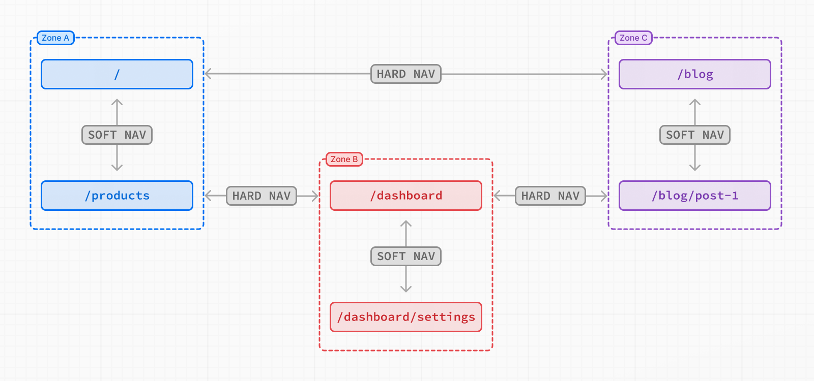

# Multi-zones

- 공식 문서: [Multi-zones](https://nextjs.org/docs/app/guides/multi-zones)
- 상위 메뉴: [Guides](./README.md)
- 전체 목차: [Next.js 학습 문서](../README.md)

## 학습 목표

- 하나의 도메인을 여러 zone으로 나누는 micro-frontend 구조를 설명한다.
- zone별 `assetPrefix`와 경로·정적 자산 rewrite를 구성한다.
- 같은 zone의 soft navigation과 zone 사이 hard navigation을 구분한다.
- zone 간 링크, 공유 코드, Server Action origin을 안전하게 설정한다.

## 핵심 개념 및 설명

Multi-Zones는 하나의 도메인에 있는 큰 애플리케이션을 경로 집합별로 여러 Next.js 앱에 나누는 micro-frontend 방식이다. 서로 관련이 적은 페이지를 별도 zone으로 옮기면 각 앱 크기와 빌드 시간을 줄이고 해당 zone에만 필요한 코드를 분리할 수 있다. 분리된 앱은 서로 다른 프레임워크를 선택할 수도 있다.

예를 들어 `/blog/*`, `/dashboard/*`, 나머지 `/*`를 세 앱에 나누어 같은 도메인에서 제공하되 각각 독립적으로 개발·배포할 수 있다.



같은 zone 안의 `/`에서 `/products`로 이동하면 문서를 reload하지 않는 soft navigation을 수행한다. `/`에서 다른 zone의 `/dashboard`로 이동하면 현재 자원을 내리고 새 앱 자원을 받는 hard navigation이 일어난다. 함께 자주 방문하는 페이지는 같은 zone에 두어 hard navigation을 줄인다.

### zone 정의하기

zone은 일반 Next.js 앱이며 다른 zone의 페이지·정적 파일과 충돌하지 않도록 [`assetPrefix`](../3-api-reference/3.5-config/3.5.1-next-config-js/assetPrefix.md)를 설정한다.

```js filename="next.config.js"
/** @type {import('next').NextConfig} */
const nextConfig = {
  assetPrefix: '/blog-static',
}
```

JavaScript와 CSS 같은 Next.js 자산은 `/blog-static/_next/...` 아래에서 제공된다. 다른 구체적인 zone이 처리하지 않는 모든 경로를 맡는 기본 앱에는 `assetPrefix`가 필요하지 않다.

Next.js 15보다 오래된 버전에서는 정적 자산용 rewrite가 추가로 필요할 수 있다. Next.js 15부터는 필요하지 않다.

```js filename="next.config.js"
const nextConfig = {
  assetPrefix: '/blog-static',
  async rewrites() {
    return {
      beforeFiles: [{
        source: '/blog-static/_next/:path+',
        destination: '/_next/:path+',
      }],
    }
  },
}
```

### 요청을 올바른 zone으로 라우팅하기

각 앱이 다른 경로를 제공하므로 HTTP proxy에서 요청을 올바른 zone으로 보내야 한다. 한 Next.js 앱이 전체 도메인의 router 역할을 할 수도 있다. 다른 zone이 맡은 페이지 경로와 그 zone의 정적 자산 경로를 [`rewrites`](../3-api-reference/3.5-config/3.5.1-next-config-js/rewrites.md)로 목적지 도메인에 전달한다.

```js filename="next.config.js"
async rewrites() {
  return [
    { source: '/blog', destination: `${process.env.BLOG_DOMAIN}/blog` },
    { source: '/blog/:path+', destination: `${process.env.BLOG_DOMAIN}/blog/:path+` },
    { source: '/blog-static/:path+', destination: `${process.env.BLOG_DOMAIN}/blog-static/:path+` },
  ]
}
```

`destination`에는 scheme과 도메인을 포함한 zone URL을 넣는다. 운영에서는 zone의 운영 도메인을, 로컬 개발에서는 `localhost`를 사용할 수 있다.

> **알아두면 좋은 점**: URL 경로는 하나의 zone에만 속해야 한다. 두 zone이 `/blog`를 제공하면 라우팅 충돌이 발생한다.

#### `proxy`로 요청 라우팅하기

요청 지연을 줄이려면 정적인 라우팅에 `rewrites`를 권장한다. 마이그레이션 중 feature flag처럼 요청마다 다이나믹 결정을 해야 하면 `proxy`를 사용할 수 있다.

```js filename="proxy.js"
export async function proxy(request) {
  const { pathname, search } = request.nextUrl
  if (pathname === '/your-path' && myFeatureFlag.isEnabled()) {
    return NextResponse.rewrite(`${rewriteDomain}${pathname}${search}`)
  }
}
```

### zone 사이 링크

다른 zone의 경로에는 Next.js [`<Link>`](../3-api-reference/3.2-components/link.md) 대신 `<a>`를 사용한다. `<Link>`는 상대 경로를 prefetch하고 soft navigation하려 하지만 zone 경계를 넘을 수 없다.

### 코드 공유

zone 앱은 서로 다른 저장소에 둘 수 있다. monorepo에 함께 두면 코드를 공유하기 편하고, 저장소가 다르면 공개·비공개 npm 패키지로 공유할 수 있다. 앱별 배포 시간이 다를 수 있으므로 feature flag로 여러 zone의 기능을 함께 켜고 끌 수 있다.

### Server Actions

사용자에게 보이는 한 도메인이 여러 앱을 제공하므로 Multi-Zones에서 [Server Action](../1-getting-started/mutating-data.md)을 사용할 때는 사용자-facing origin을 명시적으로 허용해야 한다.

```js filename="next.config.js"
const nextConfig = {
  experimental: {
    serverActions: {
      allowedOrigins: ['your-production-domain.com'],
    },
  },
}
```

자세한 설정은 [`serverActions.allowedOrigins`](../3-api-reference/3.5-config/3.5.1-next-config-js/serverActions.md)를 참고한다.

## 예제 및 데모 설계

- Phase 2에서 기본 앱, blog zone, dashboard zone을 하나의 도메인 경로처럼 연결한다.
- 같은 zone 안의 이동과 zone 사이 이동을 Network·Performance 패널의 문서 요청 여부로 비교한다.
- 각 zone의 `_next` 자산이 `assetPrefix`로 충돌 없이 전달되는지 확인한다.
- feature flag 기반 `proxy` 라우팅과 `serverActions.allowedOrigins` 누락 오류를 재현한다.

## 연습 문제

1. 함께 자주 방문하는 두 페이지를 같은 zone에 두는 이유는 무엇인가?

   - A. zone 사이 hard navigation을 줄이기 위해서다.
   - B. 모든 JavaScript를 하나의 번들로 만들기 위해서다.
   - C. `assetPrefix`를 제거하기 위해서다.

   <details><summary>정답 보기</summary>

   정답: A. zone 경계를 넘으면 현재 앱 자원을 내리고 새 앱을 불러오는 hard navigation이 발생한다.

   </details>

2. 다이나믹한 feature flag에 따라 zone을 고를 때 적합한 것은 무엇인가?

   - A. `proxy`
   - B. `<Link>`의 `prefetch`
   - C. `generateStaticParams`

   <details><summary>정답 보기</summary>

   정답: A. 정적 경로는 `rewrites`가 권장되지만 요청별 다이나믹 결정에는 `proxy`를 사용할 수 있다.

   </details>

3. 다른 zone으로 이동하는 링크에 사용할 요소는 무엇인가?

   - A. 상대 경로의 `<Link>`
   - B. `<a>`
   - C. `<form>`만 사용

   <details><summary>정답 보기</summary>

   정답: B. `<Link>`의 prefetch와 soft navigation은 zone 경계를 넘을 수 없다.

   </details>

## 챕터 요약

- Multi-Zones는 한 도메인의 경로를 여러 독립 앱으로 나누는 micro-frontend 방식이다.
- zone별 `assetPrefix`가 JavaScript와 CSS 자산 충돌을 막는다.
- 정적 경로 전달은 `rewrites`, 요청별 다이나믹 결정은 `proxy`를 사용할 수 있다.
- 같은 zone은 soft navigation, 다른 zone은 hard navigation을 수행한다.
- zone 간 링크는 `<a>`를 쓰고 Server Action의 사용자-facing origin을 허용한다.
