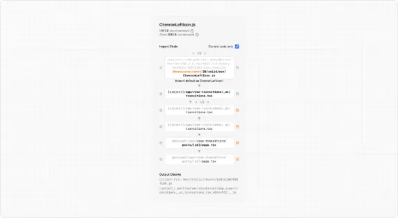

# Package Bundling

- 공식 문서: [Package Bundling](https://nextjs.org/docs/app/guides/package-bundling)
- 상위 메뉴: [Guides](./README.md)
- 전체 목차: [Next.js 학습 문서](../README.md)

## 학습 목표

- Turbopack Bundle Analyzer와 `@next/bundle-analyzer`(Webpack) 두 도구로 번들을 분석하는 방법을 구분해 설명할 수 있다.
- import chain을 추적해 번들에 포함된 큰 모듈의 위치를 찾을 수 있다.
- `optimizePackageImports`로 export가 많은 패키지의 import를 최적화할 수 있다.
- 무거운 렌더링 작업을 Client Component에서 Server Component로 옮겨 클라이언트 번들 크기를 줄일 수 있다.
- `serverExternalPackages`로 특정 패키지를 서버 번들링에서 제외할 수 있다.

## 핵심 개념 및 설명

번들링은 애플리케이션 코드와 그 의존성을 클라이언트·서버용 최적화된 출력 파일로 합치는 과정이다. 번들이 작을수록 더 빠르게 로드되고, JavaScript 실행 시간이 줄어들며, [Core Web Vitals](https://web.dev/vitals/)가 개선되고, 서버 콜드 스타트 시간도 줄어든다.

Next.js는 코드 분할, tree-shaking 등의 기법으로 번들을 자동으로 최적화한다. 다만 번들을 수동으로 최적화해야 하는 경우도 있다.

애플리케이션의 번들을 분석하는 도구는 두 가지다.

- Turbopack용 Next.js Bundle Analyzer(실험적)
- Webpack용 `@next/bundle-analyzer` 플러그인

### Next.js Bundle Analyzer(실험적)

> v16.1 이상에서 사용할 수 있다. [전용 GitHub 디스커션](https://github.com/vercel/next.js/discussions/86731)에 피드백을 남길 수 있고, [turbopack-bundle-analyzer-demo.vercel.sh](https://turbopack-bundle-analyzer-demo.vercel.sh/)에서 데모를 볼 수 있다.

Next.js Bundle Analyzer는 Turbopack의 모듈 그래프와 통합되어 있다. 서버와 클라이언트 모듈을 정확한 import 추적으로 살펴볼 수 있어 큰 의존성을 찾기 쉽다. 인터랙티브 Bundle Analyzer 데모를 열어 모듈 그래프를 직접 살펴볼 수 있다.

#### Step 1: Turbopack Bundle Analyzer 실행하기

다음 명령을 실행하고 브라우저에서 인터랙티브 뷰를 연다.

```bash
npm run next experimental-analyze
# 또는 pnpm next experimental-analyze / yarn next experimental-analyze / bun next experimental-analyze
```

#### Step 2: 모듈 필터링과 조회

UI 안에서 라우트, 환경(client 또는 server), 타입(JavaScript, CSS, JSON)으로 필터링하거나 파일명으로 검색할 수 있다.

#### Step 3: import chain으로 모듈 추적하기

treemap은 각 모듈을 사각형으로 보여주며, 사각형의 넓이가 모듈의 크기를 나타낸다.

모듈을 클릭하면 크기, 전체 import chain, 애플리케이션에서 실제로 사용되는 위치를 확인할 수 있다.



#### Step 4: 공유·비교용으로 결과를 디스크에 저장하기

동료와 분석 결과를 공유하거나 최적화 전후의 번들 크기를 비교하려면, 인터랙티브 뷰 대신 `--output` 플래그로 분석 결과를 정적 파일로 저장할 수 있다.

```bash
npm run next experimental-analyze -- --output
# 또는 pnpm next experimental-analyze --output / yarn next experimental-analyze --output / bun next experimental-analyze --output
```

이 명령은 결과를 `.next/diagnostics/analyze`에 기록한다. 이 디렉토리를 다른 곳에 복사해 결과를 비교할 수 있다.

```bash
cp -r .next/diagnostics/analyze ./analyze-before-refactor
```

> Bundle Analyzer의 더 많은 옵션은 [next CLI](../3-api-reference/3.6-cli/next.md) 레퍼런스 문서에서 전체 목록을 확인한다.

### Webpack용 `@next/bundle-analyzer`

[`@next/bundle-analyzer`](https://www.npmjs.com/package/@next/bundle-analyzer)는 애플리케이션 번들의 크기를 관리하는 데 도움을 주는 플러그인이다. 각 패키지와 그 의존성의 크기를 시각적 리포트로 생성한다. 이 정보를 활용해 큰 의존성을 제거하거나, 코드를 분할하거나, lazy-load할 수 있다.

#### Step 1: 설치

다음 명령으로 플러그인을 설치한다.

```bash
npm install @next/bundle-analyzer
# 또는 pnpm add @next/bundle-analyzer / yarn add @next/bundle-analyzer / bun add @next/bundle-analyzer
```

그다음 `next.config.js`에 bundle analyzer 설정을 추가한다.

```js
// next.config.js
/** @type {import('next').NextConfig} */
const nextConfig = {}

const withBundleAnalyzer = require('@next/bundle-analyzer')({
  enabled: process.env.ANALYZE === 'true',
})

module.exports = withBundleAnalyzer(nextConfig)
```

#### Step 2: 리포트 생성하기

다음 명령으로 번들을 분석한다.

```bash
ANALYZE=true npm run build
# 또는 ANALYZE=true yarn build
# 또는 ANALYZE=true pnpm build
```

리포트는 브라우저에 새 탭 세 개를 열어 보여주며, 이를 살펴볼 수 있다.

### 큰 번들 최적화하기

큰 모듈을 찾았다면, 해결 방법은 사용 사례에 따라 다르다. 흔한 원인과 해결 방법은 다음과 같다.

#### export가 많은 패키지

아이콘 라이브러리나 유틸리티 라이브러리처럼 수백 개의 모듈을 export하는 패키지를 사용한다면, `next.config.js`의 `optimizePackageImports` 옵션으로 import가 처리되는 방식을 최적화할 수 있다. 이 옵션은 실제로 사용하는 모듈만 불러오면서도, named export가 많은 import 문을 그대로 편하게 쓸 수 있게 해준다.

```js
// next.config.js
/** @type {import('next').NextConfig} */
const nextConfig = {
  experimental: {
    optimizePackageImports: ['icon-library'],
  },
}

module.exports = nextConfig
```

> **알아두면 좋은 점**: Next.js는 일부 라이브러리를 자동으로 최적화하므로, 그런 라이브러리는 `optimizePackageImports` 목록에 넣지 않아도 된다. 지원되는 패키지의 [전체 목록](../3-api-reference/3.5-config/3.5.1-next-config-js/optimizePackageImports.md)을 참고한다.

#### 무거운 클라이언트 작업

큰 클라이언트 번들의 흔한 원인은 Client Component 안에서 비용이 큰 렌더링 작업을 하는 것이다. 데이터를 UI로 변환하는 것이 유일한 목적인 라이브러리(문법 강조, 차트 렌더링, 마크다운 파싱 등)에서 자주 나타난다.

그 작업이 브라우저 API나 사용자 상호작용을 필요로 하지 않는다면, Server Component에서 실행할 수 있다.

다음 예제에서는 prism 기반 하이라이터가 Client Component 안에서 실행된다. 최종 결과물은 `<code>` 블록 하나뿐이지만, 하이라이팅 라이브러리 전체가 클라이언트 JavaScript 번들에 포함된다.

```tsx
// app/blog/[slug]/page.tsx
'use client'

import Highlight from 'prism-react-renderer'
import theme from 'prism-react-renderer/themes/github'

export default function Page() {
  const code = `export function hello() {
    console.log("hi")
  }`

  return (
    <article>
      <h1>Blog Post Title</h1>

      {/* prism 패키지와 토큰화 로직이 클라이언트로 전송된다 */}
      <Highlight code={code} language="tsx" theme={theme}>
        {({ className, style, tokens, getLineProps, getTokenProps }) => (
          <pre className={className} style={style}>
            <code>
              {tokens.map((line, i) => (
                <div key={i} {...getLineProps({ line })}>
                  {line.map((token, key) => (
                    <span key={key} {...getTokenProps({ token })} />
                  ))}
                </div>
              ))}
            </code>
          </pre>
        )}
      </Highlight>
    </article>
  )
}
```

결과가 정적 HTML임에도 클라이언트가 하이라이팅 라이브러리를 내려받고 실행해야 하므로 번들 크기가 커진다.

대신 하이라이팅 로직을 Server Component로 옮기고 최종 HTML을 서버에서 렌더링한다. 클라이언트는 렌더링된 마크업만 받는다.

```tsx
// app/blog/[slug]/page.tsx
import { codeToHtml } from 'shiki'

export default async function Page() {
  const code = `export function hello() {
    console.log("hi")
  }`

  // Shiki 패키지는 서버에서 실행되며 클라이언트에는 절대 번들되지 않는다.
  const highlightedHtml = await codeToHtml(code, {
    lang: 'tsx',
    theme: 'github-dark',
  })

  return (
    <article>
      <h1>Blog Post Title</h1>

      {/* 클라이언트는 순수 마크업만 받는다 */}
      <pre>
        <code dangerouslySetInnerHTML={{ __html: highlightedHtml }} />
      </pre>
    </article>
  )
}
```

#### 특정 패키지를 번들링에서 제외하기

Server Component와 Route Handler 안에서 import된 패키지는 Next.js가 자동으로 번들링한다.

`next.config.js`의 `serverExternalPackages` 옵션으로 특정 패키지를 번들링에서 제외할 수 있다.

```js
// next.config.js
/** @type {import('next').NextConfig} */
const nextConfig = {
  serverExternalPackages: ['package-name'],
}

module.exports = nextConfig
```

애플리케이션을 프로덕션에 맞게 최적화하는 방법은 [Production](./production-checklist.md)에서 더 알아볼 수 있다.

## 예제 및 데모 설계

- Phase 2에서 아이콘 라이브러리를 named import로 여러 개 불러오는 페이지를 만들고, `optimizePackageImports` 적용 전후의 클라이언트 번들 크기를 Bundle Analyzer로 비교한다.
- 문법 강조 라이브러리를 Client Component에서 실행한 버전과 Server Component(`shiki`)로 옮긴 버전을 나란히 두고, 각 버전의 클라이언트 JavaScript 크기 차이를 보여준다.
- `next experimental-analyze`로 treemap을 열어 특정 모듈의 import chain을 클릭해 추적하는 과정을 화면으로 시연한다.
- 현재 Phase 1에서는 애플리케이션을 만들지 않고, 위 시나리오에서 비교할 코드 구성과 확인할 Bundle Analyzer 화면만 설계한다.

## 연습 문제

1. Turbopack Bundle Analyzer와 `@next/bundle-analyzer`의 차이로 올바른 것은?

   1. 전자는 Webpack 전용이고, 후자는 Turbopack 전용이다.
   2. 전자는 Turbopack 모듈 그래프와 통합된 실험적 기능이고, 후자는 Webpack용 플러그인이다.
   3. 두 도구는 동일한 패키지이며 이름만 다르다.
   4. `@next/bundle-analyzer`는 v16.1부터만 사용할 수 있다.

   <details><summary>정답 보기</summary>

   **정답: 2** — Next.js Bundle Analyzer는 v16.1 이상에서 Turbopack의 모듈 그래프와 통합된 실험적 기능이고, `@next/bundle-analyzer`는 Webpack 번들을 시각화하는 별도 플러그인이다.

   </details>

2. 아이콘 라이브러리처럼 export가 많은 패키지의 import를 최적화하려면 무엇을 설정해야 하는가?

   1. `serverExternalPackages`
   2. `optimizePackageImports`
   3. `experimental.turbopack`
   4. `@next/bundle-analyzer`의 `enabled` 옵션

   <details><summary>정답 보기</summary>

   **정답: 2** — `optimizePackageImports`는 실제로 사용하는 모듈만 불러오도록 import 처리 방식을 최적화하면서, named export가 많은 import 문의 편의성은 그대로 유지한다.

   </details>

3. 클라이언트 번들 크기를 줄이기 위한 방법으로 공식 문서가 제시하는 것을 모두 고르시오.

   1. 데이터를 UI로 변환하는 무거운 렌더링 작업을 Server Component로 옮긴다.
   2. `serverExternalPackages`로 특정 패키지를 서버 번들링에서 제외한다.
   3. 모든 Client Component를 Server Component로 강제 전환한다.
   4. `optimizePackageImports`로 export가 많은 패키지의 import를 최적화한다.

   <details><summary>정답 보기</summary>

   **정답: 1, 2, 4** — 브라우저 API나 사용자 상호작용이 필요 없는 렌더링 작업만 Server Component로 옮길 수 있으며, 모든 Client Component를 강제로 전환하는 것은 공식 문서의 권장 사항이 아니다.

   </details>

## 챕터 요약

- 번들 분석에는 Turbopack용 Next.js Bundle Analyzer(v16.1+, 실험적)와 Webpack용 `@next/bundle-analyzer` 두 도구를 쓸 수 있다.
- Bundle Analyzer의 treemap에서 모듈을 클릭하면 크기와 import chain, 실제 사용 위치를 확인할 수 있다.
- export가 많은 패키지는 `optimizePackageImports`로 실제 사용하는 모듈만 불러오도록 최적화한다.
- 데이터를 UI로 변환하기만 하는 무거운 렌더링 작업은 Client Component 대신 Server Component에서 실행해 클라이언트 번들에서 제외한다.
- `serverExternalPackages`로 특정 패키지를 서버 번들링에서 제외할 수 있다.
