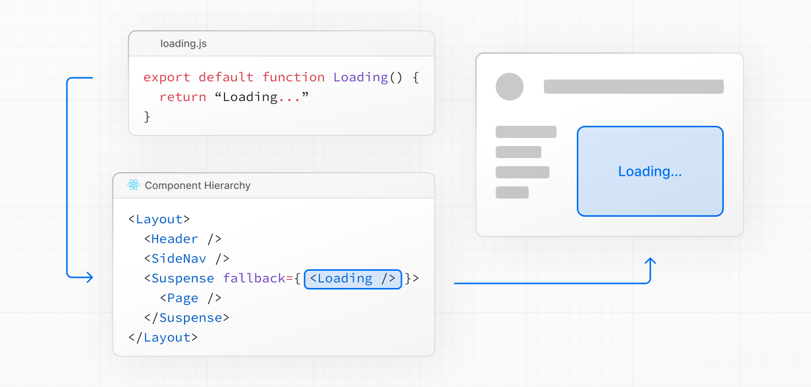

# Streaming

- 공식 문서: [Streaming](https://nextjs.org/docs/app/guides/streaming)
- 상위 메뉴: [Guides](./README.md)
- 전체 목차: [Next.js 학습 문서](../README.md)

## 학습 목표

- 전통적인 SSR과 스트리밍의 응답 시점 차이를 설명한다.
- HTML 스트림, RSC payload, `static shell`이 함께 페이지를 전달하는 방식을 구분한다.
- `loading.js`와 `<Suspense>`를 상황에 맞게 배치한다.
- Route Handler에서 Web Streams API로 원시 응답을 스트리밍한다.
- 스트리밍이 Web Vitals와 HTTP 상태 코드에 미치는 영향을 설명한다.
- 프록시·CDN·압축·클라이언트 버퍼링 문제를 진단한다.

## 핵심 개념 및 설명

### 스트리밍이란

전통적인 서버 렌더링은 전체 HTML 문서를 완성한 뒤 응답을 보낸다. 느린 데이터베이스 질의 하나가 페이지 전체를 막을 수 있다. 스트리밍은 응답을 준비된 조각부터 보내 브라우저가 서버의 나머지 렌더링과 동시에 HTML을 그리게 한다.

React 서버 렌더러는 `<Suspense>` 경계에 맞춘 HTML 조각을 만들고, Next.js App Router는 별도 설정 없이 이 흐름을 사용한다. 빠른 layout·내비게이션과 느린 개인화 데이터·추천을 함께 가진 페이지에서 특히 효과가 크다.

### 예제에서 확인할 개념

공식 스트리밍 데모는 `loading.tsx`의 페이지 수준 스트리밍, 형제 `<Suspense>`의 독립 해결, 선택적 hydration, Route Handler의 원시 HTML 스트리밍, 조각 크기에 따른 브라우저 버퍼링을 보여준다.

### App Router가 페이지를 전달하는 방식

#### HTML 스트림

layout, 내비게이션, `Suspense` fallback 같은 정적 부분을 먼저 보낸다. 비동기 Server Component가 완료되면 React는 완성 HTML과 인라인 스크립트를 보낸다. 스크립트는 fallback DOM을 실제 콘텐츠로 바꾸고 hydration용 컴포넌트 payload를 전달한다. 교체는 페이지 JavaScript 번들이 로드되거나 hydration이 끝나기 전에도 실행된다.

#### 컴포넌트 payload

RSC payload는 React가 페이지를 hydration하고 클라이언트 갱신을 처리하는 직렬화된 컴포넌트 트리다. 최초 로드에서는 HTML 스트림 안에 포함된다. **클라이언트 내비게이션에서는** `rsc: 1` 요청 헤더로 payload만 가져오며 HTML은 전송하지 않는다.

#### Static shell

비동기 작업이 끝나기 전에 렌더링되는 layout, 내비게이션, `Suspense` fallback을 `static shell`이라 한다. Cache Components를 사용하면 빌드 시점에 prerender되어 엣지에서 즉시 제공될 수 있다.


각 `<Suspense>`는 독립적인 스트리밍 지점이다. 서로 다른 경계의 컴포넌트는 완료 순서대로 나타나며 서로를 막지 않는다.

### `loading.js`를 사용한 페이지 수준 스트리밍

`page.js` 옆에 `loading.js`를 두면 Next.js가 페이지 콘텐츠를 자동으로 `<Suspense>`로 감싸고 loading 컴포넌트를 fallback으로 사용한다.


```tsx filename="app/dashboard/loading.tsx"
// app/dashboard/loading.tsx
export default function Loading() {
  return <div className="animate-pulse">Loading dashboard...</div>
}
```

내부적으로 `loading.js`는 `layout.js` 안에 중첩되고 `page.js`를 감싼다.



layout은 `static shell`로 즉시 렌더링되고 loading skeleton이 바로 보인다. 페이지가 완료되면 HTML이 skeleton을 교체한다. 데이터가 준비되기 전까지 의미 있는 내용을 전혀 표시할 수 없는 페이지에 적합하다.

### `<Suspense>`를 사용한 세밀한 스트리밍

#### 형제 경계의 병렬 스트리밍

여러 컴포넌트가 비동기 작업을 한다면 각각 별도 `<Suspense>`로 감싼다. 각 영역은 다른 영역을 기다리지 않고 완료되는 순서대로 스트리밍된다.

```tsx filename="app/dashboard/page.tsx"
import { Suspense } from 'react'

export default function Dashboard() {
  return (
    <main>
      <h1>Dashboard</h1>
      <Suspense fallback={<p>Loading revenue...</p>}><Revenue /></Suspense>
      <Suspense fallback={<p>Loading orders...</p>}><RecentOrders /></Suspense>
    </main>
  )
}
```

#### 점진적 세부 정보를 위한 중첩 경계

경계를 중첩하면 바깥의 상품 상세가 끝난 뒤 안쪽의 리뷰 fallback이 나타나는 식으로 단계적 공개를 만들 수 있다. 안쪽 경계는 바깥 경계가 해결돼 트리에 드러난 뒤부터 독립적으로 기다린다.

#### 다이나믹 접근을 아래로 내리기

`params`, `searchParams`, `cookies()`, `headers()`, 데이터 fetching은 실제로 필요한 컴포넌트까지 미룬다. layout이나 page 최상단에서 기다리면 그 아래 전체가 다이나믹이 되어 `static shell`로 prerender할 수 없다. Promise를 아래로 전달하고 소비 컴포넌트가 `<Suspense>` 안에서 해결하면 나머지 UI는 shell에 남는다. `.then()`을 경계 안에서 사용해 자식에는 Promise 대신 평범한 값을 전달할 수도 있다.

#### `loading.js`와 `<Suspense>` 선택

| 기준 | `loading.js` | `<Suspense>` |
| --- | --- | --- |
| 범위 | 페이지 전체 | 원하는 컴포넌트 |
| 설정 | 파일 하나를 배치 | 컴포넌트를 명시적으로 감쌈 |
| 내비게이션 | 즉시 fallback으로 사용하도록 prefetch됨 | 기본적으로 prefetch되지 않음 |
| 적합한 경우 | 데이터 전에는 아무 내용도 그릴 수 없는 페이지 | 세밀한 제어가 필요한 대부분의 페이지 |

다이나믹 접근 가까이에 명시적인 `<Suspense>`를 두는 편이 낫다. prerenderer가 다이나믹 작업을 만나면 위로 올라가 가장 가까운 경계를 찾는다. 경계가 없으면 빌드는 blocking route 오류로 실패한다. 트리 위쪽의 `loading.js`도 유효하지만 페이지 전체 skeleton으로 범위가 커진다.

#### 스트리밍 도중 오류 처리

스트리밍 시작 뒤 컴포넌트가 오류를 던지면 가장 가까운 `error.js` 경계가 해당 영역만 오류 UI로 바꾼다. 나머지 페이지는 유지된다. 첫 조각과 함께 `200 OK`가 이미 전송됐으므로 상태 코드를 `4xx`나 `5xx`로 바꿀 수는 없다.

### 클라이언트로 데이터 스트리밍

Server Component에서 요청을 시작하고 완료되지 않은 Promise를 Client Component의 prop으로 전달할 수 있다. Promise는 여러 계층을 지나도 되며 React `use`로 값을 읽는 컴포넌트만 `<Suspense>`로 감싸면 된다. 여러 컴포넌트가 같은 데이터가 필요하면 한 번 시작한 Promise를 Context Provider로 공유할 수 있다.

```tsx filename="app/dashboard/page.tsx"
// 서버에서 요청을 시작하지만 기다리지 않는다.
const statsPromise = getStats()
return (
  <Suspense fallback={<p>Loading chart...</p>}>
    <StatsChart dataPromise={statsPromise} />
  </Suspense>
)
```

### Route Handler에서 스트리밍

React UI 밖에서는 Web Streams API로 원시 응답을 스트리밍한다. Server-Sent Events, 큰 파일 생성, 점진적 데이터 전송에 사용할 수 있다.

```ts filename="app/api/stream/route.ts"
export async function GET() {
  const encoder = new TextEncoder()
  const stream = new ReadableStream({
    async start(controller) {
      for (let i = 0; i < 10; i++) {
        controller.enqueue(encoder.encode(`Chunk ${i + 1}\n`))
        await new Promise((resolve) => setTimeout(resolve, 200))
      }
      controller.close()
    },
  })
  return new Response(stream, {
    headers: { 'Content-Type': 'text/plain; charset=utf-8' },
  })
}
```

파일 전체를 메모리에 올리지 않고 `FileHandle.readableWebStream()`을 `Response`에 전달해 큰 파일도 스트리밍할 수 있다.

### 스트리밍과 Web Vitals

#### TTFB와 FCP

스트리밍이 없으면 TTFB가 가장 느린 질의를 기다린다. 스트리밍은 layout과 fallback이 준비되는 즉시 shell을 보내므로 TTFB를 줄이고 FCP를 데이터 fetching 시간과 분리한다.

#### LCP

hero 이미지나 주 제목 같은 LCP 후보는 느린 `Suspense` 밖이나 위에 둔다. `next/image`의 `preload`로 첫 조각의 `<head>`에 preload 링크를 넣으면 이미지 태그가 오기 전부터 가져올 수 있다.

#### CLS

Fallback과 실제 콘텐츠 크기가 다르면 교체 시 layout이 움직인다. 최종 콘텐츠와 같은 크기의 skeleton이나 고정·최소 높이 컨테이너로 공간을 예약한다.

#### INP

각 `<Suspense>`는 선택적 hydration 단위다. 전체 페이지를 한 번에 막아 hydration하지 않고 작은 작업으로 나누며, React는 사용자가 상호작용하는 영역을 우선할 수 있다.

#### 리소스 조기 발견

첫 HTML 조각에 CSS, JavaScript, 글꼴의 `<link>`와 `<script>`가 들어가 브라우저가 서버 렌더링과 동시에 리소스를 가져온다.

### HTTP 계약

스트리밍이 시작되면 응답 헤더와 상태 코드는 이미 전송됐다. 이후에는 바꿀 수 없다.

#### 상태 코드

`Suspense` fallback이 전송된 뒤 `notFound()`가 실행되면 404로 바꾸지 못하고 검색 엔진이 색인하지 않도록 `noindex` 메타 태그를 주입한다. 스트리밍 도중 `redirect()`는 HTTP 리다이렉트 헤더 대신 클라이언트 리다이렉트가 된다.

#### 스트리밍 시작 시점

Fallback이 렌더링되거나 컴포넌트가 `<Suspense>` 아래에서 중단될 때 본문 스트리밍이 시작된다. 실제 404가 필요하면 빠른 존재 확인과 `notFound()`를 첫 `Suspense`보다 앞에서 수행한다.

> **알아두면 좋은 점**: `proxy`나 `next.config.js`의 redirects도 페이지 렌더링 전에 요청을 거절하거나 전환할 수 있으므로 HTTP 상태 코드를 사용할 수 있다.

#### 봇과 크롤러

HTML만 읽는 봇은 첫 HTML의 `<head>`에 metadata가 필요하다. Next.js는 user agent로 이런 봇을 감지하고 `generateMetadata`가 끝날 때까지 페이지 스트리밍을 기다린다. 브라우저와 DOM을 처리하는 크롤러는 콘텐츠와 함께 스트리밍 metadata를 받을 수 있다. Cache Components 사용 시 HTML 제한 봇은 prerender된 shell 대신 요청 시점에 페이지를 렌더링하므로 shell의 데이터도 요청 환경에서 접근 가능해야 한다.

### 스트리밍에 영향을 주는 요소

#### Reverse proxy

Nginx 같은 프록시는 응답을 버퍼링할 수 있다. `X-Accel-Buffering: no` 헤더로 버퍼링을 끌 수 있다.

#### CDN

CDN이 전체 응답을 모은 뒤 전달할 수 있다. 제공자의 스트리밍 지원과 필요한 설정·요금제를 확인한다.

#### 서버리스 플랫폼

모든 서버리스 환경이 스트리밍을 지원하지는 않는다. AWS Lambda는 응답 스트리밍 모드를 명시적으로 켜야 하며 Vercel은 기본 지원한다.

#### 압축

Gzip과 Brotli는 충분한 데이터가 모일 때까지 조각을 버퍼링할 수 있다. 첫 표시가 늦다면 압축 계층의 flush 설정을 확인한다.

#### 클라이언트

Safari/WebKit은 1024바이트가 올 때까지 스트리밍 응답을 버퍼링한다. 실제 앱은 보통 이 크기를 넘지만 작은 데모에 영향을 준다. `curl`도 버퍼링할 수 있으며 `-N`으로 출력 버퍼링을 끄더라도 줄바꿈이 없는 조각은 멈춘 것처럼 보일 수 있다.

#### 스트리밍 검증

Chrome DevTools Network 탭에서 짧은 TTFB 뒤 긴 Content Download가 이어지는지 본다. 더 정확히 확인하려면 `response.body.getReader()`로 각 조각의 도착 시각을 기록한다.

> **알아두면 좋은 점**: `Accept-Encoding: identity`는 압축을 끄므로 압축 계층이 조각을 버퍼링하지 않게 한다.

#### 플랫폼 지원

| 배포 옵션 | 지원 |
| --- | --- |
| Node.js 서버 | 예 |
| Docker 컨테이너 | 예 |
| 정적 export | 아니요 |
| 어댑터 | 플랫폼별로 다름 |

### 핵심 판단 기준

비동기 작업, 비결정적 출력, 런타임 데이터가 스트리밍의 계기를 만든다. 프레임워크는 트리 위로 가장 가까운 `<Suspense>`를 찾고, 그 위의 내용을 `static shell`로 즉시 보낸다. 캐싱할 수 있는 것은 캐싱해 shell을 키우고, 다이나믹 접근은 필요한 컴포넌트까지 내린 뒤 가까운 경계로 감싼다.

## 예제 및 데모 설계

- **Phase 1 상태**: 구현 예정
- 200ms·1초·3초가 걸리는 형제 Server Component를 별도 경계에 두고 도착 순서를 시각화한다.
- `loading.tsx`의 전체 skeleton과 컴포넌트별 skeleton을 전환해 LCP·CLS·INP 차이를 비교한다.
- 프록시 버퍼링, 압축, `Accept-Encoding: identity`를 전환하고 Network 타이밍과 원시 조각 로그를 함께 보여준다.
- 스트리밍 전·후 `notFound()`를 실행해 실제 404와 `200 OK` + `noindex`의 차이를 확인한다.

## 연습 문제

1. 클라이언트 내비게이션에서 App Router가 가져오는 것은 무엇인가?
   - A. 완성된 HTML만
   - B. RSC payload만
   - C. CSS 파일만
   - D. 정적 export 파일

   <details><summary>정답 보기</summary>

   정답: B. 최초 로드는 HTML 스트림에 payload가 포함되지만 클라이언트 내비게이션은 payload만 요청한다.

   </details>

2. 실제 404 상태 코드를 보내려면 `notFound()`를 언제 실행해야 하는가?
   - A. 스트리밍이 모두 끝난 뒤
   - B. 첫 `Suspense`와 스트리밍 시작 전
   - C. hydration 뒤
   - D. 클라이언트 이벤트 안에서

   <details><summary>정답 보기</summary>

   정답: B. 첫 조각이 전송되면 상태 코드를 바꿀 수 없다.

   </details>

3. 스트리밍의 체감 성능을 개선하는 방법을 모두 고르시오.
   - A. LCP 요소를 느린 경계 밖에 둔다.
   - B. Skeleton 크기를 최종 콘텐츠와 맞춘다.
   - C. 다이나믹 접근을 최상위 layout에서 모두 기다린다.
   - D. 독립 작업을 형제 `Suspense`로 나눈다.

   <details><summary>정답 보기</summary>

   정답: A, B, D. 최상위에서 기다리면 `static shell`이 작아지고 하위 전체가 차단된다.

   </details>

## 챕터 요약

- 스트리밍은 준비된 응답 조각을 먼저 보내 브라우저가 점진적으로 그리게 한다.
- HTML 스트림과 RSC payload가 함께 최초 페이지를 만들고, `static shell`이 즉시 표시된다.
- `loading.js`는 페이지 수준, `<Suspense>`는 컴포넌트 수준 스트리밍에 적합하다.
- LCP 요소와 리소스는 shell에 두고 fallback 크기를 맞춰 Web Vitals를 보호한다.
- 스트리밍 시작 뒤에는 HTTP 상태와 헤더를 바꿀 수 없으며 모든 중간 계층의 버퍼링을 점검해야 한다.
