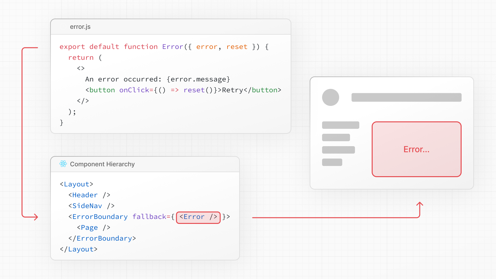

# error.js

- 공식 문서: [error.js](https://nextjs.org/docs/app/api-reference/file-conventions/error)
- 상위 메뉴: [File-system conventions](./README.md)
- 전체 목차: [Next.js 학습 문서](../../README.md)

## 학습 목표

- 라우트 세그먼트의 예상하지 못한 오류를 `error.js`로 격리한다.
- `error`, `retry`, `reset`의 계약과 production 정보 은닉을 이해한다.
- root 오류와 컴포넌트 수준 오류 복구 방법을 구분한다.

## 핵심 개념 및 설명

**오류** 파일을 사용하면 예상치 못한 런타임 오류를 처리하고 fallback UI를 표시할 수 있다.


```tsx filename="app/dashboard/error.tsx" switcher
'use client' // 오류 경계는 Client Component여야 한다.

import { useEffect } from 'react'

export default function Error({
  error,
  retry,
}: {
  error: Error & { digest?: string }
  retry: () => void
}) {
  useEffect(() => {
    // 오류 보고 서비스에 오류 기록
    console.error(error)
  }, [error])

  return (
    <div>
      <h2>Something went wrong!</h2>
      <button
        onClick={
          // 세그먼트를 다시 가져오고 다시 렌더링하여 복구를 시도한다.
          () => retry()
        }
      >
        Try again
      </button>
    </div>
  )
}
```

```jsx filename="app/dashboard/error.js" switcher
'use client' // 오류 경계는 Client Component여야 한다.

import { useEffect } from 'react'

export default function Error({ error, retry }) {
  useEffect(() => {
    // 오류 보고 서비스에 오류 기록
    console.error(error)
  }, [error])

  return (
    <div>
      <h2>Something went wrong!</h2>
      <button
        onClick={
          // 세그먼트를 다시 가져오고 다시 렌더링하여 복구를 시도한다.
          () => retry()
        }
      >
        Try again
      </button>
    </div>
  )
}
```

`error.js`는 [React Error Boundary](https://react.dev/reference/react/Component#catching-rendering-errors-with-an-error-boundary)에서 라우트 세그먼트와 중첩된 하위 항목을 래핑한다. 경계 내에서 오류가 발생하면 `error` 컴포넌트가 fallback UI로 표시된다.



> **알아두면 좋은 점**:
>
> - [React DevTools](https://react.dev/learn/react-developer-tools)를 사용하면 오류 경계를 전환하여 오류 상태를 테스트할 수 있다.
> - 오류가 상위 오류 경계까지 버블링되도록 하려면 `error` 컴포넌트를 렌더링할 때 `throw`를 사용할 수 있다.
> - [`error.js`](error.md)와 같은 라우트 세그먼트에 연결되지 않은 컴포넌트 수준 오류 복구의 경우 [`catchError`](../3.3-functions/catchError.md) 기능을 사용한다.

[컴포넌트 계층](../../1-getting-started/project-structure.md#component-hierarchy)에서 `error.js`는 `loading.js`,`not-found.js`,`page.js` 및 중첩된 `layout.js` 파일을 React 오류 경계로 래핑한다. 동일한 세그먼트에서 그 위에 있는 `layout.js` 또는 `template.js`를 래핑하지 **않는다**. 루트 레이아웃의 오류를 처리하려면 [`global-error.js`](error.md#global-error)를 사용한다.

<a id="reference"></a>
### 참조

<a id="props"></a>
#### prop

<a id="error"></a>
##### `error`

`error.js` Client Component에 전달된 [`Error`](https://developer.mozilla.org/docs/Web/JavaScript/Reference/Global_Objects/Error) 객체의 인스턴스이다.

> **알아두면 좋은 점**: 개발 중에 클라이언트에 전달된 `Error` 객체는 직렬화되고 더 쉬운 디버깅을 위해 원래 오류의 `message`를 포함한다. 그러나 오류에 포함된 잠재적으로 민감한 세부 정보가 클라이언트에 유출되는 것을 방지하기 위해 **이 동작은 프로덕션에서는 다르다**.

<a id="errormessage"></a>
##### `error.message`

- Client Component에서 전달된 오류에는 원래 `Error` 메시지가 표시된다.
- Server Component에서 전달된 오류에는 식별자가 포함된 일반 메시지가 표시된다. 이는 민감한 정보가 유출되는 것을 방지하기 위한 것이다.`errors.digest` 아래의 식별자를 사용하여 해당 서버 측 로그를 일치시킬 수 있다.

<a id="errordigest"></a>
##### `error.digest`

발생한 오류의 자동 생성된 해시이다. 서버 측 로그에서 해당 오류를 일치시키는 데 사용할 수 있다.

<a id="retry"></a>
##### `retry`

오류의 원인은 일시적일 수 있다. 이러한 경우 다시 시도하면 문제가 해결될 수도 있다.

오류 컴포넌트는 `retry()` 기능을 사용하여 사용자에게 오류 복구를 시도하라는 메시지를 표시할 수 있다. 실행되면 함수는 오류 경계의 하위 항목을 다시 가져오고 다시 렌더링하려고 시도한다. 성공하면 대체 오류 컴포넌트가 다시 렌더링된 결과로 대체된다.

```tsx filename="app/dashboard/error.tsx" switcher
'use client' // 오류 경계는 Client Component여야 한다.

export default function Error({
  error,
  retry,
}: {
  error: Error & { digest?: string }
  retry: () => void
}) {
  return (
    <div>
      <h2>Something went wrong!</h2>
      <button onClick={() => retry()}>Try again</button>
    </div>
  )
}
```

```jsx filename="app/dashboard/error.js" switcher
'use client' // 오류 경계는 Client Component여야 한다.

export default function Error({ error, retry }) {
  return (
    <div>
      <h2>Something went wrong!</h2>
      <button onClick={() => retry()}>Try again</button>
    </div>
  )
}
```

<a id="reset"></a>
##### `reset`

대부분의 경우 [`retry()`](#retry)를 대신 사용해야 한다. 그러나 오류 상태를 지우고 내용을 다시 가져오지 않고 오류 경계의 하위 항목을 다시 렌더링해야 하는 특별한 이유가 있는 경우 `reset()` 함수를 사용할 수 있다.

<a id="examples"></a>
### 예제

<a id="global-error"></a>
#### 전역 오류

흔하지는 않지만 [국제화](../../2-guides/internationalization.md)를 활용하는 경우에도 루트 앱 디렉터리에 있는 `global-error.jsx`를 사용하여 루트 레이아웃이나 템플릿의 오류를 처리할 수 있다. 전역 오류 UI는 자체 `<html>` 및 `<body>` 태그, 전역 스타일, 글꼴 또는 오류 페이지에 필요한 기타 종속성을 정의해야 한다. 이 파일은 활성화되면 루트 레이아웃이나 템플릿을 대체한다.

> **알아두면 좋은 점**: `global-error` 및 내장된 500페이지는 자체 문서를 렌더링하며 전역 스타일을 포함하지 **않는다**. 따라서 앱 수준 테마 토글(클래스 또는 `data-theme` 속성)이 도달하지 않는다. 기본 UI는 OS 색 구성표를 따릅니다. 앱 테마와 일치시키려면 자체 `global-error` 컴포넌트 내에 적용한다.

> **알아두면 좋은 점**: 오류 경계는 [Client Component](../../1-getting-started/server-and-client-components.md#using-client-components)여야 한다. 이는 [`metadata` 및 `generateMetadata`](../../1-getting-started/metadata-and-og-images.md) 내보내기가 `global-error.jsx`에서 지원되지 않음을 의미한다. 대안으로 React [`<title>`](https://react.dev/reference/react-dom/components/title) 컴포넌트를 사용할 수 있다.

```tsx filename="app/global-error.tsx" switcher
'use client' // 오류 경계는 Client Component여야 한다.

export default function GlobalError({
  error,
  retry,
}: {
  error: Error & { digest?: string }
  retry: () => void
}) {
  return (
    // 전역 오류에는 html 및 body 태그가 포함되어야 한다.
    <html>
      <body>
        <h2>Something went wrong!</h2>
        <button onClick={() => retry()}>Try again</button>
      </body>
    </html>
  )
}
```

```jsx filename="app/global-error.js" switcher
'use client' // 오류 경계는 Client Component여야 한다.

export default function GlobalError({ error, retry }) {
  return (
    // 전역 오류에는 html 및 body 태그가 포함되어야 한다.
    <html>
      <body>
        <h2>Something went wrong!</h2>
        <button onClick={() => retry()}>Try again</button>
      </body>
    </html>
  )
}
```

<a id="graceful-error-recovery-with-a-custom-error-boundary"></a>
#### 사용자 정의 오류 경계를 통한 정상적인 오류 복구

클라이언트에서 렌더링이 실패하면 더 나은 사용자 경험을 위해 마지막으로 알려진 서버 렌더링 UI를 표시하는 것이 유용할 수 있다.

`GracefullyDegradingErrorBoundary`는 오류가 발생하기 전에 현재 HTML을 캡처하고 보존하는 사용자 정의 오류 경계의 예이다. 렌더링 오류가 발생하면 캡처된 HTML을 다시 렌더링하고 지속적인 알림 표시줄을 표시하여 사용자에게 알립니다.

```tsx filename="app/dashboard/error.tsx" switcher
'use client'

import React, { Component, ErrorInfo, ReactNode } from 'react'

interface ErrorBoundaryProps {
  children: ReactNode
  onError?: (error: Error, errorInfo: ErrorInfo) => void
}

interface ErrorBoundaryState {
  hasError: boolean
}

export class GracefullyDegradingErrorBoundary extends Component<
  ErrorBoundaryProps,
  ErrorBoundaryState
> {
  private contentRef: React.RefObject<HTMLDivElement | null>

  constructor(props: ErrorBoundaryProps) {
    super(props)
    this.state = { hasError: false }
    this.contentRef = React.createRef()
  }

  static getDerivedStateFromError(_: Error): ErrorBoundaryState {
    return { hasError: true }
  }

  componentDidCatch(error: Error, errorInfo: ErrorInfo) {
    if (this.props.onError) {
      this.props.onError(error, errorInfo)
    }
  }

  render() {
    if (this.state.hasError) {
      // hydration 없이 현재 HTML 콘텐츠로
      return (
        <>
          <div
            ref={this.contentRef}
            suppressHydrationWarning
            dangerouslySetInnerHTML={{
              __html: this.contentRef.current?.innerHTML || '',
            }}
          />
          <div className="fixed bottom-0 left-0 right-0 bg-red-600 text-white py-4 px-6 text-center">
            <p className="font-semibold">
              An error occurred during page rendering
            </p>
          </div>
        </>
      )
    }

    return <div ref={this.contentRef}>{this.props.children}</div>
  }
}

export default GracefullyDegradingErrorBoundary
```

```jsx filename="app/dashboard/error.js" switcher
'use client'

import React, { Component, createRef } from 'react'

class GracefullyDegradingErrorBoundary extends Component {
  constructor(props) {
    super(props)
    this.state = { hasError: false }
    this.contentRef = createRef()
  }

  static getDerivedStateFromError(_) {
    return { hasError: true }
  }

  componentDidCatch(error, errorInfo) {
    if (this.props.onError) {
      this.props.onError(error, errorInfo)
    }
  }

  render() {
    if (this.state.hasError) {
      // hydration 없이 현재 HTML 콘텐츠로
      return (
        <>
          <div
            ref={this.contentRef}
            suppressHydrationWarning
            dangerouslySetInnerHTML={{
              __html: this.contentRef.current?.innerHTML || '',
            }}
          />
          <div className="fixed bottom-0 left-0 right-0 bg-red-600 text-white py-4 px-6 text-center">
            <p className="font-semibold">
              An error occurred during page rendering
            </p>
          </div>
        </>
      )
    }

    return <div ref={this.contentRef}>{this.props.children}</div>
  }
}

export default GracefullyDegradingErrorBoundary
```

<a id="version-history"></a>
### Version History

| 버전 | 변경 사항 |
| --------- | ------------------------------------------- |
| `v16.3.0` | `retry` prop이 안정화되었다. |
| `v16.2.0` | `unstable_retry` prop이 추가되었다. |
| `v15.2.0` | 또한 개발 중인 `global-error`도 표시한다. |
| `v13.1.0` | `global-error`가 출시되었다. |
| `v13.0.0` | `error`가 출시되었다. |

## 예제 및 데모 설계

- Phase 2에서 의도적으로 오류를 내고 `retry()`가 성공한 렌더링으로 교체하는 흐름을 만든다.
- Server Component 오류의 `digest`를 서버 로그와 UI에 각각 기록한다.
- `global-error.tsx`가 전역 스타일과 `<html>/<body>`를 직접 포함하는지 확인한다.

## 연습 문제

1. `error.js`에 필요한 지시어는?
   - A. `'use cache'`
   - B. `'use client'`
   - C. `'use server'`

<details><summary>정답 보기</summary>

정답: B. Error Boundary UI는 Client Component여야 한다.
</details>

2. `retry()`와 `reset()`의 차이는?
   - A. `retry()`는 다시 fetching·렌더링하고 `reset()`은 fetching 없이 상태를 지운다.
   - B. 둘은 완전히 같다.
   - C. `reset()`만 production에서 쓸 수 있다.

<details><summary>정답 보기</summary>

정답: A. 대부분의 경우 새 결과를 시도하는 `retry()`가 권장된다.
</details>

## 챕터 요약

- `error.js`는 세그먼트별 예상하지 못한 오류를 격리한다.
- Error Boundary는 Client Component여야 한다.
- 서버 오류 상세는 production에서 `digest`로 숨겨진다.
- 대부분의 복구에는 `retry()`를 사용한다.
- root 오류는 완전한 문서를 반환하는 `global-error.js`가 처리한다.
