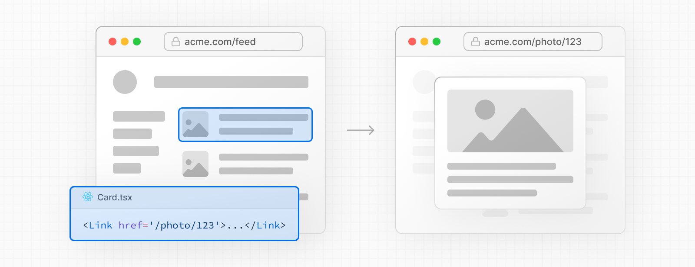
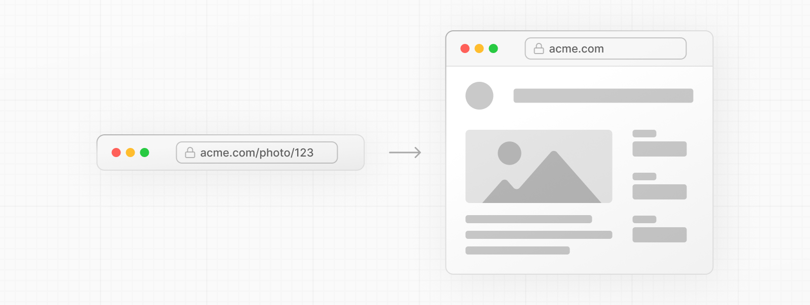
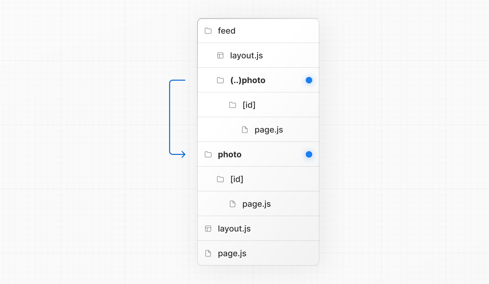
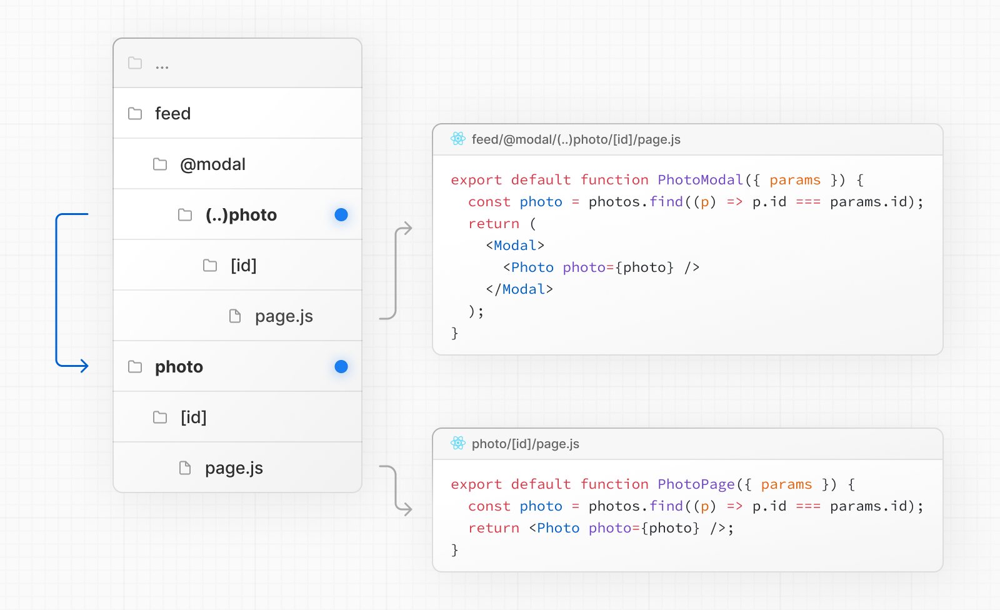

# Intercepting Routes

- 공식 문서: [Intercepting Routes](https://nextjs.org/docs/app/api-reference/file-conventions/intercepting-routes)
- 상위 메뉴: [File-system conventions](./README.md)
- 전체 목차: [Next.js 학습 문서](../../README.md)

## 학습 목표

- 다른 route 콘텐츠를 현재 layout 안에 표시하면서 URL 맥락을 유지한다.
- `(.)`, `(..)`, `(..)(..)`, `(...)` matcher를 route segment 기준으로 계산한다.
- Parallel Routes와 결합한 shareable modal 패턴을 이해한다.

## 핵심 개념 및 설명

경로를 가로채면 현재 레이아웃 내 애플리케이션의 다른 부분에서 경로를 로드할 수 있다. 이 라우팅 패러다임은 사용자가 다른 컨텍스트로 전환하지 않고도 경로의 내용을 표시하려는 경우 유용할 수 있다.

예를 들어, 피드에서 사진을 클릭하면 피드에 오버레이되어 사진을 모달로 표시할 수 있다. 이 경우 Next.js는 `/photo/123` 경로를 가로채서 URL을 마스크하고 `/feed` 위에 오버레이한다.

그러나 공유 가능한 URL을 클릭하거나 페이지를 새로 고쳐 사진으로 이동하면 모달 대신 전체 사진 페이지가 렌더링되어야 한다. 라우트 가로채기가 발생해서는 안 된다.

### 규칙

라우트 가로채기는 `(..)` 규칙으로 정의할 수 있다. 이는 상대 경로 규칙 `../`와 유사하지만 라우트 세그먼트에 대한 것이다.

다음을 사용할 수 있다.

- **동일 레벨**의 세그먼트를 일치시키는 `(.)`
- **한 레벨 위** 세그먼트와 일치하는 `(..)`
- 세그먼트 **두 레벨 이상**과 일치하는 `(..)(..)`
- **루트**`app` 디렉터리의 세그먼트와 일치하는 `(...)`

예를 들어, `(..)photo` 디렉터리를 생성하여 `feed` 세그먼트 내에서 `photo` 세그먼트를 가로챌 수 있다.

> **알아두면 좋은 점**: `(..)` 규칙은 파일 시스템이 아닌 _라우트 세그먼트_를 기반으로 한다. 예를 들어, [병렬 라우트](parallel-routes.md)의 `@slot` 폴더는 고려하지 않는다.

### 예제

#### 모달

차단 경로는 [병렬 라우트](parallel-routes.md)와 함께 사용하여 모달을 생성할 수 있다. 이를 통해 다음과 같은 모달을 구축할 때 일반적인 문제를 해결할 수 있다.

- URL로 모달 콘텐츠를 공유할 수 있게 한다.
- 페이지를 새로 고쳐도 컨텍스트를 유지한다.
- 뒤로 이동하면 모달을 닫는다.
- 앞으로 이동하면 모달을 다시 연다.

사용자가 클라이언트 측 탐색을 사용하여 갤러리에서 사진 모달을 열거나 공유 가능한 URL에서 직접 사진 페이지로 이동할 수 있는 다음 UI 패턴을 고려한다.

위의 예에서 `@modal`은 세그먼트가 **아닌** 슬롯이므로 `photo` 세그먼트에 대한 경로는 `(..)` 일치자를 사용할 수 있다. 이는 파일 시스템 수준이 두 개 더 높음에도 불구하고 `photo` 경로가 세그먼트 수준 한 개만 높다는 것을 의미한다.

단계별 예는 [병렬 라우트](parallel-routes.md#modals) 문서를 참조하거나 [이미지 갤러리 예](https://github.com/vercel-labs/nextgram)를 참조한다.

> **알아두면 좋은 점**:
>
> - 다른 예로는 전용 `/login` 페이지를 갖는 동시에 상단 탐색 표시줄에서 로그인 모달을 열거나 측면 모달에서 장바구니를 여는 등이 있다.

## 예제 및 데모 설계

- Phase 2에서 갤러리의 사진 링크를 `@modal/(..)photo/[id]`로 가로챈다.
- 링크 클릭, 공유 URL 직접 진입, 새로고침, 뒤로·앞으로 이동을 각각 검증한다.

## 연습 문제

1. matcher depth 계산에서 제외되는 것은?
   - A. 다이나믹 세그먼트
   - B. `@slot` 폴더
   - C. 일반 route segment

정답 보기

정답: B. matcher는 file-system이 아니라 route segment를 센다.

## 챕터 요약

- Intercepting Routes는 다른 route를 현재 layout에서 보여준다.
- client navigation에서는 URL을 mask하고 맥락을 보존한다.
- 직접 진입·새로고침은 대상 full page를 렌더링한다.
- matcher는 route segment depth를 기준으로 한다.
- Parallel Routes와 결합하면 shareable modal을 만들 수 있다.
