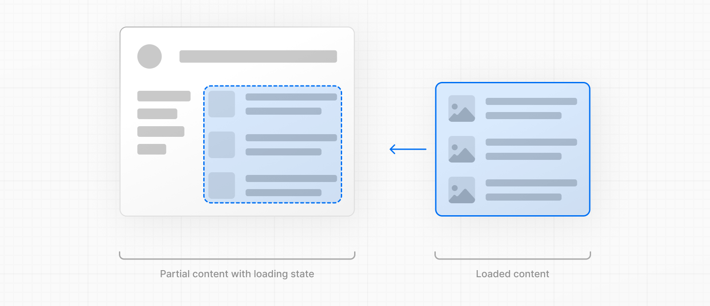

# loading.js

- 공식 문서: [loading.js](https://nextjs.org/docs/app/api-reference/file-conventions/loading)
- 상위 메뉴: [File-system conventions](./README.md)
- 전체 목차: [Next.js 학습 문서](../../README.md)

## 학습 목표

- `loading.js`가 생성하는 Suspense boundary와 instant loading state를 이해한다.
- streaming 중 내비게이션·SEO·상태 코드 동작을 설명한다.
- layout의 runtime 데이터에는 별도 Suspense가 필요한 이유를 이해한다.

## 핵심 개념 및 설명

특수 파일 `loading.js`는 [React Suspense](https://react.dev/reference/react/Suspense)를 사용하여 의미 있는 로딩 UI를 만드는 데 도움이 된다. 이 규칙을 사용하면 라우트 세그먼트의 콘텐츠가 스트리밍되는 동안 서버에서 [즉시 로딩 상태](#instant-loading-states)를 표시할 수 있다. 새 콘텐츠는 완료되면 자동으로 교체된다.



```tsx filename="app/feed/loading.tsx" switcher
export default function Loading() {
  // 또는 사용자 정의 로딩 뼈대 컴포넌트
  return <p>Loading...</p>
}
```

```jsx filename="app/feed/loading.js" switcher
export default function Loading() {
  // 또는 사용자 정의 로딩 뼈대 컴포넌트
  return <p>Loading...</p>
}
```

`loading.js` 파일 내에 경량 로딩 UI를 추가할 수 있다. [React 개발자 도구](https://react.dev/learn/react-developer-tools)를 사용하여 Suspense 경계를 수동으로 전환하는 것이 도움이 될 수 있다.

기본적으로 이 파일은 [Server Component](../../1-getting-started/server-and-client-components.md)이지만 `"use client"` 지시문을 통해 Client Component로 사용할 수도 있다.

<a id="reference"></a>
### 참조

<a id="parameters"></a>
#### 매개변수

UI 컴포넌트 로드에는 매개변수가 허용되지 않는다.

<a id="behavior"></a>
### 동작

<a id="navigation"></a>
#### 내비게이션

- fallback UI는 [prefetch](../../1-getting-started/linking-and-navigating.md#prefetching)되어 prefetch가 완료되지 않은 한 즉시 탐색할 수 있다.
- 탐색은 중단 가능하다. 즉, 경로를 변경할 때 다른 경로로 이동하기 전에 경로의 콘텐츠가 완전히 로드될 때까지 기다릴 필요가 없다.
- 새 라우트 세그먼트가 로드되는 동안 공유 레이아웃은 대화형으로 유지된다.

<a id="instant-loading-states"></a>
#### 즉시 로딩 상태

즉시 로딩 상태는 탐색 시 즉시 표시되는 fallback UI이다. 스켈레톤 및 스피너와 같은 로딩 표시기나 표지 사진, 제목 등과 같은 미래 화면의 작지만 의미 있는 부분을 prerendering할 수 있다. 이를 통해 사용자는 앱이 응답하고 있음을 이해하고 더 나은 사용자 경험을 제공할 수 있다.

폴더 내에 `loading.js` 파일을 추가하여 로드 상태를 만듭니다.


```tsx filename="app/dashboard/loading.tsx" switcher
export default function Loading() {
  // 스켈레톤을 포함하여 로딩 내부에 UI를 추가할 수 있다.
  return <LoadingSkeleton />
}
```

```jsx filename="app/dashboard/loading.js" switcher
export default function Loading() {
  // 스켈레톤을 포함하여 로딩 내부에 UI를 추가할 수 있다.
  return <LoadingSkeleton />
}
```

동일한 폴더에서 `loading.js`는 `layout.js` 내에 중첩된다.`page.js` 파일과 그 아래의 모든 하위 항목을 `<Suspense>` 경계에 자동으로 래핑한다.


[컴포넌트 계층](../../1-getting-started/project-structure.md#component-hierarchy)에서 `loading.js`는 `not-found.js`,`page.js` 및 중첩된 `layout.js` 파일을 `<Suspense>` 경계로 래핑한다. 동일한 세그먼트에 `layout.js`,`template.js` 또는 `error.js`를 래핑하지 **않는다**.

> **알아두면 좋은 점**: 레이아웃이 캐시되지 않은 데이터 또는 런타임 데이터(예:`cookies()`,`headers()` 또는 캐시되지 않은 가져오기)에 액세스하는 경우 `loading.js`는 이에 대한 대체를 표시하지 않는다.
>
> - **[Cache Components](../../1-getting-started/caching.md) 없음:** 레이아웃 렌더링이 완료될 때까지 탐색이 차단된다.
> - **[Cache Components](../../1-getting-started/caching.md) 사용:** 레이아웃의 캐시되지 않은 데이터 또는 런타임 데이터 액세스는 명시적으로 `<Suspense>`에 래핑되어야 한다. 그렇지 않으면 Next.js가 빌드 시점 오류를 안내한다. static shell이 먼저 스트리밍되고 캐시되지 않은 콘텐츠가 채워진다.
>
> 즉각적인 탐색을 보장하려면 `layout.js`에서 가져오는 캐시되지 않은 데이터를 `page.js`로 이동하거나 레이아웃의 런타임 데이터 액세스를 자체 `<Suspense>` 경계로 래핑한다. 자세한 내용과 예시는 [layout.js 주의사항](layout.md#interaction-with-loadingjs)을 참조한다.

<a id="seo"></a>
#### SEO

- Twitterbot과 같이 정적 HTML만 스크랩하고 풀 브라우저처럼 JavaScript를 실행할 수 없는 봇의 경우 Next.js는 UI를 스트리밍하기 전에 [`generateMetadata`](../3.3-functions/generate-metadata.md)를 해결하고 메타데이터는 초기 HTML의 `<head>`에 배치된다.
- 그렇지 않으면 [스트리밍 메타데이터](../3.3-functions/generate-metadata.md#streaming-metadata)가 사용될 수 있다. Next.js는 사용자 에이전트를 자동으로 감지하여 차단 동작과 스트리밍 동작 중에서 선택한다.
- 스트리밍은 서버에서 렌더링되므로 SEO에 영향을 주지 않는다. Google의 [리치 결과 테스트](https://search.google.com/test/rich-results) 도구를 사용하면 페이지가 Google 웹 크롤러에 어떻게 표시되는지 확인하고 직렬화된 HTML을 볼 수 있다([출처](https://web.dev/rendering-on-the-web/#seo-considerations)).

<a id="status-codes"></a>
#### 상태 코드

스트리밍할 때 요청이 성공했음을 알리기 위해 `200` 상태 코드가 반환된다.

예를 들어 [`redirect`](../3.3-functions/redirect.md) 또는 [`notFound`](../3.3-functions/not-found.md)를 사용하는 경우 서버는 스트리밍된 콘텐츠 자체 내에서 클라이언트에 오류나 문제를 계속 전달할 수 있다. 응답 헤더가 이미 클라이언트에 전송되었기 때문에 응답의 상태 코드를 업데이트할 수 없다.

예를 들어, 404 페이지가 클라이언트로 스트리밍되면 Next.js는 스트리밍된 HTML에 `<meta name="robots" content="noindex">` 태그를 포함한다. 이렇게 하면 HTTP 상태가 200인 경우에도 검색 엔진이 해당 URL을 색인화하지 못하게 된다. [`robots` 메타 태그](https://developers.google.com/search/docs/crawling-indexing/robots-meta-tag)에 대한 Google 지침을 참조한다.

일부 크롤러는 이러한 응답에 'soft 404'라는 라벨을 붙일 수 있다. 스트리밍의 경우 페이지가 HTML에 `noindex`로 명시적으로 표시되어 있으므로 인덱싱이 발생하지 않는다.

규정 준수 또는 분석을 위해 404 상태가 필요한 경우 서버가 HTTP 상태 코드를 설정할 수 있도록 응답 본문이 스트리밍되기 전에 리소스가 존재하는지 확인한다.

[`proxy`](proxy.md)에서 이 검사를 실행하여 누락된 슬러그를 찾을 수 없는 경로에 다시 쓰거나 [404 응답을 생성](proxy.md#producing-a-response)할 수 있다. 프록시 검사를 빠르게 유지하고 거기에서 전체 콘텐츠를 가져오는 것을 피한다.

<details>
<summary>응답 본문은 언제 스트리밍되나요?</summary>

응답 본문은 Suspense 대체가 렌더링될 때(예:`loading.tsx`) 또는 Server Component가 `Suspense` 경계 아래에서 일시 중지될 때 스트리밍을 시작한다. 해당 경계 앞과 일시 중단될 수 있는 `await` 앞에 `notFound()`를 배치한다.

스트리밍을 시작하려면 응답 헤더를 설정해야 한다. 그렇기 때문에 스트리밍이 시작된 후에는 상태 코드를 변경할 수 없다.

</details>

<a id="browser-limits"></a>
#### 브라우저 제한

[일부 브라우저](https://bugs.webkit.org/show_bug.cgi?id=252413)는 스트리밍 응답을 버퍼링한다. 응답이 1024바이트를 초과할 때까지 스트리밍된 응답을 볼 수 없다. 이는 일반적으로 "hello world" 애플리케이션에만 영향을 미치고 실제 애플리케이션에는 영향을 미치지 않는다.

<a id="platform-support"></a>
### 플랫폼 지원

| 배포 옵션 | 지원됨 |
| ------------------------------------------------------------------- | ----------------- |
| [Node.js 서버](../../1-getting-started/deploying.md#nodejs-server) | 예 |
| [도커 컨테이너](../../1-getting-started/deploying.md#docker) | 예 |
| [정적 내보내기](../../1-getting-started/deploying.md#static-export) | 아니요 |
| [어댑터](../../1-getting-started/deploying.md#adapters) | 플랫폼별 |

Next.js를 자체 호스팅할 때 [스트리밍 구성](../../2-guides/self-hosting.md#streaming-and-suspense) 방법을 살펴본다.

<a id="examples"></a>
### 예제

<a id="streaming-with-suspense"></a>
#### Suspense를 사용한 스트리밍

`loading.js` 외에도 자체 UI 컴포넌트에 대한 Suspense Boundaries를 수동으로 생성할 수도 있다. App Router는 [Suspense](https://react.dev/reference/react/Suspense)를 통한 스트리밍을 지원한다. 세부적인 일시 중단 패턴, Route Handler 스트리밍 및 인프라 고려 사항을 포함하여 스트리밍 작동 방식에 대한 자세한 내용은 [스트리밍 가이드](../../2-guides/streaming.md)를 참조한다.

`<Suspense>`는 비동기 작업(예: 데이터 가져오기)을 수행하는 컴포넌트를 래핑하고 해당 작업이 진행되는 동안 fallback UI(예: 스켈레톤, 스피너)를 표시한 다음 작업이 완료되면 컴포넌트를 교체하는 방식으로 작동한다.

```tsx filename="app/dashboard/page.tsx" switcher
import { Suspense } from 'react'
import { PostFeed, Weather } from './Components'

export default function Posts() {
  return (
    <section>
      <Suspense fallback={<p>Loading feed...</p>}>
        <PostFeed />
      </Suspense>
      <Suspense fallback={<p>Loading weather...</p>}>
        <Weather />
      </Suspense>
    </section>
  )
}
```

```jsx filename="app/dashboard/page.js" switcher
import { Suspense } from 'react'
import { PostFeed, Weather } from './Components'

export default function Posts() {
  return (
    <section>
      <Suspense fallback={<p>Loading feed...</p>}>
        <PostFeed />
      </Suspense>
      <Suspense fallback={<p>Loading weather...</p>}>
        <Weather />
      </Suspense>
    </section>
  )
}
```

Suspense를 사용하면 다음과 같은 이점을 얻을 수 있다.

1. **스트리밍 서버 렌더링** - 서버에서 클라이언트로 HTML을 점진적으로 렌더링한다.
2. **선택적 hydration** - React는 사용자 상호 작용을 기반으로 어떤 컴포넌트를 먼저 대화형으로 만들 것인지 우선순위를 정한다.

더 많은 Suspense 예제와 사용 사례를 보려면 [React 문서](https://react.dev/reference/react/Suspense)를 참조한다.

<a id="version-history"></a>
### Version History

| 버전 | 변경 사항 |
| --------- | --------------------- |
| `v13.0.0` | `loading`가 출시되었다. |

## 예제 및 데모 설계

- Phase 2에서 지연된 page와 skeleton `loading.tsx`를 만들고 즉시 표시·교체 과정을 관찰한다.
- 공유 layout의 버튼이 하위 page streaming 중에도 작동하는지 확인한다.
- layout fetching을 자체 Suspense 안팎에 놓고 내비게이션 차이를 비교한다.

## 연습 문제

1. `loading.js`가 자동으로 감싸지 않는 것은?
   - A. 같은 세그먼트의 `page.js`
   - B. 중첩 `layout.js`
   - C. 같은 세그먼트의 `layout.js`

<details><summary>정답 보기</summary>

정답: C. `loading.js`는 같은 세그먼트 layout 아래에 위치한다.
</details>

## 챕터 요약

- `loading.js`는 라우트 세그먼트에 Suspense fallback을 제공한다.
- fallback은 prefetch되어 즉각적인 피드백을 줄 수 있다.
- 내비게이션은 중단 가능하고 공유 layout은 상호작용을 유지한다.
- streaming 응답의 HTTP 상태 코드는 보통 `200`이다.
- layout의 runtime 데이터에는 자체 Suspense가 필요하다.
