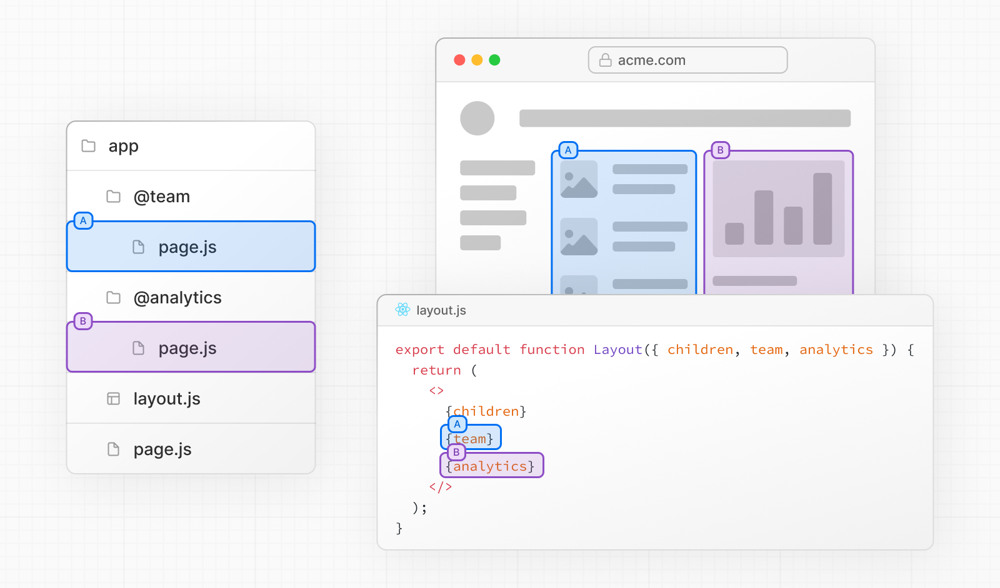
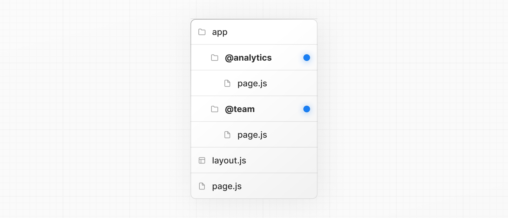
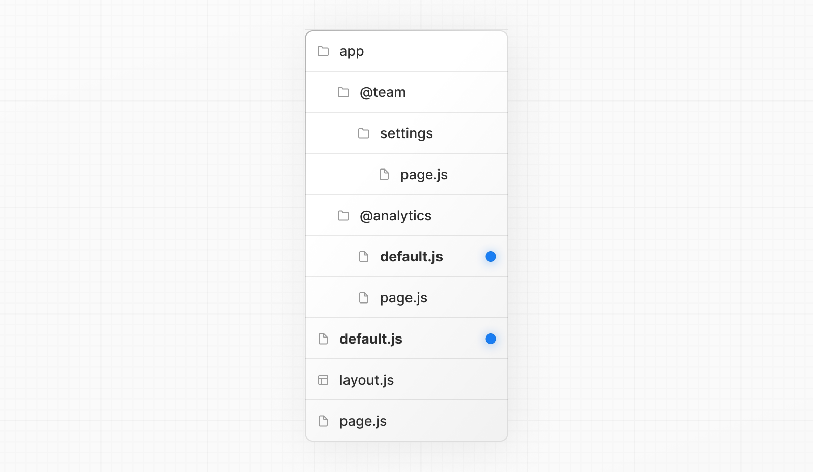
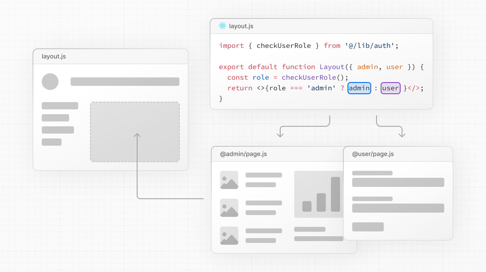
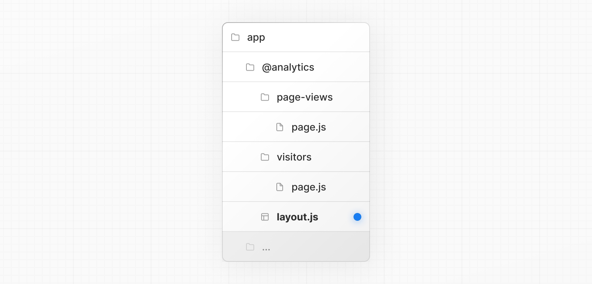
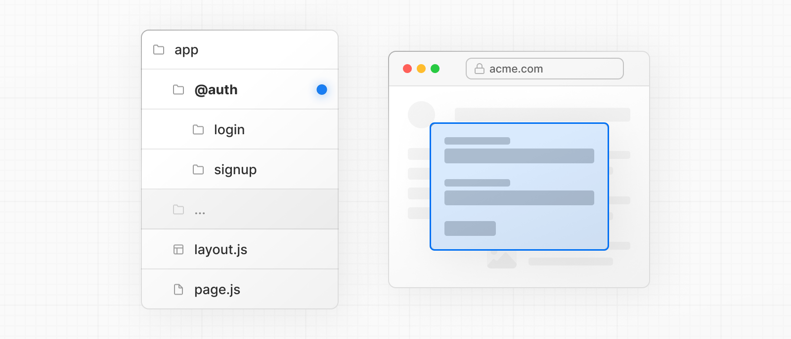
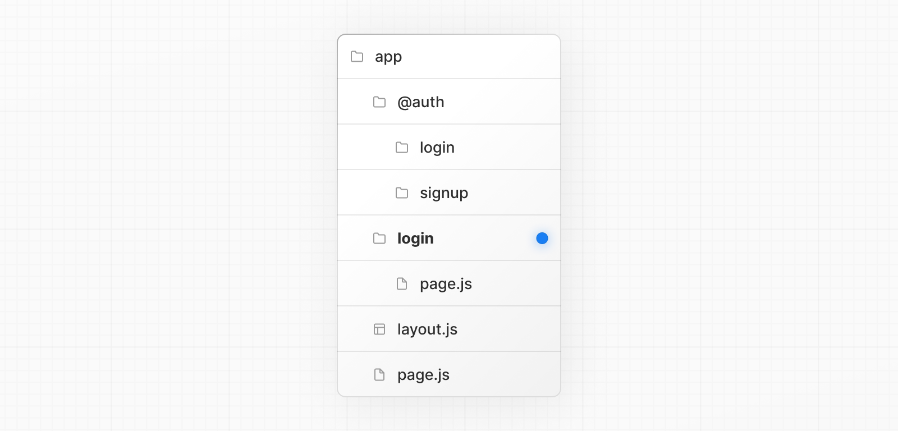
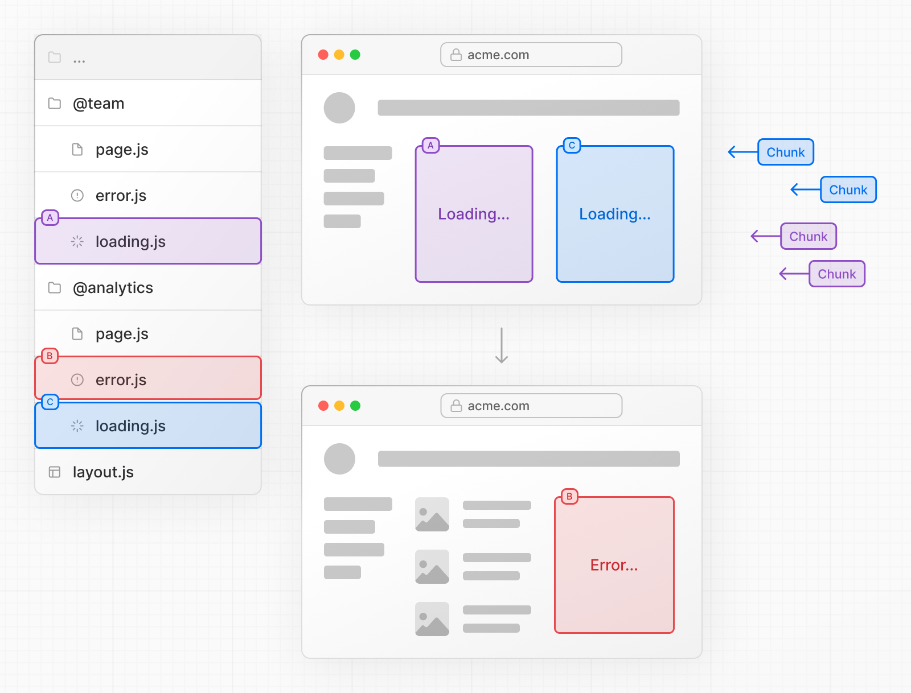

# Parallel Routes

- 공식 문서: [Parallel Routes](https://nextjs.org/docs/app/api-reference/file-conventions/parallel-routes)
- 상위 메뉴: [File-system conventions](./README.md)
- 전체 목차: [Next.js 학습 문서](../../README.md)

## 학습 목표

- named slot으로 같은 layout 안에 여러 page를 동시에 렌더링한다.
- soft/hard navigation에서 slot 상태와 `default.js` 동작을 설명한다.
- 조건부 route, tab, modal을 안전하게 설계한다.

## 핵심 개념 및 설명

병렬 라우트를 사용하면 동일한 레이아웃 내에서 하나 이상의 페이지를 동시에 또는 조건부로 렌더링할 수 있다. 이는 대시보드 및 소셜 사이트의 피드와 같이 앱의 매우 동적인 섹션에 유용하다.

예를 들어 대시보드를 고려하면 병렬 라우트를 사용하여 `team` 및 `analytics` 페이지를 동시에 렌더링할 수 있다.



<a id="convention"></a>
### 규칙

<a id="slots"></a>
#### 슬롯

병렬 라우트는 명명된 **슬롯**을 사용하여 생성된다. 슬롯은 `@folder` 규칙으로 정의된다. 예를 들어, 다음 파일 구조는 두 개의 슬롯 `@analytics` 및 `@team`를 정의한다.



슬롯은 공유 상위 레이아웃에 prop으로 전달된다. 위의 예에서 `app/layout.js`의 컴포넌트는 이제 `@analytics` 및 `@team` 슬롯 prop을 허용하고 `children` prop과 함께 병렬로 렌더링할 수 있다.

```tsx filename="app/layout.tsx" switcher
export default function Layout({
  children,
  team,
  analytics,
}: {
  children: React.ReactNode
  analytics: React.ReactNode
  team: React.ReactNode
}) {
  return (
    <>
      {children}
      {team}
      {analytics}
    </>
  )
}
```

```jsx filename="app/layout.js" switcher
export default function Layout({ children, team, analytics }) {
  return (
    <>
      {children}
      {team}
      {analytics}
    </>
  )
}
```

그러나 슬롯은 라우트 세그먼트가 **아님** URL 구조에 영향을 주지 않는다. 예를 들어,`/@analytics/views`의 경우 `@analytics`가 슬롯이므로 URL은 `/views`가 된다. 슬롯은 일반 [페이지](page.md) 컴포넌트와 결합되어 라우트 세그먼트와 연결된 최종 페이지를 형성한다. 이로 인해 동일한 라우트 세그먼트 수준에서 별도의 [prerendering된](../../4-glossary/README.md#prerendering) 및 [동적으로 렌더링된](../../4-glossary/README.md#dynamic-rendering) 슬롯을 가질 수 없다. 하나의 슬롯이 동적이면 해당 수준의 모든 슬롯이 동적이어야 한다.

> **알아두면 좋은 점**:
>
> - `children` prop은 폴더에 매핑할 필요가 없는 암시적 슬롯이다. 이는 `app/page.js`가 `app/@children/page.js`와 동일함을 의미한다.

<a id="defaultjs"></a>
#### `default.js`

초기 로드 또는 전체 페이지 다시 로드 중에 일치하지 않는 슬롯에 대한 폴백으로 렌더링하도록 `default.js` 파일을 정의할 수 있다.

다음 폴더 구조를 고려한다.`@team` 슬롯에는 `/settings` 페이지가 있지만 `@analytics`에는 없다.



`/settings`로 이동할 때 `@team` 슬롯은 `@analytics` 슬롯에 대해 현재 활성 페이지를 유지하면서 `/settings` 페이지를 렌더링한다.

새로 고침 시 Next.js는 `@analytics`에 대한 `default.js`를 렌더링한다.`default.js`가 없으면 `404`가 대신 렌더링된다.

또한 `children`는 암시적 슬롯이므로 Next.js가 상위 페이지의 활성 상태를 복구할 수 없는 경우 `children`에 대한 대체를 렌더링하기 위해 `default.js` 파일도 생성해야 한다.

<a id="behavior"></a>
### 동작

기본적으로 Next.js는 각 슬롯의 활성 _상태_(또는 하위 페이지)를 추적한다. 그러나 슬롯 내에서 렌더링되는 콘텐츠는 탐색 유형에 따라 달라진다.

- [**소프트 탐색**](../../1-getting-started/linking-and-navigating.md#client-side-transitions): 클라이언트 측 탐색 중에 Next.js는 [부분 렌더링](../../1-getting-started/linking-and-navigating.md#client-side-transitions)을 수행하여 슬롯 내의 하위 페이지를 변경하는 동시에 다른 슬롯의 활성 하위 페이지가 현재 URL과 일치하지 않더라도 유지한다.
- **하드 탐색**: 전체 페이지 로드(브라우저 새로 고침) 후 Next.js는 현재 URL과 일치하지 않는 슬롯의 활성 상태를 확인할 수 없다. 대신, 일치하지 않는 슬롯에 대해 [`default.js`](#defaultjs) 파일을 렌더링하거나 `default.js`가 존재하지 않는 경우 `404`를 렌더링한다.

> **알아두면 좋은 점**:
>
> - 일치하지 않는 경로를 위한 `404`는 의도하지 않은 페이지에 병렬 라우트를 실수로 렌더링하지 않도록 도와준다.

<a id="examples"></a>
### 예제

<a id="with-useselectedlayoutsegments"></a>
#### `useSelectedLayoutSegment(s)` 사용

[`useSelectedLayoutSegment`](../3.3-functions/use-selected-layout-segment.md) 및 [`useSelectedLayoutSegments`](../3.3-functions/use-selected-layout-segments.md)는 모두 슬롯 내에서 활성 라우트 세그먼트를 읽을 수 있도록 하는 `parallelRoutesKey` 매개변수를 허용한다.

```tsx filename="app/layout.tsx" switcher
'use client'

import { useSelectedLayoutSegment } from 'next/navigation'

export default function Layout({ auth }: { auth: React.ReactNode }) {
  const loginSegment = useSelectedLayoutSegment('auth')
  // ...
}
```

```jsx filename="app/layout.js" switcher
'use client'

import { useSelectedLayoutSegment } from 'next/navigation'

export default function Layout({ auth }) {
  const loginSegment = useSelectedLayoutSegment('auth')
  // ...
}
```

사용자가 `app/@auth/login`(또는 URL 표시줄의 `/login`)로 이동하면 `loginSegment`는 `"login"` 문자열과 동일하다.

<a id="conditional-routes"></a>
#### 조건부 경로

병렬 라우트를 사용하면 사용자 역할과 같은 특정 조건에 따라 조건부로 경로를 렌더링할 수 있다. 예를 들어 `/admin` 또는 `/user` 역할에 대해 다른 대시보드 페이지를 렌더링하려면 다음을 수행한다.



```tsx filename="app/dashboard/layout.tsx" switcher
import { checkUserRole } from '@/lib/auth'

export default function Layout({
  user,
  admin,
}: {
  user: React.ReactNode
  admin: React.ReactNode
}) {
  const role = checkUserRole()
  return role === 'admin' ? admin : user
}
```

```jsx filename="app/dashboard/layout.js" switcher
import { checkUserRole } from '@/lib/auth'

export default function Layout({ user, admin }) {
  const role = checkUserRole()
  return role === 'admin' ? admin : user
}
```

레이아웃이 반환하는 슬롯에 관계없이 두 슬롯 모두 서버에서 렌더링된다. 조건부는 실행되는 것이 아니라 사용자에게 표시되는 것을 결정한다.`@admin/page.js`는 모든 사용자에 대해 데이터 가져오기를 실행하고 해당 출력은 브라우저로 전송되는 응답에 포함된다. 각 슬롯의 페이지 내부 또는 [데이터 액세스 레이어](../../2-guides/authentication.md#creating-a-data-access-layer-dal)에서 승인한다.

```tsx filename="app/dashboard/@admin/page.tsx" switcher
import { getAdminStats } from '@/lib/dal'

export default async function AdminPage() {
  const stats = await getAdminStats()
  return <Stats stats={stats} />
}
```

```jsx filename="app/dashboard/@admin/page.js" switcher
import { getAdminStats } from '@/lib/dal'

export default async function AdminPage() {
  const stats = await getAdminStats()
  return <Stats stats={stats} />
}
```

<a id="tab-groups"></a>
#### 탭 그룹

슬롯 내부에 `layout`를 추가하면 사용자가 슬롯을 독립적으로 탐색할 수 있다. 이는 탭을 생성하는 데 유용하다.

예를 들어,`@analytics` 슬롯에는 `/page-views` 및 `/visitors`라는 두 개의 하위 페이지가 있다.



`@analytics` 내에서 [`layout`](layout.md) 파일을 생성하여 두 페이지 간에 탭을 공유한다.

```tsx filename="app/@analytics/layout.tsx" switcher
import Link from 'next/link'

export default function Layout({ children }: { children: React.ReactNode }) {
  return (
    <>
      <nav>
        <Link href="/page-views">Page Views</Link>
        <Link href="/visitors">Visitors</Link>
      </nav>
      <div>{children}</div>
    </>
  )
}
```

```jsx filename="app/@analytics/layout.js" switcher
import Link from 'next/link'

export default function Layout({ children }) {
  return (
    <>
      <nav>
        <Link href="/page-views">Page Views</Link>
        <Link href="/visitors">Visitors</Link>
      </nav>
      <div>{children}</div>
    </>
  )
}
```

<a id="modals"></a>
#### 모달

병렬 라우트는 [라우트 가로채기](intercepting-routes.md)와 함께 사용하여 딥 링크를 지원하는 모달을 생성할 수 있다. 이를 통해 다음과 같은 모달을 구축할 때 일반적인 문제를 해결할 수 있다.

- 모달 콘텐츠를 **URL을 통해 공유 가능**하게 만듭니다.
- **컨텍스트 보존** 페이지를 새로 고칠 때 모달을 닫는 대신.
- **이전 경로로 이동하는 대신 뒤로 탐색 시 모달을 닫는다**.
- **앞으로 탐색 시 모달 다시 열기**.

사용자가 클라이언트 측 탐색을 사용하여 레이아웃에서 로그인 모달을 열거나 별도의 `/login` 페이지에 액세스할 수 있는 다음 UI 패턴을 고려한다.



이 패턴을 구현하려면 먼저 **기본** 로그인 페이지를 렌더링하는 `/login` 경로를 생성한다.



```tsx filename="app/login/page.tsx" switcher
import { Login } from '@/app/ui/login'

export default function Page() {
  return <Login />
}
```

```jsx filename="app/login/page.js" switcher
import { Login } from '@/app/ui/login'

export default function Page() {
  return <Login />
}
```

그런 다음 `@auth` 슬롯 내부에 `null`를 반환하는 [`default.js`](default.md) 파일을 추가한다. 이렇게 하면 모달이 활성화되지 않을 때 렌더링되지 않는다.

```tsx filename="app/@auth/default.tsx" switcher
export default function Default() {
  return null
}
```

```jsx filename="app/@auth/default.js" switcher
export default function Default() {
  return null
}
```

`@auth` 슬롯 내에서 `<Modal>` 컴포넌트와 해당 하위 컴포넌트를 `@auth/(.)login/page.tsx` 파일로 가져오고 폴더 이름을 `/@auth/(.)login/page.tsx`로 업데이트하여 `/login` 경로를 차단한다.

```tsx filename="app/@auth/(.)login/page.tsx" switcher
import { Modal } from '@/app/ui/modal'
import { Login } from '@/app/ui/login'

export default function Page() {
  return (
    <Modal>
      <Login />
    </Modal>
  )
}
```

```jsx filename="app/@auth/(.)login/page.js" switcher
import { Modal } from '@/app/ui/modal'
import { Login } from '@/app/ui/login'

export default function Page() {
  return (
    <Modal>
      <Login />
    </Modal>
  )
}
```

> **알아두면 좋은 점**:
>
> - 경로를 가로채는 데에는 `(.)` 규칙이 사용된다. 자세한 내용은 [라우트 가로채기](intercepting-routes.md#convention) 문서를 참조한다.
> - 모달 콘텐츠(`<Login>`)에서 `<Modal>` 기능을 분리하면 모달 내부의 모든 콘텐츠를 보장할 수 있다. [양식](../../2-guides/forms.md)은 Server Component이다. 자세한 내용은 [클라이언트 및 Server Component 인터리빙](../../1-getting-started/server-and-client-components.md#interleaving-server-and-client-components)을 참조한다.

<a id="opening-the-modal"></a>
##### 모달 열기

이제 Next.js 라우터를 활용하여 모달을 열고 닫을 수 있다. 이렇게 하면 모달이 열려 있을 때와 앞뒤로 탐색할 때 URL이 올바르게 업데이트된다.

모달을 열려면 `@auth` 슬롯을 상위 레이아웃에 prop으로 전달하고 `children` prop과 함께 렌더링한다.

```tsx filename="app/layout.tsx" switcher
import Link from 'next/link'

export default function Layout({
  auth,
  children,
}: {
  auth: React.ReactNode
  children: React.ReactNode
}) {
  return (
    <>
      <nav>
        <Link href="/login">Open modal</Link>
      </nav>
      <div>{auth}</div>
      <div>{children}</div>
    </>
  )
}
```

```jsx filename="app/layout.js" switcher
import Link from 'next/link'

export default function Layout({ auth, children }) {
  return (
    <>
      <nav>
        <Link href="/login">Open modal</Link>
      </nav>
      <div>{auth}</div>
      <div>{children}</div>
    </>
  )
}
```

사용자가 `<Link>`를 클릭하면 `/login` 페이지로 이동하는 대신 모달이 열립니다. 그러나 새로 고침 또는 초기 로드 시 `/login`로 이동하면 사용자가 기본 로그인 페이지로 이동한다.

<a id="closing-the-modal"></a>
##### 모달 닫기

`router.back()`를 호출하거나 `Link` 컴포넌트를 사용하여 모달을 닫을 수 있다.

```tsx filename="app/ui/modal.tsx" switcher
'use client'

import { useRouter } from 'next/navigation'

export function Modal({ children }: { children: React.ReactNode }) {
  const router = useRouter()

  return (
    <>
      <button
        onClick={() => {
          router.back()
        }}
      >
        Close modal
      </button>
      <div>{children}</div>
    </>
  )
}
```

```jsx filename="app/ui/modal.js" switcher
'use client'

import { useRouter } from 'next/navigation'

export function Modal({ children }) {
  const router = useRouter()

  return (
    <>
      <button
        onClick={() => {
          router.back()
        }}
      >
        Close modal
      </button>
      <div>{children}</div>
    </>
  )
}
```

`Link` 컴포넌트를 사용하여 더 이상 `@auth` 슬롯을 렌더링해서는 안 되는 페이지에서 벗어나는 경우 병렬 라우트가 `null`를 반환하는 컴포넌트와 일치하는지 확인해야 한다. 예를 들어 루트 페이지로 다시 탐색할 때 `@auth/page.tsx` 컴포넌트를 생성한다.

```tsx filename="app/ui/modal.tsx" switcher
import Link from 'next/link'

export function Modal({ children }: { children: React.ReactNode }) {
  return (
    <>
      <Link href="/">Close modal</Link>
      <div>{children}</div>
    </>
  )
}
```

```jsx filename="app/ui/modal.js" switcher
import Link from 'next/link'

export function Modal({ children }) {
  return (
    <>
      <Link href="/">Close modal</Link>
      <div>{children}</div>
    </>
  )
}
```

```tsx filename="app/@auth/page.tsx" switcher
export default function Page() {
  return null
}
```

```jsx filename="app/@auth/page.js" switcher
export default function Page() {
  return null
}
```

또는 다른 페이지(예:`/foo`,`/foo/bar` 등)로 이동하는 경우 포괄 슬롯을 사용할 수 있다.

```tsx filename="app/@auth/[...catchAll]/page.tsx" switcher
export default function CatchAll() {
  return null
}
```

```jsx filename="app/@auth/[...catchAll]/page.js" switcher
export default function CatchAll() {
  return null
}
```

> **알아두면 좋은 점**:
>
> - 병렬 라우트의 작동 방식으로 인해 모달을 닫기 위해 `@auth` 슬롯에서 캐치올 경로를 사용한다. 더 이상 슬롯과 일치하지 않는 경로에 대한 클라이언트 측 탐색은 계속 표시되므로 모달을 닫으려면 `null`를 반환하는 경로에 슬롯을 일치시켜야 한다.
> - 다른 예로는 갤러리에서 사진 모달을 열면서 전용 `/photo/[id]` 페이지를 열거나 사이드 모달에서 장바구니를 여는 등이 있다.
> - 차단 및 병렬 라우트가 있는 모달의 [예 보기](https://github.com/vercel-labs/nextgram).

<a id="loading-and-error-ui"></a>
#### 로딩 및 오류 UI

병렬 라우트는 독립적으로 스트리밍될 수 있으므로 각 경로에 대해 독립적인 오류 및 로드 상태를 정의할 수 있다.



자세한 내용은 [UI 로딩](loading.md) 및 [오류 처리](../../1-getting-started/error-handling.md) 문서를 참조한다.

## 예제 및 데모 설계

- Phase 2에서 dashboard의 두 slot을 동시에 표시하고 각각 독립 loading/error UI를 둔다.
- client navigation과 새로고침에서 활성 slot과 `default.tsx` 결과를 비교한다.
- intercepted login modal의 URL·뒤로가기·새로고침 동작을 검증한다.

## 연습 문제

1. `@analytics`가 URL에 미치는 영향은?
   - A. `/@analytics`가 추가된다.
   - B. URL에는 포함되지 않는다.
   - C. query string이 된다.

<details><summary>정답 보기</summary>

정답: B. slot은 route segment가 아니다.
</details>

2. layout이 `@admin`을 반환하지 않으면 그 slot의 fetching은?
   - A. 실행되지 않는다.
   - B. 서버에서 실행될 수 있으므로 slot 내부 authorization이 필요하다.
   - C. 브라우저에서만 실행된다.

<details><summary>정답 보기</summary>

정답: B. 조건부 표시 자체는 보안 경계가 아니다.
</details>

## 챕터 요약

- Parallel Routes는 `@slot`으로 여러 page를 함께 렌더링한다.
- slot은 URL segment가 아니며 `children`도 slot이다.
- soft navigation은 다른 slot 상태를 보존한다.
- hard navigation에는 `default.js` fallback이 필요하다.
- 조건부 slot마다 독립적으로 authorization해야 한다.
