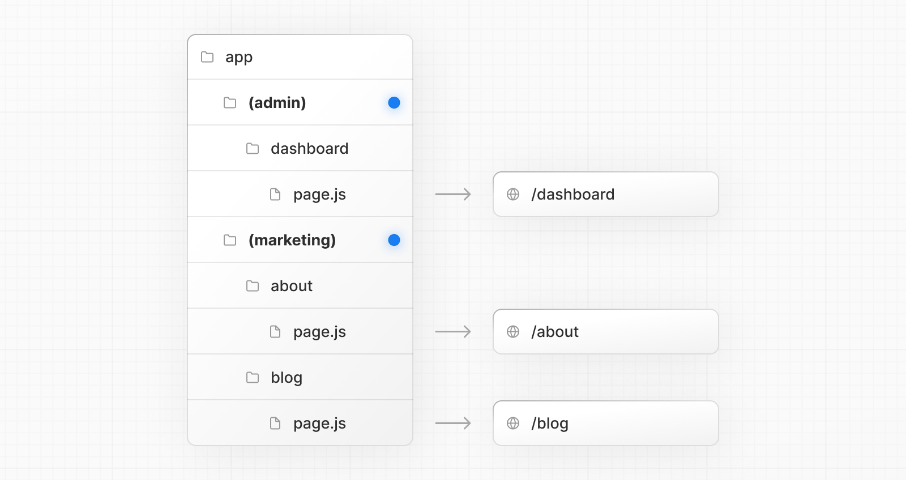

# Route Groups

- 공식 문서: [Route Groups](https://nextjs.org/docs/app/api-reference/file-conventions/route-groups)
- 상위 메뉴: [File-system conventions](./README.md)
- 전체 목차: [Next.js 학습 문서](../../README.md)

## 학습 목표

- URL을 바꾸지 않고 라우트를 팀·관심사·기능별로 묶는다.
- 공유 layout 범위를 조절하고 여러 root layout을 구성한다.
- 경로 충돌과 전체 page 로드 caveat를 피한다.

## 핵심 개념 및 설명

라우트 그룹은 범주나 팀별로 경로를 구성할 수 있는 폴더 규칙이다.

### 규칙

라우트 그룹은 폴더 이름을 괄호(`(folderName)`)로 묶어 생성할 수 있다.

이 규칙은 폴더가 조직적 목적을 위한 것이며 경로의 URL 경로에 **포함되어서는 안 됨**을 나타냅니다.

### 사용 사례

- 팀, 관심사 또는 기능별로 경로를 구성한다.
- 여러 [루트 레이아웃](layout.md#root-layout) 정의.
- 특정 경로 구간을 레이아웃 공유로 선택하고 다른 구간은 제외한다.

### 주의사항

- **전체 페이지 로드**: 서로 다른 루트 레이아웃을 사용하는 경로 사이를 탐색하는 경우 전체 페이지 새로고침이 트리거된다. 예를 들어 `app/(shop)/layout.js`를 사용하는 `/cart`에서 `app/(marketing)/layout.js`를 사용하는 `/blog`로 이동한다. 이는 **만** 다중 루트 레이아웃에만 적용된다.
- **경로 충돌**: 서로 다른 그룹의 경로는 동일한 URL 경로로 해석되어서는 안 된다. 예를 들어,`(marketing)/about/page.js` 및 `(shop)/about/page.js`는 모두 `/about`로 확인되어 오류를 발생시킵니다.
- **최상위 루트 레이아웃**: 최상위 `layout.js` 파일 없이 여러 루트 레이아웃을 사용하는 경우 홈 경로(/)가 라우트 그룹 중 하나 내에 정의되어 있는지 확인한다. app/(마케팅)/page.js.

## 예제 및 데모 설계

- Phase 2에서 `(marketing)`과 `(shop)`을 만들고 URL에 group 이름이 노출되지 않는지 확인한다.
- 두 root layout 사이 이동 때 document가 다시 로드되는지 기록한다.

## 연습 문제

1. `app/(shop)/cart/page.js`의 URL은?
   - A. `/(shop)/cart`
   - B. `/shop/cart`
   - C. `/cart`

정답 보기

정답: C. Route Group 이름은 URL에 포함되지 않는다.

## 챕터 요약

- Route Group은 `(name)` 폴더 규칙이다.
- group 이름은 URL path에 포함되지 않는다.
- layout 공유 범위와 여러 root layout을 구성할 수 있다.
- 같은 URL로 해석되는 group route는 충돌한다.
- 서로 다른 root layout 사이에서는 전체 page가 로드된다.
