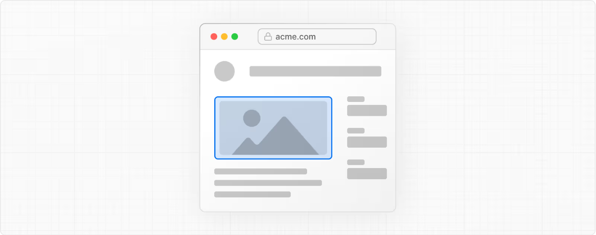
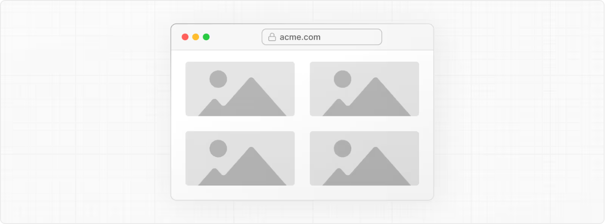
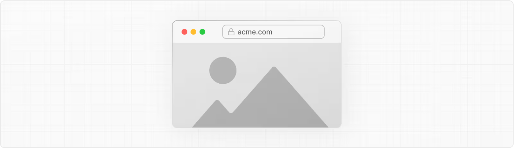

# Image Component

- 공식 문서: [Image Component](https://nextjs.org/docs/app/api-reference/components/image)
- 상위 메뉴: [Components](./README.md)
- 전체 목차: [Next.js 학습 문서](../../README.md)

## 학습 목표

- `next/image`의 `Image` 컴포넌트가 일반 `` 태그와 어떻게 다른지, 어떤 최적화를 자동으로 수행하는지 설명할 수 있다.
- `src`, `width`/`height`, `fill`, `sizes`, `quality`, `placeholder` 등 자주 쓰는 props의 역할과 사용 조건을 구분해서 사용할 수 있다.
- `next.config.js`의 `images` 설정(`remotePatterns`, `qualities`, `formats` 등)으로 이미지 최적화 동작을 제어할 수 있다.
- `getImageProps` 함수로 `` 엘리먼트가 아닌 다른 요소(배경 이미지, `<picture>` 등)에 최적화된 이미지 속성을 적용할 수 있다.

## 핵심 개념 및 설명

### Image 컴포넌트란

Next.js의 `Image` 컴포넌트는 HTML `` 엘리먼트를 확장해 이미지 최적화를 자동으로 처리한다.

```tsx
import Image from 'next/image'

export default function Page() {
  return (
    <Image
      src="/profile.png"
      width={500}
      height={500}
      alt="Picture of the author"
    />
  )
}
```

### Props

다음 props를 사용할 수 있다.

| Prop | 예시 | 타입 | 상태 |
| --- | --- | --- | --- |
| src | `src="/profile.png"` | String | 필수 |
| alt | `alt="Picture of the author"` | String | 필수 |
| width | `width={500}` | Integer (px) | - |
| height | `height={500}` | Integer (px) | - |
| fill | `fill={true}` | Boolean | - |
| loader | `loader={imageLoader}` | Function | - |
| sizes | `sizes="(max-width: 768px) 100vw, 33vw"` | String | - |
| quality | `quality={80}` | Integer (1-100) | - |
| preload | `preload={true}` | Boolean | - |
| placeholder | `placeholder="blur"` | String | - |
| style | `style={{objectFit: "contain"}}` | Object | - |
| onLoadingComplete | `onLoadingComplete={img => done()}` | Function | Deprecated |
| onLoad | `onLoad={event => done()}` | Function | - |
| onError | `onError={event => fail()}` | Function | - |
| loading | `loading="lazy"` | String | - |
| blurDataURL | `blurDataURL="data:image/jpeg..."` | String | - |
| unoptimized | `unoptimized={true}` | Boolean | - |
| overrideSrc | `overrideSrc="/seo.png"` | String | - |
| decoding | `decoding="async"` | String | - |

#### src

이미지의 출처. 다음 중 하나를 사용할 수 있다.

내부 경로 문자열:

```tsx
<Image src="/profile.png" />
```

절대 외부 URL(반드시 [remotePatterns](#remotepatterns)로 설정해야 한다):

```tsx
<Image src="https://example.com/profile.png" />
```

정적 import:

```tsx
import profile from './profile.png'

export default function Page() {
  return <Image src={profile} />
}
```

> **알아두면 좋은 점**: 보안상의 이유로 기본 [loader](#loader)를 사용하는 Image Optimization API는 `src` 이미지를 가져올 때 헤더를 전달하지 않는다. `src` 이미지가 인증을 필요로 한다면 [unoptimized](#unoptimized) 속성으로 이미지 최적화를 비활성화하는 것을 고려한다.

#### alt

`alt` 속성은 스크린 리더와 검색 엔진을 위해 이미지를 설명한다. 이미지가 꺼져 있거나 로딩 중 오류가 발생했을 때 대체 텍스트로도 쓰인다.

이미지를 대신해도 [페이지의 의미가 바뀌지 않는](https://html.spec.whatwg.org/multipage/images.html#general-guidelines) 텍스트를 담아야 한다. 이미지를 보완하는 용도가 아니므로 위·아래 캡션에 이미 있는 정보를 반복해서는 안 된다.

이미지가 [순수하게 장식적이거나](https://html.spec.whatwg.org/multipage/images.html#a-purely-decorative-image-that-doesn't-add-any-information) [사용자를 위한 것이 아니라면](https://html.spec.whatwg.org/multipage/images.html#an-image-not-intended-for-the-user) `alt` 속성은 빈 문자열(`alt=""`)이어야 한다.

> [이미지 접근성 가이드라인](https://html.spec.whatwg.org/multipage/images.html#alt)에서 더 알아본다.

#### width and height

`width`, `height` 속성은 이미지의 [고유한(intrinsic)](https://developer.mozilla.org/en-US/docs/Glossary/Intrinsic_Size) 크기를 픽셀 단위로 나타낸다. 이 값은 브라우저가 올바른 **가로세로 비율**을 추론해 로딩 중 레이아웃 이동을 막기 위해 공간을 미리 확보하는 데 쓰인다. 이미지의 _렌더링 크기_ 자체를 결정하지는 않으며, 그것은 CSS가 담당한다.

```tsx
<Image src="/profile.png" width={500} height={500} />
```

다음 경우가 아니라면 `width`와 `height`를 **반드시** 함께 설정해야 한다.

- 이미지를 정적으로 import한 경우
- 이미지에 [`fill` 속성](#fill)이 있는 경우

높이와 너비를 모르는 경우에는 [`fill` 속성](#fill)을 사용하는 것을 권장한다.

#### fill

부모 엘리먼트의 크기만큼 이미지를 확장하는 boolean 속성이다.

```tsx
<Image src="/profile.png" fill={true} />
```

**포지셔닝**:

- 부모 엘리먼트는 반드시 `position: "relative"`, `"fixed"`, `"absolute"` 중 하나를 지정해야 한다.
- 기본적으로 `` 엘리먼트는 `position: "absolute"`를 사용한다.

**Object Fit**:

이미지에 별도 스타일이 없으면 이미지는 컨테이너에 맞춰 늘어난다. `objectFit`으로 자르기·크기 조정 방식을 제어할 수 있다.

- `"contain"`: 가로세로 비율을 유지하면서 컨테이너에 맞게 축소한다.
- `"cover"`: 컨테이너를 가득 채우고 넘치는 부분은 잘라낸다.

> [`position`](https://developer.mozilla.org/en-US/docs/Web/CSS/position)과 [`object-fit`](https://developer.mozilla.org/docs/Web/CSS/object-fit)에서 더 알아본다.

#### loader

이미지 URL을 생성하는 커스텀 함수. 이 함수는 다음 매개변수를 받아 이미지 URL 문자열을 반환한다.

- [`src`](#src)
- [`width`](#width-and-height)
- [`quality`](#quality)

```tsx
'use client'

import Image from 'next/image'

const imageLoader = ({ src, width, quality }) => {
  return `https://example.com/${src}?w=${width}&q=${quality || 75}`
}

export default function Page() {
  return (
    <Image
      loader={imageLoader}
      src="me.png"
      alt="Picture of the author"
      width={500}
      height={500}
    />
  )
}
```

> **알아두면 좋은 점**: `onLoad`처럼 함수를 전달받는 props는 전달된 함수를 직렬화하기 위해 [Client Components](https://react.dev/reference/rsc/use-client)에서 사용해야 한다.

또는 `next.config.js`의 [loaderFile](#loaderfile) 설정으로 앱 안의 모든 `next/image` 인스턴스에 대해 props를 전달하지 않고도 설정할 수 있다.

#### sizes

브레이크포인트별 이미지 크기를 정의한다. 브라우저가 생성된 `srcset`에서 가장 적절한 크기를 고를 때 사용한다.

```tsx
import Image from 'next/image'

export default function Page() {
  return (
    <div className="grid-element">
      <Image
        fill
        src="/example.png"
        sizes="(max-width: 768px) 100vw, (max-width: 1200px) 50vw, 33vw"
      />
    </div>
  )
}
```

다음의 경우 `sizes`를 사용해야 한다.

- 이미지가 [`fill`](#fill) prop을 사용하는 경우
- CSS로 이미지를 반응형으로 만드는 경우

`sizes`가 없으면 브라우저는 이미지가 뷰포트만큼 넓다고(`100vw`) 가정한다. 그러면 불필요하게 큰 이미지가 다운로드될 수 있다.

또한 `sizes`는 `srcset` 생성 방식에도 영향을 준다.

- `sizes`가 없을 때: Next.js는 고정 크기 이미지에 적합한, 제한된 `srcset`(예: 1x, 2x)을 생성한다.
- `sizes`가 있을 때: Next.js는 반응형 레이아웃에 최적화된 전체 `srcset`(예: 640w, 750w 등)을 생성한다.

> `srcset`과 `sizes`는 [web.dev](https://web.dev/learn/design/responsive-images/#sizes)와 [mdn](https://developer.mozilla.org/docs/Web/HTML/Element/img#sizes)에서 더 알아본다.

#### quality

최적화된 이미지의 품질을 설정하는 1~100 사이의 정수다. 값이 높을수록 파일 크기와 시각적 품질이 올라가고, 값이 낮을수록 파일 크기는 줄지만 선명도에 영향을 줄 수 있다.

```tsx
// 기본 quality는 75
<Image quality={75} />
```

`next.config.js`에 [qualities](#qualities)를 설정했다면 이 값은 허용된 항목 중 하나와 일치해야 한다.

> **알아두면 좋은 점**: 원본 이미지 자체가 이미 저품질이라면 quality 값을 높여도 외형은 개선되지 않고 파일 크기만 커진다.

#### style

하위 이미지 엘리먼트에 CSS 스타일을 전달할 수 있다.

```tsx
const imageStyle = {
  borderRadius: '50%',
  border: '1px solid #fff',
  width: '100px',
  height: 'auto',
}

export default function ProfileImage() {
  return <Image src="..." style={imageStyle} />
}
```

> **알아두면 좋은 점**: `style` prop으로 커스텀 너비를 지정한다면 이미지의 가로세로 비율을 유지하기 위해 `height: 'auto'`도 함께 설정해야 한다.

#### preload

이미지를 프리로드할지 나타내는 boolean 속성이다.

```tsx
// 기본 preload는 false
<Image preload={false} />
```

- `true`: `<head>`에 `<link>`를 삽입해 이미지를 [프리로드](https://web.dev/preload-responsive-images/)한다.
- `false`: 이미지를 프리로드하지 않는다.

**사용해야 할 때:**

- 이미지가 [LCP(Largest Contentful Paint)](https://nextjs.org/learn/seo/web-performance/lcp) 엘리먼트인 경우
- 이미지가 최초 화면 안(주로 히어로 이미지)에 있는 경우
- `<body>`에서 나중에 발견되기 전에 `<head>`에서 먼저 로딩을 시작하고 싶은 경우

**사용하지 않아야 할 때:**

- 뷰포트에 따라 여러 이미지가 [LCP](https://nextjs.org/learn/seo/web-performance/lcp) 엘리먼트가 될 수 있는 경우
- `loading` 속성을 사용하는 경우
- `fetchPriority` 속성을 사용하는 경우

대부분의 경우 `preload` 대신 `loading="eager"`나 `fetchPriority="high"`를 사용하는 것이 좋다.

#### priority (Deprecated)

Next.js 16부터 `priority` 속성은 동작을 더 명확히 하기 위해 [`preload`](#preload) 속성으로 대체되면서 deprecated되었다.

#### loading

이미지 로딩이 시작되는 시점을 제어한다.

```tsx
// 기본값은 lazy
<Image loading="lazy" />
```

- `lazy`: 뷰포트로부터 일정 거리에 도달할 때까지 이미지 로딩을 지연한다.
- `eager`: 페이지 안 위치와 무관하게 즉시 이미지를 로딩한다.

이미지를 반드시 즉시 로딩해야 할 때만 `eager`를 사용한다.

> [`loading` 속성](https://developer.mozilla.org/docs/Web/HTML/Element/img#loading)에서 더 알아본다.

#### placeholder

이미지가 로딩되는 동안 사용할 플레이스홀더를 지정해 체감 로딩 성능을 개선한다.

```tsx
// 기본값은 empty
<Image placeholder="empty" />
```

- `empty`: 로딩 중 플레이스홀더를 표시하지 않는다.
- `blur`: 이미지를 흐리게 만든 버전을 플레이스홀더로 사용한다. [`blurDataURL`](#blurdataurl) 속성과 함께 사용해야 한다.
- `data:image/...`: [Data URL](https://developer.mozilla.org/docs/Web/HTTP/Basics_of_HTTP/Data_URIs)을 플레이스홀더로 사용한다.

**예시:**

- [`blur` placeholder](https://image-component.nextjs.gallery/placeholder)
- [data URL `placeholder` prop을 이용한 시머 효과](https://image-component.nextjs.gallery/shimmer)
- [`blurDataURL` prop을 이용한 색상 효과](https://image-component.nextjs.gallery/color)

> [`placeholder` 속성](https://developer.mozilla.org/docs/Web/HTML/Element/img#placeholder)에서 더 알아본다.

#### blurDataURL

이미지가 성공적으로 로딩되기 전에 플레이스홀더로 사용할 [Data URL](https://developer.mozilla.org/docs/Web/HTTP/Basics_of_HTTP/Data_URIs)이다. 자동으로 설정되거나 [`placeholder="blur"`](#placeholder) 속성과 함께 사용할 수 있다.

```tsx
<Image placeholder="blur" blurDataURL="..." />
```

이미지는 자동으로 확대·흐림 처리되므로 매우 작은 이미지(10px 이하)를 권장한다.

**자동 설정**

`src`가 애니메이션이 아닌 `jpg`, `png`, `webp`, `avif` 파일의 정적 import라면 `blurDataURL`이 자동으로 추가된다.

**수동 설정**

이미지가 동적이거나 원격 이미지라면 `blurDataURL`을 직접 제공해야 한다. 다음과 같은 방법으로 생성할 수 있다.

- [png-pixel.com 같은 온라인 도구](https://png-pixel.com/)
- [Plaiceholder 같은 라이브러리](https://github.com/joe-bell/plaiceholder)

`blurDataURL`이 너무 크면 성능에 영향을 줄 수 있으므로 작고 단순하게 유지한다.

**예시:**

- [기본 `blurDataURL` prop](https://image-component.nextjs.gallery/placeholder)
- [`blurDataURL` prop을 이용한 색상 효과](https://image-component.nextjs.gallery/color)

#### onLoad

이미지 로딩이 완료되고 [placeholder](#placeholder)가 제거된 뒤 호출되는 콜백 함수다.

```tsx
<Image onLoad={(e) => console.log(e.target.naturalWidth)} />
```

콜백 함수는 하나의 인자(이벤트)와 함께 호출되며, 이 이벤트의 `target`은 하위 `` 엘리먼트를 참조한다.

> **알아두면 좋은 점**: `onLoad`처럼 함수를 전달받는 props는 전달된 함수를 직렬화하기 위해 [Client Components](https://react.dev/reference/rsc/use-client)에서 사용해야 한다.

#### onError

이미지 로딩이 실패했을 때 호출되는 콜백 함수다.

```tsx
<Image onError={(e) => console.error(e.target.id)} />
```

> **알아두면 좋은 점**: `onError`처럼 함수를 전달받는 props는 전달된 함수를 직렬화하기 위해 [Client Components](https://react.dev/reference/rsc/use-client)에서 사용해야 한다.

#### unoptimized

이미지를 최적화할지 나타내는 boolean 속성이다. 작은 이미지(1KB 미만), 벡터 이미지(SVG), 애니메이션 이미지(GIF)처럼 최적화의 이점이 없는 이미지에 유용하다.

```tsx
import Image from 'next/image'

const UnoptimizedImage = (props) => {
  // 기본값은 false
  return <Image {...props} unoptimized />
}
```

- `true`: 품질·크기·포맷을 바꾸지 않고 `src`에 있는 그대로 원본 이미지를 서빙한다.
- `false`: 원본 이미지를 최적화한다.

Next.js 12.3.0부터는 `next.config.js`에 다음 설정을 추가해 모든 이미지에 이 prop을 일괄 적용할 수 있다.

```js
module.exports = {
  images: {
    unoptimized: true,
  },
}
```

#### overrideSrc

`<Image>` 컴포넌트에 `src` prop을 전달하면 결과로 생성되는 ``의 `srcset`과 `src` 속성이 모두 자동으로 생성된다.

```tsx
<Image src="/profile.jpg" />
```

```html

```

경우에 따라 `src` 속성이 자동으로 생성되는 것을 원하지 않을 수 있는데, 이때 `overrideSrc` prop으로 이를 재정의할 수 있다.

예를 들어 기존 웹사이트를 ``에서 `<Image>`로 업그레이드할 때, 이미지 검색 순위나 재크롤링을 피하기 위해 SEO 목적으로 동일한 `src` 속성을 유지하고 싶을 수 있다.

```tsx
<Image src="/profile.jpg" overrideSrc="/override.jpg" />
```

```html

```

#### decoding

이미지 디코딩이 완료되기를 기다린 뒤 다른 콘텐츠 업데이트를 표시할지 브라우저에게 알려주는 힌트다.

```tsx
// 기본값은 async
<Image decoding="async" />
```

- `async`: 이미지를 비동기적으로 디코딩하고, 완료되기 전에 다른 콘텐츠가 렌더링되도록 허용한다.
- `sync`: 다른 콘텐츠와 동시에 표시되도록 이미지를 동기적으로 디코딩한다.
- `auto`: 별다른 선호가 없다. 브라우저가 최선의 방식을 선택한다.

> [`decoding` 속성](https://developer.mozilla.org/docs/Web/HTML/Element/img#decoding)에서 더 알아본다.

### 그 외 props

`<Image />` 컴포넌트에 전달한 그 외 속성들은 다음을 제외하고 하위 `img` 엘리먼트로 전달된다.

- `srcSet`: 대신 [Device Sizes](#devicesizes)를 사용한다.

### Deprecated props

#### onLoadingComplete

> **경고**: Next.js 14부터 deprecated되었다. 대신 [`onLoad`](#onload)를 사용한다.

이미지 로딩이 완료되고 [placeholder](#placeholder)가 제거된 뒤 호출되는 콜백 함수다.

콜백 함수는 하위 `` 엘리먼트에 대한 참조 하나를 인자로 받아 호출된다.

```tsx
'use client'

<Image onLoadingComplete={(img) => console.log(img.naturalWidth)} />
```

> **알아두면 좋은 점**: `onLoadingComplete`처럼 함수를 전달받는 props는 전달된 함수를 직렬화하기 위해 [Client Components](https://react.dev/reference/rsc/use-client)에서 사용해야 한다.

### Configuration options

`next.config.js`에서 Image 컴포넌트를 설정할 수 있다. 다음 옵션을 사용할 수 있다.

#### localPatterns

`next.config.js`의 `localPatterns`로 특정 로컬 경로의 이미지만 최적화를 허용하고 나머지는 모두 막을 수 있다.

```js
module.exports = {
  images: {
    localPatterns: [
      {
        pathname: '/assets/images/**',
        search: '',
      },
    ],
  },
}
```

위 예시는 `next/image`의 `src` 속성이 반드시 `/assets/images/`로 시작하고 쿼리 문자열이 없어야 함을 보장한다. 그 외 경로를 최적화하려 하면 `400 Bad Request` 오류가 반환된다.

> **알아두면 좋은 점**: `search` 속성을 생략하면 모든 쿼리 파라미터가 허용되어, 악의적인 사용자가 의도하지 않은 URL을 최적화할 수 있게 될 수 있다. `search: '?v=2'`처럼 구체적인 값을 사용해 정확히 일치하도록 하는 것을 권장한다.

#### remotePatterns

`next.config.js`의 `remotePatterns`로 특정 외부 경로의 이미지만 허용하고 나머지는 모두 막을 수 있다. 이를 통해 자신의 계정에서 나온 외부 이미지만 서빙되도록 보장한다.

```js
module.exports = {
  images: {
    remotePatterns: [new URL('https://example.com/account123/**')],
  },
}
```

객체 형태로도 `remotePatterns`를 설정할 수 있다.

```js
module.exports = {
  images: {
    remotePatterns: [
      {
        protocol: 'https',
        hostname: 'example.com',
        port: '',
        pathname: '/account123/**',
        search: '',
      },
    ],
  },
}
```

위 예시는 `next/image`의 `src` 속성이 반드시 `https://example.com/account123/`로 시작하고 쿼리 문자열이 없어야 함을 보장한다. 그 외 프로토콜, 호스트명, 포트, 일치하지 않는 경로는 `400 Bad Request`로 응답한다.

**와일드카드 패턴:**

`pathname`과 `hostname` 모두에 와일드카드 패턴을 사용할 수 있으며 다음 문법을 따른다.

- `*`: 하나의 경로 세그먼트 또는 서브도메인과 일치
- `**`: 끝의 경로 세그먼트 또는 시작의 서브도메인을 몇 개든 일치. 패턴 중간에서는 동작하지 않는다.

```js
module.exports = {
  images: {
    remotePatterns: [
      {
        protocol: 'https',
        hostname: '**.example.com',
        port: '',
        search: '',
      },
    ],
  },
}
```

이렇게 하면 `image.example.com` 같은 서브도메인이 허용된다. 쿼리 문자열과 커스텀 포트는 여전히 막힌다.

> **알아두면 좋은 점**: `protocol`, `port`, `pathname`, `search`를 생략하면 `**` 와일드카드가 암시적으로 적용된다. 악의적인 사용자가 의도하지 않은 URL을 최적화할 수 있으므로 권장하지 않는다.

**쿼리 문자열:**

`search` 속성으로 쿼리 문자열도 제한할 수 있다.

```js
module.exports = {
  images: {
    remotePatterns: [
      {
        protocol: 'https',
        hostname: 'assets.example.com',
        search: '?v=1727111025337',
      },
    ],
  },
}
```

위 예시는 `next/image`의 `src` 속성이 반드시 `https://assets.example.com`으로 시작하고 정확히 `?v=1727111025337` 쿼리 문자열을 가져야 함을 보장한다. 그 외 프로토콜이나 쿼리 문자열은 `400 Bad Request`로 응답한다.

허용된 `remotePatterns`가 리다이렉트로 응답하면, 리다이렉트 위치에서 `remotePatterns`를 다시 검증하지 않고 원격 이미지 서버의 리다이렉트를 그대로 따라간다는 점에 유의한다. [maximumRedirects](#maximumredirects)를 설정해 리다이렉트를 줄이거나 비활성화할 수 있다.

#### loaderFile

`loaderFile`을 사용하면 Next.js 대신 커스텀 이미지 최적화 서비스를 사용할 수 있다.

```js
module.exports = {
  images: {
    loader: 'custom',
    loaderFile: './my/image/loader.js',
  },
}
```

경로는 프로젝트 루트를 기준으로 한 상대 경로여야 한다. 이 파일은 URL 문자열을 반환하는 함수를 default export로 내보내야 한다.

```tsx
'use client'

export default function myImageLoader({ src, width, quality }) {
  return `https://example.com/${src}?w=${width}&q=${quality || 75}`
}
```

**예시:**

- [커스텀 이미지 로더 설정](https://nextjs.org/docs/app/api-reference/config/next-config-js/images#example-loader-configuration)

> 또는 [`loader` prop](#loader)으로 `next/image`의 개별 인스턴스마다 설정할 수도 있다.

#### path

Image Optimization API의 기본 경로를 바꾸거나 프리픽스를 붙이고 싶다면 `path` 속성을 사용한다. `path`의 기본값은 `/_next/image`다.

```js
module.exports = {
  images: {
    path: '/my-prefix/_next/image',
  },
}
```

#### deviceSizes

`deviceSizes`로 디바이스 너비 브레이크포인트 목록을 지정할 수 있다. `next/image` 컴포넌트가 [`sizes`](#sizes) prop을 사용할 때 이 너비들을 기준으로 사용자의 디바이스에 맞는 이미지를 서빙한다.

설정하지 않으면 다음 기본값이 사용된다.

```js
module.exports = {
  images: {
    deviceSizes: [640, 750, 828, 1080, 1200, 1920, 2048, 3840],
  },
}
```

#### imageSizes

`imageSizes`로 이미지 너비 목록을 지정할 수 있다. 이 값들은 [deviceSizes](#devicesizes) 배열과 합쳐져 이미지 [srcset](https://developer.mozilla.org/docs/Web/API/HTMLImageElement/srcset)을 생성하는 전체 크기 배열을 구성한다.

설정하지 않으면 다음 기본값이 사용된다.

```js
module.exports = {
  images: {
    imageSizes: [32, 48, 64, 96, 128, 256, 384],
  },
}
```

`imageSizes`는 [`sizes`](#sizes) prop이 있는 이미지, 즉 화면 전체 너비보다 작다고 알려진 이미지에만 사용된다. 따라서 `imageSizes`의 모든 값은 `deviceSizes`의 가장 작은 값보다 작아야 한다.

#### qualities

`qualities`로 이미지 품질 값 목록을 지정할 수 있다.

설정하지 않으면 다음 기본값이 사용된다.

```js
module.exports = {
  images: {
    qualities: [75],
  },
}
```

> **알아두면 좋은 점**: Next.js 16부터 이 필드가 필수다. 제한 없이 접근을 허용하면 악의적인 사용자가 의도하지 않은 다양한 품질로 이미지를 최적화할 수 있기 때문이다.

다음처럼 허용 목록에 더 많은 이미지 품질을 추가할 수 있다.

```js
module.exports = {
  images: {
    qualities: [25, 50, 75, 100],
  },
}
```

위 예시에서는 25, 50, 75, 100의 네 가지 품질만 허용된다.

[`quality`](#quality) prop이 이 배열의 값과 일치하지 않으면 가장 가까운 허용 값이 사용된다.

REST API를 직접 방문했을 때 품질 값이 이 배열과 일치하지 않으면 서버는 `400 Bad Request` 응답을 반환한다.

#### formats

`formats`로 사용할 이미지 포맷 목록을 지정할 수 있다.

```js
module.exports = {
  images: {
    // 기본값
    formats: ['image/webp'],
  },
}
```

Next.js는 요청의 `Accept` 헤더를 통해 브라우저가 지원하는 이미지 포맷을 자동으로 감지해 최적의 출력 포맷을 결정한다.

`Accept` 헤더가 설정된 여러 포맷과 일치한다면 배열에서 먼저 등장하는 포맷이 사용된다. 따라서 배열 순서가 중요하다. 일치하는 항목이 없거나(또는 원본 이미지가 애니메이션이면) 원본 이미지의 포맷을 그대로 사용한다.

AVIF 지원을 활성화할 수 있으며, 브라우저가 [AVIF를 지원하지 않으면](https://caniuse.com/avif) 원본 src 이미지의 포맷으로 폴백한다.

```js
module.exports = {
  images: {
    formats: ['image/avif'],
  },
}
```

AVIF와 WebP 포맷을 함께 활성화할 수도 있다. AVIF를 지원하는 브라우저에는 AVIF가 우선 적용되고, WebP가 폴백으로 쓰인다.

```js
module.exports = {
  images: {
    formats: ['image/avif', 'image/webp'],
  },
}
```

> **알아두면 좋은 점**:
>
> - 대부분의 경우에는 여전히 WebP 사용을 권장한다.
> - AVIF는 일반적으로 인코딩에 50% 더 오래 걸리지만 WebP보다 20% 더 작게 압축된다. 즉 이미지를 처음 요청할 때는 보통 더 느리지만, 캐시된 이후의 요청은 더 빨라진다.
> - 여러 포맷을 사용하면 Next.js는 각 포맷을 별도로 캐시한다. 즉 브라우저 지원별로 AVIF와 WebP 버전이 모두 저장되므로 단일 포맷을 쓸 때보다 저장 공간이 더 많이 필요하다.
> - Next.js 앞에 Proxy/CDN을 두고 셀프 호스팅한다면 반드시 Proxy가 `Accept` 헤더를 전달하도록 설정해야 한다.

#### minimumCacheTTL

`minimumCacheTTL`로 캐시된 최적화 이미지의 TTL(Time to Live, 초 단위)을 설정할 수 있다. 대부분의 경우 [정적 이미지 import](../../1-getting-started/images.md)를 사용하는 것이 더 낫다. 파일 내용을 자동으로 해시하고 `Cache-Control` 헤더를 `immutable`로 설정해 영구히 캐시하기 때문이다.

설정하지 않으면 다음 기본값이 사용된다.

```js
module.exports = {
  images: {
    minimumCacheTTL: 14400, // 4시간
  },
}
```

재검증 횟수를 줄이고 비용을 낮추기 위해 TTL을 늘릴 수도 있다.

```js
module.exports = {
  images: {
    minimumCacheTTL: 2678400, // 31일
  },
}
```

최적화된 이미지의 만료 시점(정확히는 Max Age)은 `minimumCacheTTL`과 업스트림 이미지의 `Cache-Control` 헤더 중 더 큰 값으로 정해진다.

이미지별로 캐싱 동작을 다르게 하려면 [`headers`](../3.5-config/3.5.1-next-config-js/headers.md)를 설정해 업스트림 이미지(예: `/some-asset.jpg`, `/_next/image` 자체가 아님)에 `Cache-Control` 헤더를 지정할 수 있다.

현재 캐시를 무효화하는 메커니즘은 없으므로 `minimumCacheTTL`을 낮게 유지하는 것이 좋다. 그렇지 않으면 [`src`](#src) prop을 직접 변경하거나 캐시된 파일(`<distDir>/cache/images`)을 삭제해야 할 수 있다.

#### disableStaticImages

`disableStaticImages`로 정적 이미지 import를 비활성화할 수 있다.

기본적으로 `import icon from './icon.png'`처럼 정적 파일을 import해서 `src` 속성에 전달할 수 있다. 이 동작이 다른 플러그인이 import를 다르게 처리하길 기대하는 것과 충돌한다면 이 기능을 비활성화할 수 있다.

`next.config.js`에서 정적 이미지 import를 비활성화할 수 있다.

```js
module.exports = {
  images: {
    disableStaticImages: true,
  },
}
```

#### maximumRedirects

기본 이미지 최적화 로더는 원격 이미지를 가져올 때 HTTP 리다이렉트를 최대 3회까지 따라간다.

```js
module.exports = {
  images: {
    maximumRedirects: 3,
  },
}
```

편의를 위해 이 리다이렉트들은 [remotePatterns](#remotepatterns)를 만족하지 않아도 된다.

원격 이미지를 가져올 때 따라갈 리다이렉트 횟수를 설정할 수 있다. 값을 `0`으로 설정하면 리다이렉트 추적을 비활성화한다.

```js
module.exports = {
  images: {
    maximumRedirects: 0,
  },
}
```

#### maximumDiskCacheSize

기본 이미지 최적화 로더는 최적화된 이미지를 디스크에 기록해, 이후 요청을 디스크 캐시에서 더 빠르게 서빙한다.

최대 디스크 캐시 크기를 바이트 단위로 설정할 수 있다(예: 500 MB).

```js
module.exports = {
  images: {
    maximumDiskCacheSize: 500_000_000,
  },
}
```

값을 `0`으로 설정하면 디스크 캐시 자체를 비활성화할 수도 있다.

```js
module.exports = {
  images: {
    maximumDiskCacheSize: 0,
  },
}
```

값을 설정하지 않으면 기본 동작은 시작 시점에 현재 가용 디스크 공간을 한 번 확인해 그중 50%를 사용하는 것이다.

디스크 캐시가 설정된 크기를 초과하면 가장 오래 사용되지 않은 최적화 이미지가 삭제되어 한도 안으로 돌아온다.

또는 [`cacheHandler`](../3.5-config/3.5.1-next-config-js/incrementalCacheHandlerPath.md)로 직접 캐시 핸들러를 구현할 수도 있으며, 이 경우 `maximumDiskCacheSize` 설정은 무시된다.

#### maximumResponseBody

기본 이미지 최적화 로더는 최대 50 MB 크기까지의 원본 이미지를 가져온다.

```js
module.exports = {
  images: {
    maximumResponseBody: 50_000_000,
  },
}
```

모든 원본 이미지가 작다는 것을 알고 있다면, 메모리가 제한된 서버를 보호하기 위해 이 값을 5 MB처럼 더 작은 값으로 줄일 수 있다.

```js
module.exports = {
  images: {
    maximumResponseBody: 5_000_000,
  },
}
```

#### dangerouslyAllowLocalIP

프라이빗 네트워크에서 Next.js를 셀프 호스팅하는 드문 경우, 같은 네트워크의 로컬 IP 주소에서 이미지를 최적화하도록 허용하고 싶을 수 있다. 악의적인 사용자가 내부 네트워크의 콘텐츠에 접근할 수 있게 될 수 있어 대부분의 사용자에게는 권장하지 않는다.

기본값은 false다.

```js
module.exports = {
  images: {
    dangerouslyAllowLocalIP: false,
  },
}
```

로컬 네트워크 안 다른 곳에 호스팅된 원격 이미지를 최적화해야 한다면 값을 true로 설정할 수 있다.

```js
module.exports = {
  images: {
    dangerouslyAllowLocalIP: true,
  },
}
```

split-horizon DNS를 사용하는 VPC에서 Next.js를 호스팅하며 `400 Bad Request` 상태를 받을 때 이 설정이 필요할 수 있다. SSRF 위험을 이해한 뒤에만 활성화한다.

#### dangerouslyAllowSVG

`dangerouslyAllowSVG`로 SVG 이미지를 서빙할 수 있다.

```js
module.exports = {
  images: {
    dangerouslyAllowSVG: true,
  },
}
```

Next.js는 기본적으로 다음과 같은 이유로 SVG 이미지를 최적화하지 않는다.

- SVG는 벡터 포맷이라 무손실로 크기를 조정할 수 있다.
- SVG는 HTML/CSS와 많은 기능을 공유하므로, 적절한 [Content Security Policy(CSP) 헤더](../3.5-config/3.5.1-next-config-js/headers.md) 없이는 취약점이 생길 수 있다.

[`src`](#src) prop이 SVG인 것을 알고 있다면 [`unoptimized`](#unoptimized) prop을 사용하는 것을 권장한다. `src`가 `".svg"`로 끝나면 이는 자동으로 적용된다.

```tsx
<Image src="/my-image.svg" unoptimized />
```

또한 이미지에 담긴 스크립트가 실행되지 않도록 `contentDispositionType`으로 브라우저가 이미지를 강제로 다운로드하게 하고, `contentSecurityPolicy`를 함께 설정하는 것을 강력히 권장한다.

```js
module.exports = {
  images: {
    dangerouslyAllowSVG: true,
    contentDispositionType: 'attachment',
    contentSecurityPolicy: "default-src 'self'; script-src 'none'; sandbox;",
  },
}
```

#### contentDispositionType

`contentDispositionType`으로 [`Content-Disposition`](https://developer.mozilla.org/en-US/docs/Web/HTTP/Headers/Content-Disposition#as_a_response_header_for_the_main_body) 헤더를 설정할 수 있다.

```js
module.exports = {
  images: {
    contentDispositionType: 'inline',
  },
}
```

#### contentSecurityPolicy

`contentSecurityPolicy`로 이미지에 대한 [`Content-Security-Policy`](https://developer.mozilla.org/en-US/docs/Web/HTTP/Guides/CSP) 헤더를 설정할 수 있다. [`dangerouslyAllowSVG`](#dangerouslyallowsvg)를 사용할 때 이미지에 담긴 스크립트가 실행되지 않도록 막는 데 특히 중요하다.

```js
module.exports = {
  images: {
    contentSecurityPolicy: "default-src 'self'; script-src 'none'; sandbox;",
  },
}
```

API가 임의의 원격 이미지를 서빙할 수 있기 때문에, 기본적으로 [loader](#loader)는 추가 보호를 위해 [`Content-Disposition`](https://developer.mozilla.org/en-US/docs/Web/HTTP/Headers/Content-Disposition#as_a_response_header_for_the_main_body) 헤더를 `attachment`로 설정한다.

기본값은 `attachment`로, 직접 방문했을 때 브라우저가 이미지를 강제로 다운로드하게 한다. [`dangerouslyAllowSVG`](#dangerouslyallowsvg)가 true일 때 특히 중요하다.

직접 방문했을 때 다운로드 없이 브라우저가 이미지를 렌더링하도록 `inline`으로 설정할 수도 있다.

### Deprecated configuration options

#### domains

> **경고**: 악의적인 사용자로부터 애플리케이션을 보호하기 위해 더 엄격한 [`remotePatterns`](#remotepatterns)를 사용하도록 Next.js 14부터 deprecated되었다.

[`remotePatterns`](#remotepatterns)와 비슷하게 `domains` 설정으로 외부 이미지에 허용할 호스트명 목록을 지정할 수 있었다. 다만 `domains` 설정은 와일드카드 패턴 매칭을 지원하지 않고 프로토콜·포트·경로도 제한할 수 없다.

대부분의 원격 이미지 서버는 여러 사용자가 공유하므로, 의도한 이미지만 최적화되도록 `remotePatterns`를 사용하는 것이 더 안전하다.

`next.config.js` 파일에서 `domains` 속성의 예시는 다음과 같다.

```js
module.exports = {
  images: {
    domains: ['assets.acme.com'],
  },
}
```

### getImageProps 함수

`getImageProps` 함수는 하위 `` 엘리먼트에 전달될 props를 가져와, 다른 컴포넌트·스타일·캔버스 등에 대신 전달하는 데 사용할 수 있다.

```tsx
import { getImageProps } from 'next/image'

const { props } = getImageProps({
  src: 'https://example.com/image.jpg',
  alt: 'A scenic mountain view',
  width: 1200,
  height: 800,
})

function ImageWithCaption() {
  return (
    <figure>
      
      <figcaption>A scenic mountain view</figcaption>
    </figure>
  )
}
```

이 방식은 React `useState()` 호출도 피할 수 있어 더 나은 성능을 낼 수 있지만, [`placeholder`](#placeholder) prop과는 함께 사용할 수 없다. 플레이스홀더가 절대 제거되지 않기 때문이다.

### 알려진 브라우저 버그

`next/image` 컴포넌트는 브라우저 네이티브 [lazy loading](https://caniuse.com/loading-lazy-attr)을 사용하며, Safari 15.4 이전 구형 브라우저에서는 eager loading으로 폴백될 수 있다. blur-up 플레이스홀더를 사용할 때 Safari 12 이전 구형 브라우저는 빈 플레이스홀더로 폴백한다. `width`/`height`를 `auto`로 스타일링할 때, [가로세로 비율을 보존하지 않는](https://caniuse.com/mdn-html_elements_img_aspect_ratio_computed_from_attributes) Safari 15 이전 구형 브라우저에서는 [레이아웃 이동](https://web.dev/cls/)이 발생할 수 있다. 자세한 내용은 [이 MDN 영상](https://www.youtube.com/watch?v=4-d_SoCHeWE)을 참고한다.

- [Safari 15 - 16.3](https://bugs.webkit.org/show_bug.cgi?id=243601)은 로딩 중 회색 테두리를 표시한다. Safari 16.4에서 [이 문제가 수정](https://webkit.org/blog/13966/webkit-features-in-safari-16-4/#:~:text=Now%20in%20Safari%2016.4%2C%20a%20gray%20line%20no%20longer%20appears%20to%20mark%20the%20space%20where%20a%20lazy%2Dloaded%20image%20will%20appear%20once%20it%E2%80%99s%20been%20loaded.)되었다. 가능한 해결 방법:
  - CSS `@supports (font: -apple-system-body) and (-webkit-appearance: none) { img[loading="lazy"] { clip-path: inset(0.6px) } }` 사용
  - 이미지가 최초 화면 안에 있다면 [`loading="eager"`](#loading) 사용
- [Firefox 67+](https://bugzilla.mozilla.org/show_bug.cgi?id=1556156)는 로딩 중 흰색 배경을 표시한다. 가능한 해결 방법:
  - [AVIF `formats`](#formats) 활성화
  - [`placeholder`](#placeholder) 사용

### 사용 예시

#### Styling images

Image 컴포넌트 스타일링은 일반 `` 엘리먼트 스타일링과 비슷하지만 몇 가지 유의할 점이 있다.

`styled-jsx`가 아니라 `className`이나 `style`을 사용한다. 대부분의 경우 `className` prop을 사용하는 것을 권장하며, import한 [CSS Module](../../1-getting-started/css.md)이나 [글로벌 스타일시트](../../1-getting-started/css.md#global-css) 등을 쓸 수 있다.

```tsx
import styles from './styles.module.css'

export default function MyImage() {
  return <Image className={styles.image} src="/my-image.png" alt="My Image" />
}
```

`style` prop으로 인라인 스타일을 지정할 수도 있다.

```tsx
export default function MyImage() {
  return (
    <Image style={{ borderRadius: '8px' }} src="/my-image.png" alt="My Image" />
  )
}
```

`fill`을 사용할 때는 부모 엘리먼트가 반드시 `position: relative` 또는 `display: block`이어야 한다. 이 레이아웃 모드에서 이미지 엘리먼트가 올바르게 렌더링되기 위해 필요하다.

```tsx
<div style={{ position: 'relative' }}>
  <Image fill src="/my-image.png" alt="My Image" />
</div>
```

[styled-jsx](../../2-guides/css-in-js.md)는 현재 컴포넌트로 스코프가 한정되므로 사용할 수 없다(스타일을 `global`로 지정하지 않는 한).

#### Responsive images with a static export

정적 이미지를 import하면 Next.js는 파일을 기준으로 width와 height를 자동으로 설정한다. style을 지정해 이미지를 반응형으로 만들 수 있다.



```tsx
import Image from 'next/image'
import mountains from '../public/mountains.jpg'

export default function Responsive() {
  return (
    <div style={{ display: 'flex', flexDirection: 'column' }}>
      <Image
        alt="Mountains"
        // 이미지를 import하면
        // width와 height가 자동으로 설정된다
        src={mountains}
        sizes="100vw"
        // 이미지를 전체 너비로 표시하고
        // 가로세로 비율을 유지한다
        style={{
          width: '100%',
          height: 'auto',
        }}
      />
    </div>
  )
}
```

#### Responsive images with a remote URL

원본 이미지가 동적이거나 원격 URL이라면, Next.js가 가로세로 비율을 계산할 수 있도록 width와 height props를 반드시 제공해야 한다.

```tsx
import Image from 'next/image'

export default function Page({ photoUrl }) {
  return (
    <Image
      src={photoUrl}
      alt="Picture of the author"
      sizes="100vw"
      style={{
        width: '100%',
        height: 'auto',
      }}
      width={500}
      height={300}
    />
  )
}
```

직접 확인해보기:

- [뷰포트에 반응하는 이미지 데모](https://image-component.nextjs.gallery/responsive)

#### Responsive image with fill

이미지의 가로세로 비율을 모른다면 [`fill` prop](#fill)과 `objectFit`을 `cover`로 설정한 style을 함께 추가할 수 있다. 이렇게 하면 이미지가 부모 컨테이너의 전체 너비를 채운다.



```tsx
import Image from 'next/image'
import mountains from '../public/mountains.jpg'

export default function Fill() {
  return (
    <div
      style={{
        display: 'grid',
        gridGap: '8px',
        gridTemplateColumns: 'repeat(auto-fit, minmax(400px, auto))',
      }}
    >
      <div style={{ position: 'relative', width: '400px' }}>
        <Image
          alt="Mountains"
          src={mountains}
          fill
          sizes="(min-width: 808px) 50vw, 100vw"
          style={{
            objectFit: 'cover', // cover, contain, none
          }}
        />
      </div>
      {/* 그리드에 더 많은 이미지... */}
    </div>
  )
}
```

#### Background Image

`fill` prop을 사용해 이미지가 화면 전체 영역을 덮도록 만들 수 있다.



```tsx
import Image from 'next/image'
import mountains from '../public/mountains.jpg'

export default function Background() {
  return (
    <Image
      alt="Mountains"
      src={mountains}
      placeholder="blur"
      quality={100}
      fill
      sizes="100vw"
      style={{
        objectFit: 'cover',
      }}
    />
  )
}
```

Image 컴포넌트를 다양한 스타일로 사용하는 예시는 [Image Component Demo](https://image-component.nextjs.gallery/)에서 확인할 수 있다.

#### Remote images

원격 이미지를 사용하려면 `src` 속성이 URL 문자열이어야 한다.

```tsx
import Image from 'next/image'

export default function Page() {
  return (
    <Image
      src="https://s3.amazonaws.com/my-bucket/profile.png"
      alt="Picture of the author"
      width={500}
      height={500}
    />
  )
}
```

Next.js는 빌드 과정에서 원격 파일에 접근할 수 없으므로 [`width`](#width-and-height), [`height`](#width-and-height), 선택적으로 [`blurDataURL`](#blurdataurl) props를 직접 제공해야 한다.

`width`와 `height` 속성은 이미지의 올바른 가로세로 비율을 추론해 이미지 로딩 중 레이아웃 이동을 막는 데 쓰인다. `width`와 `height`가 이미지 파일의 _렌더링 크기_ 자체를 결정하지는 _않는다_.

이미지 최적화를 안전하게 허용하려면 `next.config.js`에 지원할 URL 패턴 목록을 정의한다. 악의적인 사용을 막기 위해 최대한 구체적으로 지정한다. 예를 들어 다음 설정은 특정 AWS S3 버킷의 이미지만 허용한다.

```js
module.exports = {
  images: {
    remotePatterns: [
      {
        protocol: 'https',
        hostname: 's3.amazonaws.com',
        port: '',
        pathname: '/my-bucket/**',
        search: '',
      },
    ],
  },
}
```

#### Theme detection

라이트 모드와 다크 모드에 서로 다른 이미지를 표시하고 싶다면, 두 `<Image>` 컴포넌트를 감싸고 CSS 미디어 쿼리로 알맞은 쪽을 보여주는 새 컴포넌트를 만들 수 있다.

```css
.imgDark {
  display: none;
}

@media (prefers-color-scheme: dark) {
  .imgLight {
    display: none;
  }
  .imgDark {
    display: unset;
  }
}
```

```tsx
import styles from './theme-image.module.css'
import Image, { ImageProps } from 'next/image'

type Props = Omit<ImageProps, 'src' | 'preload' | 'loading'> & {
  srcLight: string
  srcDark: string
}

const ThemeImage = (props: Props) => {
  const { srcLight, srcDark, ...rest } = props

  return (
    <>
      <Image {...rest} src={srcLight} className={styles.imgLight} />
      <Image {...rest} src={srcDark} className={styles.imgDark} />
    </>
  )
}
```

> **알아두면 좋은 점**: 기본 동작인 `loading="lazy"`는 올바른 이미지 하나만 로딩되도록 보장한다. `preload`나 `loading="eager"`를 사용하면 두 이미지가 모두 로딩되므로 사용할 수 없다. 대신 [`fetchPriority="high"`](https://developer.mozilla.org/docs/Web/API/HTMLImageElement/fetchPriority)를 사용할 수 있다.

직접 확인해보기:

- [라이트/다크 모드 테마 감지 데모](https://image-component.nextjs.gallery/theme)

#### Art direction

모바일과 데스크톱에 서로 다른 이미지를 표시하는, [Art Direction](https://developer.mozilla.org/en-US/docs/Learn/HTML/Multimedia_and_embedding/Responsive_images#art_direction)이라 불리는 방식을 쓰고 싶다면, `getImageProps()`에 서로 다른 `src`, `width`, `height`, `quality` props를 전달할 수 있다.

```tsx
import { getImageProps } from 'next/image'

export default function Home() {
  const common = { alt: 'Art Direction Example', sizes: '100vw' }
  const {
    props: { srcSet: desktop },
  } = getImageProps({
    ...common,
    width: 1440,
    height: 875,
    quality: 80,
    src: '/desktop.jpg',
  })
  const {
    props: { srcSet: mobile, ...rest },
  } = getImageProps({
    ...common,
    width: 750,
    height: 1334,
    quality: 70,
    src: '/mobile.jpg',
  })

  return (
    <picture>
      <source media="(min-width: 1000px)" srcSet={desktop} />
      <source media="(min-width: 500px)" srcSet={mobile} />
      
    </picture>
  )
}
```

#### Background CSS

`srcSet` 문자열을 [`image-set()`](https://developer.mozilla.org/en-US/docs/Web/CSS/image/image-set) CSS 함수로 변환해 배경 이미지를 최적화할 수도 있다.

```tsx
import { getImageProps } from 'next/image'

function getBackgroundImage(srcSet = '') {
  const imageSet = srcSet
    .split(', ')
    .map((str) => {
      const [url, dpi] = str.split(' ')
      return `url("${url}") ${dpi}`
    })
    .join(', ')
  return `image-set(${imageSet})`
}

export default function Home() {
  const {
    props: { srcSet },
  } = getImageProps({ alt: '', width: 128, height: 128, src: '/img.png' })
  const backgroundImage = getBackgroundImage(srcSet)
  const style = { height: '100vh', width: '100vw', backgroundImage }

  return (
    <main style={style}>
      <h1>Hello World</h1>
    </main>
  )
}
```

### 버전 히스토리

| 버전 | 변경 사항 |
| --- | --- |
| v16.1.7 | maximumDiskCacheSize 설정 추가. |
| v16.1.2 | maximumResponseBody 설정 추가. |
| v16.0.0 | qualities 기본 설정이 [75]로 변경, preload prop 추가, priority prop deprecated, dangerouslyAllowLocalIP 설정 추가, maximumRedirects 설정 추가. |
| v15.3.0 | remotePatterns가 URL 객체 배열을 지원. |
| v15.0.0 | contentDispositionType 설정 기본값이 attachment로 변경. |
| v14.2.23 | qualities 설정 추가. |
| v14.2.15 | decoding prop 추가, localPatterns 설정 추가. |
| v14.2.14 | remotePatterns.search prop 추가. |
| v14.2.0 | overrideSrc prop 추가. |
| v14.1.0 | getImageProps()가 stable. |
| v14.0.0 | onLoadingComplete prop과 domains 설정이 deprecated. |
| v13.4.14 | placeholder prop이 data:/image... 지원. |
| v13.2.0 | contentDispositionType 설정 추가. |
| v13.0.6 | ref prop 추가. |
| v13.0.0 | next/image import가 next/legacy/image로 이름 변경. next/future/image import가 next/image로 이름 변경. import를 안전하고 자동으로 바꿔주는 codemod 제공. `<span>` 래퍼 제거. layout, objectFit, objectPosition, lazyBoundary, lazyRoot props 제거. alt가 필수로 변경. onLoadingComplete가 img 엘리먼트 참조를 받음. 내장 loader 설정 제거. |
| v12.3.0 | remotePatterns와 unoptimized 설정이 stable. |
| v12.2.0 | 실험적 remotePatterns와 실험적 unoptimized 설정 추가. layout="raw" 제거. |
| v12.1.1 | style prop 추가. layout="raw"에 대한 실험적 지원 추가. |
| v12.1.0 | dangerouslyAllowSVG와 contentSecurityPolicy 설정 추가. |
| v12.0.9 | lazyRoot prop 추가. |
| v12.0.0 | formats 설정 추가. AVIF 지원 추가. `<div>` 래퍼가 `<span>`으로 변경. |
| v11.1.0 | onLoadingComplete와 lazyBoundary props 추가. |
| v11.0.0 | src prop이 정적 import를 지원. placeholder prop 추가. blurDataURL prop 추가. |
| v10.0.5 | loader prop 추가. |
| v10.0.1 | layout prop 추가. |
| v10.0.0 | next/image 도입. |

## 예제 및 데모 설계

- Phase 2에서 `width`/`height` 정적 이미지와 `fill` + `sizes` 반응형 레이아웃을 나란히 비교하는 데모를 구현한다.
- `placeholder="blur"`와 `blurDataURL`을 적용해 로딩 전/후 화면을 비교한다.
- `remotePatterns`, `qualities`, `formats` 설정 변경에 따라 요청·응답이 어떻게 달라지는지 `next.config.js` 실습으로 보여준다.
- 라이트/다크 테마별 이미지 전환(Theme detection) 예제를 인터랙티브 데모로 확장한다.

## 연습 문제

1. `next/image`에서 `width`, `height`를 지정하지 않고도 되는 경우로 옳은 것은?

   A. `loading="eager"`를 사용하는 경우
   B. 이미지를 정적으로 import했거나 `fill` prop을 사용하는 경우
   C. `quality`를 75로 설정한 경우

   <details><summary>정답 보기</summary>

   정답: B. 정적 import는 파일에서 크기를 자동으로 읽어오고, `fill`은 부모 크기에 맞춰 확장되므로 width/height를 직접 지정하지 않아도 된다.

   </details>

2. `sizes` prop을 생략했을 때 발생할 수 있는 문제로 가장 적절한 것은?

   A. 이미지가 전혀 렌더링되지 않는다
   B. 브라우저가 이미지를 뷰포트 전체 너비(100vw)로 간주해 불필요하게 큰 이미지를 다운로드할 수 있다
   C. `blurDataURL`이 자동으로 비활성화된다

   <details><summary>정답 보기</summary>

   정답: B. `sizes`가 없으면 브라우저는 이미지가 뷰포트만큼 넓다고 가정하므로, 실제로 필요한 것보다 큰 이미지를 받아올 수 있다.

   </details>

3. 원격 이미지의 최적화를 안전하게 허용하려는 설정으로 Next.js 14 이후 권장되는 방식은?

   A. `next.config.js`에 `domains` 목록을 추가한다
   B. `next.config.js`에 `remotePatterns`로 프로토콜·호스트명·경로를 구체적으로 제한한다
   C. 모든 이미지에 `unoptimized`를 true로 설정한다

   <details><summary>정답 보기</summary>

   정답: B. `domains`는 와일드카드나 프로토콜·포트·경로 제한을 지원하지 않아 Next.js 14부터 deprecated되었고, 더 엄격하게 제한할 수 있는 `remotePatterns` 사용이 권장된다.

   </details>

## 챕터 요약

- `next/image`는 ``를 확장해 크기 추론, 지연 로딩, 포맷 변환 같은 최적화를 자동으로 처리한다.
- `src`/`alt`는 필수이며, `width`/`height`는 정적 import나 `fill`을 쓰지 않는 한 반드시 함께 지정해야 한다.
- `sizes`, `quality`, `placeholder`, `loading`, `preload` 같은 props로 반응형 크기·로딩 시점·체감 성능을 세밀하게 제어할 수 있다.
- `next.config.js`의 `images` 설정(`remotePatterns`, `qualities`, `formats` 등)으로 원격 이미지 허용 범위와 최적화 방식을 프로젝트 전역에서 관리할 수 있다.
- `getImageProps`를 사용하면 `` 대신 `<picture>`나 배경 이미지 같은 다른 대상에도 최적화된 이미지 속성을 적용할 수 있다.
