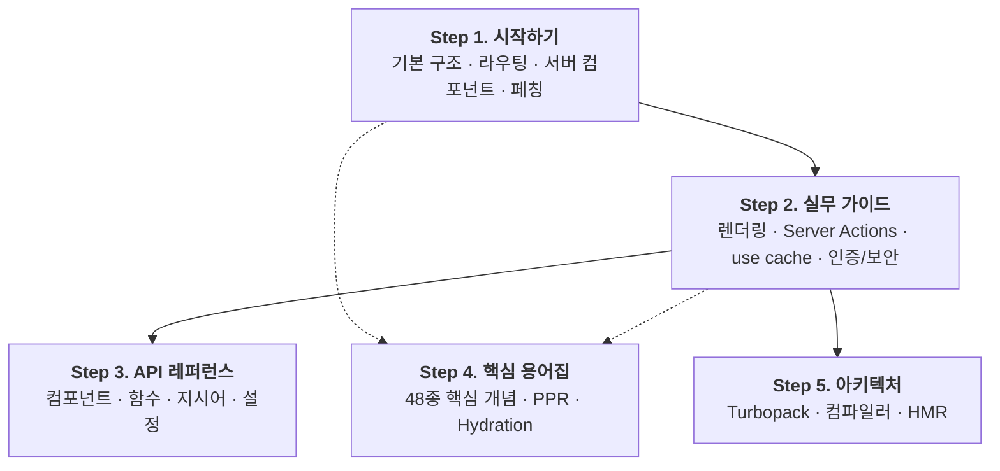

# Next.js App Router 학습

> 공식 문서 기반의 체계적인 한국어 학습 로드맵과 인터랙티브 실습 랩입니다.

---

## 🗺️ 학습 로드맵

---

## 📚 단계별 커리큘럼 요약

| 단계 | 카테고리 | 분량 | 주요 학습 내용 | 바로가기 |
| :--- | :--- | :---: | :--- | :--- |
| **Step 01** | **시작하기 (Getting Started)** | 18개 챕터 | 설치, App Router 구조, 레이아웃, 서버/클라이언트 컴포넌트, 페칭, 캐싱 기초 | [학습 시작](./1-getting-started/README.md) |
| **Step 02** | **실무 가이드 (Guides)** | 64개 챕터 | 렌더링 철학, Server Actions, `use cache` 아키텍처, Forms, 인증·보안, 배포 | [가이드 탐색](./2-guides/README.md) |
| **Step 03** | **API 레퍼런스 (API Reference)** | 9개 분류 | `<Image>`, `<Link>`, `cookies()`, `'use cache'`, `next.config.js` 등 상세 명세 | [레퍼런스 조회](./3-api-reference/README.md) |
| **Step 04** | **용어집 (Glossary)** | 48개 용어 | RSC, PPR, App Shell, Hydration, Cache Tags 등 필수 용어 사전 | [용어집 검색](./4-glossary/README.md) |
| **Step 05** | **아키텍처 (Architecture)** | 4개 챕터 | Turbopack, SWC 컴파일러, Fast Refresh 동작 원리 및 브라우저 호환성 | [원리 탐구](./5-architecture/README.md) |

---

## 🌐 기준 및 환경

- **Next.js 공식 문서 기준**: [Next.js App Router Documentation](https://nextjs.org/docs/app)
- **학습 기준 버전**: **Next.js 16.3.1** (React 19.2.8 / Turbopack)
- **오픈소스 커리큘럼**: 모든 문서는 오픈소스로 유지관리되며, 개선 제안이나 오류 제보는 하단 **[피드백 보내기]**를 통해 언제든 전달하실 수 있습니다.
